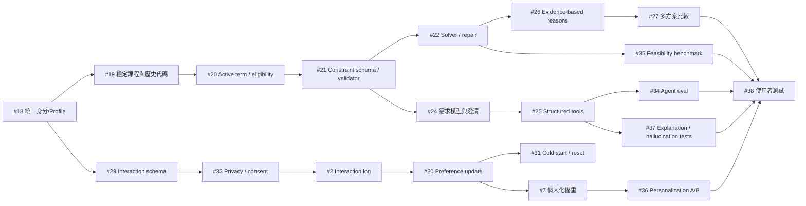

# 2026-08-01 個人化推薦演算法改造路線圖

## 文件性質

本文件為**持續更新的任務追蹤報告**。每完成一項任務即回來更新該任務區塊的狀態、修改檔案清單、實際改動與驗證結果。

## 建立日期

2026-08-01

## 最後更新

2026-08-09（#13 拆成 #13A～#13D；依程式碼盤點補上 #4、#18、#19、#20、#21、#23、#26、#28、#31、#35、#36 的既有進度）

前次更新：2026-08-08（保留既有完成紀錄；新增 #18～#38、任務相依與階段 Gate）

> **2026-08-09 盤點方式**：狀態不是依印象或文件推定，而是逐一讀取 `server/src`、`client/src` 與 `server/test` 的實際程式碼後判定。凡標成「已完成」者，本文件均指出其實作位置或釘住它的測試；凡標成「尚未完成」者，均指出缺少的具體欄位、模組或測試。多項任務因此由「⬜ 未開始」改為「🟡 部分完成」——原本的標示低估了已完成的前置工作。

## 背景

對現行排課演算法（`server/src/skills/scheduler.js`）做個人化能力檢討後，確認目前系統屬於「參數化的限制求解器」，而非個人化推薦系統。

判定依據：兩位修課歷史、互動行為完全不同的學生，只要表單填寫相同，`buildPlan()` 會回傳完全相同的課表。個人化程度等於使用者自己勾了幾個 checkbox。

> **2026-08-01 修正**：下表是以 `server/data/courses.json` 的 55 筆**示範資料**（description 平均 21 字）實測。接上 MySQL 後已用 3560 筆真實課程（description 平均 161 字、100% 有內容）重測，結論有實質變化——`discussion` 不再全滅、`practicalExam` 與 `finalReport` 已可運作，但 `weightDaily`、`noMidterm`、`learnMore` 與涼課關鍵字仍然失效。完整對照見 [排課演算法與資料庫對齊](./2026-08-01-align-scheduler-with-database.md) 的「關鍵字命中率重測」章節。下表保留作為示範資料下的紀錄。
>
> `#3`（硬過濾改軟懲罰）與 `#4`（結構化評分欄位）仍然成立且必要。

實測 `server/data/courses.json`（55 門課，description 平均 21 字）後發現偏好層在示範資料上大量失效：

| 偏好開關 | 命中課程數 / 55 | 開啟後實際後果 |
| --- | ---: | --- |
| `noMidterm` | 0 | 完全無效，永不排除任何課，卻回報已滿足 |
| `noGroupReport` | 0 | 完全無效，同上 |
| `discussion` | 0 | 候選集歸零，排課直接失敗 |
| `weightDaily` | 0 | 候選集歸零，排課直接失敗 |
| `finalReport` | 1 | 剩 1 門，湊不到最低學分 |
| `englishTaught` | 1 | 剩 1 門，且 `language` 欄位 55 筆全為 undefined |
| `practicalExam` | 3 | 剩 3 門共 8 學分 |
| `learnMore` | 5 | 剩 5 門 |
| 涼課關鍵字（涼/容易/輕鬆/高分/甜） | 0 | 「涼課高分優先」方案加分恆為 0 |

## 進度總覽

| # | 任務 | 狀態 | 相依 |
| ---: | --- | --- | --- |
| 1 | 修掉方案排序的自相矛盾：用偏好符合度決定 `plans[0]` | ✅ 已完成 | 無 |
| 2 | 埋互動 log：記錄推薦清單、最終選擇、加選後退選 | ⬜ 未開始 | #18、#29、#33 |
| 3 | 偏好從硬過濾改成軟懲罰 | ⬜ 未開始 | 無 |
| 4 | 把評分方式結構化：新增課程欄位並從 reviews 聚合難度甜度 | 🟡 部分完成 | 無 |
| 5 | 把 reviews 分數接進 `scoreCourse`，加權方向依使用者而異 | ⬜ 未開始 | #4 |
| 6 | 協同過濾：用選課紀錄矩陣做 item-item / user-user | ⬜ 未開始 | #2、#29、#31；另需足夠互動樣本 |
| 7 | 以個人化權重向量取代 5 個固定 variant | ⬜ 未開始 | #2、#5、#30 |
| 8 | 先修關係與多學期路徑規劃 | ⬜ 未開始 | #19、#20、#21、#23 |
| 9 | 探索機制：小比例隨機與多樣性重排 | ⬜ 未開始 | #2、#21、#30、#36 |
| 10 | 修復多方案塌縮：5 個 variant 實際只產出 2 種課表 | ⬜ 未開始 | #4、#21、#22 |
| 11 | 修復排課失敗時關注課程從回應中消失（TEST_PLAN S2） | ✅ 已完成 | 無 |
| 12 | 課程類別不完整：資料庫只有必修／選修，缺通識、核心選修、系外選修 | 🟡 部分完成 | 通識正式資料來源待確認 |
| 13A | 資工系一般班級必修 scope | ✅ 已完成 | 無 |
| 13B | B～F 類班級分類與 unknown eligibility | ⬜ 未開始（**現在可做**） | #13A |
| 13C | B～F 類的正式適用規則 | ⛔ 等待外部資料 | #13B；**另需系辦／校方正式規則** |
| 13D | 學制、學程與特殊身分 | ⛔ 等待 #18 | #13B、#18 |
| 14 | 無時間課程永不衝堂，可被無限排入 | ✅ 已完成 | 無 |
| 15 | 實習課程需與同名正課一併排入 | ⬜ 未開始 | #13A、#13B、#19、#20、#21 |
| 16 | 多時段課程支援 | ✅ 已完成 | 無 |
| 17 | 週六與週日課程支援 | ✅ 已完成 | 無 |
| 18 | 統一 user identity、Profile、歷史修課與偏好資料來源 | ✅ 已完成（shared MySQL rollout 另列 D 類） | 無（新增任務的資料基礎） |
| 19 | 以穩定 course code 建立歷史修課、重修與跨學期對應 | ✅ 已完成 | #18 |
| 20 | 建立 active term 與完整 candidate eligibility 規則 | 🟡 部分完成 | #12、#13A、#13B、#18、#19 |
| 21 | 建立 hard／soft constraint schema、validator 與放寬策略 | 🟡 部分完成 | #3、#19、#20 |
| 22 | 為 greedy 排課加入 repair／backtracking 或 constraint solver | ⬜ 未開始 | #21 |
| 23 | 建立版本化且可追溯的畢業規則引擎 | 🟡 部分完成 | #12、#19；另需校方正式規則 |
| 24 | 建立結構化需求模型、矛盾偵測與澄清對話 | ⬜ 未開始 | #18、#21 |
| 25 | 改用 structured/native tool calling 與輸入輸出驗證 | ⬜ 未開始 | #20、#21、#24 |
| 26 | 建立每門課的 evidence-based recommendation reason | 🟡 部分完成 | #4、#5、#21、#22 |
| 27 | 完成多方案比較 UI 與 counterfactual explanation | ⬜ 未開始 | #10、#26 |
| 28 | 統一 Dashboard、Schedule、Chat 的登入使用者 context | 🟡 部分完成 | #18 |
| 29 | 定義 interaction event schema 與回饋原因 | ⬜ 未開始 | #18 |
| 30 | 建立可重現的 per-user preference update pipeline | ⬜ 未開始 | #2、#5、#29 |
| 31 | 建立冷啟動、偏好重設、時間衰減與資料不足策略 | 🟡 部分完成 | #18、#30 |
| 32 | 比較 content-based、collaborative filtering 與 hybrid 方法 | ⬜ 未開始 | #6、#7、#31、#36；另需足夠互動樣本 |
| 33 | 建立互動資料隱私、匿名化、consent 與保存規則 | ⬜ 未開始 | #18、#29 |
| 34 | 建立 Agent 自然語言需求理解 eval | ⬜ 未開始 | #24、#25 |
| 35 | 建立 feasibility、constraint violation 與 solver benchmark | 🟡 部分完成 | #15、#21、#22 |
| 36 | 建立 personalization baseline 與 preference sensitivity A/B | 🟡 部分完成 | #5、#7、#30、#31 |
| 37 | 建立 explanation faithfulness 與 hallucination tests | ⬜ 未開始 | #25、#26 |
| 38 | 進行學生使用者測試並整理量化結果 | ⬜ 未開始 | #27、#28、#33、#34、#35、#36、#37 |

## 任務相依的閱讀方式

- 「相依」是開始該任務前必須完成或至少達到可被依賴的穩定介面，不只是相關任務。
- 若相依欄包含「另需校方正式規則」或「另需足夠互動樣本」，代表即使程式任務已完成，外部資料條件不足時仍不可開始驗收。
- #18～#38 均預設既有 MySQL 課程查詢、多時段解析及基本衝堂判斷仍維持通過；若基礎資料契約改動，必須先重跑相關 regression tests。
- 相依完成不代表下游任務自動完成。每一項仍須通過該節所列的獨立驗收標準。

## 建議執行 Gate

| Gate | 目的 | 必須先完成 | 通過後才進入 |
| --- | --- | --- | --- |
| Gate 0 — 身分與資料真實性 | 確保學到的是正確學生、正確課程與正確學期 | #12、#13A、#13B、#18、#19、#20、#23 的適用部分（#13C、#13D 阻塞中，以 `unknown` 標記通過） | Agent、學習與 solver 開發 |
| Gate 1 — 限制與可行性 | 統一定義硬限制、軟偏好、共修與無解原因 | #3、#15、#21、#22 | 多方案、解釋與 feasibility benchmark |
| Gate 2 — Agent 需求理解 | 讓自然語言先變成可驗證需求，再允許工具執行 | #24、#25、#28 | Agent-level 自動排課與對話 eval |
| Gate 3 — 偏好資料與學習 | 先合法、安全記錄互動，再更新個人權重 | #29、#33、#2、#30、#31、#7 | 協同過濾、探索與 hybrid 比較 |
| Gate 4 — 推薦解釋與比較 | 讓每門課與每個方案都有可追溯理由 | #4、#5、#10、#26、#27 | 教授展示與使用者研究 |
| Gate 5 — 系統驗證 | 證明需求理解、可行性、個人化與解釋均有效 | #34～#38 | 宣稱完成 AI 個人化課程規劃 Agent |

核心依賴主線如下；協同過濾與探索是有資料後的研究分支，不應阻塞先完成單一使用者的 content-based 個人化：



---

## #1 修掉方案排序的自相矛盾

**狀態**：✅ 已完成（2026-08-01）

### 問題

`server/src/skills/scheduler.js` 的方案比較器只看三層：`success` → 是否達最低學分 → 總學分高者勝。三層都與使用者偏好無關。

系統花整套 `getEasyCourseScore`、`getInterestScore`、compact 加權產生 5 份反映不同偏好的課表，卻用總學分裁決主推哪一份。而 `max_credits` 是唯一跳過提前中止條件、一路塞滿到上限的 variant，設計上必定學分最高，因此主推方案幾乎恆為「學分最大化」，其他四種偏好方案只能躺在 `plans[1..4]`。

整條個人化管線的產出，在管線末端被一個與偏好正交的排序規則覆蓋掉。

### 修改檔案清單

- `server/src/skills/scheduler.js`
- `server/src/routes/schedule.js`
- `server/src/services/agentService.js`
- `docs/API_SPEC.md`

### 主要改動內容

- 新增 `buildPreferenceProfile(constraints)`，由使用者實際表達的偏好推出權重（`interest` / `compact` / `easy`）。
- 新增 `evaluatePreference(plan, constraints, profile)`，回傳 0~1 的 `preferenceScore` 與三項 `preferenceBreakdown`。
- **關鍵設計**：所有方案一律用「同一組使用者權重」評分，方案不得用自己的 variant 偏誤自評，否則彼此無從比較。
- 三項正規化指標：
  - `interest`：平均每門課的興趣關鍵字命中率，除以每門課可能的最大命中分。
  - `compact`：`(maxDays - usedDays) / (maxDays - 1)`，使用天數越少越高。
  - `easy`：平均涼課分數除以最大可能涼課分數。
- 比較器改為四層：`success` → 是否達最低學分 → `preferenceScore` → `totalCredits`（tie-break）。
- 抽出 `collectInterestKeywords()`，並將 magic number 改為具名常數（`INTEREST_KEYWORD_SCORE`、`MAX_EASY_COURSE_SCORE`、`WEEK_DAYS`、`PREFERENCE_SCORE_EPSILON`）。
- 回傳結果新增 `preferenceProfile`、`hasExpressedPreference`，各方案新增 `preferenceScore`、`preferenceBreakdown`，訊息文字附上主推理由。
- 使用者未表達任何偏好時，`preferenceScore` 全為 0，自動退回總學分排序（維持既有行為），並發出 warning 說明「主推方案改以總學分決定，個人化程度有限」。
- 補齊參數傳遞：`preferredKeywords`、`interests` 原本**完全沒有**被傳進排課引擎，導致 `interest` variant 的 `getInterestScore` 只看得到 `preferredTrack`，該方案形同半死。本次於 REST 與 AI Agent 兩條路徑一併補上，並新增 `preferEasyCourses`。

### 影響範圍

- `POST /api/schedule/generate`
- `POST /api/chat` 的 `run_csp_scheduler` tool call
- 回應格式為**向後相容的欄位新增**，既有欄位語意不變；但 `plans[0]` 與頂層 `schedule` 的挑選結果會改變，這正是本次修正的目的。

### 測試與驗證結果

以 `server/data/courses.json`（55 門課）實測。

**情境一：大一大二（必修未修畢）**

選修填充空間僅剩 1 學分，variant 差異幾乎無法展現。詳細量測與根因見 #10。

**情境二：大三（12 門必修已修畢，選修填充階段實際執行）**

| 測試 | 結果 |
| --- | --- |
| A. 無偏好 | `preferenceScore` 全 0，退回總學分排序，warning 正確發出 |
| B. 興趣優先（關鍵字 網路/資料） | **`interest` 方案 21 學分（pref 0.214）擊敗 `compact` 方案 22 學分（pref 0.063）** |
| C. 集中排課 | 使用 3 天的方案（pref 0.500）勝過使用 4 天的方案（pref 0.250） |
| D. 涼課優先 | 所有方案 `easy` 皆為 0，`preferenceScore` 全 0，退回學分排序 |

測試 B 即為本任務驗收條件：**偏好符合的方案即使學分較少，仍成為 `plans[0]`**。舊比較器下必定是相反結果。

測試 D 的 0 分是**正確且誠實的行為**，反映背景章節記錄的「涼課關鍵字 0 命中」資料問題。系統會顯示「偏好符合度 0%」，把資料缺口顯性化而非靜默吞掉。該資料問題由 #4 修復。

**其他驗證**

- `node --check` 對 `server/src/**/*.js` 全數通過。
- `npm run install:all`：通過（client 165 packages、server 142 packages）。
- `cd client && npm run build`：通過，1744 modules transformed，產出 `dist/index.html`、CSS 28.02 kB、JS 277.74 kB。
- `cd client && npm run lint`：通過，無錯誤與警告。
- 本次未修改任何前端檔案，前端無程式碼變更；`node_modules/` 已由 `.gitignore` 排除，未進入 git 追蹤。

### 已知限制（留給後續任務）

- `easy` 維度目前恆為 0，需等 #4 補上結構化評分欄位後才有作用。
- 偏好權重仍是 0/1 二元，無法表達「0.7 涼 + 0.3 興趣」，由 #7 處理。
- 權重來源仍為顯式表單，非從行為學習，由 #2 與 #7 處理。
- 5 個 variant 去重後實際只剩 2 種課表，本次驗證過程中量測發現，已另立 #10 追蹤。

### 對抗式審查修正（2026-08-01 追加）

`/codex:adversarial-review` 對 #1 的工作區變更提出兩項 medium 發現，均成立且均為本次引入或未同步，已修正。

**發現一：空陣列蓋掉已儲存偏好**

`constraints.preferredKeywords || prefs.preferredKeywords || []` 中，空陣列在 JavaScript 是 truthy，因此 client 只要送出 `[]` 就會短路，永遠取不到已儲存偏好。

追查後確認影響範圍比審查指出的更大：`client/src/pages/DashboardPage.jsx:60-82` **每次都送出本地建的 `blockedPeriods`**，`mondayFree` 為 false 時即為 `[]`。這使得使用者存在 `User_Profiles.avoid_time` 的封鎖時段被靜默丟棄——這是硬約束，不只是軟偏好，且為線上既有缺陷。

**發現二：AI Agent tool 契約未同步**

`agentService.js` 已接受 `preferredKeywords`、`interests`、`preferEasyCourses`，但 `promptService.js` 呈現給 LLM 的工具說明未列出，模型不知道這些參數存在，`/api/chat` 路徑的個人化實際未生效。違反 `AGENTS.md:115` 與 `docs/PROMPT_DESIGN.md:93` 的維護規則。

**根因與處置**

兩項發現的共同根因是 `routes/schedule.js` 與 `agentService.js` 各有一份近乎重複的 30 行限制條件合併區塊，兩者已經漂移。新增 `server/src/services/constraintService.js`，抽出共用的 `buildScheduleConstraints()`，兩條路徑改為呼叫同一份邏輯。

合併語意明確化：

- 陣列型參數送 `[]` 視同未指定，退回已儲存偏好；要覆蓋必須送非空陣列。
- 布林型 `false` 是有效值會覆蓋；只有 `null` / `undefined` 才退回。
- `selectedCourseIds`、`watchingCourseIds`、`courseStates` 屬本次操作狀態，不從偏好回填。

**連帶修正**：`mondayFree` 原本只在 REST 路徑展開，Agent 路徑完全忽略——但 `docs/PROMPT_DESIGN.md:82` 的 few-shot 範例正是教模型送 `mondayFree`。抽出共用邏輯後兩條路徑一致。

**追加修改檔案**

- `server/src/services/constraintService.js`（新增）
- `server/src/services/promptService.js`
- `server/src/routes/schedule.js`
- `server/src/services/agentService.js`
- `docs/PROMPT_DESIGN.md`
- `docs/API_SPEC.md`
- `docs/TEST_PLAN.md`

**追加驗證**

- 限制合併與 prompt 契約測試：17 項全數通過。
- `docs/TEST_PLAN.md:81` 規定「修改排課邏輯至少執行 S1-S10」，此項在 #1 原始提交時**遺漏未執行**，本次補做：12 項通過、1 項失敗。
- 失敗項 S2 為既有缺陷，非 #1 或本次修正引入，已立案為 #11。
- #1 的驗收情境 B（興趣方案以較少學分勝出）重跑通過，無回歸。
- `node --check` 對 `server/src/**/*.js` 全數通過。
- `npm run build`、`npm run lint`：通過。

### 是否 commit 與 push

- 未 commit。
- 未 push。

---

## #2 埋互動 log

**狀態**：⬜ 未開始

**相依**：#18、#29、#33

**開始前必須具備**：使用者已有唯一 canonical ID；互動事件已定義曝光、接受、移除、退選及原因；隱私、consent 與保存期限已確認。不得先把未定義、不可追溯的 click/chat log 大量寫入正式資料。

記錄推薦清單、使用者最終選擇、加選後退選。不需演算法工作，但為 #6、#7、#9、#30、#32 的資料前提。

---

## #3 偏好從硬過濾改成軟懲罰

**狀態**：⬜ 未開始

解決反向判定型（候選集歸零）與正向判定型（靜默假承諾）兩種失效模式，並提供 graceful degradation。

---

## #4 把評分方式結構化

**狀態**：🟡 部分完成（2026-08-08 更新）——**評價聚合的前置工作已完成，但 scheduler scoring 尚未接上**

新增 `has_midterm` / `has_group_project` / `grading_scheme` 等欄位進 courses 表；從 reviews 聚合難度甜度；修正 `schema.sql` 的 category CHECK 與 `CATEGORY_PRIORITY` 不一致；補上 `language` 欄位。

### 已完成：評價聚合層

`server/src/skills/reviewStats.js` 已提供結構化的聚合結果，不再需要從 description 撈關鍵字：

- `weightedAverageScore()`：依 `getReviewWeight()` 做加權平均，而非簡單平均。
- `summarizeReviews()`：回傳 `avgDifficulty`、`avgSweetness`、`avgCoolness`、`avgWorkload`、`avgOverall` 及評價則數。
- `calculateEasinessFromAverages()`：由涼度、甜度、作業量與整體評分推導「好過程度」，取代原本「課程文字是否出現涼／容易／高分」的關鍵字判斷。
- `countBySentiment()`：正負面評價則數。
- regression：`server/test/reviewStats.test.js`。

### 尚未完成：接進排課評分

**`server/src/skills/scheduler.js` 目前完全沒有 import `reviewStats`。** `scoreCourse()` 仍以文字關鍵字計分，因此：

- 「涼課高分優先」方案的加分依據仍是課程描述字串，不是 `avgCoolness` / `avgSweetness`。
- `calculateEasinessFromAverages()` 的結果沒有任何排課路徑會讀到。
- 這是 #5 的實際內容；#4 的資料面已備妥，卡點在 scheduler 端接線。

課程表欄位（`has_midterm`、`has_group_project`、`grading_scheme`、`language`）仍未新增，`noMidterm`、`noGroupReport`、`englishTaught` 三個偏好因此仍然失效。

---

## #5 把 reviews 分數接進 scoreCourse

**狀態**：⬜ 未開始（卡 #4）

評價分數需個人化加權：同一難度數值對不同使用者要有相反符號。

---

## #6 協同過濾

**狀態**：⬜ 未開始（卡 #2、#29、#31，且需足夠互動樣本）

**相依**：#2、#29、#31；外部條件為足夠且去識別化的 user-course interaction matrix。

**開始前必須具備**：事件能區分「被曝光但未選」與「根本沒看見」，冷啟動策略已存在，並先定義最少使用者數、最少課程互動數與離線切分方式。若樣本不足，本任務只能做實驗，不得接管正式排序。

用選課紀錄矩陣做 item-item / user-user 相似度，含冷啟動 population fallback。

---

## #7 以個人化權重向量取代 5 個固定 variant

**狀態**：⬜ 未開始（卡 #2、#5、#30）

**相依**：#2、#5、#30

**開始前必須具備**：已有可信課程 feature／review score，互動事件可轉成訓練訊號，且 per-user preference update 能重播得到相同權重。需先定義權重範圍、正規化、版本與回復預設值的方法。

將離散 variant 選擇改為連續權重空間，並在 log 累積後由資料學習權重。

---

## #8 先修關係與多學期路徑規劃

**狀態**：⬜ 未開始（卡 #19、#20、#21、#23）

**相依**：#19、#20、#21、#23

**開始前必須具備**：歷史修課可用穩定課程代碼判定完成／未通過／重修；每學期課程與資格可查；限制 schema 可表達先修與共修；畢業規則已有入學年度版本。缺一項時只能做單學期提示，不能宣稱完成路徑規劃。

從單學期無狀態貪婪升級為序列決策，補上先修欄位、歷史成績與分類別畢業進度。

---

## #9 探索機制

**狀態**：⬜ 未開始（卡 #2、#21、#30、#36）

**相依**：#2、#21、#30、#36

**開始前必須具備**：互動 log 可供回饋、hard constraints 有獨立 validator、個人偏好已有穩定 baseline，且 A/B 指標能偵測探索是否降低品質。探索不得作用於必修、重補修、明確指定或資格不確定課程。

小比例隨機與多樣性重排，限制在備選區與低風險課程，不得對必修與重補修做隨機化。

---

## #10 修復多方案塌縮

**狀態**：⬜ 未開始（卡 #4、#21、#22）

**相依**：#4、#21、#22

**開始前必須具備**：課程評分維度有非零且可信的資料，限制 schema 已穩定，solver／repair 能在相同硬限制下搜尋不同可行區域。否則只調整排序常數可能短暫得到五份方案，後續 solver 重構又會全部失效。

於 #1 的驗證過程中量測發現。`PLAN_VARIANTS` 宣稱 5 種方案，經 `uniquePlans()` 去重後**永遠只剩 2 種，且與年級無關**。`docs/SCHEDULING_LOGIC.md:131` 要求至少支援五種方案，目前實質未達成。

以 `server/data/courses.json` 實測：

| 已修必修 | 選修填充空間 | 去重後方案數 |
| ---: | ---: | ---: |
| 0 門 | 1 學分 | 2 |
| 4 門 | 1 學分 | 2 |
| 8 門 | 10 學分 | 2 |
| 12 門 | 16 學分 | 2 |

**根因一：必修排不進去，低年級無填充空間**

15 門必修共 45 學分，但**互相衝堂的配對有 11 對**，實際只排得進 7 門 21 學分。低年級在 22 學分上限下只剩 1 學分填充空間，選修貪婪迴圈幾乎無事可做。

另需注意：被擋掉的 8 門必修只寫進 `excludedCourses`，不會進 `plan.failures`——因為只有 `requiredIds` 指定的課程會記錄 failure，`category === '必修'` 的不算。**使用者看不到「你的必修排不進去」這件事。**

須釐清 11 對必修衝堂是 seed 資料不真實，還是系統缺少分班／分組（section）概念。

**根因二：variant 評分函式退化為同一個**

`interest` variant 的 `getInterestScore` 在使用者未提供關鍵字時恆為 0；`easy_score` variant 的 `getEasyCourseScore` 因涼課關鍵字 0 命中而恆為 0。兩者評分函式因此與 `required_first` 完全相同，必然產生同一份課表。`max_credits` 亦常與其他 variant 重合。

**與 #7 的關係**：本任務是過渡修復，長期由連續權重向量取代固定 variant。

---

## #11 修復排課失敗時關注課程從回應中消失

**狀態**：✅ 已完成（2026-08-01）

於補做 `docs/TEST_PLAN.md` S1-S10 時發現。**既有缺陷，非 #1 或對抗式審查修正引入。**

`generateSchedule` 的失敗回傳路徑不含 `watchedCourses`，只有成功路徑有。方案 `success === false` 時，使用者的關注課程從 API 回應中完全消失。

重現：

```text
generateSchedule([課程5, 課程6], { watchingCourseIds: [5, 6], minCredits: 0 })
  → plans[0].watchedCourses 正確含 2 筆
  → 頂層 watchedCourses === undefined
  → success === false，message =「無法產生符合限制的課表。」
```

**根因兩處**

1. `plan.success = plan.schedule.length > 0 && plan.failures.length === 0`——全部課程都是關注狀態時 `schedule` 為空，被判定為失敗。但關注課程本來就不佔時段，這個判定把合法情境當成失敗。
2. 失敗回傳物件缺少 `watchedCourses`。任何失敗情境都會遺失關注課程。

**違反規格**：`docs/SCHEDULING_LOGIC.md:28-34` 規定關注課程會顯示在課表上供學生觀察時間分佈。

### 修改檔案清單

- `server/src/skills/scheduler.js`
- `docs/SCHEDULING_LOGIC.md`
- `docs/API_SPEC.md`
- `docs/TEST_PLAN.md`

### 主要改動內容

- `plan.success` 改為 `failures.length === 0 && (schedule.length > 0 || watchedCourses.length > 0)`。關注課程本來就不佔時段，「只有關注課程」是合法結果而非失敗。
- 新增 `plan.watchOnly` 旗標，並在該情境下加上警告訊息。
- 失敗回傳路徑補上 `watchedCourses`，與成功路徑一致。無候選課程的早期回傳也補上，維持回應形狀一致。
- `watchOnly` 情境給予專屬訊息，不再誤報「無法產生符合限制的課表」。
- 頂層回應新增 `watchOnly` 欄位。
- `docs/SCHEDULING_LOGIC.md` 補上兩條關注課程規則，把此行為固定為規格而非實作細節。

### 影響範圍

- `POST /api/schedule/generate`
- `POST /api/chat` 的 `run_csp_scheduler` tool call
- 回應為向後相容的欄位新增。**行為變更**：候選課程全為關注狀態時，`success` 由 `false` 改為 `true`。

### 測試與驗證結果

| 情境 | 結果 |
| --- | --- |
| 只有關注課程 | `success=true`、`watchOnly=true`、回傳 2 門關注課、訊息正確 |
| 指定必修排不進去 + 有關注課 | `success=false`（正確），`watchedCourses` 仍完整回傳 1 門 |
| 正常課表 + 關注課 | 無回歸，`watchOnly=false`，訊息維持原格式 |

- **S1-S10：13 項全數通過**（修正前為 12 通過 1 失敗）。
- 限制合併與 prompt 契約測試：17 項全數通過。
- #1 驗收情境 B 重跑通過，無回歸。
- `node --check` 對 `server/src/**/*.js` 全數通過。
- `npm run build`、`npm run lint`：通過。

### 已知限制

前端目前**完全沒有關注課程相關程式碼**（`client/src/` 查無 `watchedCourses` / `watching` / `關注`）。`docs/UX_FLOW.md:42` 已將此標註為「未來應支援」，屬既有未實作項目，不在本任務範圍。後端修正確保資料至少不再遺失，前端接上後即可直接使用。

### 是否 commit 與 push

- 已於後續 commit 提交。

---

## #12 課程類別不完整

**狀態**：🟡 部分完成（2026-08-07）——#12A 已完成，#12B 通識分類待處理。詳見 [課程分類與搜尋一致性變更報告](./2026-08-07-course-category-consistency.md)

**已完成（#12A）**

- 搜尋、排課與 AI Agent 共用同一套先分類後篩選流程。
- 可由目前正式資料與資工課程表支持的必修、核心選修、一般選修、系外選修已統一。
- 課程回應保留 `sourceCategory` 與 `classificationSource`，可追查原始分類及推導來源。
- 系外選修另外回傳認列條件判斷，不把「可能可選」直接宣稱為可計入畢業學分。

**尚未完成（#12B）**

- 尚無正式通識課程分類表、領域及適用學年度規則。
- 通識搜尋目前明確回傳未支援，不根據課號前綴自行猜測。

接上 MySQL 後發現。`Courses.type` 只有兩種值：`必修`（1760）、`選修`（1326）。資料庫**沒有** `通識`、`核心選修`、`系外選修`。

**與規格的落差**

| 來源 | 類別定義 |
| --- | --- |
| 資料庫 `Courses.type` | 必修 / 選修（僅兩類） |
| `scheduler.js` 的 `CATEGORY_PRIORITY` | 必修 0 / 核心選修 1 / 選修 2 / 通識 3 / 系外選修 4（五階，後三者永不出現） |
| `docs/REQUIREMENTS.md:49-55` | 必修 63 / 核心選修 12 / 選修 16 / 通識基礎 16 / 通識選修 12 / 系外選修 9（六類） |
| `server/src/routes/graduation.js` | required / elective / general / external（四類英文 key） |

四份定義互不一致，且都無法由課程資料支撐。

**後果**

- 五階類別優先序實際只有兩階在運作。
- 六類畢業學分要求、核心選修三條路徑、系外選修門檻皆無法正確計算。
- `docs/SCHEDULING_LOGIC.md:58-72` 的核心選修路徑另需 `track` 欄位，資料庫同樣沒有。

**可能線索**

`Courses.subid3` 的前綴看似編碼了科目類別，例如 `GEID`（169 筆）、`GEH1`（86 筆）開頭者可能為通識。需向校方或課程資料來源確認編碼規則，**不應自行臆測**。

**相關**：`#8`（分類別畢業進度向量）、稽核報告的 `F13`（畢業學分分類渲染出英文 key）。

---

## #13 必修範圍錯誤：全校必修被當成每位學生的必修

原 #13 已於 2026-08-08 拆成 #13A～#13D。拆分理由：A 類班級的收斂是**已完成且可驗收**的工作，但原本被同一個「🟡 部分完成」掩蓋；而剩下的部分其實有三種**不同的阻塞原因**——可以立刻做的分類工作、必須等校方規則的判定工作、以及必須等 Profile schema 的身分工作。混在一起會讓「現在到底能做什麼」無法判讀。

| 子項 | 範圍 | 狀態 | 阻塞原因 |
| --- | --- | --- | --- |
| #13A | 資工系一般班級（A 表）必修 scope | ✅ 已完成 | 無 |
| #13B | B～F 類班級分類與 unknown eligibility | ⬜ 未開始 | 無，**現在可做** |
| #13C | B～F 類的正式適用規則 | ⛔ 阻塞 | 需系辦／校方正式規則 |
| #13D | 學制、學程與特殊身分 | ⛔ 阻塞 | 需 #18 Profile schema |

**共同背景**（接上 MySQL 後以 3560 筆真實課程實測發現）：

`server/src/skills/scheduler.js` 的 `buildPlan()` 原本以下列條件判定必修：

```js
eligible.filter(course => requiredIds.has(Number(course.id)) || course.category === '必修')
```

但資料庫的 `Courses.type = '必修'` 代表**「某個系所的必修」**，不是**「這位學生的必修」**。全校共 2094 筆必修 section。

**實測後果**

產生的課表橫跨 **79 個系所**，包含 12 個不同研究所的碩士論文：

```text
0學分  必修  碩士論文  [運輸物流碩二]  (一)00
0學分  必修  碩士論文  [土管碩二]      (五)00
0學分  必修  碩士論文  [環境碩二]      (五)00
0學分  必修  博士論文  [中文博三]      (六)00
4學分  必修  建築設計(二)  [建築專業一甲]
0學分  必修  會計學(二)實習  [會計一甲]
```

一位學生不可能修這些課。過去以 `server/data/courses.json` 的 55 筆示範資料測試完全看不出來，因為那批資料全是資工系。

**根因**

課程資料沒有「這門必修屬於哪個系所、年級、學程」的結構化關聯。可用線索只有 `course.department`，而它實際上是**班級名稱**而非系所名稱。

**班級名稱結構（實測 562 個相異值）**

| 樣態 | 範例 | 說明 |
| --- | --- | --- |
| 系所簡稱 + 年級 + 班別 | `資訊二合`、`會計一甲`、`建築專業一甲` | 可解析 |
| 系所簡稱 + 學位 + 年級 | `資訊碩一`、`中文博三`、`電子碩一` | 可解析 |
| 學院綜合班 | `資電學院綜合班`、`商學院綜合班` | 跨系 |
| 通識與共同科目 | `國文綜合班`、`體育選修`、`人文藝術與社會經典教育`、`核心必修綜合班` | 非系所 |
| 國際學程 | `資工一(SFSU)`、`資工二(Monash)` | 特殊 |
| 學位學程 | `建築二學位學程`、`智能工程碩專一學位學程` | 特殊 |

**注意**：資訊工程學系的班級簡稱是 **`資訊`**（`資訊二合`、`資訊三合`、`資訊碩一`），不是 `資工`。`資工` 只出現在 `資工一(SFSU)`、`資工二(Monash)` 等國際學程班級。簡稱與系所全名的對應**不可用字面前綴推導**，需要對照規則。

**影響**：在此修好之前，對真實資料產生的任何課表都不可用，其他個人化改進也無從評估。

---

## #13A 資工系一般班級必修 scope

**狀態**：✅ 已完成（2026-08-02）——詳見 [依系所與年級收斂必修範圍](./2026-08-02-required-course-scope.md)

**相依**：無

### 範圍

- 建立系所全名與班級簡稱的對應（使用者已確認班級名稱中的系所部分為簡稱）。
- 由班級名稱解析出系所簡稱、學制與年級。
- 排課前先依學生的系所與年級篩選候選課程，`User_Profiles` 的 `department` 與 `grade_level` 可用。
- `category === '必修'` 的判定加上「屬於這位學生的系所與年級」條件。
- 必修再收斂到班別（資工系明文不接受必修換班）。

### 實際改動

以 `docs/DEPARTMENT_MAPPING.md` A 表（使用者核對完畢，71 個簡稱對應 69 個系所）為依據：

- `server/src/data/departmentMapping.js`：簡稱與系所全名對照。
- `server/src/skills/courseScope.js`：`parseClassName()`、`buildStudentScope()`、`isRequiredForStudent()`、`isOtherStudentsRequiredCourse()`。
- `server/src/skills/scheduler.js`：他系、他學制、其他年級的必修整批排除；非本人必修不再享有必修優先度。
- `server/src/services/constraintService.js`：把 `department`、`gradeLevel`、`className` 帶進排課限制。
- `client/src/pages/SetupPage.jsx`：年級預設值改為登入使用者的實際年級（原本固定大一，會把三年級學生存成大一）。

### 驗收結果

- 為資訊工程學系大三學生產生的課表，不出現其他系所的必修或研究所論文課程。**已達成。**
- 實測（資訊工程學系）：必修 section 由 2094 收斂為大一 33、大二 19、大三 12、大四 0；大三課表排除 1576 門他人必修。
- regression：`server/test/courseScope.test.js` 涵蓋班級名稱解析與必修判定。

**限制**：只涵蓋 A 表班級。A 表以外的 51 個班級名稱（含 **506 筆必修**）落入 #13B～#13D。

---

## #13B B～F 類班級分類與 unknown eligibility

**狀態**：⬜ 未開始（**現在可做，不需外部資料**）

**相依**：#13A

**開始前必須具備**：#13A 的 `parseClassName()` 已穩定；確認 562 個相異班級名稱的完整清單仍與資料庫一致。

### 問題與目的

目前 A 表以外的 51 個班級名稱一律**靜默**退回「一般候選課程」。系統既沒有把它們標成任何人的必修，也沒有記錄「我不知道這門課適不適用於這位學生」。結果是：`會計四合｜企業實習(二)` 這種修不到的課會被當成正常候選排入，而畫面上看不出任何疑慮。

**本任務不判定「誰可以修」——那是 #13C。本任務只要求「知道自己不知道」，並把不確定性顯性化。**

### 實作範圍

- 把 51 個班級名稱依 B～F 分類，寫成可測試的資料表（B 全校共同與通識、C 學院綜合班、D 英語授課班與國際學程、E 學分學程、F 其他）。
- `parseClassName()` 對這些名稱回傳結構化的 `classKind`，而不是 `null`。
- 引入 `eligibility: 'eligible' | 'ineligible' | 'unknown'` 與 `eligibilityReason`，B～F 類在規則確認前一律為 `unknown`。
- 排課與搜尋回應保留 `unknown` 標記，前端需能顯示「資格待確認」而不是當成一般候選。
- 名稱自帶年級者（`軍訓(一年級)`→一年級、`大二*`→二年級）可先解析出年級，但適用對象仍為 `unknown`。

### 驗收標準

- 562 個班級名稱全部有分類，沒有任何一個落入「無法辨識」。
- B～F 類課程在排課結果中帶 `eligibility: 'unknown'` 與可讀原因。
- 系統不再把 `unknown` 課程當成確定可修的候選靜默排入。
- 測試涵蓋每一類至少一個代表性班級名稱。

---

## #13C B～F 類的正式適用規則

**狀態**：⛔ 阻塞——**等待系辦／校方正式規則**

**相依**：#13B；外部條件為系辦或課務組提供的正式適用規則

**開始前必須具備**：#13B 已把不確定性顯性化；取得下表各項的正式書面規則。在取得前不得以臆測填入判定邏輯。

### 待確認清單

| # | 類別 | 筆數 | 待確認問題 |
| ---: | --- | ---: | --- |
| 13C-1 | B 全校共同與通識 | 244 筆必修 | `國文綜合班`(92)、`大二英文綜合班`(64)、`軍訓(一年級)`(18) 等的適用年級與對象 |
| 13C-2 | B `核心必修綜合班` | 52 筆 | 名稱含「必修」但不屬任何系所，適用對象完全未知 |
| 13C-3 | C 學院綜合班 | 20 筆必修 | 需要「系所 → 學院」正式對照表。例如資訊工程學系屬資電學院，才能判定 `資電學院綜合班` 是否適用 |
| 13C-4 | 系外選修範圍 | — | 他系**選修**目前全數保留為候選，實測會排入 `會計四合｜企業實習(二)` 這類實際上修不到的課。需要「哪些他系課程對外開放」的規則 |
| 13C-5 | 同系他年級選修 | — | 目前只收斂必修。一年級學生仍可能被排入 `資訊三甲` 的選修，需要先修科目或年級限制資料 |

### 驗收標準

- 每一條規則都能指向書面來源（公告、必選修科目表或系辦回覆），並記錄適用學年度。
- `eligibility` 由 `unknown` 收斂為 `eligible` / `ineligible`，且附 `eligibilitySource`。
- 無法取得規則的項目維持 `unknown`，不得為了讓數字好看而猜測。

---

## #13D 學制、學程與特殊身分

**狀態**：⛔ 阻塞——**等待 #18 Profile schema**

**相依**：#13B、#18

**開始前必須具備**：#18 的 versioned Profile schema 已定義學制（學士／碩士／博士／在職專班）、雙聯學程、英語授課班與已報名學分學程等欄位。目前 `User_Profiles` 沒有這些欄位，判定邏輯無處取值。

### 待處理清單

| # | 類別 | 筆數 | 問題 |
| ---: | --- | ---: | --- |
| 13D-1 | D 英語授課班與國際學程 | 112 + 91 筆必修 | `工英班`、`資電英A/B班`、`資工一(SFSU)`、`商學一(UQ)` 等是否為獨立學制？資訊系學生是否可能被編入 `資電英A班`？需 Profile 記錄學生實際所屬 |
| 13D-2 | E 學分學程 | 19 筆必修 | 15 項跨系選修學程的納入規則需「學生是否已報名該學程」，Profile 目前沒有這個欄位 |
| 13D-3 | F 其他 | 20 筆必修 | `未完成課程(大學)`(19)、`未完成課程(碩士)`(1) 的用途；`大數據分析與實務應用碩士學` 名稱疑似被 `varchar(45)` 截斷 |
| 13D-4 | 學制表達 | — | `User_Profiles` 沒有學制欄位，一律視為學士班。碩博生的 `grade_level` 意義與 `department` 值域未確認 |

### 驗收標準

- Profile 能表達學制、學位學程與已報名學分學程，且有 migration 與預設值。
- 學士班學生不會被排入碩博班必修；反之亦然。
- 未填寫特殊身分的使用者，相關課程維持 `unknown` 而非預設可修。

---

## #14 無時間課程永不衝堂，可被無限排入

**狀態**：✅ 已完成（2026-08-01）——詳見 [修復無時間課程被無限排入](./2026-08-01-unscheduled-courses.md)

`time_str` 為 `(一)00` 這類「節次 00」的課程代表**尚未排定時間**，解析後 `timeBlocks` 為空陣列、`dayOfWeek` 為 `null`。

`getTimeBlocks()` 對這類課程回傳 `[]`，因此：

- `timeConflict()` 恆為 `false`，與任何課都不衝堂
- 不受封鎖時段、早八、晚課、午休限制
- `getUsedDays()` 回傳空集合，單日課程數上限不計入

**實測後果**：主推方案排入 **75 門** 0 學分課程，多數是 `(一)00`、`(五)00` 這類未排定時間的碩士論文與班級活動。它們不佔學分、不佔時段、不受任何限制，因此能無限累積。

**與 0 學分無關**：0 學分課程本身**不應排除**——班級活動與論文屬必要課程，實習則搭配同名正課（見 #15）。問題在於「無有效時間」的處理方式。

**附帶的效能問題**：貪婪迴圈的提前中止條件為

```js
remaining.some(next => plan.totalCredits + next.credits <= plan.maxCredits)
```

0 學分課程使其恆為真，迴圈會跑到候選清單耗盡。3560 筆候選且每輪重新排序，效能不可接受。

**範圍**

- 決定無時間課程的處理方式：仍可排入但不佔時段、需有數量上限、或在畫面上另列一區而非放進課表格
- 修正提前中止條件，使其不被 0 學分課程無限延續
- 課表格需能呈現「已排入但時間未定」的課程，否則學分數與畫面內容對不起來

**驗收**：未排定時間的課程不會被大量塞入課表，且使用者看得到它們的存在與狀態。

---

## #15 實習課程需與同名正課一併排入

**狀態**：⬜ 未開始（卡 #13A、#13B、#19、#20、#21）

**相依**：#13A、#13B、#19、#20、#21

**開始前必須具備**：正課與實習使用穩定課程代碼建立關聯；candidate eligibility 已能判斷兩門是否同時可修；constraint schema 可表達 co-requisite group。需先驗證 `P` 後綴是否涵蓋所有實習，並整理例外清單。

> **2026-08-08 進度確認**：本項**仍未完成**，且**沒有任何共修強制邏輯**。目前唯一成立的是「正課與實習是不同課號，不得被當成同一門課的兩個班次」——這一點已由 `server/test/scheduler.test.js` 的 B3 測試釘住，避免 #B（同課只選一班）誤把 `STAT1002` 與 `STAT1002P` 視為重複而砍掉其中一門。
>
> 換句話說：系統現在**不會誤把實習當成正課的替代品**，但仍然**可能只排入其中一門**。實測仍會出現「會計學(二)實習」被排入而沒有「會計學(二)」的情況。co-requisite group 的定義、綁定排入與整組回退都還沒開始。

使用者說明的領域規則：實習課一定搭配課程名稱相同的正課。例如「物件導向」有正課與實習，3 學分但共四堂課。

**配對規則（已於資料驗證）**

`Courses.subid3` 有 `P` 後綴者為實習，對應同編號去掉 `P` 的正課：

| 實習 | 學分 | 正課 | 學分 |
| --- | ---: | --- | ---: |
| `STAT1002P` 統計學(二)實習 | 0.0 | `STAT1002` 統計學(二) | 3.0 |
| `ACCT1012P` 會計學(二)實習 | 0.0 | `ACCT1012` 會計學(二) | 3.0 |
| `ECON1002P` 經濟學(二)實習 | 0.0 | `ECON1002` 經濟學(二) | 3.0 |
| `FINA2034P` 財務管理實習 | 0.0 | `FINA2034` 財務管理 | 3.0 |

422 筆 0 學分課程的組成：實習（`P` 後綴）187 筆，班級活動 168 筆，碩士論文 54 筆，博士論文 10 筆，其餘為統籌科目實習等。

**目前問題**：排課引擎把實習視為獨立課程。實測結果出現「會計學(二)實習」被排入但沒有「會計學(二)」正課的情況，這在選課上不成立。反之只排正課不排實習也不完整。

**範圍**

- 以 `subid3` 的 `P` 後綴建立正課與實習的關聯
- 排入正課時必須一併排入對應實習，兩者任一無法排入則整組不排
- 實習不得單獨排入
- 學分計算以正課為準，實習 0 學分但佔用時段
- `docs/SCHEDULING_LOGIC.md` 補上共同必修（co-requisite）定義
- 需確認 `P` 後綴規則是否涵蓋所有實習課程，或另有例外

---

## #16 多時段課程支援

**狀態**：✅ 已完成（2026-08-01）

資料庫中 330 筆（9.3%）課程含多個時段，例如 `(四)01-04 (四)06-09 (五)01-04`，但原本的資料模型只容納第一段，`timeConflict()` 會漏判衝堂。

實例：`建築設計(二) (四)01-04 (四)06-09 (五)01-04` 與 `循環經濟 (四)06-07`——只比第一段判定為不衝堂，實際上第二段共用週四第 6、7 節。

完整改動與驗證見 [排課演算法與資料庫對齊](./2026-08-01-align-scheduler-with-database.md)。

---

## #17 週六與週日課程支援

**狀態**：✅ 已完成（2026-08-01）

資料庫含 90 筆週末課程（週六 81、週日 9），但 `WEEK_DAYS = 5`、`ScheduleGrid` 只畫五天、`schema.sql` 的 `CHECK(day_of_week BETWEEN 1 AND 5)` 皆只支援週一至週五。這些課程會進入課表資料但在畫面上看不見，導致學分數與課表格內容對不起來。

依「以資料庫為準」原則擴充程式碼而非過濾資料，課表格現為七欄。完整改動與驗證見 [排課演算法與資料庫對齊](./2026-08-01-align-scheduler-with-database.md)。

---

## #18 統一 user identity、Profile、歷史修課與偏好資料來源

**狀態**：✅ 已完成（2026-08-14）——canonical identity、signed session、Profile schema v1、per-user 前端狀態與安全 migration 均已實作；shared MySQL DDL rollout 另列 D 類協調事項

**相依**：無；這是 #18～#38 的資料基礎。

**開始前必須具備**：完成現有 `users.json`、`user_preferences.json`、MySQL `User_Profiles`、localStorage 與各 API user ID 用法的 read-only inventory；決定 canonical user ID，不得在尚未盤點時直接搬移或刪除資料。

### 問題與目的

目前 numeric user ID、student ID、JSON Profile、MySQL Profile 與瀏覽器偏好可能代表同一位學生卻沒有正式關聯。Agent 若讀到錯誤 Profile，後續偏好學習、互動 log、已修排除與推薦解釋全部失去可信度。

### 實作範圍

- 選定 canonical user ID，建立 student ID 與內部 ID 的唯一對應。
- 選定單一 Profile source of truth；其他來源只作 migration 或 cache，不可各自更新。
- 統一 auth、profile、schedule、chat、graduation、saved schedules 的使用者取得方式。
- 定義 versioned Profile schema 與 migration，包含科系、學制、年級、班級、偏好及歷史資料引用。
- 移除 Dashboard、SchedulePage 與 ChatPanel 各自推定 `default` user 的行為。

### 驗收標準

- 同一登入學生從所有 routes 取得相同 canonical ID 與 Profile version。
- 修改 Profile 後重新登入、換頁與 Chat 排課均讀到同一份值。
- API 不再接受 client 任意指定另一位使用者作為實際操作身分。
- migration 前後的示範帳號資料筆數與必要欄位可核對，沒有靜默遺失。

### 目前進度（2026-08-14 盤點，取代 2026-08-08 版本）

**已完成（2026-08-08 當時記錄的）**

- **班別（`className`）的真相來源與寫入優先序已正式定義**，見 `server/src/db/database.js` 的說明區塊與 `pickClassNameTarget()`。
- `hasUserProfileClassNameColumn()` 以 `SHOW COLUMNS` 偵測欄位是否存在並快取，組員新增欄位後不需改程式即自動改走 SQL。
- `pickClassNameTarget()` 是**與 I/O 分離的純函式**，因此「存在於 `User_Profiles` 但沒有 `users.json` 對應列的使用者，班別被靜默丟掉」這個 bug 有 regression 測試釘住。
- `sameId()` 已統一 `studentId` 與 numeric `id` 的比對，讀寫兩邊都用同一個判斷。
- `POST /api/profile` 已在邊界擋下型別錯誤的 `department`（物件／陣列／數字經字串化後會變成看似正常的值），不靠正規化「救回來」。
- demo 使用者 `D1249697` 的 Profile 已含 `className`、`courseHistory`，不再只有 numeric section id。

**新完成（2026-08-11 commit `ad306a5` bundle，之前未回填進本文件）**

- **Canonical user ID 已定案為 `studentId`**：新增 `server/src/services/identityService.js`，`resolveIdentity()`/`resolveIdentityFrom()` 為純函式（與 I/O 分離），對不到 `users.json` 同一列一律回傳 `found: false`，不做 ID 猜測。`profile.js`、`schedule.js`、`graduation.js`、`chat.js` 四條 route 已統一改用它取得身分，不再各自比對。
- **`'default'` fallback 已全面移除**，非只有部分：後端 `profile.js:24` 明文擋下（`resolveIdentityFrom()` 把 `'default'` 視為 `default-user-not-allowed`，回 401）；前端 `client/src/services/api.js:54` 明確擋下 `userId === 'default'`。2026-08-14 盤點時對 `server/src`、`client/src` 全域 grep `|| 'default'`：**0 處殘留**（2026-08-08 記錄的 5 處前端 + 1 處後端已全部清除）。
- **`server/data/user_preferences.json` 已刪除**（見 [2026-08-11 change report](./2026-08-11-drop-local-profile-store-and-restore-period-one.md)），`User_Profiles` 成為偏好資料唯一儲存體。2026-08-08 記錄的「Profile source of truth 其餘欄位在 MySQL 與 user_preferences.json 之間仍可能各自更新」這個問題，因為第二個來源已物理消失，**不再成立**。

**本次完成（2026-08-14）**

- 登入建立簽名 `HttpOnly`、`SameSite=Lax` session cookie，內容只保存 canonical `studentId`；`requireIdentity` 已套用 Profile、Schedule、Chat、Graduation、watchlist 與 saved schedules。未登入回 401，request 改送其他學號回 403。
- `/api/auth/me` 改由 session 取得使用者，前端所有 API 開啟 credentials，不再傳 user ID。
- 新增 `PROFILE_SCHEMA_VERSION = 1`、集中式 normalizer／validator 與 v0→v1 migration；Profile response 固定包含 `schemaVersion: 1`。
- migration 已規劃 `student_id UNIQUE`、`class_name`、`profile_schema_version`，具 dry-run、執行前備份、重複執行不重複變更與 rollback。shared MySQL 的實際 `ALTER TABLE` **尚未執行**，必須另取得協調確認；此 rollout 歸入 D 類資料模型工作，不阻擋 #18 程式契約完成。
- 前端 onboarding／setup 狀態改用 `fcu:<studentId>:...`，登出不再 `localStorage.clear()`；畢業頁移除硬編碼學號 fallback。
- API canonical ID 文件已改成學號/session 契約；MySQL `user_id` 改存學號的後續資料模型工作由 `student_id` migration 取代並列入 D 類 rollout。

---

## #19 以穩定 course code 建立歷史修課、重修與跨學期對應

**狀態**：✅ 已完成（2026-08-14）——穩定課號、latest-attempt、自動重補修、跨學期 mapping 與 warning 均已完成；多狀態畢業認列移至 #23

**相依**：#18

**開始前必須具備**：canonical user ID 與 Profile store 已確定；釐清 `course_id`、`subid3`、`section_id`、`selection_code` 的正式語意與跨學期穩定性。

### 問題與目的

目前 scheduler 主要用當學期 numeric section ID 判斷 `completedCourseIds`，歷史修課則可能保存正式課程代碼。相同課程換學期、換教師或換 section 後 ID 不同，會使已修排除失效。

### 實作範圍

- 統一命名為 `catalogCourseCode`、`sectionId`、`selectionCode` 等不含糊欄位。
- 以穩定課程代碼保存歷史修課，section 僅表示某學期的實際開課。
- 保存完成、未通過、停修、重修中、抵免等狀態及學期。
- 建立歷史課程到當期所有 sections 的 mapping。
- 定義重複修習與重補修優先規則。

### 驗收標準

- 已通過課程即使換 section ID，也不會再次成為一般推薦候選。
- 未通過必修會成為重補修候選，但不會被誤標成已完成。
- 同一正式課程的不同 sections 不會同時排入。
- 建立至少兩學期、同課不同 section ID 的 regression fixture。

### 目前進度（2026-08-14 盤點，取代 2026-08-08 版本）

**已完成：歷史資料層**（2026-08-06，詳見 [個人歷年修課成績資料匯入](./2026-08-06-personal-course-history-import.md)）

- demo 使用者 `D1249697` 的 53 門歷史課程已用**穩定課程代碼**保存於 `courseHistory`（`IECS2001`、`MATH1005`…），不是當學期 section id。
- `courseHistory` 保存 112-1 至 114-2 的學年度、學期、課程編碼、科目、百分制成績、等第、學分、修習別及通識類別——**跨學期比對所需的欄位已經齊備**。
- 「同一正式課程的不同 sections 不會同時排入」已達成，由 `getCourseKey()` 與 `server/test/scheduler.test.js` B1／B4 釘住；B3 另外確保正課與實習不被誤判為同一門課的兩個班次。
- 缺少歷史資料時，`GET /api/graduation/:studentId` 回傳 `courseHistoryAvailable: false` 與說明訊息，前端顯示提示而非捏造進度。

**新完成：排課器已接上歷史修課**（Step 2 課號統一 Part A，A1-A9，2026-08-13，詳見 [consolidated change report](./2026-08-13-part-a-course-history-scheduling-data.md)，之前未回填進本文件）

- 2026-08-08 記錄的核心缺口——「`server/src/skills/scheduler.js` 仍只認 `completedCourseIds`，那個欄位現在是空的，demo 使用者 53 筆歷史修課排課器完全看不到」——**已修好**：新增 `server/src/data/courseHistory.js` 的純函式 `getPassedCourseCodes()`，`scheduler.js` 用它比對 `course.subid3`（穩定課號，不是 section id），REST 與 AI Agent 兩條路徑經 `constraintService.js` 共用同一份邏輯，courseHistory 逐一傳遞（不是 shadow 欄位）。
- **實測驗證**：demo 學生候選池 16 門中 6 門已修過並通過（`IECS3003`、`IECS3002`、`IECS4926` 等必修 + `IECS3059` 3 個班次）正確被排除，並附排除理由「已修過並通過（課號 XXX）」。
- `completedCourseIds`／`completedCourseCodes`／`completedCourseNames`／`completedCredits`／`earnedCredits` 五個 shadow 欄位已從 `users.json`、`memoryService.js`、`SetupPage.jsx`、`database.js`（MySQL 映射的讀寫兩側）全部移除；`courseHistory` 是唯一資料來源，不再有「兩份資料互不同步」的空間。
- `courseHistory` 每筆新增 `passed: boolean`（`score >= 60`），一次算好不重複推導。
- `server/src/routes/graduation.js` 改用 `getPassedCourseCodes`/`getEarnedCredits`/`getTotalEarnedCredits`（同一份 `server/src/data/courseHistory.js`），查無系所對照表時回傳明確 warning，不再退回 `user.requiredCredits` 之類的假造預設值。

**本次完成（2026-08-14）**

- MySQL `subid3` 已只映射為 API `catalogCourseCode`；section identity 保持為 `id`／`sectionId`。
- `courseHistory` 每筆必要欄位固定為 `academicYear`、`semester`、`courseCode`、`courseName`、`score`、`letterGrade`、`credits`、`passed`、`requirementType`、`generalEducationCategory`、`graduationCategory`，demo 53 筆皆通過契約測試。
- 同一 `courseCode` 依 `academicYear + semester` 取最新一筆。先不及格後通過時視為完成；最新一筆仍是不及格必修時才成為重補修來源。
- 排課前自動把不及格必修課號映射到本學期所有相同 `catalogCourseCode` sections，多班次仍最多排一班。優先序固定為「本學期必修 → 不及格必修重補修 → 其他課程」。
- `retakeCourseIds`／`failedRequiredCourseIds` 已從 REST、Agent prompt 與 constraint contract 移除；舊 client 傳入時不生效。
- 本學期無對應 section 時回傳「請下學期記得重修」warning；有開課但因本學期必修衝堂或硬限制未排入時回傳調整課表提醒。
- 跨學期不同 section ID、先失敗後通過、不及格選修、多班次與未開課等 regression tests 已補齊。

`withdrawn`、`transferred`、`exempted` 等狀態不在 #19 實作，已整併至 #23 的逐門畢業認列與規則來源工作。

---

## #20 建立 active term 與完整 candidate eligibility 規則

**狀態**：🟡 部分完成（2026-08-08 盤點）——資格判定已有分層雛形，但 active term 與 `unknown` 完全未做

**相依**：#12、#13A、#13B、#18、#19

**開始前必須具備**：課程分類與學生 scope 已穩定；Profile 能提供科系、學制、年級、班級；歷史修課可用穩定代碼排除；確認目前啟用學年與學期的來源。

### 問題與目的

個人化只能在正確候選集合上排序。目前仍有通識、學院綜合班、跨班、他系選修、學程、國際班及其他年級課程的資格缺口，query 也未把 active term 固定成必要條件。

### 實作範圍

- 建立 active academic term 設定，所有查課與排課 API 必須使用同一 term。
- 分開「可搜尋」、「可加選」、「本人必修」、「可計入畢業學分」四種判定。
- 補齊跨班、同系他年級、他系選修、學院綜合班、通識與學程資格。
- 對資料不足的資格回傳 `unknown` 與待確認原因，不自行猜測為可修。
- 每門 candidate 附上 `eligibilitySource`、`scopeReason` 與 `term`。

### 驗收標準

- 排課候選只包含 active term 的 sections。
- 資工大三 fixture 不出現其他系所必修、未開放他系課程或研究所論文。
- 使用者明確指定 scope 外課程時，系統保留並提出資格警告，不靜默刪除或宣稱可修。
- 不同科系、年級、班級與無法確認資格的測試案例均有預期結果。

### 目前進度（2026-08-08 盤點）

**已完成：四種判定中的三種已有雛形**

| 判定 | 現況 | 實作位置 |
| --- | --- | --- |
| 可搜尋 | ✅ 有 | `buildCourseSearchScope()`、`buildCourseQueryScope()`、`COURSE_SEARCH_CATEGORIES` |
| 本人必修 | ✅ 有（限 A 表班級） | `isRequiredForStudent()`、`isOtherStudentsRequiredCourse()` |
| 可計入畢業學分 | 🟡 部分（限系外選修） | `evaluateOutsideElective()` 回傳認列條件與 `reasons` |
| 可加選 | ❌ 無 | — |

- 搜尋、排課與 AI Agent 共用同一套「先分類後篩選」流程（`searchCoursesForStudent` / `ForSchedule` / `ForAgent` 三個入口共用 `filterCategorizedCourses`），避免三條路徑各自漂移。
- `annotateCourseCategory()` 已在課程回應保留 `sourceCategory` 與 `classificationSource`，**可追查分類的原始值與推導來源**——這正是 `eligibilitySource` 想要的性質，只是目前只涵蓋「分類」而非「資格」。
- 系外選修不把「可能可選」直接宣稱為可計入畢業學分，會另外回傳判斷理由。
- 排課時系外選修的認列條件**不會**靜默剔除使用者手動勾選的課（`explicitCourseIds`）——那條規則講的是能不能計入畢業學分，不是能不能修。

**尚未完成**

- **完全沒有 active term 概念。** 全專案搜不到 `activeTerm` / `academicYear` 之類的設定；`server/src/db/database.js` 的課程查詢只是 `ORDER BY cs.year DESC, cs.semester`，沒有任何 API 以學年學期為必要條件。跨學期資料一旦同時存在，候選集就會混入非當學期的 sections。
- **沒有 `eligibility` 欄位，也沒有 `unknown`。** 目前只有「有沒有被篩掉」兩種結果，資料不足時一律當成可修（見 #13B）。
- candidate 沒有 `eligibilitySource`、`scopeReason`、`term` 三個欄位。
- 「可加選」與「可搜尋」尚未分開；搜尋得到的課等同被視為可排入。
- 跨班、同系他年級選修、學院綜合班、通識與學程的資格缺口仍在（#13B～#13D）。

---

## #21 建立 hard／soft constraint schema、validator 與放寬策略

**狀態**：🟡 部分完成（2026-08-08 盤點）——已有共用限制合併層與獨立 validator，但 hard／soft 分層未建立

**相依**：#3、#19、#20

**開始前必須具備**：所有現有偏好已分類成 hard constraint 或 soft preference；candidate 與歷史修課使用一致 ID；可修資格已在排課前完成判定。

### 問題與目的

目前 `hardConstraintReason()` 把部分「盡量不要」條件當成直接排除，系統無法區分不可違反與可以放寬的需求，也沒有獨立 validator 證明最終結果合法。

### 實作範圍

- 定義 `hardConstraints`、`softPreferences`、`weight`、`relaxable`、`source`、`confidence`。
- 明確規範衝堂、資格、已修、學分上限、explicit selection、必修、先修／共修的層級。
- 建立與方案產生器分離的 final schedule validator。
- 建立 soft constraint 逐級放寬順序與使用者可否接受的確認流程。
- 無解時產生結構化 conflict set，而不是只回傳第一個錯誤字串。

### 驗收標準

- 所有成功方案經 validator 驗證 hard constraint violation 為 0。
- 「盡量不排早八」在必要時可放寬；「週一絕對不能上課」不可被放寬。
- 必修與 soft preference 衝突時，結果與警告符合規格。
- 無解回應列出互相衝突的課程／條件與可放寬選項。

### 目前進度（2026-08-08 盤點）

**已完成**

- **限制合併已集中在單一模組**：`server/src/services/constraintService.js` 的 `buildScheduleConstraints()` 由 REST 與 AI Agent 兩條路徑共用，避免「參數只在其中一條路徑生效」。
- **合併語意已明確定義並有測試**（`server/test/constraints.test.js`）：
  - 空陣列視同「未指定」退回已儲存偏好，不會把偏好整個蓋掉（若用 `||`，空陣列在 JS 是 truthy）。
  - `false` 是有效值，會覆蓋已儲存偏好；`undefined` 才退回。
  - `selectedCourseIds`、`watchingCourseIds`、`explicitCourseIds` 屬「本次操作的當下狀態」，**不從已儲存偏好回填**——這已經是 hard／soft 之外的第三種語意分層。
  - `mondayFree` 展開為週一 1-14 節封鎖，且與已儲存封鎖時段合併而非取代。
- **已有與方案產生器分離的 validator**：`validateSchedule()` 是獨立 export，檢查衝堂、同課重複班次，並分別回報 `totalCredits` / `graduationCredits` / `nonGraduationCredits`。
- 排入與排除都已帶原因：`addCourseToPlan()` 接受 `reason`，`plan.excludedCourses` 記錄 `{ course, reason }`，`hardConstraintReason()` 產生排除理由字串。
- 校規上下限（25／12／四年級 9／超修 30）已依 `docs/COURSE_SELECTION_RULES.md` 實作，且**移除了沒有校方依據的「每日 4 門課」預設值**。

**尚未完成**

- **沒有 `hardConstraints` / `softPreferences` 的正式 schema**，也沒有 `weight`、`relaxable`、`source`、`confidence` 欄位。所有限制目前都是 `buildScheduleConstraints()` 回傳物件上的扁平布林或陣列。
- `hardConstraintReason()` 仍把部分「盡量不要」條件當成直接排除（#3 的內容），系統無法區分不可違反與可放寬。
- **沒有逐級放寬機制**。排不出來就是排不出來，不會自動放寬 soft preference 再試。
- **無解時只回傳第一個錯誤字串**，沒有結構化 conflict set（互相衝突的課程／條件配對）。
- `validateSchedule()` 只驗證衝堂與重複班次，不驗證資格、已修、學分上下限、必修涵蓋或先修／共修——因此「所有成功方案 hard constraint violation 為 0」這條驗收標準目前無法被證明。

---

## #22 為 greedy 排課加入 repair／backtracking 或 constraint solver

**狀態**：⬜ 未開始（卡 #21）

**相依**：#21

**開始前必須具備**：constraint schema 與 final validator 已固定；建立一組「greedy 找不到但實際有解」和「確實無解」的 benchmark fixtures；先決定可接受的計算時間上限。

### 問題與目的

排序後逐門加入只能保證已加入課程沒有已知衝突，不能保證有解時找得到，也不能保證偏好分數為全域較佳。需讓 solver 能撤回早期選擇、修復局部衝突或搜尋替代 section。

### 實作範圍

- 評估 bounded backtracking、local repair、beam search 或 CP-SAT 等方案。
- 將硬限制建模為不可違反條件，軟偏好建模為 objective／penalty。
- 設定 timeout、候選縮減、deterministic seed 與可預期 fallback。
- 保留 greedy 作為 baseline，量測可行率、品質及執行時間差異。
- solver 回傳狀態需區分 solved、infeasible、timeout、data-insufficient。

### 驗收標準

- benchmark 中 greedy 失敗但有解的案例能找到合法課表。
- 確實無解的案例不虛構結果，並回傳可驗證 conflict explanation。
- timeout 時不把未驗證的部分方案標成成功。
- 同一 deterministic 設定可重現相同結果，所有結果通過 #21 validator。

---

## #23 建立版本化且可追溯的畢業規則引擎

**狀態**：🟡 部分完成（2026-08-08 盤點）——正式來源與可疑標記已建立，但沒有多版本並存

**相依**：#12、#19；外部相依為系辦或校方正式畢業規則、適用入學年度及學制確認。

> **進度摘要**：`server/src/data/graduationRequirements.js` 已把**逢甲大學註冊課務組「114 學年度新生必選修科目」各系所 PDF** 逐份讀取後彙整成 49 個系所的六欄學分要求，並標註來源網址與適用學年度。這已達成「可追溯」的一半；缺的是「版本化」——目前只有 114 學年度**單一版本**，無法依學生入學年度選擇適用規則。詳見下方進度段落。

**開始前必須具備**：完成規則來源清單與版本；能以穩定課程代碼讀取歷史修課；尚未確認的規則必須標成 unknown，不得用畫面 mockup 補值。

### 問題與目的

多學期課程規劃與畢業缺口不能只讀預先彙整學分。規則需能逐門分類，處理入學年度、重修、抵免、跨系認列、核心選修路徑、通識領域與 0 學分活動。

### 實作範圍

- 建立 `program + degree + admissionYear + ruleVersion` 的規則模型。
- 定義修課／認列狀態模型，至少涵蓋 `withdrawn`、`transferred`、`exempted`，並明確規範是否視為完成、是否計學分及是否需要重修。
- 逐門歷史課程分類並計算 required／core／elective／general／external gaps。
- 保存每筆認列的規則來源與人工待確認狀態。
- 推薦補學分課程前，先驗證課程能補足指定 gap。
- API 失敗或規則缺漏時只回傳不可計算原因，不提供虛構 fallback。

### 驗收標準

- 與系辦確認的 golden student cases 逐項學分相符。
- 0 學分班級活動不會被當成補通識或畢業學分的推薦。
- 相同學生在不同 rule version 下能得到可追溯差異。
- 每個 gap 與推薦都能指出使用的規則版本與課程分類依據。

### 目前進度（2026-08-08 盤點）

**已完成：規則來源與可追溯性**

- `server/src/data/graduationRequirements.js` 的 49 筆系所規則**全部標註來源**：逢甲大學註冊課務組「114學年度新生必選修科目」公告，含索引頁網址；校級規則另指向 `docs/COURSE_SELECTION_RULES.md`。
- 六欄結構已建立：`total`、`deptRequired`、`deptElective`、`outsideElective`、`generalBasic`、`generalElective`、`unspecified`。
- **推翻了「畢業學分全校一致」的假設**並記錄實際差異：128 為多數，但電子／電機／自控／通訊／化工／水利／都資為 130、航太 131、機電／精密系統／環科 134、建築學士學位學程（五年制）156。外系選修也非全校 9 學分——電子／自控／通訊為 0、電機為 3。
- **`needsVerification: true` 已用於標記抽取結果可疑的系所**（財金、風管、財工精算、資電學院學士班），明文規定未經人工複核前不得作為判定依據。這正是「尚未確認的規則必須標成 unknown」的做法。
- `commonFirstYear: true` 標記大一共同學士班／不分系，畢業學分於分流後依所屬系所計算。
- 通識共同必修 3 學分（軍訓國防科技 1、體育 2、班級活動）不計入畢業學分的規則已實作於 `countsTowardGraduation()`，並反映在 `validateSchedule()` 的 `graduationCredits`。
- 缺少歷史修課時 `GET /api/graduation/:studentId` 回傳不可計算原因，前端顯示提示而非虛構 fallback。

**尚未完成**

- **沒有版本化**。`GRADUATION_REQUIREMENTS` 是單一 `Map`，只有 114 學年度一個版本，沒有 `admissionYear` 或 `ruleVersion` 維度。同一位學生無法在不同 rule version 下比較差異。
- 規則模型缺 `program + degree + admissionYear + ruleVersion` 的鍵；目前只以系所全名為鍵。
- **沒有逐門歷史課程分類**。學分是預先彙整的總數（`completedCredits: 118` 與四個分類小計），不是由 `courseHistory` 逐門推導，因此無法追溯「這 61 學分本系必修是哪些課湊出來的」。
- 每筆認列沒有記錄規則來源與人工待確認狀態。
- **補學分推薦仍未驗證能否補足指定 gap**：專題進度報告實測顯示，推薦只取同系第一門未完成課程，甚至把 0 學分的「班級活動」顯示成通識推薦——這條驗收標準明確**未通過**。

  **追蹤記錄（2026-08-13）**：重新查證，現象仍存在，附具體重現數據：
  - `GEID0010`「班級活動」全校 169 個班次，每班一個，`credits: 0`、`type: 必修`；
    資訊工程學系底下有 7 個班次（資訊一甲～資訊二丁）。
  - `routes/graduation.js` 的 `departmentCourses[0]` 沒有排序、沒有排除 0 學分課，
    這門課只因為在陣列裡排在前面就被選中——A4（2026-08-13）修正已修排除
    （改用 `courseHistory` 課號比對）之後，這個問題依然存在，不在 A4 範圍內。
  - **新發現，補進本條記錄**：前端 `client/src/pages/GraduationPage.jsx:195`
    把所有非 `warning` 類型的推薦一律寫死顯示「💡 通識推薦：」，與課程實際
    分類無關（`rec.type === 'warning' ? '⚠️ 必修警告：' : '💡 通識推薦：'`）。
    即使未來把推薦排序邏輯修對，只要類型不是 `warning`，畫面上都會被冠上
    「通識推薦」字樣——`班級活動` 的真實分類是必修，不是通識。修 #23 時
    後端排序邏輯與前端這處寫死標籤要一併處理，否則只修一邊仍會顯示錯誤分類。

---

## #24 建立結構化需求模型、矛盾偵測與澄清對話

**狀態**：⬜ 未開始（卡 #18、#21）

**相依**：#18、#21

**開始前必須具備**：Profile 欄位與 constraint schema 已穩定；列出排課前必要欄位、可選欄位、允許預設值與不得猜測的欄位。

### 問題與目的

目前 Agent 可能把自然語言直接轉成 tool parameters，缺少科系、班級或需求互相矛盾時沒有結構化 gate。需要先判斷「已理解」、「需澄清」或「無法由現有資料回答」，再允許排課工具執行。

### 實作範圍

- 定義需求物件：intent、hard constraints、soft preferences、weights、explicit courses、missing fields、conflicts。
- 建立常見同義詞、否定、程度詞與時間表達的正規化。
- 偵測「絕對不上早八」與「必要時可早八」等強度差異。
- 必要 Profile 缺漏、課程名稱歧義或條件互斥時產生澄清問題。
- 使用者確認前不得永久更新偏好或執行高影響排課。

### 驗收標準

- 自然語言 golden set 可正確轉成結構化需求。
- 資料不足與矛盾案例會先澄清，不默認或編造。
- 使用者更正 department／grade／className 後，後續 candidate scope 使用新值。
- 同一句需求重跑能得到相同結構化結果，或清楚標記 LLM 不確定性。

---

## #25 改用 structured/native tool calling 與輸入輸出驗證

**狀態**：⬜ 未開始（卡 #20、#21、#24）

**相依**：#20、#21、#24

**開始前必須具備**：course query、schedule 與 preference tools 的輸入輸出 schema 已固定；需求模型能產生 validated parameters；每個 tool 的授權、timeout 與錯誤語意已定義。

### 問題與目的

目前以 regex 解析 `[ToolCall]` JSON，`getAgentTools()` 又回傳空陣列。自由文字只要多一段 JSON 或格式偏移就可能解析失敗，也缺少欄位型別、enum、ID 存在性及 user scope 的一致驗證。

### 實作範圍

- 使用 Gemini 支援的 structured/native function calling，或至少採嚴格 JSON Schema。
- 建立 tool allowlist、型別／enum／range validation 與未知欄位拒絕策略。
- 從 authenticated context 取得 user ID，不讓模型或 client 任意切換使用者。
- Tool result 加入 schema version、data source、term、warnings 與 error code。
- Profile 被工具更新後重新建立 scope，不沿用 Agent turn 開頭的舊 scope。

### 驗收標準

- malformed、未知工具、非法 course ID 與矛盾參數不會進入核心 service。
- Tool schema 與 `PROMPT_DESIGN.md` 有自動契約測試。
- Agent 修改 Profile 後，同一對話後續查詢使用更新後 scope。
- Tool 失敗時 final answer 正確轉述錯誤，不宣稱任務成功。

---

## #26 建立每門課的 evidence-based recommendation reason

**狀態**：⬜ 未開始（卡 #4、#5、#21、#22）

**相依**：#4、#5、#21、#22

**開始前必須具備**：課程 feature 與 review aggregate 已通過資料品質檢查；constraint exclusions 與 solver objective 可輸出結構化原因；禁止讓 LLM 自行推測缺少的課程事實。

### 問題與目的

目前只有方案層級的 interest／compact／easy 百分比，無法回答某一門課為何被推薦、用了哪筆評價、替代課為何落選或判斷有多大不確定性。

### 實作範圍

- 每門課回傳 `selectedBecause`、`matchedPreferences`、`requiredRules`、`reviewEvidence`。
- 回傳 `alternativesRejected`、`constraintTradeoffs`、`confidence`、`dataSources`。
- 區分資料庫事實、規則推論、使用者偏好與 LLM 文字整理。
- 評價不足或資格未知時明確標示，不產生「涼、好拿分、可認列」等無證據說法。
- LLM final answer 只能轉述 reason object 內可用證據。

### 驗收標準

- 每門推薦課至少有一項可追溯原因；沒有證據時顯示資料不足。
- 更改單一偏好後，受影響課程的 reason 與分數同步改變。
- 被排除課程能指出 hard constraint 或排名原因。
- Explanation faithfulness 測試能把每個句子對應到 Profile、DB、review 或 rule source。

### 目前進度（2026-08-08 盤點）

**已完成：reason 的欄位管道已經打通**

- `addCourseToPlan(plan, course, constraints, reason)` 會把 `reason` 寫進排入的課程物件，前端拿得到。
- **被排除的課程已能指出原因**：`plan.excludedCourses` 為 `{ course, reason }`，來源包含 `hardConstraintReason()`、學分上限、每日課程數上限、系外選修認列條件（`outsideElectiveReasons`）。第三條驗收標準的**前半（hard constraint 原因）已達成**。
- 課程分類帶 `sourceCategory` 與 `classificationSource`，可追查分類依據。
- `countsTowardGraduation` 與 `nonGraduationCategory` 讓「這門課排進來但不算畢業學分」有明確理由可顯示。

**尚未完成：reason 還不是 evidence-based**

- 目前的 `reason` 是**產生器自己寫的字串**（例如「必修優先」），不是指向具體證據的結構化物件。沒有 `evidence` 欄位可以指回 Profile 欄位、review 統計或規則來源。
- **沒有引用任何評價統計**——因為 #4／#5 尚未接線，`reviewStats` 的 `avgDifficulty`、`avgSweetness` 根本沒有進入 scheduler。
- 沒有「替代課為何落選」的比較資訊，也沒有不確定性標示。
- 「更改單一偏好後 reason 與分數同步改變」無法驗證，因為 reason 不含分數組成。
- 沒有 explanation faithfulness 測試（那是 #37）。

---

## #27 完成多方案比較 UI 與 counterfactual explanation

**狀態**：⬜ 未開始（卡 #10、#26）

**相依**：#10、#26

**開始前必須具備**：後端能穩定回傳真正不同的方案；每個方案與課程已有 reason object；定義方案差異度，不以排序不同冒充內容不同。

### 問題與目的

專題核心是多個可比較的推薦課表，但目前前端主要顯示單一 primary schedule。使用者也無法知道取消某項偏好後會交換哪些課。

### 實作範圍

- 提供方案切換或並排比較。
- 比較學分、上課天數、早八、空堂、評價、興趣命中、限制放寬與差異課程。
- 顯示「若取消／調低某偏好，方案會如何變化」的 counterfactual。
- 允許使用者接受方案、保留部分課程或要求重新規劃，並送出互動事件。

### 驗收標準

- 至少三個具內容差異的方案可比較；不足時誠實顯示實際方案數與重複原因。
- 使用者能指出主推方案勝出的偏好與代價。
- 切換方案不會遺失 watched、explicit 或 time-unscheduled courses。
- 正常與資料不足情境均完成瀏覽器 A/B 驗收。

---

## #28 統一 Dashboard、Schedule、Chat 的登入使用者 context

**狀態**：⬜ 未開始（卡 #18）

**相依**：#18

**開始前必須具備**：canonical user ID 與 authenticated context 已完成；盤點前端所有 `default` user、student ID fallback 及 localStorage setup flag。

### 問題與目的

目前不同頁面對 user ID 的傳遞方式不同，`ChatPanel` 可能使用預設 user。這會讓聊天記憶、偏好更新、互動 log 與排課結果寫到錯誤學生。

### 實作範圍

- 所有頁面從同一 Auth/Profile context 取得使用者。
- API client 不再為 user-scoped operation 自動補 `default`。
- setup 狀態與本機 cache 以 canonical user ID 隔離。
- 登出／切換帳號時只清理該使用者狀態，不使用過廣的 `localStorage.clear()`。

### 驗收標準

- 兩個測試帳號輪流登入，Profile、Chat、課表與互動事件不交叉。
- Dashboard 與 SchedulePage 的 Chat 產生相同 user-scoped 結果。
- 未登入時所有 user-scoped routes 被拒絕，而非落到 default user。
- 瀏覽器測試覆蓋登入、切換、登出與重新載入。

### 目前進度（2026-08-08 盤點）

**已完成**

- `client/src/contexts/AuthContext.jsx` 已是**唯一的登入狀態來源**，搭配 `useAuth.js` 供各頁面取用。
- DashboardPage、SchedulePage、SearchPage、SetupPage **都已改成從 `useAuth()` 取得 `user`**，不再各自從 localStorage 或 props 推定身分。
- Dashboard 與 SchedulePage 的 Chat 都以 `user?.studentId` 呼叫 `chatAPI.send()`，兩處來源一致。
- SetupPage 的年級預設值已改為登入使用者的實際年級（原本固定大一，會把三年級學生存成大一）。

**尚未完成：`default` fallback 仍在**

`|| 'default'` 共 5 處，這正是「盤點前端所有 `default` user」要處理的對象：

| 檔案 | 位置 |
| --- | --- |
| `client/src/pages/DashboardPage.jsx` | `userId: user?.studentId \|\| 'default'`、`chatAPI.send(msg, user?.studentId \|\| 'default')` |
| `client/src/pages/SchedulePage.jsx` | `profileAPI.get(...)`、`userId:` 兩處 |
| `client/src/pages/SearchPage.jsx` | `profileAPI.get(...)` |
| `client/src/pages/SetupPage.jsx` | `profileAPI.get(...)`、`profileAPI.update(...)` |
| `client/src/services/api.js` | `chat.send`、`schedule.save`、`schedule.getSaved`、`profile.get`、`profile.update` 的 `userId = 'default'` 預設參數 |

後果：

- **未登入時 user-scoped routes 不會被拒絕**，而是落到 `default` user——第三條驗收標準明確未達成。
- 後端 `server/src/routes/profile.js` 同樣有 `req.query.userId || 'default'`，因此不是只改前端就能修好。
- 尚未做兩個測試帳號輪流登入的交叉污染測試，也沒有登入／切換／登出／重新載入的瀏覽器測試。

---

## #29 定義 interaction event schema 與回饋原因

**狀態**：⬜ 未開始（卡 #18）

**相依**：#18

**開始前必須具備**：canonical user／course／section identifiers 已定義；列出產品實際可觀察的曝光、查看、收藏、接受、移除、退選與重新規劃動作。

### 問題與目的

沒有一致事件語意，就無法分辨「看過但拒絕」、「沒看到」、「因衝堂不能選」或「必修不得不選」。錯誤 label 會讓偏好學習向相反方向更新。

### 實作範圍

- 定義 event type、user、course、section、term、plan、position、timestamp、request ID。
- 記錄 exposure context、當時 Profile／model version、候選集及推薦理由版本。
- 對移除／退選提供可選原因：時間、內容、教師、負擔、額滿、資格、其他。
- 區分 explicit selection、必修、系統推薦與探索曝光。
- 設計 idempotency key，避免 React 重複 request 造成雙重事件。

### 驗收標準

- 同一操作重送不會產生重複事件。
- 能由事件重建「顯示了什麼、使用者選了什麼、為何改變」。
- 必修接受不會被直接當成興趣正回饋；衝堂移除不會被當成討厭課程。
- Schema 有版本與 migration 測試。

---

## #30 建立可重現的 per-user preference update pipeline

**狀態**：⬜ 未開始（卡 #2、#5、#29）

**相依**：#2、#5、#29

**開始前必須具備**：互動事件已穩定寫入；課程 feature 可供學習；先定義哪些事件更新哪些偏好、學習率、上下限、衰減與防止單一事件過度影響的規則。

### 問題與目的

保存 checkbox 或讓 Agent 直接覆寫 Profile 不等於學習。需要一條可重播、可解釋、可撤銷的更新管線，將互動行為轉成使用者權重。

### 實作範圍

- 建立顯式偏好與隱式行為的分層權重，顯式設定不得被單次隱式事件覆蓋。
- 由事件產生 feature-level positive／negative update。
- 保存 model version、更新前後權重、使用事件與 reason。
- 支援 batch replay、冪等更新與 rollback。
- 限制更新幅度並監控權重漂移。

### 驗收標準

- 同一事件序列重播得到相同權重。
- 兩位表單相同但互動不同的學生，相關課程排名以預期方向分化。
- 單次誤點不會永久改變主要偏好。
- 每個 learned preference 能追溯到哪些事件與更新規則。

---

## #31 建立冷啟動、偏好重設、時間衰減與資料不足策略

**狀態**：⬜ 未開始（卡 #18、#30）

**相依**：#18、#30

**開始前必須具備**：Profile 預設值及 preference update pipeline 已穩定；定義沒有互動、少量互動與長期未使用的判斷門檻。

### 問題與目的

新使用者沒有行為資料，舊使用者的偏好也會改變。系統必須區分顯式設定、學到的暫時傾向與無資料 fallback，並讓使用者有控制權。

### 實作範圍

- 新使用者使用顯式 onboarding／content-based baseline，不假裝已有學習結果。
- 設計時間衰減、學期切換及舊行為降權。
- 提供查看、修改、重設與暫停個人化功能。
- 偏好資料不足時顯示 confidence，避免用全體熱門度冒充個人偏好。
- 定義 population fallback 的適用條件及資料來源。

### 驗收標準

- 零互動使用者仍能依明確條件取得合法課表，並標示個人化程度有限。
- 重設後 learned weights 與相關快取確實清除，顯式 Profile 保留規則符合設計。
- 舊學期偏好會依規則衰減，新行為能逐步影響結果。
- 使用者能看見目前使用了顯式、學習或 fallback 哪一種來源。

### 目前進度（2026-08-08 盤點）

**已完成：冷啟動偵測**

- `server/src/skills/scheduler.js` 計算 `hasExpressedPreference`（`preferenceProfile` 是否有任一權重大於 0），並在為 `false` 時**發出警告而非靜默產生課表**。
- 該旗標會回傳給呼叫端，`server/src/services/promptService.js` 明文要求 Agent：「若回傳 `hasExpressedPreference` 為 `false`，代表沒有收到任何偏好，應主動詢問使用者的興趣或偏好。」
- regression：`server/test/scheduler.test.js` 的 S14「未表達任何軟性偏好時回報 `hasExpressedPreference` 為 `false` 並警告」。
- 因此第一條驗收標準的**核心行為（零偏好仍能取得合法課表且標示個人化有限）已達成**。
- Agent 規範另有「課程資料不足時，先說明缺少哪些資料，再用工具查詢或請使用者補充」。

**尚未完成**

- **只有「零偏好」一種冷啟動判定**，沒有「少量互動」與「長期未使用」的門檻——因為互動事件本身還沒開始記錄（#2、#29）。
- **沒有 learned weights**，所以也沒有重設機制與快取清除。目前偏好 100% 來自使用者顯式填寫。
- **沒有時間衰減**。`courseHistory` 已含學年度與學期欄位，具備做衰減的資料基礎，但沒有任何程式使用。
- 使用者看不到「目前用的是顯式、學習還是 fallback」——因為只有顯式一種來源，UI 也沒有這個標示。

---

## #32 比較 content-based、collaborative filtering 與 hybrid 方法

**狀態**：⬜ 未開始（卡 #6、#7、#31、#36，且需足夠互動樣本）

**相依**：#6、#7、#31、#36；外部相依為達到事前定義最低門檻的去識別化互動樣本。

**開始前必須具備**：資料切分、baseline、評估指標與冷啟動策略已固定；協同過濾不得使用 validation／test 期間的未來互動造成 leakage。

### 問題與目的

協同過濾不是個人化的必然終點。課程資料稀疏、每學期變動、必修行為多，可能讓 content-based 更可靠。需要用相同資料與指標比較，而不是因演算法名稱較進階就直接採用。

### 實作範圍

- 建立 non-personalized、content-based、CF、hybrid 四組可重現 baseline。
- 依使用者或時間切分 train／validation／test。
- 分開評估冷啟動、活躍使用者、必修與選修情境。
- 量測 ranking utility、多樣性、coverage、calibration 與 constraint-safe rate。
- 記錄模型版本、feature 與超參數。

### 驗收標準

- 結果可由固定資料與指令重現，沒有資料 leakage。
- Hybrid 只有在關鍵指標顯著優於簡單 baseline 且不降低可行性時才成為正式方案。
- 樣本不足時報告「無法判定」，不強行得出協同過濾有效結論。
- 研究報告清楚呈現方法限制與不同使用者群的差異。

---

## #33 建立互動資料隱私、匿名化、consent 與保存規則

**狀態**：⬜ 未開始（卡 #18、#29）

**相依**：#18、#29

**開始前必須具備**：已知道要記錄哪些事件及欄位；canonical identity 能分離登入識別與研究分析 ID；確認專題是否會收集真實學生資料。

### 問題與目的

互動 log、聊天內容、修課歷史與偏好可能包含個人資料。若未先定義用途與保存方式，#2 的資料收集會形成安全與研究倫理風險。

### 實作範圍

- 將登入識別與分析用 pseudonymous ID 分離。
- 定義最小化蒐集、consent、用途、保存期限、刪除與匯出流程。
- 禁止將明文密碼、完整聊天內容或不必要個資寫入訓練資料。
- 建立資料存取權限、audit log 與 anonymized research export。
- Demo／test fixture 使用去識別資料。

### 驗收標準

- 使用者未 consent 時不產生可用於學習的 interaction events。
- 可依單一使用者要求刪除或匯出其 Profile、事件與 learned weights。
- 分析資料無法直接還原 student ID，repository 不追蹤 runtime 個資。
- 資料保存與清理有自動測試或可稽核紀錄。

---

## #34 建立 Agent 自然語言需求理解 eval

**狀態**：⬜ 未開始（卡 #24、#25）

**相依**：#24、#25

**開始前必須具備**：結構化需求 schema 與 tool schema 已固定；建立由人工標註的需求、歧義、否定、修正與矛盾案例。

### 問題與目的

Prompt 範例與少數人工對話不能證明 Agent 理解需求。需將自然語言輸入和期望的 structured request、澄清問題及 tool call 做可重複比較。

### 實作範圍

- 建立繁體中文語句集：時段、學分、課程、興趣、偏好強度、否定與多輪修正。
- 包含科系／班級缺漏、課名同名、互斥條件、越權要求與無資料問題。
- 評估欄位 extraction、澄清召回率、錯誤 tool call 與不必要 tool call。
- 固定 model／prompt version 並保存結果，避免模型更新後無法比較。

### 驗收標準

- Hard constraints 不得被漏抽或反向理解。
- 資訊不足與矛盾案例會進入澄清，不直接排課。
- Tool call 參數全部通過 schema validation。
- Prompt 或模型版本變更有 regression report，不只看單一成功對話。

---

## #35 建立 feasibility、constraint violation 與 solver benchmark

**狀態**：⬜ 未開始（卡 #15、#21、#22）

**相依**：#15、#21、#22

**開始前必須具備**：co-requisite、hard／soft constraints、validator 與 solver 已完成；測試資料能表示不同科系、年級、班級、學期與歷史狀態。

### 問題與目的

單元測試通過不等於在真實組合下能找到課表。需要量測「有解時找到」、「無解時正確說明」及「所有輸出零硬限制違反」。

### 實作範圍

- 建立 feasible、infeasible、greedy trap、timeout、資料不足五類 cases。
- 覆蓋 explicit selected、必修、重補修、已修、衝堂、多時段、無時間、週末及正課實習組。
- 對小型 case 以 exhaustive search 或人工 golden solution 作 oracle。
- 量測 feasible-solution rate、hard violation count、soft utility、runtime 與 timeout rate。

### 驗收標準

- 成功方案 hard violation count 為 0。
- Golden feasible cases 都能找到經 validator 通過的解。
- Golden infeasible cases 回傳正確 conflict set，不把 timeout 當 infeasible。
- Benchmark 可在固定環境重現並產出比較報告。

### 目前進度（2026-08-08 盤點）

**已完成：feasibility 的單元測試骨架**

`server/src/skills/scheduler.js` 的行為已被 `server/test/scheduler.test.js` 的多組 case 釘住，涵蓋 feasible 與 infeasible 兩側：

| Case | 內容 | 對應驗收標準 |
| --- | --- | --- |
| S9 | 學分低於最低門檻時回傳警告 | 無解說明 |
| S10 | 指定必要課程無法排入時回傳失敗原因 | infeasible 正確說明 |
| S16 | 候選課程全為關注狀態時視為合法結果 | feasible edge case |
| S17 | 指定必修排不進去時仍完整回傳關注課程 | infeasible 不吞資料 |
| U4 | 大量 0 學分課程不會讓貪婪迴圈跑到候選清單耗盡 | 不把 timeout 當 infeasible 的前置 |
| C1–C6 | 學分上下限與每日課程數 | hard constraint 涵蓋 |
| B1–B5 | 同一門課只能選一個班次 | hard constraint 涵蓋 |
| M1–M4 | 多時段課程衝堂 | hard constraint 涵蓋 |

- 整體後端測試現況：**48 suites / 238 tests 全數通過**。
- `validateSchedule()` 可作為 benchmark 的驗證器使用（目前僅涵蓋衝堂與重複班次）。

**尚未完成**

- **沒有 benchmark**，只有單元測試。沒有固定的 golden case 資料集、沒有量化指標、沒有比較報告，也無法在固定環境重現。
- 「成功方案 hard violation count 為 0」**無法證明**——`validateSchedule()` 不檢查資格、已修、學分上下限與必修涵蓋（見 #21）。
- **沒有 conflict set**，infeasible 只回傳第一個錯誤字串，因此「回傳正確 conflict set」尚未成立。
- 測試資料仍以少量手寫 fixture 為主，未涵蓋不同科系、年級、班級、學期與歷史狀態的組合。
- co-requisite（#15）未實作，實習相關的 feasibility 無從量測。

---

## #36 建立 personalization baseline 與 preference sensitivity A/B

**狀態**：⬜ 未開始（卡 #5、#7、#30、#31）

**相依**：#5、#7、#30、#31

**開始前必須具備**：課程分數、個人權重、學習更新與冷啟動均已定義；固定 candidate set 與 solver version，避免 A/B 差異來自資料或演算法版本不同。

### 問題與目的

只有「不同使用者得到不同課表」仍可能是隨機或資料錯誤。需證明改變偏好或行為後，排名以預期方向改善，並優於不使用個人資料的 baseline。

### 實作範圍

- 建立 non-personalized baseline 與 explicit-preference baseline。
- 做 interest、compact、easy、avoid-time、review-priority 的單變量 A/B。
- 比較相同表單但歷史／互動不同的 synthetic personas。
- 量測 preference utility、ranking change、coverage、多樣性與 feasible rate。
- 檢查個人化是否意外降低必修、資格或學分正確性。

### 驗收標準

- 改變單一偏好時，相關 utility 以預期方向變化且有 reason 支持。
- 表單相同但行為不同的 personas 能產生合理、可重現差異。
- 個人化方案相較 baseline 有明確量化改善，不能只展示畫面不同。
- 所有 A/B 使用相同候選、term、solver 與 hard constraints。

### 目前進度（2026-08-08 盤點）

**已完成：偏好敏感度的最小驗證**

- **S13「表達興趣偏好時，興趣方案成為 `plans[0]`」**：這是第一條驗收標準的最小版本——改變偏好會讓主推方案以預期方向改變，且有測試釘住。
- **S14「未表達任何軟性偏好時回報 `hasExpressedPreference` 為 `false` 並警告」**：確保「沒有偏好」與「偏好無效」不會被混為一談。
- #1 已修掉方案排序的自相矛盾（原本比較器三層都與偏好無關），因此偏好確實會影響 `plans[0]` 的選擇。
- `avoid_time` 修復時已做過一次實機 A/B 對照（有此設定的使用者第 1 節 0 門、無的 2 門），證明 node 層測試不足以取代瀏覽器驗收——這個方法論可直接沿用到本任務。

**尚未完成**

- **沒有 baseline**。無法回答「個人化方案比不使用個人資料好多少」，因為沒有定義 baseline solver 或 baseline 排序。
- **沒有量化指標**，只有「`plans[0]` 是不是興趣方案」這種布林判斷。
- **無法做「表單相同但行為不同」的 personas**——行為資料尚未記錄（#2、#29），目前兩位表單填寫相同的學生仍會得到完全相同的課表，這正是本 roadmap 開頭的判定依據。
- **A/B 條件無法固定**：沒有 active term（#20）、沒有 solver version 標記，因此無法保證差異不是來自資料或版本不同。
- 實測顯示 5 個 variant 最後只得到 2 個不同方案（#10），在方案塌縮修好前，敏感度量測的解析度不足。

---

## #37 建立 explanation faithfulness 與 hallucination tests

**狀態**：⬜ 未開始（卡 #25、#26）

**相依**：#25、#26

**開始前必須具備**：Tool result 與 recommendation reason 均有 schema、data source 及 confidence；準備有資料、缺資料、工具失敗與惡意 prompt 等測試情境。

### 問題與目的

LLM 能寫出流暢理由不代表理由正確。需要驗證每個課名、教師、學分、時間、評價、資格與畢業規則都可追溯，並測試工具無資料時不編造。

### 實作範圍

- 將 final answer 的事實 claim 對應 tool result／reason object。
- 建立不存在課程、無評價、規則未知、tool timeout、malformed response 測試。
- 測試 prompt injection 要求忽略資料庫、捏造評價或洩漏系統資訊。
- 比較 reason object 與自然語言是否有新增、遺漏或反向敘述。

### 驗收標準

- 課程事實與畢業規則 hallucination count 為 0。
- 無評價時明確說明不知道，不以 RAG 關鍵字冒充實際評價。
- Tool 失敗時不宣稱已完成排課或更新偏好。
- 每個推薦理由都能定位到 evidence source，無來源句子被測試攔截。

---

## #38 進行學生使用者測試並整理量化結果

**狀態**：⬜ 未開始（卡 #27、#28、#33～#37）

**相依**：#27、#28、#33、#34、#35、#36、#37

**開始前必須具備**：Demo 身分與資料隔離、隱私 consent、穩定 UI、多方案解釋、Agent／solver／個人化／hallucination 自動 eval 均已通過；先完成研究問題、招募條件與問卷／訪談設計。

### 問題與目的

技術指標不能完全代表學生是否覺得推薦符合需求、理由是否易懂、澄清是否自然。最終需由目標使用者驗證，而不是只由開發者操作自己的 Demo 帳號。

### 實作範圍

- 設計 baseline 與 personalized 條件的同受試者或適當對照實驗。
- 任務涵蓋設定需求、修正偏好、比較方案、處理衝突與查看理由。
- 量測完成率、時間、接受率、主觀符合度、解釋理解度與信任校準。
- 收集拒絕原因與質性回饋，但不得把研究資料直接混入正式學習資料。
- 保存 anonymized 結果、分析方法、限制與失敗案例。

### 驗收標準

- 受試者能分辨硬限制、偏好與系統不確定性。
- Personalized 條件相較 baseline 的改善有量化結果，未改善時如實報告。
- 使用者能理解主要推薦理由及替代方案代價。
- 研究資料符合 #33，結果可供專題報告與教授審查重現。

---

## AI 個人化課程規劃 Agent 的最終完成 Gate

不得以「#1～#38 都有程式檔案」作為完成判定。只有同時具備以下證據，才可宣稱達到「能理解學生需求、學習個人偏好、處理複雜限制、產生可行課表並解釋推薦理由」：

- #34 證明 Agent 能正確抽取需求，缺資料或矛盾時會澄清。
- #30、#31、#36 證明互動會以合理、可重現方式改變個人權重，且優於非個人化 baseline。
- #21、#22、#35 證明所有成功課表零 hard constraint violation，且有解／無解判斷可驗證。
- #20、#23 證明候選資格與畢業判斷有明確適用範圍；未知資料不被臆測。
- #26、#37 證明每項推薦理由有 evidence，無資料與工具失敗時不編造。
- #27、#38 證明學生能比較方案、理解理由，且個人化對實際使用有可觀察價值。

協同過濾 #6、hybrid 比較 #32 與探索 #9 屬資料量足夠後的進階研究。若專題期限內樣本不足，可用通過 #30、#31、#36 的 content-based per-user learning 達成「學習個人偏好」的最低可驗證版本，但必須在報告中明確說明未完成跨使用者學習與探索機制。
