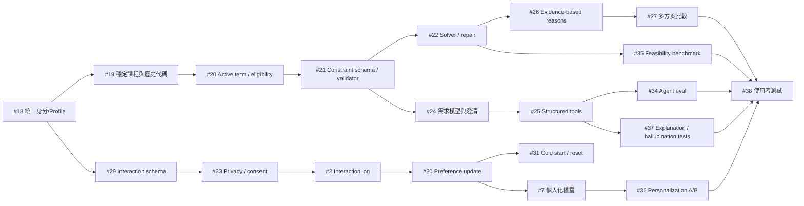

# 2026-08-01 個人化推薦演算法改造路線圖

## 文件性質

本文件為**持續更新的任務追蹤報告**。每完成一項任務即回來更新該任務區塊的狀態、修改檔案清單、實際改動與驗證結果。

### 每次修改都要更新「狀態」與「相依」兩欄

**這兩欄不會自己失效，只會靜默失準。** 每次改動之後都必須回頭核對整張進度總覽表，
不是只改你剛動到的那一列。

**為什麼要核對整張表，而不只是自己那一列**：完成任務 A 會讓「相依 A」的 B、C、D
三列一起過期，而那時候沒有人在做 B、C、D，也就沒有人會發現。這不是假設——
2026-08-31 核對時實際抓到**五項**（`#10`、`#26`、`#34`、`#35`、`#28`）的前置相依
早已全部完成，卻仍被記成卡住；`#10` 與 `#26` 的內文甚至還寫著「仍卡 #21、#22」，
而那兩項分別在 08-29 與 08-30 就完成了。被誤記為卡住的任務不會有人去碰，
等於白白擱置。

**狀態一律依實際程式碼判定，不依印象或文件推定。** 標成「已完成」就要指得出實作位置
或釘住它的測試；標成「尚未完成」就要指得出缺少的具體欄位、模組或測試。
（2026-08-09 首次依此原則全表盤點時，多項任務因此由「⬜ 未開始」改為「🟡 部分完成」
——原本的標示低估了已完成的前置工作。）

核對時要做的四件事：

1. **狀態欄**：完成度是否改變；仍是部分完成的，要寫清楚「還缺什麼」而不只是 🟡。
2. **相依欄**：列出的每一項現在是什麼狀態？全部完成就標「均已完成」，並在狀態欄
   明講**可繼續／可開始**。
3. **外部阻塞要寫進相依欄**，不能只寫在內文——否則從表格看會誤以為只是排程問題。
   例如 `#8` 缺的是 `Courses.prerequisites`（3,086 筆全為 NULL），不是缺工。
4. **區分「卡任務」與「卡資料」**：前者做上游就會解開，後者寫程式也解決不了，
   兩者的處置完全不同。

同一份修改若讓某項任務的相依全部滿足，要一併更新「現在可以動工的任務」一節。

## 建立日期

2026-08-01

## 背景

對現行排課演算法（`server/src/skills/scheduler.js`）做個人化能力檢討後，確認目前系統屬於「參數化的限制求解器」，而非個人化推薦系統。

判定依據：兩位修課歷史、互動行為完全不同的學生，只要表單填寫相同，`buildPlan()` 會回傳完全相同的課表。個人化程度等於使用者自己勾了幾個 checkbox。

> **2026-08-01 修正**：下表是以 `server/data/courses.json` 的 55 筆**示範資料**（description 平均 21 字）實測。接上 MySQL 後已用 3560 筆真實課程（description 平均 161 字、100% 有內容）重測，結論有實質變化——`discussion` 不再全滅、`practicalExam` 與 `finalReport` 已可運作，但 `weightDaily`、`noMidterm`、`learnMore` 與涼課關鍵字仍然失效。完整對照見 [排課演算法與資料庫對齊](./2026-08-01-align-scheduler-with-database.md) 的「關鍵字命中率重測」章節。下表保留作為示範資料下的紀錄。
>
> `#3`（硬過濾改軟懲罰）與 `#4`（結構化評分欄位）仍然成立且必要。

實測 `server/data/courses.json`（55 門課，description 平均 21 字）後發現偏好層在示範資料上大量失效：

| 偏好開關 | 命中課程數 / 55 | 開啟後實際後果 |
| --- | ---: | --- |
| `noMidterm` | 0 | 完全無效，永不排除任何課，卻回報已滿足 |
| `noGroupReport` | 0 | 完全無效，同上 |
| `discussion` | 0 | 候選集歸零，排課直接失敗 |
| `weightDaily` | 0 | 候選集歸零，排課直接失敗 |
| `finalReport` | 1 | 剩 1 門，湊不到最低學分 |
| `englishTaught` | 1 | 剩 1 門，且 `language` 欄位 55 筆全為 undefined |
| `practicalExam` | 3 | 剩 3 門共 8 學分 |
| `learnMore` | 5 | 剩 5 門 |
| 涼課關鍵字（涼/容易/輕鬆/高分/甜） | 0 | 「涼課高分優先」方案加分恆為 0 |

## 進度總覽

| # | 任務 | 狀態 | 相依 |
| ---: | --- | --- | --- |
| 1 | 修掉方案排序的自相矛盾：用偏好符合度決定 `plans[0]` | ✅ 已完成 | 無 |
| 2 | 埋互動 log：記錄推薦清單、最終選擇、加選後退選 | ✅ 已完成（2026-08-26） | #18、#29、#33（均已完成） |
| 3 | 偏好從硬過濾改成軟懲罰 | ✅ 已完成（2026-08-19） | 無 |
| 4 | 把評分方式結構化：新增課程欄位並從 reviews 聚合難度甜度 | ✅ 已完成（2026-08-17） | 無（DDL 欄位另列 D 類） |
| 5A | 結構化評價分數接進 `scoreCourse`（母體共用） | ✅ 已完成（2026-08-17） | #4 |
| 5B | per-user 加權方向（同一分數對不同使用者相反符號） | ⛔ 等待 #30 | #5A、#29、#33、#2（均已完成）；只剩 #30 |
| 6 | 協同過濾：用選課紀錄矩陣做 item-item / user-user | ⬜ 未開始（卡 #31 與樣本量） | #2、#29（已完成）；#31（部分完成，本身卡 #30）；另需足夠互動樣本 |
| 7 | 以個人化權重向量取代 5 個固定 variant | ⬜ 未開始（卡 #30） | #2、#5A（已完成）；#30（可開始但未開始） |
| 8 | 先修關係與多學期路徑規劃 | ⬜ 多學期規劃未開始；歷史修課 MySQL 基礎已完成（2026-08-30） | #19、#21（已完成）；#20、#23（部分完成，剩餘皆卡外部資料）；**另需先修資料——`Courses.prerequisites` 目前 3,086/3,086 全為 NULL** |
| 9 | 探索機制：小比例隨機與多樣性重排 | ⬜ 未開始（卡 #30、#36） | #2、#21（已完成）；#30、#36 |
| 10 | 修復多方案塌縮：5 個 variant 實際只產出 2 種課表 | 🟡 部分完成（2026-08-31）——排序機制的根因已修（variant 權重表、必修絕對優先、涼度來源標記、`interests` 欄位錯用）。實測 demo 帳號 1→2 個方案；候選池夠大且偏好齊全時可達 4 個。**剩下的限制是候選池太小，卡 #13C 的外部規則，不是排序邏輯** | #4、#21、#22（均已完成）；方案數上限另受 #13C（等校方規則）限制 |
| 11 | 修復排課失敗時關注課程從回應中消失（TEST_PLAN S2） | ✅ 已完成 | 無 |
| 12 | 課程類別不完整：資料庫只有必修／選修，缺通識、核心選修、系外選修 | ✅ 已完成 | 無（歷史畢業認列另屬 #23） |
| 13A | 資工系一般班級必修 scope | ✅ 已完成 | 無 |
| 13B | B～F 類班級分類與 unknown eligibility | ✅ 已完成（2026-08-14） | #13A |
| 13C | B～F 類的正式適用規則 | ⛔ 等待外部資料 | #13B；**另需系辦／校方正式規則** |
| 13D | 學制、學程與特殊身分 | 🟡 工程可開始；正式驗收等待特殊身分資料。**`User_Profiles` 已有組員新增的 `program_type`／`enrolled_programs`／`college` 三欄（本專案尚未讀寫），欄位設計這一段不必從零開始** | #13B、#18（均已完成）；另需特殊身分資料與正式適用規則 |
| 14 | 無時間課程永不衝堂，可被無限排入 | ✅ 已完成 | 無 |
| 15 | 實習課程需與同名正課一併排入 | ✅ 已完成（2026-08-20） | #13A、#13B、#19、#20、#21 |
| 16 | 多時段課程支援 | ✅ 已完成 | 無 |
| 17 | 週六與週日課程支援 | ✅ 已完成 | 無 |
| 18 | 統一 user identity、Profile、歷史修課與偏好資料來源 | ✅ 已完成（shared MySQL rollout 另列 D 類） | 無（新增任務的資料基礎） |
| 19 | 以穩定 course code 建立歷史修課、重修與跨學期對應 | ✅ 已完成 | #18 |
| 20 | 建立 active term 與完整 candidate eligibility 規則 | 🟡 部分完成——**程式相依已全部完成**；剩餘缺口（B～F 類正式適用規則、學制學程身分）全部卡 #13C／#13D 的外部資料，非工程問題 | #12、#13A、#13B、#18、#19（均已完成）；剩餘缺口另需 #13C／#13D 的外部資料 |
| 21 | 建立 hard／soft constraint schema、validator 與放寬策略 | ✅ 已完成（2026-08-29 確認責任邊界） | #3、#19（已完成）、#20（已提供本任務所需能力） |
| 22 | 為 greedy 排課加入 repair／backtracking 或 constraint solver | ✅ 已完成（2026-08-30） | #21（已完成） |
| 23 | 建立版本化且可追溯的畢業規則引擎 | 🟡 部分完成（2026-08-31 兩輪）——版本化架構、逐門認列追溯、規則來源記錄、補學分推薦驗證與候選範圍、通識基礎／選修拆分皆完成；剩餘各項全部卡在外部資料（科目表、官方認列表、歷史學期資料、系辦確認） | #12、#19；另需校方正式規則 |
| 24 | 建立結構化需求模型、矛盾偵測與澄清對話 | ✅ 已完成（2026-08-31，兩輪）——四條驗收標準全數達成（第 4 條前提為「無歧義的需求」） | #18、#21（均已完成） |
| 25 | 改用 structured/native tool calling 與輸入輸出驗證 | ✅ 已完成（2026-08-31）——四條驗收標準全數達成：OpenAI 原生 tool calling／JSON Schema、誠實 intent/data、同回合 scope 重建、矛盾參數排課前擋下、正式 tool allowlist（`agentToolRegistry.js`）、非法 course ID 過濾（`watchingCourseIds`）與統一結果信封均已完成 | #20、#21、#24（均已完成） |
| 26 | 建立每門課的 evidence-based recommendation reason | ✅ 已完成（2026-08-31）——8 個欄位全數交付並接到前端與 Agent；`recommendationReasonVersion` 已填。**內容量受 #13C 的候選池限制**：demo 帳號實測 8 門課有 7 門「沒有競爭者」，那是真實情況並已明講，不是缺漏 | #4、#5A、#21、#22（均已完成）；落選者與分數取捨的**內容豐富度**另受 #13C 限制 |
| 27 | 完成多方案比較 UI 與 counterfactual explanation | ✅ **已完成（2026-09-03）**——見下方 #27 段落與[變更報告](./2026-09-03-roadmap-27-plan-comparison-and-counterfactual.md)。方案切換、比較表、counterfactual 端點皆已上線；「保留部分課程再重排」未做，明確記錄未完成 | #10、#26（均已完成） |
| 28 | 統一 Dashboard、Schedule、Chat 的登入使用者 context | ✅ **已完成（2026-09-03）**——見下方 #28 段落與[變更報告](./2026-09-03-roadmap-28-account-isolation.md)。兩帳號實機驗收全數通過；過程中發現並修復共用 MySQL 的日期時區 bug（刪除功能原本一律失敗） | 無（#18、#2 均已完成） |
| 29 | 定義 interaction event schema 與回饋原因 | ✅ 已完成（2026-08-21） | #18 |
| 30 | 建立可重現的 per-user preference update pipeline | ⬜ **可開始（前置相依已全部完成）** | #2、#5A、#29（均已完成） |
| 31 | 建立冷啟動、偏好重設、時間衰減與資料不足策略 | 🟡 部分完成 | #18、#30 |
| 32 | 比較 content-based、collaborative filtering 與 hybrid 方法 | ⬜ 未開始 | #6、#7、#31、#36；另需足夠互動樣本 |
| 33 | 建立互動資料隱私、匿名化、consent 與保存規則 | ✅ 已完成（2026-08-22） | #18、#29（均已完成） |
| 34 | 建立 Agent 自然語言需求理解 eval | 🟡 部分完成（2026-08-31）——**前置相依已全部完成，可繼續**。8 題中文 golden set 已進 `npm test` 每次執行；多輪修正、課名同名、越權要求與大規模標註資料集尚未涵蓋 | #24、#25（均已完成） |
| 35 | 建立 feasibility、constraint violation 與 solver benchmark | 🟡 部分完成——**前置相依已全部完成，可繼續**。Z1–Z7 已提供最小 golden cases；仍缺跨科系／年級／學期資料集、benchmark runner 與量化報告 | #15、#21、#22（均已完成） |
| 36 | 建立 personalization baseline 與 preference sensitivity A/B | 🟡 部分完成（卡 #30 那條鏈） | #5B、#7、#30、#31（四者最終都卡在 #30） |
| 37 | 建立 explanation faithfulness 與 hallucination tests | ⬜ **未開始，前置已全部完成（2026-08-31）**——#26 的 reason 物件正是「把每個句子對應回 Profile／DB／review／rule」所需要的結構，`dataSources` 與 `confidence` 可直接當比對基準 | #25、#26（均已完成） |
| 38 | 進行學生使用者測試並整理量化結果 | ⬜ 未開始（卡 #36、#37；#27、#28 已完成，不再是阻塞） | #33、#27、#28（均已完成）；#34、#35（前置皆已解除）；#36、#37（仍有上游未完成） |
| 39 | 架設正式網站與 Production rollout | ⬜ **工程可開始**（#33 已完成；需先由人決定部署平台與網域） | #33（已完成）；另需選定部署平台、網域與 secret store |

## 現在可以動工的任務（2026-08-31 盤點）

`#25` 完成後重新核對整張表的相依欄，發現**有五項的前置相依其實早就全部完成，
只是表格沒有跟著更新**。這一節是那次核對的結論，避免「以為還卡著」而擱置。

| # | 任務 | 為什麼現在可以動 |
| ---: | --- | --- |
| ~~10~~ | ~~修復多方案塌縮~~ | **已於 2026-08-31 動工**，排序機制的根因已修（見下方 #10 段落）。原本記在這裡的「根因一：15 門必修有 11 對互相衝堂」經真實資料重測後**確認已過期**——那是 55 門假資料時代的現象 |
| ~~26~~ | ~~evidence-based recommendation reason~~ | **已於 2026-08-31 完成**（見下方 #26 段落）。它解除了 #27 與 #37 的最後一個前置 |
| 34 | Agent 需求理解 eval | #24、#25 均已完成。目前只有 8 題，缺多輪修正、課名同名、越權要求等類別 |
| 35 | solver benchmark | #15、#21、#22 全部完成。Z1–Z7 是最小 golden cases，缺 runner 與量化報告 |
| 28 | 統一登入使用者 context | #2 已在記錄互動事件，「互動事件不交叉」這條驗收**先前無事件可測**，現在可以測；只剩雙帳號實機驗收 |

另外 `#39`（正式網站）在工程上也可開始——`#33` 已完成，缺的是「選哪個平台」這個
人的決定，不是程式相依。

**仍然真的卡住的**，卡點只有兩種：

- **卡 #30 這條鏈**：`#30`（可開始但未開始）→ `#5B`／`#7`／`#31`／`#36`／`#9`／`#6`／`#32`。
  `#30` 本身前置已全部完成，它是這條鏈唯一的閘門。
- **卡外部資料**：`#13C`（系辦規則）、`#13D`（特殊身分資料）、`#23` 剩餘項（歷史科目表、
  官方認列表、歷史學期課程資料）、`#8`（`Courses.prerequisites` 全為 NULL）。
  這些不是排程問題，寫程式也解決不了。

## 任務相依的閱讀方式

- 「相依」是開始該任務前必須完成或至少達到可被依賴的穩定介面，不只是相關任務。
- 若相依欄包含「另需校方正式規則」或「另需足夠互動樣本」，代表即使程式任務已完成，外部資料條件不足時仍不可開始驗收。
- #18～#38 均預設既有 MySQL 課程查詢、多時段解析及基本衝堂判斷仍維持通過；若基礎資料契約改動，必須先重跑相關 regression tests。
- 相依完成不代表下游任務自動完成。每一項仍須通過該節所列的獨立驗收標準。

## 建議執行 Gate

| Gate | 目的 | 必須先完成 | 通過後才進入 |
| --- | --- | --- | --- |
| Gate 0 — 身分與資料真實性 | 確保學到的是正確學生、正確課程與正確學期 | #12、#13A、#13B、#18、#19、#20、#23 的適用部分（#13C、#13D 阻塞中，以 `unknown` 標記通過） | Agent、學習與 solver 開發 |
| Gate 1 — 限制與可行性 | 統一定義硬限制、軟偏好、共修與無解原因 | #3、#15、#21、#22 | 多方案、解釋與 feasibility benchmark |
| Gate 2 — Agent 需求理解 | 讓自然語言先變成可驗證需求，再允許工具執行 | #24、#25、#28（**三項均已完成，2026-09-03 起本 Gate 全數通過**） | Agent-level 自動排課與對話 eval |
| Gate 3 — 偏好資料與學習 | 先合法、安全記錄互動，再更新個人權重 | #29、#33、#2（已完成）、#30、#31、#7 | 協同過濾、探索與 hybrid 比較 |
| Gate 4 — 推薦解釋與比較 | 讓每門課與每個方案都有可追溯理由 | #4、#5A、#10、#26、#27 | 教授展示與使用者研究 |
| Gate 5 — 系統驗證 | 證明需求理解、可行性、個人化與解釋均有效 | #34～#38 | 宣稱完成 AI 個人化課程規劃 Agent |

核心依賴主線如下；協同過濾與探索是有資料後的研究分支，不應阻塞先完成單一使用者的 content-based 個人化：



---

## #1 修掉方案排序的自相矛盾

**狀態**：✅ 已完成（2026-08-01）

### 問題

`server/src/skills/scheduler.js` 的方案比較器只看三層：`success` → 是否達最低學分 → 總學分高者勝。三層都與使用者偏好無關。

系統花整套 `getEasyCourseScore`、`getInterestScore`、compact 加權產生 5 份反映不同偏好的課表，卻用總學分裁決主推哪一份。而 `max_credits` 是唯一跳過提前中止條件、一路塞滿到上限的 variant，設計上必定學分最高，因此主推方案幾乎恆為「學分最大化」，其他四種偏好方案只能躺在 `plans[1..4]`。

整條個人化管線的產出，在管線末端被一個與偏好正交的排序規則覆蓋掉。

### 修改檔案清單

- `server/src/skills/scheduler.js`
- `server/src/routes/schedule.js`
- `server/src/services/agentService.js`
- `docs/API_SPEC.md`

### 主要改動內容

- 新增 `buildPreferenceProfile(constraints)`，由使用者實際表達的偏好推出權重（`interest` / `compact` / `easy`）。
- 新增 `evaluatePreference(plan, constraints, profile)`，回傳 0~1 的 `preferenceScore` 與三項 `preferenceBreakdown`。
- **關鍵設計**：所有方案一律用「同一組使用者權重」評分，方案不得用自己的 variant 偏誤自評，否則彼此無從比較。
- 三項正規化指標：
  - `interest`：平均每門課的興趣關鍵字命中率，除以每門課可能的最大命中分。
  - `compact`：`(maxDays - usedDays) / (maxDays - 1)`，使用天數越少越高。
  - `easy`：平均涼課分數除以最大可能涼課分數。
- 比較器改為四層：`success` → 是否達最低學分 → `preferenceScore` → `totalCredits`（tie-break）。
- 抽出 `collectInterestKeywords()`，並將 magic number 改為具名常數（`INTEREST_KEYWORD_SCORE`、`MAX_EASY_COURSE_SCORE`、`WEEK_DAYS`、`PREFERENCE_SCORE_EPSILON`）。
- 回傳結果新增 `preferenceProfile`、`hasExpressedPreference`，各方案新增 `preferenceScore`、`preferenceBreakdown`，訊息文字附上主推理由。
- 使用者未表達任何偏好時，`preferenceScore` 全為 0，自動退回總學分排序（維持既有行為），並發出 warning 說明「主推方案改以總學分決定，個人化程度有限」。
- 補齊參數傳遞：`preferredKeywords`、`interests` 原本**完全沒有**被傳進排課引擎，導致 `interest` variant 的 `getInterestScore` 只看得到 `preferredTrack`，該方案形同半死。本次於 REST 與 AI Agent 兩條路徑一併補上，並新增 `preferEasyCourses`。

### 影響範圍

- `POST /api/schedule/generate`
- `POST /api/chat` 的 `run_csp_scheduler` tool call
- 回應格式為**向後相容的欄位新增**，既有欄位語意不變；但 `plans[0]` 與頂層 `schedule` 的挑選結果會改變，這正是本次修正的目的。

### 測試與驗證結果

以 `server/data/courses.json`（55 門課）實測。

**情境一：大一大二（必修未修畢）**

選修填充空間僅剩 1 學分，variant 差異幾乎無法展現。詳細量測與根因見 #10。

**情境二：大三（12 門必修已修畢，選修填充階段實際執行）**

| 測試 | 結果 |
| --- | --- |
| A. 無偏好 | `preferenceScore` 全 0，退回總學分排序，warning 正確發出 |
| B. 興趣優先（關鍵字 網路/資料） | **`interest` 方案 21 學分（pref 0.214）擊敗 `compact` 方案 22 學分（pref 0.063）** |
| C. 集中排課 | 使用 3 天的方案（pref 0.500）勝過使用 4 天的方案（pref 0.250） |
| D. 涼課優先 | 所有方案 `easy` 皆為 0，`preferenceScore` 全 0，退回學分排序 |

測試 B 即為本任務驗收條件：**偏好符合的方案即使學分較少，仍成為 `plans[0]`**。舊比較器下必定是相反結果。

測試 D 的 0 分是**正確且誠實的行為**，反映背景章節記錄的「涼課關鍵字 0 命中」資料問題。系統會顯示「偏好符合度 0%」，把資料缺口顯性化而非靜默吞掉。該資料問題由 #4 修復。

**其他驗證**

- `node --check` 對 `server/src/**/*.js` 全數通過。
- `npm run install:all`：通過（client 165 packages、server 142 packages）。
- `cd client && npm run build`：通過，1744 modules transformed，產出 `dist/index.html`、CSS 28.02 kB、JS 277.74 kB。
- `cd client && npm run lint`：通過，無錯誤與警告。
- 本次未修改任何前端檔案，前端無程式碼變更；`node_modules/` 已由 `.gitignore` 排除，未進入 git 追蹤。

### 已知限制（留給後續任務）

- `easy` 維度目前恆為 0，需等 #4 補上結構化評分欄位後才有作用。
- 偏好權重仍是 0/1 二元，無法表達「0.7 涼 + 0.3 興趣」，由 #7 處理。
- 權重來源仍為顯式表單，非從行為學習，由 #2 與 #7 處理。
- 5 個 variant 去重後實際只剩 2 種課表，本次驗證過程中量測發現，已另立 #10 追蹤。

### 對抗式審查修正（2026-08-01 追加）

`/codex:adversarial-review` 對 #1 的工作區變更提出兩項 medium 發現，均成立且均為本次引入或未同步，已修正。

**發現一：空陣列蓋掉已儲存偏好**

`constraints.preferredKeywords || prefs.preferredKeywords || []` 中，空陣列在 JavaScript 是 truthy，因此 client 只要送出 `[]` 就會短路，永遠取不到已儲存偏好。

追查後確認影響範圍比審查指出的更大：`client/src/pages/DashboardPage.jsx:60-82` **每次都送出本地建的 `blockedPeriods`**，`mondayFree` 為 false 時即為 `[]`。這使得使用者存在 `User_Profiles.avoid_time` 的封鎖時段被靜默丟棄——這是硬約束，不只是軟偏好，且為線上既有缺陷。

**發現二：AI Agent tool 契約未同步**

`agentService.js` 已接受 `preferredKeywords`、`interests`、`preferEasyCourses`，但 `promptService.js` 呈現給 LLM 的工具說明未列出，模型不知道這些參數存在，`/api/chat` 路徑的個人化實際未生效。違反 `AGENTS.md:115` 與 `docs/PROMPT_DESIGN.md:93` 的維護規則。

**根因與處置**

兩項發現的共同根因是 `routes/schedule.js` 與 `agentService.js` 各有一份近乎重複的 30 行限制條件合併區塊，兩者已經漂移。新增 `server/src/services/constraintService.js`，抽出共用的 `buildScheduleConstraints()`，兩條路徑改為呼叫同一份邏輯。

合併語意明確化：

- 陣列型參數送 `[]` 視同未指定，退回已儲存偏好；要覆蓋必須送非空陣列。
- 布林型 `false` 是有效值會覆蓋；只有 `null` / `undefined` 才退回。
- `selectedCourseIds`、`watchingCourseIds`、`courseStates` 屬本次操作狀態，不從偏好回填。

**連帶修正**：`mondayFree` 原本只在 REST 路徑展開，Agent 路徑完全忽略——但 `docs/PROMPT_DESIGN.md:82` 的 few-shot 範例正是教模型送 `mondayFree`。抽出共用邏輯後兩條路徑一致。

**追加修改檔案**

- `server/src/services/constraintService.js`（新增）
- `server/src/services/promptService.js`
- `server/src/routes/schedule.js`
- `server/src/services/agentService.js`
- `docs/PROMPT_DESIGN.md`
- `docs/API_SPEC.md`
- `docs/TEST_PLAN.md`

**追加驗證**

- 限制合併與 prompt 契約測試：17 項全數通過。
- `docs/TEST_PLAN.md:81` 規定「修改排課邏輯至少執行 S1-S10」，此項在 #1 原始提交時**遺漏未執行**，本次補做：12 項通過、1 項失敗。
- 失敗項 S2 為既有缺陷，非 #1 或本次修正引入，已立案為 #11。
- #1 的驗收情境 B（興趣方案以較少學分勝出）重跑通過，無回歸。
- `node --check` 對 `server/src/**/*.js` 全數通過。
- `npm run build`、`npm run lint`：通過。

### 是否 commit 與 push

- 未 commit。
- 未 push。

---

## #2 埋互動 log

**狀態**：✅ 已完成（2026-08-26）——詳見 [互動 log 埋點變更報告](./2026-08-26-interaction-logging.md)

**相依**：#18、#29、#33（均已完成）

**開始前必須具備**：使用者已有唯一 canonical ID；互動事件已定義曝光、接受、移除、退選及原因；隱私、consent 與保存期限已確認。不得先把未定義、不可追溯的 click/chat log 大量寫入正式資料。三項於開工前逐一查證程式碼確認具備。

記錄推薦清單、使用者最終選擇、加選後退選。不需演算法工作，但為 #6、#7、#9、#30、#32 的資料前提。

### 已完成

- **儲存體**：`Interaction_Events`（`003_interaction-events`，已套用 shared MySQL）。**沒有任何學號欄位**，
  只存 #33 的 HMAC `subject_id`；`(subject_id, idempotency_key)` UNIQUE 讓去重在資料庫層也成立；
  180 天保存期限併入既有 `npm run cleanup:privacy`。
- **服務與 API**：`services/interactionEventService.js` 是唯一寫入位置，`POST /api/interactions` 是唯一入口。
  未同意 `personalization_learning` 時回 `200 { recorded:false }` 而非 428——可選用途預設關閉是合法狀態，
  不該把使用者推到同意牆（ADR-018）。
- **讓推薦可被指認**：排課回應新增 `requestId` 與每個方案的 `planId`／`variantId`。先前只有 `plan.id`
  （variant 名稱），五個方案跨次排課無法區分，曝光事件根本指認不到是哪一次推薦。識別碼加在
  `scheduleService.generateForUser()`（REST 與 Chat 的唯一共同入口），`scheduler.js` 不動。
- **使用者最終選擇**：新增排課後的確認。Agent 排完課**必須**詢問是否符合需求，答案經新 tool
  `record_schedule_feedback` 轉成結構化事件；非 Chat 使用者則有確認列。**儲存課表刻意不算接受**
  ——存草稿也會按儲存，語意含糊；沒回答就是沒接受。
- **前端埋點**：曝光、查看、收藏／取消收藏、選擇、接受、退選、重新排課全部埋齊，集中在
  `ScheduleContext` 而非各頁自己記一套。移除時提供 7 個原因選單；2026-08-29 起不再提供略過
  按鈕。底層仍接受 `null`，供未啟用個人化或舊呼叫端表示「未蒐集原因」，不猜測原因。
- **失敗隔離**：互動記錄是旁路，fire-and-forget 且吞掉錯誤；實機把端點打成 500 後，加選、移除、
  排課、聊天全部照常完成，只有 console 一則警告。
- 測試：`npm test` 由 481 增至 522，全數通過（含兩輪對抗式審查追加的測試）。
- **對抗式審查修正（第一輪）**：帳號刪除與事件寫入的競態（先撤回再刪除 + `FOR UPDATE` 交易守門）、
  回饋來源改為對照曝光事件驗證（模型無法用捏造的 requestId／variant／課程寫入假標籤）、
  確認列文案改為反映實際寫入結果。
- **對抗式審查修正（第二輪，針對 `98bf7ac..218358a` 再次審查）**：consent 撤回本身也補上
  跟撤回帳號一樣的列鎖競態防護、`recommendation_exposed` 改成只能由伺服器自己寫入（不再信任
  client 宣稱的曝光）、來源驗證從只接 Agent tool 搬進共用寫入函式（確認列與移除選單原本
  完全繞過驗證）、並行撞鍵時正確區分 `duplicate` 與 `conflict`、`courseSource()` 改讀
  `formallyRequired` 而非誤用系所必修欄位、新增節流與每日事件量配額。詳見變更報告的
  「對抗式審查修正（第二輪）」一節與 `docs/DECISIONS.md` ADR-019。

### 本系統的 `course_withdrawn` 定義

#29 的字面語意是「已在學校正式選課系統選上、之後在加退選期間退掉」。本專案不連學校選課系統，
沒有那個外部狀態，因此**以「退掉推薦課表上的課」對應之**：課已進到使用者的課表（＝這個產品裡的
「已選上」），之後又被拿掉。roadmap 的「加選後退選」由這個事件承接。

`course_removed`（在課表之外拒絕一個推薦）因此成為目前沒有介面的 forward contract，不埋。
兩者在 `interactionEventSchema.js` 的處理完全相同，**不需要改 #29 的程式**，只更新了
`docs/DATA_SCHEMA.md` 的敘述，不留下與實作不符的舊定義。

### 明確不含

- 任何權重計算、偏好更新或排課結果變化——那是 #30，#2 只負責誠實記錄。
- `recommendationReasonVersion` 的真實值（#26 完成前維持 `null`）。
- 研究用 aggregate export（ADR-017 已禁止 row-level 事件進入研究匯出）。

### 已知限制（2026-08-31 更新：以下已解除）

- ~~Agent 排課後確認的**瀏覽器端對端驗收未完成**：`gemini-2.5-pro` 已遭 Google 下架
  （`404 ... no longer available to new users`），Chat 整條路徑在本次之前就已失效，與 #2 無關。~~
  **已於 2026-08-30 隨 OpenAI 原生 tool calling 遷移解除**：換成 `gpt-5.6-luna` 後 Chat 恢復可用，
  `record_schedule_feedback` 完整跑過一次瀏覽器端對端驗收——資料庫落地的 `course_withdrawn`
  事件與前一筆 `recommendation_exposed` 的 `request_id` 一致、`section_id` 為實際顯示過的課、
  `feedback_reason` 為 enum `time`，詳見
  [`2026-08-30-openai-native-tool-calling.md`](./2026-08-30-openai-native-tool-calling.md) 的
  「A/B 對照 2」。IL-13～IL-13d 與 prompt 契約測試仍涵蓋邏輯層。

---

## #3 偏好從硬過濾改成軟懲罰

**狀態**：✅ 已完成（2026-08-19）——詳見 [內容偏好從硬過濾改成軟懲罰變更報告](./2026-08-19-content-preference-soft-scoring.md)

解決反向判定型（候選集歸零）與正向判定型（靜默假承諾）兩種失效模式，並提供 graceful degradation。

### 已完成

- 8 個內容偏好旗標（`noMidterm`／`noGroupReport`／`discussion`／`weightDaily`／`practicalExam`／
  `finalReport`／`englishTaught`／`learnMore`）從 `hardConstraintReason()` 的硬性排除改為
  `scoreCourse()` 裡的軟性加分，比照 #4／#5A 的「無證據不當成負面判定」設計哲學：未命中一律
  中性 0 分，不論是「想避免」還是「想要」類。
- 新增候選池層級的訊號可靠度警告：關鍵字命中率 <5% 或 >95% 時提醒使用者這個偏好幾乎無法有效
  區分課程。門檻用真實命中率反推驗證過，正好命中本節一開始就診斷出的三個失效旗標
  （`noMidterm`、`weightDaily`、`learnMore`）。
- 真實資料驗證：對一位資工三學生的 227 門候選課，`weightDaily` 舊版行為會把候選集壓縮到 3 門
  （1.3%），新版軟性加分後排課正常成功，8 門課、24 學分不變。
- 4 個真正硬性的時段類檢查（`noMorningClasses`／`noEveningClasses`／`blockedPeriods`／
  `lunchBreakFree`）維持不變；順手修正 `docs/SCHEDULING_LOGIC.md` 先前把這 3 項誤列在
  「軟性偏好」的既有文件錯誤（只改文件敘述，不改程式行為）。
- 新增 15 個測試（N1–N15），`npm test` 由 413 增至 428，全數通過，S1–S10 逐項確認無回歸；
  瀏覽器實機以 Dashboard 既有的內容偏好 checkbox 完成 A/B 驗收。

### 明確不含

- Roadmap #21 的正式 `hard`／`soft` schema（`weight`／`relaxable`／`source`／`confidence` 欄位、
  獨立 validator、逐級放寬機制）——#3 只是把誤判為硬性的內容偏好改成軟性，不是 #21 要的正式
  分層，#21 仍是分開、後續的任務。

---

## #4 把評分方式結構化

**狀態**：✅ 已完成（2026-08-17）——評價聚合層已接進排課引擎；DDL 欄位與 per-user 加權另列後續任務

詳見 [評價驅動的涼度評分變更報告](./2026-08-17-review-driven-easiness.md)。

### 已完成

- `server/src/skills/reviewStats.js` 已提供結構化聚合（`weightedAverageScore()`、`summarizeReviews()`、`calculateEasinessFromAverages()`、`countBySentiment()`），現新增 `shrinkEasiness()`（m-estimate 收縮，`m=5`）。
- 新增 `server/src/skills/courseReviewStats.js`：課程 ↔ 評價對應、母體先驗、1–5→0–100 尺度映射、`deriveReviewEvidence()`。
- **`scheduler.js` 已 import 並使用評價資料**：`getEasyCourseScore()`、`getEasiness()`、`evaluatePreference()`、`scoreCourse()` 的 `easy_score` 分支全數改用結構化評分，取代原本「涼／容易／輕鬆／高分／甜」關鍵字判斷（真實資料命中率僅 0.7%，且會誤判「教室很涼」為涼課）。
- 沒有評價的課給母體先驗換算的中性分，不給 0（詳見 `docs/DECISIONS.md` ADR-006）；方案層涼度只在有證據的課上平均，另回傳 `plan.reviewCoverage`（ADR-008）。
- `GET /api/reviews/easy` 同步改用收縮後分數排序，消除「涼課排行榜第一名沒被排進涼課方案」的不一致（ADR-007）。
- 評價資料實測：`Course_Reviews` 181 列 / `Course_Sections` 3560（覆蓋率 5.1%），全部 114-下學期、全部選修。對資工三學生，181 筆中只有 75 筆（`eligible`）能真正進入自動排課，最大一塊（68 筆通識）卡在 #13C。
- 測試：`ttlCache.test.js`（TC1–4）、`reviewStats.test.js` 新增 shrinkEasiness（V1–5）、`courseReviewStats.test.js`（V6–15）、`reviewSearch.test.js`（V16–19）、`scheduler.test.js`（V20–28）、`database-contract.test.js` 新增三則真實 MySQL 契約測試。`npm test` 由 365 增至 407，全數通過，S1–S10 逐項確認無回歸。

### 明確不在本次範圍（移出 #4，不再視為缺口的一部分）

- **`has_midterm` / `has_group_project` / `grading_scheme` / `language` 課程欄位**：需對共用 MySQL 做 `ALTER TABLE`，屬與 #18 `student_id` migration 同性質、需與組員協調的 D 類 rollout。`noMidterm`（真實命中率 0.1%）、`noGroupReport`、`englishTaught` 三個偏好因此仍用描述關鍵字判定；改判定方式會讓候選集歸零，屬 #3（硬過濾改軟懲罰）的範圍，不屬 #4。
- **`schema.sql` 的 category CHECK 修正**：前提已失效。`server/src/db/schema.sql` 是 legacy SQLite 死檔，其 `reviews` 表連 `sweetness`/`overall` 等欄位都沒有，沒有任何程式讀取它。此項作廢，不再視為待辦。
- 已實測確認 `Reviews_tags`（314 個相異自由標籤，含「教室很熱」「追星必備」等雜訊）不可用來推導上述課程屬性欄位，見 `docs/DATA_SCHEMA.md`。

---

## #5 把 reviews 分數接進 scoreCourse

原 #5 已於 2026-08-17 拆成 #5A～#5B。拆分理由：「把結構化評價分數接進 `scoreCourse()`」與「加權方向
依使用者而異」原本混在同一個 🟡「部分完成」底下，但兩者是**完全不同性質**的工作——前者是 2026-08-17
隨 #4 一併完成、可立即驗收的接線工作；後者是「真正的個人化」，會被一條明確、有順序的相依鏈卡住
（原始順序為 #29 → #33 → #2 → #30；#29 已於 2026-08-21 完成），其餘鏈上任一環完成前**技術上做不到**，不是尚未安排時間去做。混在一起會讓
「#5 到底還缺什麼」與「為什麼缺」都無法判讀——這正是本次拆分要解決的問題。

| 子項 | 範圍 | 狀態 | 阻塞原因 |
| --- | --- | --- | --- |
| #5A | 結構化評價分數接進 `scoreCourse()`（母體共用，非個人化） | ✅ 已完成（2026-08-17） | 無 |
| #5B | per-user 加權方向（同一評價分數對不同使用者要有相反符號） | ⛔ 阻塞 | #29、#33、#2 已完成；仍需 #30 |

---

## #5A 結構化評價分數接進 scoreCourse

**狀態**：✅ 已完成（2026-08-17）——詳見 [評價驅動的涼度評分變更報告](./2026-08-17-review-driven-easiness.md)

**相依**：#4

`scoreCourse()` 已讀取 `reviewStats`／`courseReviewStats` 的結構化評價（`sweetness`／`coolness`／
`workload`／`overall`），不再是純文字關鍵字。這是「把 reviews 分數接進 scoreCourse」字面上的內容。

**範圍邊界**：這裡的分數是**母體共用**的——所有使用者看到同一門課的涼度分數相同，不含任何個人化。
「同一難度數值對不同使用者要有相反符號」不屬於 #5A，是 #5B 的內容。

---

## #5B per-user 加權方向

**狀態**：⛔ 阻塞——**#29、#33、#2 已完成；只剩 #30**

**相依**：#5A、#29、#33、#2（均已完成）；外部條件為 #30

**開始前必須具備**：#29 已定義互動事件語意（曝光、選課、退選及原因）；#33 已確認隱私、consent、
保存規則；#2 已依前兩項實際開始記錄互動；#30 已把記錄下來的事件轉成可重播、可解釋的 per-user
權重更新管線。四項缺一即無法開始，且**彼此有順序**——沒有 #29 定義事件語意，#33 無從界定要保護
什麼資料；沒有 #33 的合法性確認，#2 不能開始蒐集；沒有 #2 累積的互動資料，#30 沒有東西可學；沒有
#30 產出的權重，#5B 沒有值可以塞進 `scoreCourse()`。

**為什麼技術上做不到，不是排程問題**：「同一評價分數對不同使用者要有相反符號」的符號與強度**只能從
使用者實際行為推論**（例如持續選硬課且沒退選的學生，隱含偏好挑戰）。在完全沒有任何互動資料的情況下，
系統沒有依據判斷任何一位使用者該往哪個方向偏——不是「還沒空做」，而是「即使現在寫程式，也沒有輸入
可以喂進去」。

**與 #7 的關係（易混淆處）**：`docs/CHANGE_REPORTS/2026-08-17-review-driven-easiness.md` 一度誤寫
成「#5 這部分會連帶拖進 #7」，語意上暗示 #5B 要等 #7——這是寫反了。roadmap 主表原本就把 #7 的相依
列為 #2、#5、#30（現已改列 #5A，見下方），也就是 **#7 依賴 #5，不是 #5 依賴 #7**。#7（連續權重向量）
是 #5B 完成後，把學到的方向跟 interest／compact 等其他軸統一表示的下游消費者，不是 #5B 的前提。

**注意**：#5B 只需要 #5A 提供的評分軸位存在即可動工，**不需要等 #7**；#7 要做的是「用連續權重向量
取代 5 個固定 variant」這個更大範圍的重構，#5B 學到的一個 easy 方向值即使沒有 #7 也能直接塞進現行
`preferenceProfile.easy`。

---

## #6 協同過濾

**狀態**：⬜ 未開始（#2、#29 已完成；卡 #31 與樣本量）

**相依**：#2、#29（均已完成）；#31（部分完成，本身卡 #30——因此本任務最終也卡在 #30）；
外部條件為足夠且去識別化的 user-course interaction matrix。

**開始前必須具備**：事件能區分「被曝光但未選」與「根本沒看見」，冷啟動策略已存在，並先定義最少使用者數、最少課程互動數與離線切分方式。若樣本不足，本任務只能做實驗，不得接管正式排序。

用選課紀錄矩陣做 item-item / user-user 相似度，含冷啟動 population fallback。

---

## #7 以個人化權重向量取代 5 個固定 variant

**狀態**：⬜ 未開始（#2、#5A 已完成；卡 #30）

**相依**：#2、#5A（已完成）、#30

**開始前必須具備**：已有可信課程 feature／review score，互動事件可轉成訓練訊號，且 per-user preference update 能重播得到相同權重。需先定義權重範圍、正規化、版本與回復預設值的方法。

將離散 variant 選擇改為連續權重空間，並在 log 累積後由資料學習權重。

**由 #21 交接的評分接線**：#21 已完成描述性的 constraint schema，但目前
`scoreCourse()` 的內建評分算式仍直接使用既有常數。#7 重構 scorer／objective 時，應讓可執行的
軟性偏好權重由正式 schema／版本化權重向量提供，避免 schema 的 `weight` 與實際評分再次漂移。
這項工作不屬於 #30；#30 負責產生可重播的 per-user 權重，#7 才負責讓排課器消費它們。

---

## #8 先修關係與多學期路徑規劃

**狀態**：⬜ 多學期規劃未開始；歷史修課 MySQL 基礎已完成（2026-08-30，仍卡 #20、#23 與先修資料）

**相依**：#19、#21（均已完成）；#20、#23（部分完成，各自的剩餘缺口皆卡外部資料）；
**另需先修資料——`Courses.prerequisites` 目前 3,086/3,086 全為 NULL，沒有任何可用來源**

**開始前必須具備**：歷史修課可用穩定課程代碼判定完成／未通過／重修；每學期課程與資格可查；限制 schema 可表達先修與共修；畢業規則已有入學年度版本。缺一項時只能做單學期提示，不能宣稱完成路徑規劃。

從單學期無狀態貪婪升級為序列決策，補上先修欄位、歷史成績與分類別畢業進度。

### 已完成的資料基礎（2026-08-30）

- `users.json.courseHistory` 的 53 筆完整 11 欄紀錄已搬入 MySQL `User_Course_History`，
  逐欄 0 差異，分類學分仍為 61/22/24/11、總計 118。
- 表改用穩定 `catalog_course_code`，不再以當期 `Courses.course_id` 建 FK；歷史課程即使
  不在當期 catalog 仍可保存。
- Profile、Schedule、Chat、validator、畢業進度與 Privacy export 全部經同一個 DB repository
  取得歷史修課；JSON 欄位已刪除，沒有 fallback。
- 查詢失敗回 `503 COURSE_HISTORY_UNAVAILABLE`，不會把 DB 故障誤當成零筆歷史。
- `Courses.prerequisites` 目前仍為 3,086/3,086 NULL；資料來源與正式先修／共修強制執行
  尚未完成，validator 繼續回報 `unchecked`。
- 已於 2026-08-31 commit（`c6da412`）並 push 到 `backend` 分支；瀏覽器實機驗證 demo 帳號
  正常路徑（118/128 學分，與遷移前迴歸值一致）與失敗路徑（模擬 503 時顯示錯誤畫面而非
  假資料）。**尚缺**：本次遷移沒有獨立的 `docs/CHANGE_REPORTS/` 變更報告——工作本身在
  這份文件寫下這段記錄之前就已存在於工作目錄，commit 時補做了驗證但未回頭補一份完整
  報告，屬本次盤點順手發現的文件缺口，尚待補上。

---

## #9 探索機制

**狀態**：⬜ 未開始（#2、#21 已完成；卡 #30、#36）

**相依**：#2、#21（均已完成）、#30、#36

**開始前必須具備**：互動 log 可供回饋、hard constraints 有獨立 validator、個人偏好已有穩定 baseline，且 A/B 指標能偵測探索是否降低品質。探索不得作用於必修、重補修、明確指定或資格不確定課程。

小比例隨機與多樣性重排，限制在備選區與低風險課程，不得對必修與重補修做隨機化。

---

## #10 修復多方案塌縮

**狀態**：🟡 部分完成（2026-08-31）——**排序機制的根因已修**，詳見
[變更報告](./2026-08-31-roadmap-10-plan-diversity.md)。剩下的限制是候選池太小，
卡 `#13C` 的外部規則，不是排序邏輯。

**相依**：#4、#21、#22（均已完成）；**方案數上限另受 #13C 限制**（等系辦／校方的
B～F 類正式適用對象規則，屬外部資料，寫程式解決不了）

### 2026-08-31 實作結果

| 情境 | 改動前 | 改動後 |
| --- | ---: | ---: |
| demo 帳號（16 門可競爭） | 1 個方案 | **2 個方案** |
| 候選池放大（模擬 #13C 已解） | 3 個 | 3 個，但 `easy_score` 的課表真的不同了 |
| 放大 + 真興趣關鍵字 | 3 個 | **4 個**（`interest` 開始生效） |
| 放大 + 關閉 preferCompact | — | **4 個**（`compact` 開始生效） |

已修的三件事：**variant 權重表**（取代「共用基礎分 + 一點小加分」）、
**必修絕對優先抽離權重表**（`REQUIRED_COURSE_BONUS`，避免涼課壓過必修）、
**`easinessSource` 涼度來源標記**（`reviews`／`proxy`／`none`，proxy 不得用於涼度宣稱）。
另修掉 `constraintService.js` 把**偏好標籤當成興趣主題**的欄位錯用。

方案數不足時 `warnings` 會說明哪些取向被合併、可競爭課程數，
以及「你已勾集中排課，所以集中排課方案不會不同」這類合理原因。

### ⚠️ 以下 2026-08-01 的根因分析已過期（保留作為紀錄）

**根因一「必修互相衝堂」在現行系統上不成立。** 那份分析用的是 55 門假資料
（`server/data/courses.json`）。2026-08-31 用真實 MySQL 與 demo 帳號重測：
候選池只有 **3 門必修**，而且**三門都已修過並通過**，最終課表一門必修都沒有。
`#13A` 的系所收斂與 `#19` 的已修排除上線後，那個現象就消失了。

真正的根因是**權重量級失衡**（類別項每差一級 120 分，variant 專屬項只有 25～40 分）
與**兩個 variant 沒有訊號可用**，加上**候選池被 #13C 掐到只剩 16 門**。

**開始前必須具備**：課程評分維度有非零且可信的資料，限制 schema 已穩定，solver／repair 能在相同硬限制下搜尋不同可行區域。否則只調整排序常數可能短暫得到五份方案，後續 solver 重構又會全部失效。

於 #1 的驗證過程中量測發現。`PLAN_VARIANTS` 宣稱 5 種方案，經 `uniquePlans()` 去重後**永遠只剩 2 種，且與年級無關**。`docs/SCHEDULING_LOGIC.md:131` 要求至少支援五種方案，目前實質未達成。

以 `server/data/courses.json` 實測：

| 已修必修 | 選修填充空間 | 去重後方案數 |
| ---: | ---: | ---: |
| 0 門 | 1 學分 | 2 |
| 4 門 | 1 學分 | 2 |
| 8 門 | 10 學分 | 2 |
| 12 門 | 16 學分 | 2 |

**根因一：必修排不進去，低年級無填充空間**

15 門必修共 45 學分，但**互相衝堂的配對有 11 對**，實際只排得進 7 門 21 學分。低年級在 22 學分上限下只剩 1 學分填充空間，選修貪婪迴圈幾乎無事可做。

另需注意：被擋掉的 8 門必修只寫進 `excludedCourses`，不會進 `plan.failures`——因為只有 `requiredIds` 指定的課程會記錄 failure，`category === '必修'` 的不算。**使用者看不到「你的必修排不進去」這件事。**

須釐清 11 對必修衝堂是 seed 資料不真實，還是系統缺少分班／分組（section）概念。

**根因二：variant 評分函式退化為同一個**

`interest` variant 的 `getInterestScore` 在使用者未提供關鍵字時恆為 0；`easy_score` variant 的 `getEasyCourseScore` 因涼課關鍵字 0 命中而恆為 0。兩者評分函式因此與 `required_first` 完全相同，必然產生同一份課表。`max_credits` 亦常與其他 variant 重合。

**根因二已由 #4（2026-08-17）部分緩解、並於 2026-08-31 補完**：`getEasyCourseScore` 改用結構化評價後
不再恆為 0。以 75 筆「eligible 且有評價」的候選課測試，`easy_score` variant 確實產生與 `required_first`
不同的課表（例如「電子商務」被「商用英文會話(二)」取代），去重後方案數由 2 增至 3。但評價覆蓋率只有
5.1%，多數學生的實際候選池仍會退回塌縮——demo 帳號 `D1249697` 實測實際競爭的 10 門課只有 1 門有評價，
去重後仍只剩 1 個方案。2026-08-31 以 `easinessSource` 的替代訊號補上這個缺口（見
[#10 變更報告](./2026-08-31-roadmap-10-plan-diversity.md)）。**根因一（必修互相衝堂、低年級無填充空間）
經真實資料重測後確認已過期**，不再是缺口。#10 因此維持部分解決，
不宣告完成。

**與 #7 的關係**：本任務是過渡修復，長期由連續權重向量取代固定 variant。

---

## #11 修復排課失敗時關注課程從回應中消失

**狀態**：✅ 已完成（2026-08-01）

於補做 `docs/TEST_PLAN.md` S1-S10 時發現。**既有缺陷，非 #1 或對抗式審查修正引入。**

`generateSchedule` 的失敗回傳路徑不含 `watchedCourses`，只有成功路徑有。方案 `success === false` 時，使用者的關注課程從 API 回應中完全消失。

重現：

```text
generateSchedule([課程5, 課程6], { watchingCourseIds: [5, 6], minCredits: 0 })
  → plans[0].watchedCourses 正確含 2 筆
  → 頂層 watchedCourses === undefined
  → success === false，message =「無法產生符合限制的課表。」
```

**根因兩處**

1. `plan.success = plan.schedule.length > 0 && plan.failures.length === 0`——全部課程都是關注狀態時 `schedule` 為空，被判定為失敗。但關注課程本來就不佔時段，這個判定把合法情境當成失敗。
2. 失敗回傳物件缺少 `watchedCourses`。任何失敗情境都會遺失關注課程。

**違反規格**：`docs/SCHEDULING_LOGIC.md:28-34` 規定關注課程會顯示在課表上供學生觀察時間分佈。

### 修改檔案清單

- `server/src/skills/scheduler.js`
- `docs/SCHEDULING_LOGIC.md`
- `docs/API_SPEC.md`
- `docs/TEST_PLAN.md`

### 主要改動內容

- `plan.success` 改為 `failures.length === 0 && (schedule.length > 0 || watchedCourses.length > 0)`。關注課程本來就不佔時段，「只有關注課程」是合法結果而非失敗。
- 新增 `plan.watchOnly` 旗標，並在該情境下加上警告訊息。
- 失敗回傳路徑補上 `watchedCourses`，與成功路徑一致。無候選課程的早期回傳也補上，維持回應形狀一致。
- `watchOnly` 情境給予專屬訊息，不再誤報「無法產生符合限制的課表」。
- 頂層回應新增 `watchOnly` 欄位。
- `docs/SCHEDULING_LOGIC.md` 補上兩條關注課程規則，把此行為固定為規格而非實作細節。

### 影響範圍

- `POST /api/schedule/generate`
- `POST /api/chat` 的 `run_csp_scheduler` tool call
- 回應為向後相容的欄位新增。**行為變更**：候選課程全為關注狀態時，`success` 由 `false` 改為 `true`。

### 測試與驗證結果

| 情境 | 結果 |
| --- | --- |
| 只有關注課程 | `success=true`、`watchOnly=true`、回傳 2 門關注課、訊息正確 |
| 指定必修排不進去 + 有關注課 | `success=false`（正確），`watchedCourses` 仍完整回傳 1 門 |
| 正常課表 + 關注課 | 無回歸，`watchOnly=false`，訊息維持原格式 |

- **S1-S10：13 項全數通過**（修正前為 12 通過 1 失敗）。
- 限制合併與 prompt 契約測試：17 項全數通過。
- #1 驗收情境 B 重跑通過，無回歸。
- `node --check` 對 `server/src/**/*.js` 全數通過。
- `npm run build`、`npm run lint`：通過。

### 已知限制

前端目前**完全沒有關注課程相關程式碼**（`client/src/` 查無 `watchedCourses` / `watching` / `關注`）。`docs/UX_FLOW.md:42` 已將此標註為「未來應支援」，屬既有未實作項目，不在本任務範圍。後端修正確保資料至少不再遺失，前端接上後即可直接使用。

### 是否 commit 與 push

- 已於後續 commit 提交。

---

## #12 課程類別不完整

**狀態**：✅ 已完成（2026-08-14）——#12A 與 #12B 均已完成。#12A 詳見 [課程分類與搜尋一致性變更報告](./2026-08-07-course-category-consistency.md)，#12B 詳見 [通識課程分類與學年度規則變更報告](./2026-08-14-complete-general-education-category.md)。

**已完成（#12A）**

- 搜尋、排課與 AI Agent 共用同一套先分類後篩選流程。
- 可由目前正式資料與資工課程表支持的必修、核心選修、一般選修、系外選修已統一。
- 課程回應保留 `sourceCategory` 與 `classificationSource`，可追查原始分類及推導來源。
- 系外選修另外回傳認列條件判斷，不把「可能可選」直接宣稱為可計入畢業學分。
- 排課優先度已使用解析後的 `一般選修` 類別；非本人班級的必修也會降為一般選修優先度。`server/test/scheduler.test.js` 的 P1／P2 已固定這兩項行為。

**已完成（#12B）**

- `server/src/data/generalEducationCatalog.js` 建立正式通識分類與課程開設學年度規則：111 以前為人文／社會／自然／統合，112～114 為官方四領域，115 起不分領域。
- 114-2 MySQL 四領域共有 167 個不重複正式課號、208 個班次，全部具有 `catalogCourseCode`；分類直接使用官方領域名稱的 `Courses.dept`，不以 `GE*` 前綴猜測。
- 官方 114-2 跨院認抵表新增的 `IINE2832`、`IINE2833`、`HSS1007` 已逐筆核對課名、學分、開課單位並納入通識分類。
- 搜尋、排課與 AI Agent 共用 `annotateCourseCategory()`；`category=通識` 可跨本人班級搜尋，排課候選也會納入通識。
- API 回傳 `generalEducationDomain`、`generalEducationRuleVersion`、`generalEducationRecognitionType` 與 `classificationReference`，可追查分類規則與官方來源。
- 完整歷史畢業認列不屬於 #12：入學年度、舊學期逐門課號、跨院認列 6／4 學分上限、核心必修過渡與人工待確認狀態集中移至 #23。

### 目前資料契約（2026-08-14 重新核對）

`Courses.type` 原始值仍只有 `必修`（1760）與 `選修`（1326），但「排課器實際只有兩階優先度」已不再成立。`courseCategory.js` 會在排課前依學生 scope 與正式資工科目表衍生類別：

| 來源 | 目前實際行為 |
| --- | --- |
| MySQL `Courses.type` | 保留 `必修`／`選修` 作為 `sourceCategory` |
| 資工必選修科目表 | 將選修解析為 `核心選修` 或 `一般選修`，並帶出 `track` |
| 他系課程與學生 scope | 符合規則時解析為 `系外選修`，並另做認列條件判斷 |
| `scheduler.js` | 必修 0／核心選修 1／一般選修與未細分選修 2／通識 3／系外選修 4 |
| 通識 | 依課程開設學年度、官方 `dept` 領域與跨院認抵表解析；115 起不分領域，不以 `subid3` 前綴猜測 |

因此 #12A 的核心選修、一般選修及系外選修，以及 #12B 的通識分類、領域與課程開設學年度規則均已有程式、MySQL 契約測試與搜尋／排課入口。畢業頁的英文分類 key、入學年度規則與逐門歷史認列屬 #8／#23，不再列為 #12 缺口。

**相關**：`#8`（分類別畢業進度向量）、稽核報告的 `F13`（畢業學分分類渲染出英文 key）。

**追蹤結論（2026-08-14，已確認）**：`CATEGORY_PRIORITY['一般選修'] = 2` 是必要修正，因為 `annotateCourseCategory()` 的正式輸出就是 `一般選修`；缺少此鍵時會錯誤落到未知類別優先度 5。P1 測試證明一般選修不再落到未知類別，P2 測試證明非本人班級的必修會降到同一優先度。此項已納入 #12A 完成範圍，不再列為待確認改動。

**#12B 來源與邊界（2026-08-14）**：官方資料已足以完成目前 114-2 課程搜尋、排課與 Agent 分類。官方歷史認抵 PDF 對 112-1～114-1 多數資料只列課名、學分、領域與申請學院，沒有穩定課號；本專案 MySQL 又只有 114-2 sections，因此舊學期逐門 `catalogCourseCode` 不在 #12 猜測補值，改由 #23 取得歷史課程檢索資料後處理。

---

## #13 必修範圍錯誤：全校必修被當成每位學生的必修

原 #13 已於 2026-08-08 拆成 #13A～#13D。拆分理由：A 類班級的收斂是**已完成且可驗收**的工作，但原本被同一個「🟡 部分完成」掩蓋；而剩下的部分其實有三種**不同的阻塞原因**——可以立刻做的分類工作、必須等校方規則的判定工作、以及必須等 Profile schema 的身分工作。混在一起會讓「現在到底能做什麼」無法判讀。

| 子項 | 範圍 | 狀態 | 阻塞原因 |
| --- | --- | --- | --- |
| #13A | 資工系一般班級（A 表）必修 scope | ✅ 已完成 | 無 |
| #13B | B～F 類班級分類與 unknown eligibility | ✅ 已完成（2026-08-14） | 無 |
| #13C | B～F 類的正式適用規則 | ⛔ 阻塞 | 需系辦／校方正式規則 |
| #13D | 學制、學程與特殊身分 | ⛔ 阻塞 | 需 #18 Profile schema |

**共同背景**（接上 MySQL 後以 3560 筆真實課程實測發現）：

`server/src/skills/scheduler.js` 的 `buildPlan()` 原本以下列條件判定必修：

```js
eligible.filter(course => requiredIds.has(Number(course.id)) || course.category === '必修')
```

但資料庫的 `Courses.type = '必修'` 代表**「某個系所的必修」**，不是**「這位學生的必修」**。全校共 2094 筆必修 section。

**實測後果**

產生的課表橫跨 **79 個系所**，包含 12 個不同研究所的碩士論文：

```text
0學分  必修  碩士論文  [運輸物流碩二]  (一)00
0學分  必修  碩士論文  [土管碩二]      (五)00
0學分  必修  碩士論文  [環境碩二]      (五)00
0學分  必修  博士論文  [中文博三]      (六)00
4學分  必修  建築設計(二)  [建築專業一甲]
0學分  必修  會計學(二)實習  [會計一甲]
```

一位學生不可能修這些課。過去以 `server/data/courses.json` 的 55 筆示範資料測試完全看不出來，因為那批資料全是資工系。

**根因**

課程資料沒有「這門必修屬於哪個系所、年級、學程」的結構化關聯。可用線索只有 `course.department`，而它實際上是**班級名稱**而非系所名稱。

**班級名稱結構（實測 562 個相異值）**

| 樣態 | 範例 | 說明 |
| --- | --- | --- |
| 系所簡稱 + 年級 + 班別 | `資訊二合`、`會計一甲`、`建築專業一甲` | 可解析 |
| 系所簡稱 + 學位 + 年級 | `資訊碩一`、`中文博三`、`電子碩一` | 可解析 |
| 學院綜合班 | `資電學院綜合班`、`商學院綜合班` | 跨系 |
| 通識與共同科目 | `國文綜合班`、`體育選修`、`人文藝術與社會經典教育`、`核心必修綜合班` | 非系所 |
| 國際學程 | `資工一(SFSU)`、`資工二(Monash)` | 特殊 |
| 學位學程 | `建築二學位學程`、`智能工程碩專一學位學程` | 特殊 |

**注意**：資訊工程學系的班級簡稱是 **`資訊`**（`資訊二合`、`資訊三合`、`資訊碩一`），不是 `資工`。`資工` 只出現在 `資工一(SFSU)`、`資工二(Monash)` 等國際學程班級。簡稱與系所全名的對應**不可用字面前綴推導**，需要對照規則。

**影響**：在此修好之前，對真實資料產生的任何課表都不可用，其他個人化改進也無從評估。

---

## #13A 資工系一般班級必修 scope

**狀態**：✅ 已完成（2026-08-02）——詳見 [依系所與年級收斂必修範圍](./2026-08-02-required-course-scope.md)

**相依**：無

### 範圍

- 建立系所全名與班級簡稱的對應（使用者已確認班級名稱中的系所部分為簡稱）。
- 由班級名稱解析出系所簡稱、學制與年級。
- 排課前先依學生的系所與年級篩選候選課程，`User_Profiles` 的 `department` 與 `grade_level` 可用。
- `category === '必修'` 的判定加上「屬於這位學生的系所與年級」條件。
- 必修再收斂到班別（資工系明文不接受必修換班）。

### 實際改動

以 `docs/DEPARTMENT_MAPPING.md` A 表（使用者核對完畢，71 個簡稱對應 69 個系所）為依據：

- `server/src/data/departmentMapping.js`：簡稱與系所全名對照。
- `server/src/skills/courseScope.js`：`parseClassName()`、`buildStudentScope()`、`isRequiredForStudent()`、`isOtherStudentsRequiredCourse()`。
- `server/src/skills/scheduler.js`：他系、他學制、其他年級的必修整批排除；非本人必修不再享有必修優先度。
- `server/src/services/constraintService.js`：把 `department`、`gradeLevel`、`className` 帶進排課限制。
- `client/src/pages/SetupPage.jsx`：年級預設值改為登入使用者的實際年級（原本固定大一，會把三年級學生存成大一）。

### 驗收結果

- 為資訊工程學系大三學生產生的課表，不出現其他系所的必修或研究所論文課程。**已達成。**
- 實測（資訊工程學系）：必修 section 由 2094 收斂為大一 33、大二 19、大三 12、大四 0；大三課表排除 1576 門他人必修。
- regression：`server/test/courseScope.test.js` 涵蓋班級名稱解析與必修判定。

**限制**：一般語法涵蓋 483 個 A 類名稱。2026-08-14 重新核對 MySQL 後，另發現 79 個
非一般格式名稱；其中 8 個實為特殊格式 A 類，已用明確對照補齊，另外 71 個才是 B～F 類。
正式適用規則仍落入 #13C～#13D。

---

## #13B B～F 類班級分類與 unknown eligibility

**狀態**：✅ 已完成（2026-08-14）

**相依**：#13A

**開始前必須具備**：#13A 的 `parseClassName()` 已穩定；確認 562 個相異班級名稱的完整清單仍與資料庫一致。

### 問題與目的

原先 A 表以外的班級名稱會**靜默**退回「一般候選課程」。系統既沒有把它們標成任何人的必修，也沒有記錄「我不知道這門課適不適用於這位學生」。重新核對資料庫後確認原「51 個」為過期盤點：現行 562 個名稱中，483 個由一般 A 類語法解析，8 個是特殊格式 A 類，71 個為 B～F 類。

**本任務不判定「誰可以修」——那是 #13C。本任務只要求「知道自己不知道」，並把不確定性顯性化。**

### 實作範圍

- 把 71 個班級名稱依 B～F 分類，寫成可測試的資料表（B 全校共同與通識、C 學院綜合班、D 英語授課班與國際學程、E 學分學程、F 其他）。
- `parseClassName()` 對這些名稱回傳結構化的 `classKind`，而不是 `null`。
- 引入 `eligibility: 'eligible' | 'ineligible' | 'unknown'` 與 `eligibilityReason`，B～F 類在規則確認前一律為 `unknown`。
- 排課與搜尋回應保留 `unknown` 標記，前端需能顯示「資格待確認」而不是當成一般候選。
- 名稱自帶年級者（`軍訓(一年級)`→一年級、`大二*`→二年級）可先解析出年級，但適用對象仍為 `unknown`。

### 驗收標準

- 562 個班級名稱全部有分類，沒有任何一個落入「無法辨識」。
- B～F 類課程在排課結果中帶 `eligibility: 'unknown'` 與可讀原因。
- 系統不再把 `unknown` 課程當成確定可修的候選靜默排入。
- 測試涵蓋每一類至少一個代表性班級名稱。

### 實際完成內容

- 新增 `server/src/data/classKindCatalog.js`：71 個 B～F 名稱逐筆分類；另列 8 個特殊格式 A 類，避免誤落入非系所類別。
- `parseClassName()` 統一回傳 `classGroup`／`classKind`；未收錄的新名稱明確回傳 `unclassified`，不再用模糊樣態猜測。
- `annotateCourseCategory()` 與所有課程回應加入 `eligibility`／`eligibilityReason`。
- 搜尋保留 unknown；排課器未明確指定時保守排除，明確指定時保留並警告。
- `CourseCard` 與搜尋頁顯示「資格待確認」；Agent prompt 禁止把 unknown 說成確定可修。
- MySQL 契約測試確認現行 562 個名稱全部分類，且資料庫非系所名稱與 71 筆目錄完全一致。

### 邊界

#13B 只完成分類與 unknown 傳遞。B～F 的正式適用對象、學院歸屬、學程身分及校方加選規則仍屬 #13C／#13D，不得因本項完成而宣稱已知誰可以修。

---

## #13C B～F 類的正式適用規則

**狀態**：⛔ 阻塞——**等待系辦／校方正式規則**

**相依**：#13B；外部條件為系辦或課務組提供的正式適用規則

**開始前必須具備**：#13B 已把不確定性顯性化；取得下表各項的正式書面規則。在取得前不得以臆測填入判定邏輯。

### 待確認清單

| # | 類別 | 筆數 | 待確認問題 |
| ---: | --- | ---: | --- |
| 13C-1 | B 全校共同與通識 | 244 筆必修 | `國文綜合班`(92)、`大二英文綜合班`(64)、`軍訓(一年級)`(18) 等的適用年級與對象 |
| 13C-2 | B `核心必修綜合班` | 52 筆 | 名稱含「必修」但不屬任何系所，適用對象完全未知 |
| 13C-3 | C 學院綜合班 | 20 筆必修 | 需要「系所 → 學院」正式對照表。例如資訊工程學系屬資電學院，才能判定 `資電學院綜合班` 是否適用 |
| 13C-4 | 系外選修範圍 | — | 他系**選修**目前全數保留為候選，實測會排入 `會計四合｜企業實習(二)` 這類實際上修不到的課。需要「哪些他系課程對外開放」的規則 |
| 13C-5 | 同系他年級選修 | — | 目前只收斂必修。一年級學生仍可能被排入 `資訊三甲` 的選修，需要先修科目或年級限制資料 |

### 驗收標準

- 每一條規則都能指向書面來源（公告、必選修科目表或系辦回覆），並記錄適用學年度。
- `eligibility` 由 `unknown` 收斂為 `eligible` / `ineligible`，且附 `eligibilitySource`。
- 無法取得規則的項目維持 `unknown`，不得為了讓數字好看而猜測。

---

## #13D 學制、學程與特殊身分

**狀態**：🟡 工程可開始——**正式驗收等待特殊身分資料**

**相依**：#13B、#18（均已完成）；外部條件為學生的實際學制／學程身分資料與校方正式適用規則

**目前可開始的工程工作**：#18 已完成 canonical identity、Profile schema v1 與安全 migration 基礎，因此可以擴充學制（學士／碩士／博士／在職專班）、雙聯學程、英語授課班與已報名學分學程等欄位，並先以 `unknown` 表達未提供的特殊身分。

**正式驗收仍需具備**：取得學生實際所屬學制／學程資料，以及各特殊班別的校方適用規則。資料尚未取得前，不得把缺值預設為一般學士班或宣稱相關課程確定可修。

### 待處理清單

| # | 類別 | 筆數 | 問題 |
| ---: | --- | ---: | --- |
| 13D-1 | D 英語授課班與國際學程 | 112 + 91 筆必修 | `工英班`、`資電英A/B班`、`資工一(SFSU)`、`商學一(UQ)` 等是否為獨立學制？資訊系學生是否可能被編入 `資電英A班`？需 Profile 記錄學生實際所屬 |
| 13D-2 | E 學分學程 | 19 筆必修 | 15 項跨系選修學程的納入規則需「學生是否已報名該學程」，Profile 目前沒有這個欄位 |
| 13D-3 | F 其他 | 20 筆必修 | `未完成課程(大學)`(19)、`未完成課程(碩士)`(1) 的用途；`大數據分析與實務應用碩士學` 名稱疑似被 `varchar(45)` 截斷 |
| 13D-4 | 學制表達 | — | `User_Profiles` 沒有學制欄位，一律視為學士班。碩博生的 `grade_level` 意義與 `department` 值域未確認 |

### 驗收標準

- Profile 能表達學制、學位學程與已報名學分學程，且有 migration 與預設值。
- 學士班學生不會被排入碩博班必修；反之亦然。
- 未填寫特殊身分的使用者，相關課程維持 `unknown` 而非預設可修。

---

## #14 無時間課程永不衝堂，可被無限排入

**狀態**：✅ 已完成（2026-08-01）——詳見 [修復無時間課程被無限排入](./2026-08-01-unscheduled-courses.md)

`time_str` 為 `(一)00` 這類「節次 00」的課程代表**尚未排定時間**，解析後 `timeBlocks` 為空陣列、`dayOfWeek` 為 `null`。

`getTimeBlocks()` 對這類課程回傳 `[]`，因此：

- `timeConflict()` 恆為 `false`，與任何課都不衝堂
- 不受封鎖時段、早八、晚課、午休限制
- `getUsedDays()` 回傳空集合，單日課程數上限不計入

**實測後果**：主推方案排入 **75 門** 0 學分課程，多數是 `(一)00`、`(五)00` 這類未排定時間的碩士論文與班級活動。它們不佔學分、不佔時段、不受任何限制，因此能無限累積。

**與 0 學分無關**：0 學分課程本身**不應排除**——班級活動與論文屬必要課程，實習則搭配同名正課（見 #15）。問題在於「無有效時間」的處理方式。

**附帶的效能問題**：貪婪迴圈的提前中止條件為

```js
remaining.some(next => plan.totalCredits + next.credits <= plan.maxCredits)
```

0 學分課程使其恆為真，迴圈會跑到候選清單耗盡。3560 筆候選且每輪重新排序，效能不可接受。

**範圍**

- 決定無時間課程的處理方式：仍可排入但不佔時段、需有數量上限、或在畫面上另列一區而非放進課表格
- 修正提前中止條件，使其不被 0 學分課程無限延續
- 課表格需能呈現「已排入但時間未定」的課程，否則學分數與畫面內容對不起來

**驗收**：未排定時間的課程不會被大量塞入課表，且使用者看得到它們的存在與狀態。

---

## #15 實習課程需與同名正課一併排入

**狀態**：✅ 已完成（2026-08-20）——配對推導、原子排入（要嘛兩者皆排、要嘛皆不排）、實習不得單獨排入、學分正確加總、獨立 validator 複查配對完整性均已交付並用真實 MySQL 資料驗證過例外清單

**相依**：#13A、#13B、#19、#20、#21

**開始前必須具備**：正課與實習使用穩定課程代碼建立關聯（#19 已提供）；candidate eligibility 已能判斷兩門是否同時可修（#20 已提供）；constraint schema 可表達 co-requisite group（#21 已提供 `CONSTRAINTS` 表機制）。~~需先驗證 `P` 後綴是否涵蓋所有實習，並整理例外清單~~——**已於 2026-08-20 用唯讀 SQL 對 shared MySQL 完成驗證**，見下方「目前進度」。

使用者說明的領域規則：實習課一定搭配課程名稱相同的正課。例如「物件導向」有正課與實習，3 學分但共四堂課。

**配對規則（已於資料驗證）**

`Courses.subid3` 有 `P` 後綴者為實習，對應同編號去掉 `P` 的正課：

| 實習 | 學分 | 正課 | 學分 |
| --- | ---: | --- | ---: |
| `STAT1002P` 統計學(二)實習 | 0.0 | `STAT1002` 統計學(二) | 3.0 |
| `ACCT1012P` 會計學(二)實習 | 0.0 | `ACCT1012` 會計學(二) | 3.0 |
| `ECON1002P` 經濟學(二)實習 | 0.0 | `ECON1002` 經濟學(二) | 3.0 |
| `FINA2034P` 財務管理實習 | 0.0 | `FINA2034` 財務管理 | 3.0 |

422 筆 0 學分課程的組成：實習（`P` 後綴）187 筆，班級活動 168 筆，碩士論文 54 筆，博士論文 10 筆，其餘為統籌科目實習等。

**已於資料驗證的例外清單**（2026-08-20，唯讀 SQL 對真實 shared MySQL 執行，重現 2026-08-05 稽核、15 天內數字零漂移）：

| `subid3` | 課名 | 學分 | 例外原因 |
| --- | --- | --- | --- |
| `BUS1121P` | 統籌科目實習(二) | 0 | 全庫查無對應正課 `BUS1121` |
| `HY2073P` | 水質分析實驗 | 0 | 全庫查無對應正課 `HY2073` |
| `LAND2012P` | 測量平差實習 | **1.0（非 0）** | 正課 `LAND2012` 存在且配對正確，但配對規則不得用「學分必須為 0」判定 |
| `MKT2020P` | （行銷相關實習） | 0 | 正課 `MKT2020` 存在，但 `dept` 完全不重疊（合班命名差異）；配對規則不得用 `dept` 交叉驗證 |

零學分且課名含「實習」／「實驗」但不以 `P` 結尾的課程：0 筆——`P` 後綴慣例在「有沒有漏標」這個方向上完全可靠。

**目前進度（2026-08-20，含 Codex adversarial review 修復）**

**已完成**

- `server/src/skills/scheduler.js`：`deriveBaseCourseCode()`／`annotateCorequisite()` 在 `prepareCandidates()` 對候選池原始輸入建配對索引（五個排課方案共用，`tryRelaxationLadder()` 重試時自動沿用）；`attemptCorequisitePair()` 用快照/回滾包裝 `addCourseToPlan()` 試一次整組排入（失敗靜默回滾、不寫訊息），`placeCourseWithCorequisite()` 逐一嘗試候選實習班次、只在全部班次都失敗後統一寫入一次排除紀錄——`addCourseToPlan()` 本身未改動；接進三個排入路徑並共用同一套規則：必修排入迴圈（正課帶動實習，實習不得反向升級正課為必修）、貪婪填充迴圈（實習永不獨立進入評分競爭）、**不及格必修重補修迴圈**（原本完全沒接上配對邏輯，是 adversarial review 抓到的缺口，已補上）。
- `server/src/data/constraintSchema.js`：新增 `COREQUISITE_PAIR_INCOMPLETE`（`enforced:true`，與下方 `COREQUISITE` 明確區分：後者是 #8／#21 負責的廣義先修/共修概念，`enforced:false`，本次交付不代表那個缺口已解決）。
- `server/src/skills/scheduleValidator.js`：`checkCorequisitePairs()` 對課表複查配對完整性；只在課表裡至少有一門課帶 `corequisiteRole` 時才視為「已檢查」，否則誠實回報 `checked:false`（列進 `unchecked`），不會憑課號猜測配對關係。
- `server/src/routes/schedule.js`：`POST /api/schedule/validate` 的擴充硬性限制檢查改成一律執行，不再只在請求帶非空 `constraints` 時才跑——原本的條件式會讓目前唯一的實際呼叫形狀（只送 `{courses}`）完全繞過共同必修檢查。
- 學分計算沿用既有的逐課加總，**沒有**新增任何把實習學分強制歸零的邏輯——`LAND2012P` 這種非 0 學分的例外也正確加總。
- `docs/SCHEDULING_LOGIC.md` 新增「共同必修（Co-requisite，Roadmap #15）」一節；`docs/DATA_SCHEMA.md`／`docs/API_SPEC.md` 同步更新。
- 測試：`server/test/scheduler.test.js` 的 Y1-Y9（原始 9 個情境）之外新增 Y10-Y12，涵蓋多候選實習班次逐一重試不互相污染、重修必修一併帶入實習、重修必修的實習排不進去時兩者皆不排入；新增 `server/test/scheduleRoutes.test.js`（3 個路由層級測試，對真實 HTTP server 驗證 `/validate` 一律執行擴充檢查）。完整 server 測試套件 461/461 通過，零回歸。

**Codex adversarial review（2026-08-20，針對本任務尚未提交的 diff）**：標記 `needs-attention`，3 項發現（2 個 high：多候選實習班次重試互相污染、重修必修漏接配對邏輯；1 個 medium：`/validate` 端點繞過新規則）皆已修復，詳見下方連結的修復報告。

**尚未涵蓋（明確排除在本次範圍外）**

- 廣義的先修／共修規則（#8／#21 負責，任意課程之間的修課先後或共同修習規則）——本次只解決正課/實習這一種窄範圍、代碼驅動的特例。
- `/validate` 端點對「外部直接提供、從未經過 `generateSchedule()` 的原始課程物件」仍無法檢查共同必修配對完整性（需要伺服器端查詢完整課程目錄才能可靠判斷，範圍明顯更大；`client/src` 目前完全不呼叫這支端點，實際影響面為零，回應會誠實列進 `unchecked`）。

詳見 `docs/CHANGE_REPORTS/2026-08-20-corequisite-internship-pairing.md` 與
`docs/CHANGE_REPORTS/2026-08-20-corequisite-adversarial-review-fixes.md`。

---

## #16 多時段課程支援

**狀態**：✅ 已完成（2026-08-01）

資料庫中 330 筆（9.3%）課程含多個時段，例如 `(四)01-04 (四)06-09 (五)01-04`，但原本的資料模型只容納第一段，`timeConflict()` 會漏判衝堂。

實例：`建築設計(二) (四)01-04 (四)06-09 (五)01-04` 與 `循環經濟 (四)06-07`——只比第一段判定為不衝堂，實際上第二段共用週四第 6、7 節。

完整改動與驗證見 [排課演算法與資料庫對齊](./2026-08-01-align-scheduler-with-database.md)。

---

## #17 週六與週日課程支援

**狀態**：✅ 已完成（2026-08-01）

資料庫含 90 筆週末課程（週六 81、週日 9），但 `WEEK_DAYS = 5`、`ScheduleGrid` 只畫五天、`schema.sql` 的 `CHECK(day_of_week BETWEEN 1 AND 5)` 皆只支援週一至週五。這些課程會進入課表資料但在畫面上看不見，導致學分數與課表格內容對不起來。

依「以資料庫為準」原則擴充程式碼而非過濾資料，課表格現為七欄。完整改動與驗證見 [排課演算法與資料庫對齊](./2026-08-01-align-scheduler-with-database.md)。

---

## #18 統一 user identity、Profile、歷史修課與偏好資料來源

**狀態**：✅ 已完成（2026-08-14）——canonical identity、signed session、Profile schema v1、per-user 前端狀態與安全 migration 均已實作；shared MySQL DDL rollout 另列 D 類協調事項

**相依**：無；這是 #18～#38 的資料基礎。

**開始前必須具備**：完成現有 `users.json`、`user_preferences.json`、MySQL `User_Profiles`、localStorage 與各 API user ID 用法的 read-only inventory；決定 canonical user ID，不得在尚未盤點時直接搬移或刪除資料。

### 問題與目的

目前 numeric user ID、student ID、JSON Profile、MySQL Profile 與瀏覽器偏好可能代表同一位學生卻沒有正式關聯。Agent 若讀到錯誤 Profile，後續偏好學習、互動 log、已修排除與推薦解釋全部失去可信度。

### 實作範圍

- 選定 canonical user ID，建立 student ID 與內部 ID 的唯一對應。
- 選定單一 Profile source of truth；其他來源只作 migration 或 cache，不可各自更新。
- 統一 auth、profile、schedule、chat、graduation、saved schedules 的使用者取得方式。
- 定義 versioned Profile schema 與 migration，包含科系、學制、年級、班級、偏好及歷史資料引用。
- 移除 Dashboard、SchedulePage 與 ChatPanel 各自推定 `default` user 的行為。

### 驗收標準

- 同一登入學生從所有 routes 取得相同 canonical ID 與 Profile version。
- 修改 Profile 後重新登入、換頁與 Chat 排課均讀到同一份值。
- API 不再接受 client 任意指定另一位使用者作為實際操作身分。
- migration 前後的示範帳號資料筆數與必要欄位可核對，沒有靜默遺失。

### 目前進度（2026-08-14 盤點，取代 2026-08-08 版本）

**已完成（2026-08-08 當時記錄的）**

- **班別（`className`）的真相來源與寫入優先序已正式定義**，見 `server/src/db/database.js` 的說明區塊與 `pickClassNameTarget()`。
- `hasUserProfileClassNameColumn()` 以 `SHOW COLUMNS` 偵測欄位是否存在並快取，組員新增欄位後不需改程式即自動改走 SQL。
- `pickClassNameTarget()` 是**與 I/O 分離的純函式**，因此「存在於 `User_Profiles` 但沒有 `users.json` 對應列的使用者，班別被靜默丟掉」這個 bug 有 regression 測試釘住。
- `sameId()` 已統一 `studentId` 與 numeric `id` 的比對，讀寫兩邊都用同一個判斷。
- `POST /api/profile` 已在邊界擋下型別錯誤的 `department`（物件／陣列／數字經字串化後會變成看似正常的值），不靠正規化「救回來」。
- demo 使用者 `D1249697` 的 Profile 已含 `className`、`courseHistory`，不再只有 numeric section id。

**新完成（2026-08-11 commit `ad306a5` bundle，之前未回填進本文件）**

- **Canonical user ID 已定案為 `studentId`**：新增 `server/src/services/identityService.js`，`resolveIdentity()`/`resolveIdentityFrom()` 為純函式（與 I/O 分離），對不到 `users.json` 同一列一律回傳 `found: false`，不做 ID 猜測。`profile.js`、`schedule.js`、`graduation.js`、`chat.js` 四條 route 已統一改用它取得身分，不再各自比對。
- **`'default'` fallback 已全面移除**，非只有部分：後端 `profile.js:24` 明文擋下（`resolveIdentityFrom()` 把 `'default'` 視為 `default-user-not-allowed`，回 401）；前端 `client/src/services/api.js:54` 明確擋下 `userId === 'default'`。2026-08-14 盤點時對 `server/src`、`client/src` 全域 grep `|| 'default'`：**0 處殘留**（2026-08-08 記錄的 5 處前端 + 1 處後端已全部清除）。
- **`server/data/user_preferences.json` 已刪除**（見 [2026-08-11 change report](./2026-08-11-drop-local-profile-store-and-restore-period-one.md)），`User_Profiles` 成為偏好資料唯一儲存體。2026-08-08 記錄的「Profile source of truth 其餘欄位在 MySQL 與 user_preferences.json 之間仍可能各自更新」這個問題，因為第二個來源已物理消失，**不再成立**。

**本次完成（2026-08-14）**

- 登入建立簽名 `HttpOnly`、`SameSite=Lax` session cookie，內容只保存 canonical `studentId`；`requireIdentity` 已套用 Profile、Schedule、Chat、Graduation、watchlist 與 saved schedules。未登入回 401，request 改送其他學號回 403。
- `/api/auth/me` 改由 session 取得使用者，前端所有 API 開啟 credentials，不再傳 user ID。
- 新增 `PROFILE_SCHEMA_VERSION = 1`、集中式 normalizer／validator 與 v0→v1 migration；Profile response 固定包含 `schemaVersion: 1`。
- migration 已規劃 `student_id UNIQUE`、`class_name`、`profile_schema_version`，具 dry-run、執行前備份、重複執行不重複變更與 rollback。shared MySQL 的實際 `ALTER TABLE` **尚未執行**，必須另取得協調確認；此 rollout 歸入 D 類資料模型工作，不阻擋 #18 程式契約完成。
- 前端 onboarding／setup 狀態改用 `fcu:<studentId>:...`，登出不再 `localStorage.clear()`；畢業頁移除硬編碼學號 fallback。
- API canonical ID 文件已改成學號/session 契約；MySQL `user_id` 改存學號的後續資料模型工作由 `student_id` migration 取代並列入 D 類 rollout。

---

## #19 以穩定 course code 建立歷史修課、重修與跨學期對應

**狀態**：✅ 已完成（2026-08-14）——穩定課號、latest-attempt、自動重補修、跨學期 mapping 與 warning 均已完成；多狀態畢業認列移至 #23

**相依**：#18

**開始前必須具備**：canonical user ID 與 Profile store 已確定；釐清 `course_id`、`subid3`、`section_id`、`selection_code` 的正式語意與跨學期穩定性。

### 問題與目的

目前 scheduler 主要用當學期 numeric section ID 判斷 `completedCourseIds`，歷史修課則可能保存正式課程代碼。相同課程換學期、換教師或換 section 後 ID 不同，會使已修排除失效。

### 實作範圍

- 統一命名為 `catalogCourseCode`、`sectionId`、`selectionCode` 等不含糊欄位。
- 以穩定課程代碼保存歷史修課，section 僅表示某學期的實際開課。
- 保存完成、未通過、停修、重修中、抵免等狀態及學期。
- 建立歷史課程到當期所有 sections 的 mapping。
- 定義重複修習與重補修優先規則。

### 驗收標準

- 已通過課程即使換 section ID，也不會再次成為一般推薦候選。
- 未通過必修會成為重補修候選，但不會被誤標成已完成。
- 同一正式課程的不同 sections 不會同時排入。
- 建立至少兩學期、同課不同 section ID 的 regression fixture。

### 目前進度（2026-08-14 盤點，取代 2026-08-08 版本）

**已完成：歷史資料層**（2026-08-06，詳見 [個人歷年修課成績資料匯入](./2026-08-06-personal-course-history-import.md)）

- demo 使用者 `D1249697` 的 53 門歷史課程已用**穩定課程代碼**保存於 `courseHistory`（`IECS2001`、`MATH1005`…），不是當學期 section id。
- `courseHistory` 保存 112-1 至 114-2 的學年度、學期、課程編碼、科目、百分制成績、等第、學分、修習別及通識類別——**跨學期比對所需的欄位已經齊備**。
- 「同一正式課程的不同 sections 不會同時排入」已達成，由 `getCourseKey()` 與 `server/test/scheduler.test.js` B1／B4 釘住；B3 另外確保正課與實習不被誤判為同一門課的兩個班次。
- 缺少歷史資料時，`GET /api/graduation/:studentId` 回傳 `courseHistoryAvailable: false` 與說明訊息，前端顯示提示而非捏造進度。

**新完成：排課器已接上歷史修課**（Step 2 課號統一 Part A，A1-A9，2026-08-13，詳見 [consolidated change report](./2026-08-13-part-a-course-history-scheduling-data.md)，之前未回填進本文件）

- 2026-08-08 記錄的核心缺口——「`server/src/skills/scheduler.js` 仍只認 `completedCourseIds`，那個欄位現在是空的，demo 使用者 53 筆歷史修課排課器完全看不到」——**已修好**：新增 `server/src/data/courseHistory.js` 的純函式 `getPassedCourseCodes()`，`scheduler.js` 用它比對 `course.subid3`（穩定課號，不是 section id），REST 與 AI Agent 兩條路徑經 `constraintService.js` 共用同一份邏輯，courseHistory 逐一傳遞（不是 shadow 欄位）。
- **實測驗證**：demo 學生候選池 16 門中 6 門已修過並通過（`IECS3003`、`IECS3002`、`IECS4926` 等必修 + `IECS3059` 3 個班次）正確被排除，並附排除理由「已修過並通過（課號 XXX）」。
- `completedCourseIds`／`completedCourseCodes`／`completedCourseNames`／`completedCredits`／`earnedCredits` 五個 shadow 欄位已從 `users.json`、`memoryService.js`、`SetupPage.jsx`、`database.js`（MySQL 映射的讀寫兩側）全部移除；`courseHistory` 是唯一資料來源，不再有「兩份資料互不同步」的空間。
- `courseHistory` 每筆新增 `passed: boolean`（`score >= 60`），一次算好不重複推導。
- `server/src/routes/graduation.js` 改用 `getPassedCourseCodes`/`getEarnedCredits`/`getTotalEarnedCredits`（同一份 `server/src/data/courseHistory.js`），查無系所對照表時回傳明確 warning，不再退回 `user.requiredCredits` 之類的假造預設值。

**本次完成（2026-08-14）**

- MySQL `subid3` 已只映射為 API `catalogCourseCode`；section identity 保持為 `id`／`sectionId`。
- `courseHistory` 每筆必要欄位固定為 `academicYear`、`semester`、`courseCode`、`courseName`、`score`、`letterGrade`、`credits`、`passed`、`requirementType`、`generalEducationCategory`、`graduationCategory`，demo 53 筆皆通過契約測試。
- 同一 `courseCode` 依 `academicYear + semester` 取最新一筆。先不及格後通過時視為完成；最新一筆仍是不及格必修時才成為重補修來源。
- 排課前自動把不及格必修課號映射到本學期所有相同 `catalogCourseCode` sections，多班次仍最多排一班。優先序固定為「本學期必修 → 不及格必修重補修 → 其他課程」。
- `retakeCourseIds`／`failedRequiredCourseIds` 已從 REST、Agent prompt 與 constraint contract 移除；舊 client 傳入時不生效。
- 本學期無對應 section 時回傳「請下學期記得重修」warning；有開課但因本學期必修衝堂或硬限制未排入時回傳調整課表提醒。
- 跨學期不同 section ID、先失敗後通過、不及格選修、多班次與未開課等 regression tests 已補齊。

`withdrawn`、`transferred`、`exempted` 等狀態不在 #19 實作，已整併至 #23 的逐門畢業認列與規則來源工作。

---

## #20 建立 active term 與完整 candidate eligibility 規則

**狀態**：🟡 部分完成（2026-08-15 盤點）——active term 過濾、`eligibilitySource`／`scopeReason`／`term` 三欄位、四種判定的正式對照均已完成；B～F 正式可加選規則仍卡 #13C／#13D，維持部分完成

**相依**：#12、#13A、#13B、#18、#19（**均已完成**）；剩餘缺口另需 #13C／#13D 的外部資料

**開始前必須具備**：課程分類與學生 scope 已穩定；Profile 能提供科系、學制、年級、班級；歷史修課可用穩定代碼排除；確認目前啟用學年與學期的來源。

### 問題與目的

個人化只能在正確候選集合上排序。目前仍有通識、學院綜合班、跨班、他系選修、學程、國際班及其他年級課程的資格缺口，query 也未把 active term 固定成必要條件。

### 實作範圍

- 建立 active academic term 設定，所有查課與排課 API 必須使用同一 term。
- 分開「可搜尋」、「可加選」、「本人必修」、「可計入畢業學分」四種判定。
- 補齊跨班、同系他年級、他系選修、學院綜合班、通識與學程資格。
- 對資料不足的資格回傳 `unknown` 與待確認原因，不自行猜測為可修。
- 每門 candidate 附上 `eligibilitySource`、`scopeReason` 與 `term`。

### 驗收標準

- 排課候選只包含 active term 的 sections。
- 資工大三 fixture 不出現其他系所必修、未開放他系課程或研究所論文。
- 使用者明確指定 scope 外課程時，系統保留並提出資格警告，不靜默刪除或宣稱可修。
- 不同科系、年級、班級與無法確認資格的測試案例均有預期結果。

### 目前進度（2026-08-14 盤點）

**已完成：四種判定中的三種已有雛形**

| 判定 | 現況 | 實作位置 |
| --- | --- | --- |
| 可搜尋 | ✅ 有 | `buildCourseSearchScope()`、`buildCourseQueryScope()`、`COURSE_SEARCH_CATEGORIES` |
| 本人必修 | ✅ 有（限 A 表班級） | `isRequiredForStudent()`、`isOtherStudentsRequiredCourse()` |
| 可計入畢業學分 | 🟡 部分（限系外選修） | `evaluateOutsideElective()` 回傳認列條件與 `reasons` |
| 可加選 | 🟡 unknown 邊界已建立 | `resolveCourseEligibility()`；B～F 正式規則仍待 #13C |

- 搜尋、排課與 AI Agent 共用同一套「先分類後篩選」流程（`searchCoursesForStudent` / `ForSchedule` / `ForAgent` 三個入口共用 `filterCategorizedCourses`），避免三條路徑各自漂移。
- `annotateCourseCategory()` 已在課程回應保留 `sourceCategory` 與 `classificationSource`，**可追查分類的原始值與推導來源**——這正是 `eligibilitySource` 想要的性質，只是目前只涵蓋「分類」而非「資格」。
- 系外選修不把「可能可選」直接宣稱為可計入畢業學分，會另外回傳判斷理由。
- 排課時系外選修的認列條件**不會**靜默剔除使用者手動勾選的課（`explicitCourseIds`）——那條規則講的是能不能計入畢業學分，不是能不能修。
- #13B 已加入 `classGroup`、`classKind`、`eligibility`、`eligibilityReason`；搜尋保留 unknown，排課自動候選保守排除，明確指定保留並警告。

**尚未完成（2026-08-14 當時）**

- **完全沒有 active term 概念。** 全專案搜不到 `activeTerm` / `academicYear` 之類的設定；`server/src/db/database.js` 的課程查詢只是 `ORDER BY cs.year DESC, cs.semester`，沒有任何 API 以學年學期為必要條件。跨學期資料一旦同時存在，候選集就會混入非當學期的 sections。
- candidate 沒有 `eligibilitySource`、`scopeReason`、`term` 三個欄位。
- 「可加選」與「可搜尋」尚未形成完整獨立規則；#13B 僅先對 unknown 建立「搜尋保留、排課自動候選排除」的保守邊界。
- 跨班、同系他年級選修、學院綜合班、通識與學程的**正式適用規則**仍有缺口（#13C～#13D）；unknown 已不再被靜默當成可修。

### 本次進度（2026-08-15 盤點）

**新完成：active term 與三個 metadata 欄位**

- 新增 `server/src/data/activeTerm.js`：`ACTIVE_TERM` 常數（預設 114 學年下學期，可用 `ACTIVE_ACADEMIC_YEAR`／`ACTIVE_SEMESTER` 環境變數覆寫，換學期不需改程式碼），與 `isActiveTermCourse()`／`annotateTerm()` 兩個 pure function。學年學期皆缺的候選視為本學期（相容既有無 term 資料的測試與資料，不新增排除）。
- `courseScope.js` 的 `resolveCourseEligibility()` 新增 `ELIGIBILITY_SOURCE` 5 個固定代號（`UNCLASSIFIED`、`UNCONFIRMED_RULES`、`REQUIRED_SCOPE_UNRESOLVED`、`REQUIRED_TABLE`、`ELECTIVE_DEFAULT`），5 個分支各自附上 `eligibilitySource`。
- `courseCategory.js` 的 `annotateCourseCategory()` 新增 `term`（呼叫 `annotateTerm()`）與 `scopeReason`（`buildScopeReason()`，融合 term／類別／eligibility 結論成一句白話說明，優先序：非本學期 → `eligibility=unknown` → 必修判定 → 通識 → 系外選修 → 一般選修）。系外選修算出認列結果後，由 `refineOutsideElectiveScopeReason()` 在既有兩個呼叫點（`courseQuery.js`、`scheduler.js`）事後覆寫精修文字——刻意不搬動 `evaluateOutsideElective()` 的呼叫方式，降低風險。
- **Active term 過濾已上線，兩層**：`courseQuery.js` 的 `filterCategorizedCourses()` 無條件過濾非本學期候選（涵蓋搜尋、Agent 查詢、排課主要候選來源）；`scheduler.js` 的 `prepareCandidates()` 對繞過搜尋、直接查 `getAll('courses')` 的兩條路徑（明確 `courseIds`、#19 重補修查找）另做一次過濾，沿用「系統自撿排除＋原因、明確指定保留＋警告」的既有模式，且排在 unknown-eligibility 檢查之前（term 是更外層閘門）。
- 驗證了一個容易忽略的副作用：#19 重補修查找若唯一對到的 section 是舊學期資料，先前會被誤當成本學期已開課而靜默滿足重補修、壓下「本學期沒有開課，請下學期記得重修」警告；active term 過濾後該 section 被排除，原本該出現的警告正確觸發。已新增 regression test 釘住這個互動。
- 四種判定（可搜尋／本人必修／可加選／可計入畢業學分）整理成文件化對照表，寫入 `docs/SCHEDULING_LOGIC.md`；刻意不新增第四個頂層欄位（會與 `eligibility`／`outsideElective.eligible` 重複）。

**測試與驗證**

- 新增 `server/test/activeTerm.test.js`（16 tests）、`server/test/courseCategory.test.js`（15 tests）；`courseScope.test.js`、`courseQuery.test.js`、`scheduler.test.js`、`database-contract.test.js` 各自擴充。
- `npm test`：從本輪開始前的 322 tests / 73 suites 成長為 365 tests / 86 suites，全數通過，零回歸。
- `database-contract.test.js` 新增的 `ACTIVE_TERM` 對真實本機 MySQL 資料的契約測試通過，確認預設值（114/下學期）與現行資料相符。

**仍未完成**

- B～F 正式適用對象規則仍卡 `#13C`（等系辦／校方書面規則）。
- 學制、學程與特殊身分欄位仍卡 `#13D`（`User_Profiles`／Profile schema v1 目前沒有這些欄位）。
- 跨班、同系他年級選修、學院綜合班、通識與學程的完整正式規則因此仍未解鎖；`eligibility`／`scopeReason` 在這些情境下維持 `unknown`，不得因本輪完成而宣稱已知。

---

## #21 建立 hard／soft constraint schema、validator 與放寬策略

**狀態**：✅ 已完成（2026-08-29 確認責任邊界）——正式 `hard`／`soft` schema
（`weight`／`relaxable`／`source`／`confidence` 欄位）、與方案產生器分離的完整 validator、
opt-in 放寬階梯與結構化 conflict set 均已交付。

> #21 已完成所有既定架構與驗收項目。廣義先修／共修已在 schema 中建模，但資料來源與強制執行由
> #8 負責；在 #8 完成前，validator 持續回報 `unchecked`。

**相依**：#3、#19（已完成）、#20（已提供本任務所需能力）

**開始前必須具備（均已滿足）**：所有現有偏好已分類成 hard constraint 或 soft preference——
**這條已由 #3 滿足**：
8 個內容偏好旗標已從硬性排除改成軟性加分，剩下的 4 個時段類檢查（早八／晚課／封鎖時段／午休）與
其餘既有硬性條件（衝堂／資格／已修／學分上限／必修）維持硬性，分類已明確。正式 schema、獨立
validator、逐級放寬機制與結構化 conflict set 已於 2026-08-20 交付；candidate 與歷史修課使用
一致 ID、可修資格在排課前判定則由 #19、#20 提供。

### 問題與目的

目前 `hardConstraintReason()` 把部分「盡量不要」條件當成直接排除，系統無法區分不可違反與可以放寬的需求，也沒有獨立 validator 證明最終結果合法。

### 實作範圍

- 定義 `hardConstraints`、`softPreferences`、`weight`、`relaxable`、`source`、`confidence`。
- 明確規範衝堂、資格、已修、學分上限、explicit selection、必修、先修／共修的層級。
- 建立與方案產生器分離的 final schedule validator。
- 建立 soft constraint 逐級放寬順序與使用者可否接受的確認流程。
- 無解時產生結構化 conflict set，而不是只回傳第一個錯誤字串。

### 驗收標準

- 所有成功方案經 validator 驗證 hard constraint violation 為 0。
- 「盡量不排早八」在必要時可放寬；「週一絕對不能上課」不可被放寬。
- 必修與 soft preference 衝突時，結果與警告符合規格。
- 無解回應列出互相衝突的課程／條件與可放寬選項。

### 完成內容（2026-08-29 責任邊界確認）

- **正式 schema**：`server/src/data/constraintSchema.js` 的 `CONSTRAINTS` 表，每個既有限制類型一筆，含 `category`／`relaxable`／`weight`／`source`／`confidence`／`exemptForRequiredCourses`／`enforced` 完整欄位。純資料表，不改變任何現行排除／評分行為。
- **各層級的 relaxable 分類**：3 個時段類舒適偏好（不排早八／午休保留／不排晚課）標為可放寬；封鎖時段與其餘既有硬性條件（衝堂、資格、已修、學分上限、他班必修、非本學期、系外選修不符、每日上限）標為不可放寬，符合驗收標準「盡量不排早八可放寬、週一絕對不能上課不可放寬」的例子。explicit selection 的既有繞過機制正式化為 `overridableBy` 欄位。
- **與方案產生器分離的完整 validator**：新增 `server/src/skills/scheduleValidator.js` 的 `validateScheduleAgainstConstraints()`，檢查衝堂、重複班次、學分上限、資格／學期／系外選修／已修過、4 個時段類限制、必修涵蓋率。`generateSchedule()` 每次成功回應前對主推方案自我檢查一次，落實「所有成功方案 hard constraint violation 為 0」這條驗收標準——不再是無法被證明，而是每次實際執行一次。
- **opt-in 放寬階梯**：`constraints.allowRelaxation` + 使用者自訂的 `constraints.timePreferencePriority`，依序放寬可放寬的時段偏好並重試，成功時附上 `relaxedConstraints` 揭露。
- **結構化 conflict set**：無解時額外回傳 `conflictSet`（`constraintId`／`relaxable`／`courses`／`reason`），取代「只回傳第一個錯誤字串」。
- **正式必修無條件豁免時段偏好（使用者主導的設計決策，非路線圖原文）**：`isRequiredForStudent()===true` 的課永遠不受 3 個時段類舒適偏好排除（但仍受封鎖時段排除），豁免範圍嚴格排除 `mustTakeCourseIds`／`selectedCourseIds`，不影響既有 S10 測試。
- 附帶修復：每日課程數上限排除必排課時，先前不會回報失敗原因而靜默消失，本次一併修復。
- 限制合併已集中在單一模組、合併語意已測試、與方案產生器分離的基礎 validator（`validateSchedule()`）、校規上下限實作——以上延續先前盤點的既有基礎，本輪未變動。

### 責任邊界與後續交接

- **廣義先修／共修**：#21 已在 schema 定義 `PREREQUISITE`／`COREQUISITE`，並以
  `enforced:false`、`confidence:0` 和 `unchecked` 誠實表示目前沒有資料可檢查。建立可信資料來源、
  資料模型與強制執行屬 #8；在 #8 完成前，不得宣稱系統已檢查廣義先修／共修。
- **schema 驅動評分**：`scoreCourse()` 動態讀取正式 schema／版本化權重的工作交由 #7，配合個人化
  權重向量與 scorer／objective 重構一次完成；不是 #21 的未完成項目。
- **每日課程數上限**：現行 `maxCoursesPerDay` 是 `relaxable:false` 的硬上限，分類已完成。若未來有
  「希望每天不超過 N 門、必要時可超過」的需求，由 #24 先建模為獨立的偏好型限制並完成澄清語意，
  再另行開發；不得直接把現有硬上限改成可放寬。

詳見 `docs/CHANGE_REPORTS/2026-08-20-hard-soft-constraint-schema.md`。

---

## #22 為 greedy 排課加入 repair／backtracking 或 constraint solver

**狀態**：✅ 已完成（2026-08-30）

**相依**：#21

**開始前必須具備**：constraint schema 與 final validator 已固定；建立一組「greedy 找不到但實際有解」和「確實無解」的 benchmark fixtures；先決定可接受的計算時間上限。

### 問題與目的

排序後逐門加入只能保證已加入課程沒有已知衝突，不能保證有解時找得到，也不能保證偏好分數為全域較佳。需讓 solver 能撤回早期選擇、修復局部衝突或搜尋替代 section。

### 實作範圍

- 評估 bounded backtracking、local repair、beam search 或 CP-SAT 等方案。
- 將硬限制建模為不可違反條件，軟偏好建模為 objective／penalty。
- 設定 timeout、候選縮減、deterministic seed 與可預期 fallback。
- 保留 greedy 作為 baseline，量測可行率、品質及執行時間差異。
- solver 回傳狀態需區分 solved、infeasible、timeout、data-insufficient。

### 驗收標準

- benchmark 中 greedy 失敗但有解的案例能找到合法課表。
- 確實無解的案例不虛構結果，並回傳可驗證 conflict explanation。
- timeout 時不把未驗證的部分方案標成成功。
- 同一 deterministic 設定可重現相同結果，所有結果通過 #21 validator。

### 完成內容（2026-08-30）

- 新增 `server/src/skills/scheduleSolver.js` 的通用 bounded DFS 搜尋核心；一次 repair 的決策組
  前處理與搜尋共用 2 秒總預算，另有 50,000 nodes 上限，固定 seed `0` 與 seeded stable hash。
- 保留五個 greedy variant。主推 baseline 未通過 validator，或所有合法 baseline 低於
  `minCredits` 時才進 repair；已有合法且達標方案時不增加搜尋成本。
- 同課不同 section 建成互斥決策組；Roadmap #15 的正課／實習共同必修建成原子 option。
  所有 branch 仍呼叫 `scheduler.js` 的同一套 placement 規則，最後再由 #21 validator 複查。
- 回應區分 `solved`／`infeasible`／`timeout`／`data-insufficient`，並附上搜尋耗時、nodes、seed、
  baseline、結果來源與 fallback 狀態；timeout 不會被說成無解。
- timeout 若已有合法 baseline，回傳該 baseline；沒有完整合法解時，正式 `schedule` 固定為空，
  最佳部分組合只放 `draftSchedule`，搭配 `isDraft`、`unmetRequirements`、`conflictSet` 與
  `clarification.questions` 供 Chat 問具體必要課、目標學分、不可上課時段或課程取捨。
- `promptService.js` 已限制 Agent 不得把草稿說成成功、不得把 timeout 說成 infeasible，也不得
  建議放寬衝堂、重複班次、學分硬上限或封鎖時段。structured/native tool calling 已由
  #25（2026-08-31）完成。
- 新增 Z1–Z7 與 service／prompt 契約測試，涵蓋 greedy trap、真正無解、兩種 timeout、資料不足、
  deterministic 結果及正課／實習原子性。完整量化 benchmark 與比較報告仍由 #35 負責。

---

## #23 建立版本化且可追溯的畢業規則引擎

**狀態**：🟡 部分完成（2026-08-31 第二輪更新）——版本化架構、逐門認列追溯、規則來源與
待確認狀態、補學分推薦驗證與候選範圍、通識基礎必修／選修拆分與依入學年度選規則均已完成；
**剩餘各項全部卡在外部資料**（校方科目表、官方逐門認列表、歷史學期課程資料、系辦確認），
不是尚未安排時間。詳見
[第一輪變更報告](./2026-08-31-roadmap-23-versioned-graduation-rules.md)與
[第二輪變更報告](./2026-08-31-roadmap-23-general-education-recognition.md)

**相依**：#12、#19；外部相依為系辦或校方正式畢業規則、適用入學年度及學制確認。

> **進度摘要**：`server/src/data/graduationRequirements.js` 已把**逢甲大學註冊課務組「114 學年度新生必選修科目」各系所 PDF** 逐份讀取後彙整成 49 個系所的六欄學分要求，並標註來源網址與適用學年度。這已達成「可追溯」的一半；缺的是「版本化」——目前只有 114 學年度**單一版本**，無法依學生入學年度選擇適用規則。詳見下方進度段落。

**開始前必須具備**：完成規則來源清單與版本；能以穩定課程代碼讀取歷史修課；尚未確認的規則必須標成 unknown，不得用畫面 mockup 補值。

### 問題與目的

多學期課程規劃與畢業缺口不能只讀預先彙整學分。規則需能逐門分類，處理入學年度、重修、抵免、跨系認列、核心選修路徑、通識領域與 0 學分活動。

### 實作範圍

- 建立 `program + degree + admissionYear + ruleVersion` 的規則模型。
- 定義修課／認列狀態模型，至少涵蓋 `withdrawn`、`transferred`、`exempted`，並明確規範是否視為完成、是否計學分及是否需要重修。
- 逐門歷史課程分類並計算 required／core／elective／general／external gaps。
- 保存每筆認列的規則來源與人工待確認狀態。
- 推薦補學分課程前，先驗證課程能補足指定 gap。
- API 失敗或規則缺漏時只回傳不可計算原因，不提供虛構 fallback。

### 驗收標準

- 與系辦確認的 golden student cases 逐項學分相符。
- 0 學分班級活動不會被當成補通識或畢業學分的推薦。
- 相同學生在不同 rule version 下能得到可追溯差異。
- 每個 gap 與推薦都能指出使用的規則版本與課程分類依據。

### 目前進度（2026-08-08 盤點）

**已完成：規則來源與可追溯性**

- `server/src/data/graduationRequirements.js` 的 49 筆系所規則**全部標註來源**：逢甲大學註冊課務組「114學年度新生必選修科目」公告，含索引頁網址；校級規則另指向 `docs/COURSE_SELECTION_RULES.md`。
- 六欄結構已建立：`total`、`deptRequired`、`deptElective`、`outsideElective`、`generalBasic`、`generalElective`、`unspecified`。
- **推翻了「畢業學分全校一致」的假設**並記錄實際差異：128 為多數，但電子／電機／自控／通訊／化工／水利／都資為 130、航太 131、機電／精密系統／環科 134、建築學士學位學程（五年制）156。外系選修也非全校 9 學分——電子／自控／通訊為 0、電機為 3。
- **`needsVerification: true` 已用於標記抽取結果可疑的系所**（財金、風管、財工精算、資電學院學士班），明文規定未經人工複核前不得作為判定依據。這正是「尚未確認的規則必須標成 unknown」的做法。
- `commonFirstYear: true` 標記大一共同學士班／不分系，畢業學分於分流後依所屬系所計算。
- 通識共同必修 3 學分（軍訓國防科技 1、體育 2、班級活動）不計入畢業學分的規則已實作於 `countsTowardGraduation()`，並反映在 `validateSchedule()` 的 `graduationCredits`。
- 缺少歷史修課時 `GET /api/graduation/:studentId` 回傳不可計算原因，前端顯示提示而非虛構 fallback。

**尚未完成（2026-08-08 記錄；2026-08-31 逐條複查後更新如下）**

- ~~**沒有版本化**。`GRADUATION_REQUIREMENTS` 是單一 `Map`⋯⋯~~
  **架構已完成（2026-08-31）**：`server/src/data/graduationRuleVersions.js` 的
  `resolveGraduationRule({ program, degree, admissionYear })`，寫法沿用
  `generalEducationCatalog.js` 既有的版本化模式。`User_Profiles.admission_year` 欄位
  已新增並回填（migration `005_admission-year`）。
  **但資料仍只有一版**：校方只公布 114 學年度必選修科目表，112／113 尚未取得，
  因此「同一位學生在不同 rule version 下比較差異」在**系所學分維度依然做不到**——
  這是本項維持部分完成的唯一原因。112／113 入學生會退回 114 版並明確標示
  `appliedFallbackVersion` 與警告，不假裝那是他那年的規則。
  通識維度是例外，`through-111`／`112-114`／`from-115` 三個版本都是真實資料。
- ~~規則模型缺 `program + degree + admissionYear + ruleVersion` 的鍵~~ → **已完成**。
- ~~**沒有逐門歷史課程分類**⋯⋯`completedCredits: 118`⋯⋯~~
  **這條在寫下時就已經過期**：本段標的是 2026-08-08 盤點，但 2026-08-11 起
  `getEarnedCredits()` 就是由 `courseHistory` 逐門推導，`completedCredits` 已從
  `users.json` 移除；MySQL `User_Course_History` 每一列也都帶 `graduation_category`。
  真正缺的只是「把哪些課湊出 61 學分呈現出來」，已由
  `getEarnedCreditsAttribution()` 與畢業頁的可展開清單完成（2026-08-31）。
- ~~每筆認列沒有記錄規則來源與人工待確認狀態~~ → **已完成**：每一筆帶
  `ruleVersion`／`ruleSource`／`needsVerification`／`attributionSource`。
- ~~**補學分推薦仍未驗證能否補足指定 gap**⋯⋯~~ → **已完成（2026-08-31）**。
  改動前的行為已用線上資料重現：資訊工程學系 119 門候選裡 `departmentCourses[0]`
  確實是 0 學分的 `班級活動`，前端再一律標成「通識推薦」。現在推薦會先排除不計入
  畢業學分的課、算出補到哪個 gap、只留缺口大於 0 者，並附 `fillsGap` 讓前端顯示
  正確標籤。A/B 實機驗證見變更報告第 6 節。

**本輪（2026-08-31 第二輪）完成**

- ~~補學分推薦目前只從本系開的課挑，`general`／`external` 缺口實務上補不到~~
  → **已完成**。候選池改為「本人班級 ＋ 通識 ＋ 系外選修」的聯集，三者全部重用
  `courseQuery.js` 的 `filterCategorizedCourses()`，不另寫班級規則。
  同時修掉一個擴大候選後才會浮現的問題：單純照「缺口大者優先」取前 3 名，
  本系選修（缺 6）會吃掉全部名額，缺 4 學分通識的使用者還是看不到通識建議；
  改成**每個有缺口的分類至少先推一門**。
- ~~通識只有單一缺口數字，分不出缺在基礎必修還是選修~~ → **已完成**。
  新增 `data/generalEducationRecognition.js`，依**學生入學年度**（不是課程開設年度）
  選認列版本：112～114 基礎必修 16 學分（含兩門核心必修 4 學分）、115 起核心必修
  取消降為 12 學分。實測 demo 帳號：基礎 16／16 已滿、選修 8／12 缺 4——
  總缺口仍是 4，但現在知道缺在哪一邊。
- ~~「114 以前未完成兩門核心必修者可用通識選修補足」過渡規則~~ → **已完成**
  （三條過渡規則中唯一在現有資料上算得出來的一條，核心必修由固定課號
  `GEG2000`／`GEK2000` 辨識）。

**仍未完成（每條都附實查到的證據，不是「缺資料」四個字）**

- **系所學分維度的多版本比較**：校方只公布 114 學年度必選修科目表，112／113 未取得。
  架構支援多版本，但只有一版資料時「比較差異」是空的。
- **與系辦確認的 golden student cases**：目前只有 demo 一位，且其分類來自匯入的
  成績單而非系辦核對，因此該條驗收標準不宣稱。
- **逐門認列的來源仍是成績單分類**，不是官方逐門認列表。
- **跨院認抵 6／4 學分上限**：數值已記錄且有官方出處，但**資料庫沒有任何欄位標記
  「這門課是跨院認抵來的」**，辨識不出要受上限約束的學分，寫了也執行不到。
  程式以 `recognitionCapEnforceable: false` 明確標示，不假裝有做。
- **112-1～114-1 舊學期逐門課號比對**：實查 `Course_Sections` **只有 114 下學期
  3560 筆**，沒有任何歷史學期資料，無法把舊課名對回穩定 `catalogCourseCode`。
- **領域層級的通識規則**（另外兩條過渡規則）：成績單的領域欄位是 `(M)`／`(N)`
  這類代碼，與官方四大領域名稱**沒有已知對照**，因此判定不了。
- `withdrawn`／`transferred`／`exempted` 多狀態模型：資料庫無此欄位、成績單匯入
  也沒有這個資訊、校方對「停修是否計入」亦無正式規則——三者皆缺。
- **各學系排除與專業過於接近的通識課**：需系所正式規則。

> 上述無法執行的規則，程式裡以 `evaluateGeneralEducationProgress()` 的
> `unverifiableRules` 逐條列出（含阻塞原因）並回傳給前端，不是只寫在文件裡。

### 新增待辦：完整歷史通識畢業認列（由 #12B 移入，2026-08-14）

課程當期分類已由 #12B 完成；以下是「學生以前修過的課最後算入哪一類畢業學分」的版本化工作，必須留在 #23。**2026-08-31 第二輪後的狀態逐條標示如下**：

- ~~依 `program + degree + admissionYear + ruleVersion` 選擇畢業規則，而不是只依目前開課學年度。~~
  → **已完成**。系所學分維度由 `graduationRuleVersions.js`（第一輪）、通識維度由
  `generalEducationRecognition.js`（第二輪）各自依**學生入學年度**解析。
- ~~建立通識版本比較：111 以前為人文／社會／自然／統合；112～114 為新四領域；115 起不分領域。~~
  → **課程分類維度已由 #12B 完成**（`GENERAL_EDUCATION_RULES` 三個版本皆為真實資料）；
  **畢業認列維度**（基礎必修 16 vs 12）由第二輪完成。
- 實作過渡規則：~~114 以前未完成「現代公民與社會實踐」或「科學與人文的對話」者可用通識選修補足~~
  → **已完成**（核心必修由固定課號辨識，有正例與反例測試）。
  112 前學生未滿 12 學分可用新四領域補足、115 起舊生已滿 12 學分者不需重修
  → **無法執行**：成績單領域欄位是 `(M)`／`(N)` 代碼，與四大領域名稱無已知對照。
- 認抵上限依入學年度版本處理：112～114 為 6 學分、115 起為 4 學分
  → **數值已記錄且有官方出處，但無法執行**：資料庫沒有欄位標記某門課是認抵來的。
  程式以 `recognitionCapEnforceable: false` 明示。
- 取得 112-1～114-1 歷史課程檢索資料…
  → **仍缺**。實查 `Course_Sections` 只有 114 下學期 3560 筆。
- ~~每筆歷史認列保存課程開設學期、學生入學年度、規則版本、官方來源、認列結果及人工待確認狀態。~~
  → **已完成**（第一輪的 `getEarnedCreditsAttribution()` 每筆帶
  `ruleVersion`／`ruleSource`／`needsVerification`／`attributionSource`，
  第二輪再加上通識的 `disagreements` 人工待確認清單）。
- 各學系可排除與專業過於接近的通識課 → **仍缺**，需系所正式規則。

  ~~**追蹤記錄（2026-08-13）**：重新查證，現象仍存在~~
  → **兩項均已於 `ad19aaf`（2026-08-31 第一輪）修復，並用線上真實資料做過 A/B 驗證**：

  - ~~`routes/graduation.js` 的 `departmentCourses[0]` 沒有排序、沒有排除 0 學分課~~
    → 改為 `buildCreditRecommendations()`：先排除已修過的課與不計入畢業學分的課
    （`countsTowardGraduation()`，不自己另寫 0 學分規則），再算出補到哪個 gap、
    只留缺口大於 0 者，明確排序後依課號去重。
    **A/B 實證**：改動前 `departmentCourses[0]` 在資訊工程學系 119 門候選中確實是
    `GEID0010`「班級活動」（0 學分）；改動後為三門 3 學分的本系選修。
  - ~~前端 `GraduationPage.jsx` 把所有非 `warning` 的推薦一律寫死「💡 通識推薦：」~~
    → 改用後端算出的 `rec.gapLabel`（該值已通過「這門課補得上這個缺口」的驗證）。
    畫面實測顯示「💡 本系選修推薦：」與「💡 通識推薦：」各自正確。

---

## #24 建立結構化需求模型、矛盾偵測與澄清對話

**狀態**：✅ 已完成（2026-08-31，兩輪；2026-08-31 盤點時發現第二輪報告本身已達成
四條驗收標準，本文件先前未同步更新到那一版結論，已更正為已完成）

第一輪補齊四個「系統自己違反本任務規範」的缺口（未確認就永久寫入、無法更正系所
年級班別、scope 不重建、放寬階梯從 chat 結構性不可達）——見
[變更報告](./2026-08-31-roadmap-24-requirement-gate.md)。

第二輪把第一輪「不宣稱完成」的三項補上——結構性矛盾擴充到 12 項並宣告完整、
新增結構化理解回講、golden set 進 `npm test`（實測 8/8）；同一份報告的第 7 節
又追加把理解回講改成代號 enum，讓「同句重跑」對無歧義需求也能得到逐位元相同的
結構化結果（連續四輪、共 12 次呼叫全數一致）——見
[第二輪報告](./2026-08-31-roadmap-24-golden-set-and-interpretation.md) 第 6、7 節。

**四條驗收標準全數達成**：

| # | 驗收標準 | 結果 |
| --- | --- | --- |
| 1 | 自然語言 golden set 可正確轉成結構化需求 | 完成——8 題進 `npm test` 每次執行，實測 8/8 |
| 2 | 資料不足與矛盾案例會先澄清 | 完成，但有明確界線：**結構性矛盾**（數字、時段、集合互相打架，12 項）宣告完整；**語意矛盾**（如「想輕鬆一點但也想學很多」）取決於語言理解而非數字比對，無法窮舉，明確不宣稱 |
| 3 | 更正 department／grade／className 後 scope 使用新值 | 完成，同回合與跨回合皆已實機驗證 |
| 4 | 同一句需求重跑能得到相同結構化結果 | 完成，但有明確前提：僅對**無歧義的需求**成立——句子本身有歧義時（例如「午休可以彈性」可以解讀成兩種相反的意思），不同次解讀不同是合理的，那屬於句子性質而非系統缺陷 |

四條標準均「完成」而非「無條件完成」——每條都附著一個誠實記錄下來的邊界，這是
刻意的寫法，不是矛盾。

**相依**：#18、#21（均已完成）

**開始前必須具備**：Profile 欄位與 constraint schema 已穩定；列出排課前必要欄位、可選欄位、允許預設值與不得猜測的欄位。

### 問題與目的

目前 Agent 可能把自然語言直接轉成 tool parameters，缺少科系、班級或需求互相矛盾時沒有結構化 gate。需要先判斷「已理解」、「需澄清」或「無法由現有資料回答」，再允許排課工具執行。

### 實作範圍

- 定義需求物件：intent、hard constraints、soft preferences、weights、explicit courses、missing fields、conflicts。
- 建立常見同義詞、否定、程度詞與時間表達的正規化。
- 偵測「絕對不上早八」與「必要時可早八」等強度差異。
- 釐清每日課程數是不可超過的 `maxCoursesPerDay` 硬上限，或只是「希望每天不超過 N 門」的
  偏好型限制；只有使用者提出後者需求時才建立獨立欄位與後續開發，不直接放寬現有硬上限。
- 必要 Profile 缺漏、課程名稱歧義或條件互斥時產生澄清問題。
- 使用者確認前不得永久更新偏好或執行高影響排課。

### 驗收標準

- 自然語言 golden set 可正確轉成結構化需求。
- 資料不足與矛盾案例會先澄清，不默認或編造。
- 使用者更正 department／grade／className 後，後續 candidate scope 使用新值。
- 同一句需求重跑能得到相同結構化結果，或清楚標記 LLM 不確定性。

---

## #25 改用 structured/native tool calling 與輸入輸出驗證

**狀態**：✅ 已完成（2026-08-31）——四條驗收標準全數達成。詳見
[變更報告](./2026-08-31-roadmap-25-tool-allowlist-and-envelope.md)

**相依**：#20、#21、#24（均已完成）

**開始前必須具備**：course query、schedule 與 preference tools 的輸入輸出 schema 已固定；需求模型能產生 validated parameters；每個 tool 的授權、timeout 與錯誤語意已定義。

### 問題與目的

目前以 regex 解析 `[ToolCall]` JSON，`getAgentTools()` 又回傳空陣列。自由文字只要多一段 JSON 或格式偏移就可能解析失敗，也缺少欄位型別、enum、ID 存在性及 user scope 的一致驗證。

### 實作範圍

- 使用 Gemini 支援的 structured/native function calling，或至少採嚴格 JSON Schema。
- 建立 tool allowlist、型別／enum／range validation 與未知欄位拒絕策略。
- 從 authenticated context 取得 user ID，不讓模型或 client 任意切換使用者。
- Tool result 加入 schema version、data source、term、warnings 與 error code。
- Profile 被工具更新後重新建立 scope，不沿用 Agent turn 開頭的舊 scope。

### 驗收標準對照（2026-08-31 完成）

本任務原文設想的是「換掉 Gemini 的 regex 解析」，實際發生的是**連 provider 一併換成
OpenAI**（因為 `gemini-2.5-pro` 已被 Google 下架，Chat 整條路徑本來就是壞的，見
[2026-08-30-openai-native-tool-calling.md](./2026-08-30-openai-native-tool-calling.md)）。
落點相同：原生 function calling 取代文字協定，用 JSON Schema 而非模型自律保證參數合法性。

| # | 驗收標準 | 結果 |
| --- | --- | --- |
| 1 | malformed、未知工具、非法 course ID 與矛盾參數不會進入核心 service | **完成**。malformed／未知工具：JSON Schema（`enum`／`required`／`additionalProperties:false`）+ `executeAgentTool()` 攔下未知名稱（AG1）。矛盾參數：`checkPreflightContradictions()`（#24，12 項）在排課引擎執行前擋下。非法 course ID：**開始實作才查證到** `mustTakeCourseIds`／`selectedCourseIds` 撞到不存在的 id 其實已由 #22 的 `data-insufficient` 機制處理（Z5），真正的缺口只有 `watchingCourseIds`——實測它會被靜默吃掉、無警告無澄清。2026-08-31 修正：`agentService.js` 在呼叫排課引擎前濾掉查無對應課程的 watching id，讓它們**真的不會進入** `scheduler.js`，並在 `warnings` 說明（AG14） |
| 2 | Tool schema 與 `PROMPT_DESIGN.md` 有自動契約測試 | **完成**。`prompt.test.js` 對 `getAgentTools()` schema 斷言；`agentToolRegistry.test.js`（AR1-AR4）另外釘住登記表、schema、switch 三處工具名稱一致 |
| 3 | Agent 修改 Profile 後，同一對話後續查詢使用更新後 scope | **完成**（#24 第一輪已達成，未變動） |
| 4 | Tool 失敗時 final answer 正確轉述錯誤，不宣稱任務成功 | **完成**（2026-08-30 `applyToolOutcome()` 已達成）。2026-08-31 補上系統性 `errorCode`：七個工具的失敗路徑統一標上穩定錯誤碼並透過信封傳給模型，不再各自寫錯誤文字讓模型自己猜 |

### 完成內容（2026-08-31）

- **`agentToolRegistry.js`**：七個工具的政策單一來源（`renderable`／`writes`／
  `confirmation`），取代原本各自維護的 `getAgentTools()` schema、`executeAgentTool()`
  switch、獨立的 `RENDERABLE_TOOLS` Set 三處定義。`agentToolRegistry.test.js` 直接
  讀原始碼比對三者名稱集合，漏改一邊會讓測試先失敗，而不是等模型呼叫到才發現。
- **`buildToolResultEnvelope()`**：模型看到的工具結果統一包成
  `{ schemaVersion, dataSource, term, warnings, errorCode, result }`，只影響送給
  模型的那一份——前端消費的 `/api/chat` 回應 `data` 欄位完全不受影響（已用測試與
  瀏覽器實機驗證）。
- **`watchingCourseIds` 的存在性過濾**：與 `mustTakeCourseIds`／`selectedCourseIds`
  刻意不同待遇——後兩者是硬性宣告，撞到不存在的 id 由 #22 回頭問清楚；關注課程只是
  追蹤用途，不佔時段不計學分，改成直接濾掉並在 `warnings` 說明，不中斷排課。

詳見變更報告「查證到的事實」一節——原計畫以為要在 preflight 加一個新檢查涵蓋三種
id，實際查證後範圍縮小到只有 `watchingCourseIds`，避免了重複 #22 已有機制、
也避免了對低風險欄位套用與高風險欄位相同的阻斷式處理。

---

## #26 建立每門課的 evidence-based recommendation reason

**狀態**：✅ 已完成（2026-08-31）——詳見
[變更報告](./2026-08-31-roadmap-26-evidence-based-reason.md)

**相依**：#4、#5A、#21、#22（均已完成）；**落選者與分數取捨的內容豐富度**另受
#13C 限制（候選池被壓到 16 門，多數課沒有競爭者——那是真實情況且已明講）

### 2026-08-31 完成內容

實作範圍列的 8 個欄位全數交付，並接到前端與 Agent：

| 欄位 | 內容 |
| --- | --- |
| `selectedBecause` | 7 個原因代號（必修／重補修／使用者指名／共同必修／偏好符合／補學分／關注） |
| `scoreBreakdown`／`scoreTotal` | 分數組成。`computeScoreComponents()` 是唯一公式，`scoreCourse()` 只是加總——解釋與排序不可能漂移（R7 釘住） |
| `matchedPreferences` | 實際命中的內容偏好與興趣關鍵字。**空陣列＝沒命中**，照實說不硬掰 |
| `requiredRules` | 必修／分類判定依據，沿用既有欄位不新增判定 |
| `reviewEvidence`／`easinessSource` | #4／#10 已提供，直接引用 |
| `constraintTradeoffs` | 排入的代價（例如必修豁免時段偏好） |
| `alternativesRejected` | 誰輸給了它，三態區分「有競爭者／沒有競爭者／不適用」 |
| `confidence`／`dataSources` | 證據完整度與實際查過的來源 |

同時填上 `#2` 從 `#29` 起就預留、註記「等 #26」的
`Interaction_Events.recommendation_reason_version`（已查 MySQL 確認新資料為
`2026-08-31.v1`、舊資料仍為 `null`）。

**開發中抓到的一個假資料**：貪婪迴圈記錄落選者的時間點是決定的當下，那時還不知道
排在後面的課稍後也會被排入——實測 18 筆記錄裡有 **16 筆（89%）**最後自己也進了課表。
已在 `finalizePlan()` 加一道修剪並補上「它最後為什麼不在課表」。

**內容量的誠實說明**：`#26` 的機制完整，但「誰輸給了它」與「分數取捨」的**內容**
受 `#13C` 限制——demo 帳號 8 門排入的課有 7 門真的沒有競爭者（可競爭課程只有 16 門，
貪婪迴圈是候選用完才停）。這是真實情況，畫面上會明講「同一個時段沒有其他課與它競爭」，
不是留白。候選池一放大（模擬 `#13C` 已解）落選者立刻變成 185 個。

**開始前必須具備**：課程 feature 與 review aggregate 已通過資料品質檢查；constraint exclusions 與 solver objective 可輸出結構化原因；禁止讓 LLM 自行推測缺少的課程事實。

### 問題與目的

目前只有方案層級的 interest／compact／easy 百分比，無法回答某一門課為何被推薦、用了哪筆評價、替代課為何落選或判斷有多大不確定性。

### 實作範圍

- 每門課回傳 `selectedBecause`、`matchedPreferences`、`requiredRules`、`reviewEvidence`。
- 回傳 `alternativesRejected`、`constraintTradeoffs`、`confidence`、`dataSources`。
- 區分資料庫事實、規則推論、使用者偏好與 LLM 文字整理。
- 評價不足或資格未知時明確標示，不產生「涼、好拿分、可認列」等無證據說法。
- LLM final answer 只能轉述 reason object 內可用證據。

### 驗收標準

- 每門推薦課至少有一項可追溯原因；沒有證據時顯示資料不足。
- 更改單一偏好後，受影響課程的 reason 與分數同步改變。
- 被排除課程能指出 hard constraint 或排名原因。
- Explanation faithfulness 測試能把每個句子對應到 Profile、DB、review 或 rule source。

### 目前進度（2026-08-08 盤點）

**已完成：reason 的欄位管道已經打通**

- `addCourseToPlan(plan, course, constraints, reason)` 會把 `reason` 寫進排入的課程物件，前端拿得到。
- **被排除的課程已能指出原因**：`plan.excludedCourses` 為 `{ course, reason }`，來源包含 `hardConstraintReason()`、學分上限、每日課程數上限、系外選修認列條件（`outsideElectiveReasons`）。第三條驗收標準的**前半（hard constraint 原因）已達成**。
- 課程分類帶 `sourceCategory` 與 `classificationSource`，可追查分類依據。
- `countsTowardGraduation` 與 `nonGraduationCategory` 讓「這門課排進來但不算畢業學分」有明確理由可顯示。

**尚未完成：reason 還不是 evidence-based**

- 目前的 `reason` 是**產生器自己寫的字串**（例如「必修優先」），不是指向具體證據的結構化物件。沒有 `evidence` 欄位可以指回 Profile 欄位、review 統計或規則來源。
- 沒有「替代課為何落選」的比較資訊，也沒有不確定性標示。
- 「更改單一偏好後 reason 與分數同步改變」無法驗證，因為 reason 不含分數組成。
- 沒有 explanation faithfulness 測試（那是 #37）。
- `selectedBecause`、`matchedPreferences`、`requiredRules`、`alternativesRejected`、`constraintTradeoffs`、`confidence`、`dataSources` 一個都還沒做。

**新完成（2026-08-17，隨 #4 一併提供）**

- **`reviewEvidence` 已提供**：每門排入的課帶完整證據物件（`reviewCount`、四個維度平均分、
  未收縮 `easiness`、收縮後 `adjustedEasiness`、0–100 的 `easyScore`、`priorEasiness`），無評價時
  明確為 `null`。這是實作範圍列出的四個欄位（`selectedBecause`、`matchedPreferences`、
  `requiredRules`、`reviewEvidence`）中唯一完成的一個——其餘三個刻意不在本次做，避免在其餘三
  個介面還沒設計清楚前搶先發明。
- 「評價不足或資格未知時明確標示，不產生涼、好拿分等無證據說法」的規則已在 `docs/PROMPT_DESIGN.md`
  的「評價證據的使用限制」與 `promptService.js` 的 system prompt 明文落實。
- 已由 #4 補齊「沒有引用任何評價統計」這條舊缺口——`reviewStats` 的聚合結果現在確實進入
  scheduler，見 [評價驅動的涼度評分變更報告](./2026-08-17-review-driven-easiness.md)。

---

## #27 完成多方案比較 UI 與 counterfactual explanation

**狀態**：✅ **已完成（2026-09-03）**——見[變更報告](./2026-09-03-roadmap-27-plan-comparison-and-counterfactual.md)。

**相依**：#10、#26（均已完成）

### 2026-09-03 完成內容

- **方案切換**：`PlanSwitcher.jsx`，Dashboard 與 SchedulePage 兩頁都接上，切換時
  課表、提示、每門課的 `#26` 推薦理由跟著換成選中方案的。
- **方案比較**：`PlanComparison.jsx` + 後端新增的 `planMetrics`（每個方案的上課
  天數／早八／空堂，與偏好符合度／評價涵蓋率並列）。**明講「哪幾項完全相同，只有
  哪一項真的有差」**，不排出裝飾性的重複數字。
- **counterfactual**：新端點 `POST /api/schedule/counterfactual`，對使用者目前開著
  的每項偏好回答「取消它課表會不會變」，三態表達（`changed`／`unchanged`／
  `not-applicable`），`unchanged` 附原因，不留白。
- **方案數不足的誠實顯示**：`planDiversity` 結構化回傳合併數與可競爭池大小，
  `PlanSwitcher` 據此顯示「目前只有 N 個方案」與合併原因。
- **watched／explicit／time-unscheduled 不遺失**：`ScheduleContext` 新增
  `plans`／`selectedPlanId`／`activePlan`，切換方案時這些讀選中方案自己的欄位，
  不是沿用前一個方案的。
- **順手修正**：`acceptRecommendation()` 原本寫死 `planRank:1`，能切換方案後改送
  真實排名。

**過程中發現並修的真實 bug**：切到非主推方案再接受，被 `assertProvenance()` 拒絕
——曝光事件原本只記主推方案的 `planId`。修法是 `exposureContext` 新增
`displayedPlanIds`，見變更報告第 4.5／6 節。

**內容量受 `#13C` 限制**（與 `#10`、`#26` 同一個瓶頸）：demo 帳號現況只有 2 個方案，
六項比較指標裡只有「空堂節數」真的不同；counterfactual 的 13 項偏好裡，5 項開著的
全部落在 `unchanged`。機制已就緒，`#13C` 一解就有內容。

### 未完成，明確記錄

- **「保留部分課程再重排」未做**——需要把使用者鎖定的課當成新的硬限制重排，是一條
  獨立的排課路徑，本次只做了「接受方案」與「要求重新規劃」。

### 原始問題與目的（規劃時記錄）

專題核心是多個可比較的推薦課表，但目前前端主要顯示單一 primary schedule。使用者也無法知道取消某項偏好後會交換哪些課。

### 原始實作範圍（規劃時記錄）

- 提供方案切換或並排比較。
- 比較學分、上課天數、早八、空堂、評價、興趣命中、限制放寬與差異課程。
- 顯示「若取消／調低某偏好，方案會如何變化」的 counterfactual。
- 允許使用者接受方案、保留部分課程或要求重新規劃，並送出互動事件。

### 驗收標準

- 至少三個具內容差異的方案可比較；不足時誠實顯示實際方案數與重複原因。
  **今天只有 2 個方案，已誠實顯示；「至少三個」受 `#13C` 限制，機制已備妥。**
- 使用者能指出主推方案勝出的偏好與代價。**已完成**（比較表 + counterfactual）。
- 切換方案不會遺失 watched、explicit 或 time-unscheduled courses。**已完成**。
- 正常與資料不足情境均完成瀏覽器 A/B 驗收。**已完成**（見變更報告第 6 節六張截圖）。

---

## #28 統一 Dashboard、Schedule、Chat 的登入使用者 context

**狀態**：✅ **已完成（2026-09-03）**——見[變更報告](./2026-09-03-roadmap-28-account-isolation.md)。

**相依**：#18（已完成）

**開始前必須具備**：canonical user ID 與 authenticated context 已由 #18 完成；前端 `default` user、student ID fallback 及 localStorage setup flag 已完成盤點與修正。

### 2026-09-03 完成內容

建第二個測試帳號（`AC28TEST2`，企業管理學系／大一，刻意與 demo 帳號 `D1249697`
不同系所年級），在同一瀏覽器連續走過一輪：登入 A → 設偏好 → 排課 → 聊天 → 存課表
→ 登出 → 登入 B → 確認乾淨 → 設不同偏好 → 排課 → 聊天 → 存課表 → 重新載入 → 登出
→ 登回 A → 確認乾淨且沒沾到 B。逐項核對 Profile、已存課表、Chat、互動事件、
localStorage、未登入 401、跨帳號冒用 403，全部通過（見變更報告 4.2 的完整比對表）。

**過程中發現並修的真實 bug**：驗收結束要清理 B 時，系統自己的「刪除我的資料」
一律回「刪除確認已失效或不正確」——`mysql2` 讀回 `DATETIME` 欄位用執行環境的本地
時區（`Asia/Taipei`，UTC+8）解析，比對得到的到期時間永遠是「已過期」。修法是連線池
加 `timezone: 'Z'`，一次修正這個檔案裡所有受影響的比較。見變更報告 4.4。

**兩處補強**（發現但未達實際重現門檻，比照既有防護模式補齊，見變更報告 4.3）：
`saveCurrentSchedule()` 補上帳號世代檢查；`fcu_theme` 裁定為裝置偏好，
不加使用者前綴，加註解記下判斷依據，避免下次驗收又被誤判成 bug。

**發現但明確不在這輪處理**：`DashboardPage.jsx` 的「我的專業技能樹」是寫死的假資料
（不讀任何使用者欄位），B 帳號看到跟 A 一模一樣的「Lv.4/5」——這不是跨帳號洩漏
（兩帳號看到同一份假資料，不是彼此的真資料），已另開任務追蹤，不計入本輪範圍。

新增 `server/test/accountIsolation.test.js`（AC1-AC6），用真的能登入的固定帳號走
HTTP + cookie，取代先前手工 identity 物件的隔離測試。

驗收結束後，`AC28TEST2` 已透過系統自己的刪除功能清除，並直接查共用 MySQL 逐表
確認（`User_Profiles`／`User_Course_History`／`Interaction_Events`／`Chat_Messages`
均為 0 列，`users.json`／`saved_schedules.json` 只剩 A）；`Privacy_Subject_State`／
`Consents`／`Audit_Log`／`Data_Requests` 依政策保留少量記錄，只含 HMAC subject_id，
不含學號。

### 原始問題與目的（規劃時記錄）

目前不同頁面對 user ID 的傳遞方式不同，`ChatPanel` 可能使用預設 user。這會讓聊天記憶、偏好更新、互動 log 與排課結果寫到錯誤學生。

### 原始實作範圍（規劃時記錄）

- 所有頁面從同一 Auth/Profile context 取得使用者。
- API client 不再為 user-scoped operation 自動補 `default`。
- setup 狀態與本機 cache 以 canonical user ID 隔離。
- 登出／切換帳號時只清理該使用者狀態，不使用過廣的 `localStorage.clear()`。

### 驗收標準

- 兩個測試帳號輪流登入，Profile、Chat、課表與互動事件不交叉。**已完成**（2026-09-03，見變更報告 4.2）。
- Dashboard 與 SchedulePage 的 Chat 產生相同 user-scoped 結果。**已完成**（A 換頁後 Agent 仍記得同一份對話記憶）。
- 未登入時所有 user-scoped routes 被拒絕，而非落到 default user。**已完成**（`AC6`，7 條路由全數 401）。
- 瀏覽器測試覆蓋登入、切換、登出與重新載入。**已完成**。

### 2026-08-14 完成內容（統一身分來源，此輪之前）

- `client/src/contexts/AuthContext.jsx` 已是**唯一的登入狀態來源**，搭配 `useAuth.js` 供各頁面取用。
- DashboardPage、SchedulePage、SearchPage、SetupPage **都已改成從 `useAuth()` 取得 `user`**，不再各自從 localStorage 或 props 推定身分。
- Dashboard 與 SchedulePage 的 Chat 共用不帶 user ID 的 `chatAPI.send()`；實際身分只由 HttpOnly session 決定。
- SetupPage 的年級預設值已改為登入使用者的實際年級（原本固定大一，會把三年級學生存成大一）。
- `services/api.js` 已移除 user-scoped API 的 `default` 與 client user ID，並全面使用 `credentials: 'include'`；未登入回 401、改送不同 ID 回 403。
- onboarding／setup key 已改為 `fcu:<studentId>:onboarded` 與 `fcu:<studentId>:setupDone`；登出只移除目前帳號的 key 與目前登入快取，不再使用 `localStorage.clear()`。
- GraduationPage 已移除硬編碼學號 fallback；未登入時不發送個人資料請求。
- #18 的 route／session 測試已固定 401、403、cookie 簽名與 `/auth/me` canonical student ID。

---

## #29 定義 interaction event schema 與回饋原因

**狀態**：✅ 已完成（2026-08-21）——完成 v1 schema、event/source/reason enums、server-authoritative envelope、v0 migration、validator 與 storage-agnostic idempotency 純邏輯；依相依邊界不建立 API、不持久化真實事件

**相依**：#18

**開始前必須具備**：canonical user／course／section identifiers 已定義；列出產品實際可觀察的曝光、查看、收藏、接受、移除、退選與重新規劃動作。

### 問題與目的

沒有一致事件語意，就無法分辨「看過但拒絕」、「沒看到」、「因衝堂不能選」或「必修不得不選」。錯誤 label 會讓偏好學習向相反方向更新。

### 實作範圍

- 定義 event type、user、course、section、term、plan、position、timestamp、request ID。
- 記錄 exposure context、當時 Profile／model version、候選集及推薦理由版本。
- 對移除／退選提供可選原因：時間、內容、教師、負擔、額滿、資格、其他。
- 區分 explicit selection、必修、系統推薦與探索曝光。
- 設計 idempotency key，避免 React 重複 request 造成雙重事件。

### 驗收標準

- 同一操作重送不會產生重複事件。
- 能由事件重建「顯示了什麼、使用者選了什麼、為何改變」。
- 必修接受不會被直接當成興趣正回饋；衝堂移除不會被當成討厭課程。
- Schema 有版本與 migration 測試。

### 完成內容（2026-08-21）

- `server/src/data/interactionEventSchema.js` 定義 `InteractionEvent v1`：event／user／course／section／term／plan／position／timestamp／request/action ID、exposure context、Profile／model／recommendation reason version 均有固定 shape 與驗證。
- event type 涵蓋曝光、查看、收藏／取消收藏、選擇／取消選擇、接受推薦、移除、退選及重新規劃；目前 UI 尚不存在的操作只是 forward contract，不宣稱已埋點。
- `source` 固定區分 `explicit_selection`、`required`、`system_recommendation`、`exploration`；移除／退選原因固定為 `time`、`content`、`instructor`、`workload`、`full`、`eligibility`、`other`，不收自由文字。
- `createInteractionEvent()` 從 authenticated identity 寫入 canonical `userId`，並由 server 產生 `eventId`／`timestamp`／`schemaVersion`／`idempotencyKey`；同名 client input 一律覆寫。
- idempotency key 由 request/action/event/plan/course subject 的 canonical payload 計算 SHA-256，不含重送時本來就會改變的 `eventId`／`timestamp`。`resolveIdempotentAppend()` 區分 append、duplicate、conflict，且只操作傳入陣列、不寫 runtime store。
- 曝光同時保存 ordered `candidateSet` 與 `displayedSet`，validator 要求後者為前者子集，避免把「未顯示」錯當成「看過但拒絕」。
- 缺 `schemaVersion` 的無版本 flat draft 可經 `migrateInteractionEventV0ToV1()` 轉成 v1；未知未來版本明確拒絕。

### 明確不含

- 不新增 Express route、MySQL table 或 `server/data/interaction_events.json`，也不修改前端。#33 必須先定義 consent、pseudonymous ID 與保存／刪除規則，之後才由 #2 接上正式埋點。
- `recommendationReasonVersion` 在 #26 完成前允許且應保持 `null`，不捏造不存在的理由版本。

詳見 `docs/CHANGE_REPORTS/2026-08-21-interaction-event-schema.md`。

---

## #30 建立可重現的 per-user preference update pipeline

**狀態**：⬜ **可開始（2026-08-26：#2、#5A、#29 前置相依均已完成）**

**相依**：#2、#5A、#29（均已完成）

**開始前必須具備**：互動事件已穩定寫入（#2 已完成，`Interaction_Events` 正在累積）；課程 feature 可供學習；先定義哪些事件更新哪些偏好、學習率、上下限、衰減與防止單一事件過度影響的規則。

### 問題與目的

保存 checkbox 或讓 Agent 直接覆寫 Profile 不等於學習。需要一條可重播、可解釋、可撤銷的更新管線，將互動行為轉成使用者權重。

**與 #5B 的關係**：#30 產出的 easy 方向權重就是 #5B（per-user 加權方向）要塞進 `scoreCourse()` 的值。
#30 完成即代表 #5B 的阻塞條件解除；#30 未完成之前，#5B 沒有任何權重可用，不必另外排工。

### 實作範圍

- 建立顯式偏好與隱式行為的分層權重，顯式設定不得被單次隱式事件覆蓋。
- 由事件產生 feature-level positive／negative update。
- 保存 model version、更新前後權重、使用事件與 reason。
- 支援 batch replay、冪等更新與 rollback。
- 限制更新幅度並監控權重漂移。

### 驗收標準

- 同一事件序列重播得到相同權重。
- 兩位表單相同但互動不同的學生，相關課程排名以預期方向分化。
- 單次誤點不會永久改變主要偏好。
- 每個 learned preference 能追溯到哪些事件與更新規則。

---

## #31 建立冷啟動、偏好重設、時間衰減與資料不足策略

**狀態**：🟡 部分完成（2026-08-08 盤點）——零偏好冷啟動偵測與警告已完成；互動門檻、重設、時間衰減與來源標示仍卡 #30

**相依**：#18、#30

**開始前必須具備**：Profile 預設值及 preference update pipeline 已穩定；定義沒有互動、少量互動與長期未使用的判斷門檻。

### 問題與目的

新使用者沒有行為資料，舊使用者的偏好也會改變。系統必須區分顯式設定、學到的暫時傾向與無資料 fallback，並讓使用者有控制權。

### 實作範圍

- 新使用者使用顯式 onboarding／content-based baseline，不假裝已有學習結果。
- 設計時間衰減、學期切換及舊行為降權。
- 提供查看、修改、重設與暫停個人化功能。
- 偏好資料不足時顯示 confidence，避免用全體熱門度冒充個人偏好。
- 定義 population fallback 的適用條件及資料來源。

### 驗收標準

- 零互動使用者仍能依明確條件取得合法課表，並標示個人化程度有限。
- 重設後 learned weights 與相關快取確實清除，顯式 Profile 保留規則符合設計。
- 舊學期偏好會依規則衰減，新行為能逐步影響結果。
- 使用者能看見目前使用了顯式、學習或 fallback 哪一種來源。

### 目前進度（2026-08-08 盤點）

**已完成：冷啟動偵測**

- `server/src/skills/scheduler.js` 計算 `hasExpressedPreference`（`preferenceProfile` 是否有任一權重大於 0），並在為 `false` 時**發出警告而非靜默產生課表**。
- 該旗標會回傳給呼叫端，`server/src/services/promptService.js` 明文要求 Agent：「若回傳 `hasExpressedPreference` 為 `false`，代表沒有收到任何偏好，應主動詢問使用者的興趣或偏好。」
- regression：`server/test/scheduler.test.js` 的 S14「未表達任何軟性偏好時回報 `hasExpressedPreference` 為 `false` 並警告」。
- 因此第一條驗收標準的**核心行為（零偏好仍能取得合法課表且標示個人化有限）已達成**。
- Agent 規範另有「課程資料不足時，先說明缺少哪些資料，再用工具查詢或請使用者補充」。

**尚未完成**

- **只有「零偏好」一種冷啟動判定**，沒有「少量互動」與「長期未使用」的門檻。#2 已於 2026-08-26
  開始記錄互動事件，門檻本身仍待 #30 定義。
- **沒有 learned weights**，所以也沒有重設機制與快取清除。目前偏好 100% 來自使用者顯式填寫。
- **沒有時間衰減**。`courseHistory` 已含學年度與學期欄位，具備做衰減的資料基礎，但沒有任何程式使用。
- 使用者看不到「目前用的是顯式、學習還是 fallback」——因為只有顯式一種來源，UI 也沒有這個標示。

---

## #32 比較 content-based、collaborative filtering 與 hybrid 方法

**狀態**：⬜ 未開始（卡 #6、#7、#31、#36，且需足夠互動樣本）

**相依**：#6、#7、#31、#36；外部相依為達到事前定義最低門檻的去識別化互動樣本。

**開始前必須具備**：資料切分、baseline、評估指標與冷啟動策略已固定；協同過濾不得使用 validation／test 期間的未來互動造成 leakage。

### 問題與目的

協同過濾不是個人化的必然終點。課程資料稀疏、每學期變動、必修行為多，可能讓 content-based 更可靠。需要用相同資料與指標比較，而不是因演算法名稱較進階就直接採用。

### 實作範圍

- 建立 non-personalized、content-based、CF、hybrid 四組可重現 baseline。
- 依使用者或時間切分 train／validation／test。
- 分開評估冷啟動、活躍使用者、必修與選修情境。
- 量測 ranking utility、多樣性、coverage、calibration 與 constraint-safe rate。
- 記錄模型版本、feature 與超參數。

### 驗收標準

- 結果可由固定資料與指令重現，沒有資料 leakage。
- Hybrid 只有在關鍵指標顯著優於簡單 baseline 且不降低可行性時才成為正式方案。
- 樣本不足時報告「無法判定」，不強行得出協同過濾有效結論。
- 研究報告清楚呈現方法限制與不同使用者群的差異。

---

## #33 建立互動資料隱私、匿名化、consent 與保存規則

**狀態**：✅ 已完成（2026-08-22）——詳見 [互動資料隱私、匿名化、consent 與保存規則變更報告](./2026-08-22-interaction-data-privacy.md)；正式網站與平台 Production secrets 另由 #39 追蹤

**相依**：#18、#29（均已完成）

**開始前必須具備**：已知道要記錄哪些事件及欄位；canonical identity 能分離登入識別與研究分析 ID；確認專題是否會收集真實學生資料。

### 問題與目的

互動 log、聊天內容、修課歷史與偏好可能包含個人資料。若未先定義用途與保存方式，#2 的資料收集會形成安全與研究倫理風險。

### 實作範圍

- 將登入識別與分析用 pseudonymous ID 分離。
- 定義最小化蒐集、consent、用途、保存期限、刪除與匯出流程。
- 禁止將明文密碼、完整聊天內容或不必要個資寫入訓練資料。
- 建立資料存取權限、audit log 與 anonymized research export。
- Demo／test fixture 使用去識別資料。

### 驗收標準

- 使用者未 consent 時不產生可用於學習的 interaction events。
- 可依單一使用者要求刪除或匯出其 Profile、事件與 learned weights。
- 分析資料無法直接還原 student ID，repository 不追蹤 runtime 個資。
- 資料保存與清理有自動測試或可稽核紀錄。

### 完成內容（2026-08-22）

- 三層、版本化 consent 與 HTTP 428 guard；選擇性用途預設關閉。
- HMAC pseudonymous subject ID、AES-256-GCM Raw Chat、30 天期限與 metadata-only Agent log。
- Privacy Center、資料串流匯出、清除 Chat、短效單次 token 的完整帳號／資料刪除。
- MySQL migration 與 retention／legacy cleanup CLI；所有破壞性操作均需額外確認。
- #33 原始碼、自動測試、shared MySQL migration、本機 secrets 與 enforcement 已完成。
- Privacy Center 實機 A/B 已完成：未同意時受保護 API 回 `428 CONSENT_REQUIRED`；只同意必要用途後 `requiresAction=false`、核心頁面可使用，同一 API 進入一般輸入驗證而回 400；`personalization_learning` 與 `aggregate_research` 均維持 `false`。
- #2 的前置相依已全部完成，可開始本機埋點；正式網站與平台 secrets 改由 #39 獨立追蹤。

---

## #34 建立 Agent 自然語言需求理解 eval

**狀態**：🟡 部分完成（2026-08-31 盤點）——#24 第二輪已交付一個小規模但真實存在、
每次 `npm test` 都會執行的 golden set，具備本任務的雛形；規模與涵蓋面遠不到完整驗收

**相依**：#24、#25（均已完成）

**開始前必須具備**：結構化需求 schema 與 tool schema 已固定；建立由人工標註的需求、歧義、否定、修正與矛盾案例。

### 問題與目的

Prompt 範例與少數人工對話不能證明 Agent 理解需求。需將自然語言輸入和期望的 structured request、澄清問題及 tool call 做可重複比較。

### 實作範圍

- 建立繁體中文語句集：時段、學分、課程、興趣、偏好強度、否定與多輪修正。
- 包含科系／班級缺漏、課名同名、互斥條件、越權要求與無資料問題。
- 評估欄位 extraction、澄清召回率、錯誤 tool call 與不必要 tool call。
- 固定 model／prompt version 並保存結果，避免模型更新後無法比較。

### 驗收標準

- Hard constraints 不得被漏抽或反向理解。
- 資訊不足與矛盾案例會進入澄清，不直接排課。
- Tool call 參數全部通過 schema validation。
- Prompt 或模型版本變更有 regression report，不只看單一成功對話。

### 目前進度（2026-08-31 盤點）

**已具備的部分**——`server/test/agentGoldenSet.test.js` 與
`server/test/fixtures/agentGoldenSet.json`（8 題，見
[#24 第二輪報告](./2026-08-31-roadmap-24-golden-set-and-interpretation.md)）：

- 涵蓋時段偏好（早八）、偏好強度差異（絕對不要 vs 盡量不要）、興趣關鍵字、
  permanent-vs-once（該走 `update_preferences` 還是只帶進這次排課）、
  no-invented-constraints（不得自行假設使用者沒提過的限制）、身分更正路由，共 6 種性質。
- 每次 `npm test` 都會真的呼叫模型，不是一次性人工對話記錄；斷言邏輯
  （`goldenSetAssertions.js`）與呼叫邏輯分離，前者另有純函式單元測試。
- 固定 `model=gpt-5.6-luna`（由 `OPENAI_MODEL` 決定，非寫死），未來模型或
  prompt 版本變更時重跑這 8 題即為最小 regression 訊號。

**尚未具備的部分**（與本任務原文的差距，不宣稱已達成）：

- **規模**：8 題遠小於「建立繁體中文語句集」設想的規模，且非人工標註的系統化資料集，
  是開發過程中針對已知風險逐一加的案例。
- **缺覆蓋的類別**：多輪修正（目前每題都是單輪對話）、課名同名歧義、越權要求
  （例如要求查看其他學生資料）、必修與軟偏好互斥的組合案例、無資料問題（課程資料庫
  查不到時的行為）均未建立對應測試。
- **沒有正式 regression report**：目前只有「這次跑 8/8」的通過率輸出，沒有跨模型或
  跨 prompt 版本的歷史比較報告格式。
- **schema validation 覆蓋率未量化**：#25 的 JSON Schema 約束了 tool call 的形狀，
  但沒有針對 golden set 額外做「參數全部通過 schema validation」的專門統計。

---

## #35 建立 feasibility、constraint violation 與 solver benchmark

**狀態**：🟡 部分完成（2026-08-30 更新）——greedy 與 repair 的 golden fixtures 已建立；完整量化 benchmark、跨 scope 資料集與比較報告仍未完成。
**2026-08-31 更新：#15、#21、#22 均已完成，前置相依已全部滿足，本任務可繼續**。

**相依**：#15、#21、#22（均已完成）

**開始前必須具備**：co-requisite、hard／soft constraints、validator 與 solver 已完成；測試資料能表示不同科系、年級、班級、學期與歷史狀態。

### 問題與目的

單元測試通過不等於在真實組合下能找到課表。需要量測「有解時找到」、「無解時正確說明」及「所有輸出零硬限制違反」。

### 實作範圍

- 建立 feasible、infeasible、greedy trap、timeout、資料不足五類 cases。
- 覆蓋 explicit selected、必修、重補修、已修、衝堂、多時段、無時間、週末及正課實習組。
- 對小型 case 以 exhaustive search 或人工 golden solution 作 oracle。
- 量測 feasible-solution rate、hard violation count、soft utility、runtime 與 timeout rate。

### 驗收標準

- 成功方案 hard violation count 為 0。
- Golden feasible cases 都能找到經 validator 通過的解。
- Golden infeasible cases 回傳正確 conflict set，不把 timeout 當 infeasible。
- Benchmark 可在固定環境重現並產出比較報告。

### 目前進度（2026-08-08 盤點）

**已完成：feasibility 的單元測試骨架**

`server/src/skills/scheduler.js` 的行為已被 `server/test/scheduler.test.js` 的多組 case 釘住，涵蓋 feasible 與 infeasible 兩側：

| Case | 內容 | 對應驗收標準 |
| --- | --- | --- |
| S9 | 學分低於最低門檻時回傳警告 | 無解說明 |
| S10 | 指定必要課程無法排入時回傳失敗原因 | infeasible 正確說明 |
| S16 | 候選課程全為關注狀態時視為合法結果 | feasible edge case |
| S17 | 指定必修排不進去時仍完整回傳關注課程 | infeasible 不吞資料 |
| U4 | 大量 0 學分課程不會讓貪婪迴圈跑到候選清單耗盡 | 不把 timeout 當 infeasible 的前置 |
| C1–C6 | 學分上下限與每日課程數 | hard constraint 涵蓋 |
| B1–B5 | 同一門課只能選一個班次 | hard constraint 涵蓋 |
| M1–M4 | 多時段課程衝堂 | hard constraint 涵蓋 |

- 整體後端測試現況：**48 suites / 238 tests 全數通過**。
- `validateSchedule()` 可作為 benchmark 的驗證器使用（目前僅涵蓋衝堂與重複班次）。

**尚未完成**

- **沒有 benchmark**，只有單元測試。沒有固定的 golden case 資料集、沒有量化指標、沒有比較報告，也無法在固定環境重現。
- 測試資料仍以少量手寫 fixture 為主，未涵蓋不同科系、年級、班級、學期與歷史狀態的組合。
- #22 已提供 greedy trap、infeasible、timeout、data-insufficient 的固定 fixtures 與 solver
  搜尋統計，但尚未整理成可重複執行的正式 benchmark runner、量化指標與比較報告。

**2026-08-20 更新**：「成功方案 hard violation count 為 0」與「無解回傳 conflict set」兩項已由 #21 交付（`scheduleValidator.js` 的獨立 validator 自我檢查、`generateSchedule()` 的結構化 `conflictSet`）；co-requisite（#15，正課/實習配對）也已交付。以上三項不再是 #35 的缺口，但仍未組成正式 benchmark（無 golden case、無量化指標），故 #35 狀態維持部分完成。

**2026-08-30 更新**：#22 已交付可比較的 greedy baseline 與 bounded backtracking repair，並以
Z1–Z7 固定最小 golden cases；因此「沒有 solver 比較對象」不再是缺口。#35 仍需擴充跨科系／年級／
班級／學期／歷史狀態的資料集，建立 runner 並輸出 feasible-solution rate、hard violation count、
soft utility、runtime 與 timeout rate 的正式報告。

---

## #36 建立 personalization baseline 與 preference sensitivity A/B

**狀態**：🟡 部分完成（2026-08-08 盤點）——已有興趣偏好與 avoid-time 的最小敏感度 A/B；完整 baseline、量化指標與行為差異仍卡 #5B、#7、#30、#31

**相依**：#5B、#7、#30、#31

**開始前必須具備**：課程分數、個人權重、學習更新與冷啟動均已定義；固定 candidate set 與 solver version，避免 A/B 差異來自資料或演算法版本不同。

### 問題與目的

只有「不同使用者得到不同課表」仍可能是隨機或資料錯誤。需證明改變偏好或行為後，排名以預期方向改善，並優於不使用個人資料的 baseline。

### 實作範圍

- 建立 non-personalized baseline 與 explicit-preference baseline。
- 做 interest、compact、easy、avoid-time、review-priority 的單變量 A/B。
- 比較相同表單但歷史／互動不同的 synthetic personas。
- 量測 preference utility、ranking change、coverage、多樣性與 feasible rate。
- 檢查個人化是否意外降低必修、資格或學分正確性。

### 驗收標準

- 改變單一偏好時，相關 utility 以預期方向變化且有 reason 支持。
- 表單相同但行為不同的 personas 能產生合理、可重現差異。
- 個人化方案相較 baseline 有明確量化改善，不能只展示畫面不同。
- 所有 A/B 使用相同候選、term、solver 與 hard constraints。

### 目前進度（2026-08-08 盤點）

**已完成：偏好敏感度的最小驗證**

- **S13「表達興趣偏好時，興趣方案成為 `plans[0]`」**：這是第一條驗收標準的最小版本——改變偏好會讓主推方案以預期方向改變，且有測試釘住。
- **S14「未表達任何軟性偏好時回報 `hasExpressedPreference` 為 `false` 並警告」**：確保「沒有偏好」與「偏好無效」不會被混為一談。
- #1 已修掉方案排序的自相矛盾（原本比較器三層都與偏好無關），因此偏好確實會影響 `plans[0]` 的選擇。
- `avoid_time` 修復時已做過一次實機 A/B 對照（有此設定的使用者第 1 節 0 門、無的 2 門），證明 node 層測試不足以取代瀏覽器驗收——這個方法論可直接沿用到本任務。

**尚未完成**

- **沒有 baseline**。無法回答「個人化方案比不使用個人資料好多少」，因為沒有定義 baseline solver 或 baseline 排序。
- **沒有量化指標**，只有「`plans[0]` 是不是興趣方案」這種布林判斷。
- **無法做「表單相同但行為不同」的 personas**——#29 已定義事件契約，但行為資料尚未記錄（#2），目前兩位表單填寫相同的學生仍會得到完全相同的課表，這正是本 roadmap 開頭的判定依據。
- **A/B 條件無法固定**：沒有 active term（#20）、沒有 solver version 標記，因此無法保證差異不是來自資料或版本不同。
- 實測顯示 5 個 variant 最後只得到 2 個不同方案（#10），在方案塌縮修好前，敏感度量測的解析度不足。

---

## #37 建立 explanation faithfulness 與 hallucination tests

**狀態**：⬜ **未開始，前置已全部完成（2026-08-31）**——#26 的 reason 物件正是
「把每個句子對應回 Profile／DB／review／rule」需要的結構：`dataSources` 說明查過
哪些來源、`confidence` 說明證據夠不夠、`matchedPreferences` 為空即代表沒有命中。
這三者可直接當作忠實度比對的基準。

**相依**：#25、#26（均已完成）

**開始前必須具備**：Tool result 與 recommendation reason 均有 schema、data source 及 confidence；準備有資料、缺資料、工具失敗與惡意 prompt 等測試情境。

### 問題與目的

LLM 能寫出流暢理由不代表理由正確。需要驗證每個課名、教師、學分、時間、評價、資格與畢業規則都可追溯，並測試工具無資料時不編造。

### 實作範圍

- 將 final answer 的事實 claim 對應 tool result／reason object。
- 建立不存在課程、無評價、規則未知、tool timeout、malformed response 測試。
- 測試 prompt injection 要求忽略資料庫、捏造評價或洩漏系統資訊。
- 比較 reason object 與自然語言是否有新增、遺漏或反向敘述。

### 驗收標準

- 課程事實與畢業規則 hallucination count 為 0。
- 無評價時明確說明不知道，不以 RAG 關鍵字冒充實際評價。
- Tool 失敗時不宣稱已完成排課或更新偏好。
- 每個推薦理由都能定位到 evidence source，無來源句子被測試攔截。

---

## #38 進行學生使用者測試並整理量化結果

**狀態**：⬜ 未開始（卡 #36、#37；#27、#28 已於 2026-09-03 完成，不再是阻塞）

**相依**：#33、#27、#28（均已完成）；#34、#35（前置皆已解除，可繼續）；#36、#37（仍有上游未完成）

**開始前必須具備**：Demo 身分與資料隔離、隱私 consent、穩定 UI、多方案解釋、Agent／solver／個人化／hallucination 自動 eval 均已通過；先完成研究問題、招募條件與問卷／訪談設計。

### 問題與目的

技術指標不能完全代表學生是否覺得推薦符合需求、理由是否易懂、澄清是否自然。最終需由目標使用者驗證，而不是只由開發者操作自己的 Demo 帳號。

### 實作範圍

- 設計 baseline 與 personalized 條件的同受試者或適當對照實驗。
- 任務涵蓋設定需求、修正偏好、比較方案、處理衝突與查看理由。
- 量測完成率、時間、接受率、主觀符合度、解釋理解度與信任校準。
- 收集拒絕原因與質性回饋，但不得把研究資料直接混入正式學習資料。
- 保存 anonymized 結果、分析方法、限制與失敗案例。

### 驗收標準

- 受試者能分辨硬限制、偏好與系統不確定性。
- Personalized 條件相較 baseline 的改善有量化結果，未改善時如實報告。
- 使用者能理解主要推薦理由及替代方案代價。
- 研究資料符合 #33，結果可供專題報告與教授審查重現。

---

## #39 架設正式網站與 Production rollout

**狀態**：⬜ **工程可開始**（`#33` 已完成，程式相依已滿足）——目前只有本機前後端與
shared MySQL，尚無正式網站。缺的是「選哪個平台、哪個網域」這個**人的決定**，不是程式相依。

**相依**：#33（已完成）；外部條件為選定部署平台、網域、HTTPS 與平台 secret store

**開始前必須具備**：Privacy migration、consent A/B 與 production startup checks 均已通過；確認前後端要部署在同網域或跨網域，並決定 session cookie／CORS 策略。

### 問題與目的

目前只能在開發機啟動，沒有可供目標使用者透過 HTTPS 存取的正式前端／後端，也沒有平台層級的 secrets、部署 migration、監控、備份與回滾流程。本機 `.env` rollout 不能冒充 Production。

### 實作範圍

- 選定並建立前端與 Node.js 後端 hosting，設定正式網域與 HTTPS。
- 在平台 secret store 設定 DB、Gemini、session 與 privacy secrets，不提交 `.env`。
- 設定 `NODE_ENV=production`、`CLIENT_ORIGIN`、Secure cookie、CORS 與 health check。
- 建立 deploy 前 migration、失敗回滾、資料庫備份、retention job 與最小權限 DB 帳號。
- 驗證 production log 不含 Raw Chat、學號、完整 Profile、model thought 或 secret。

### 驗收標準

- 正式 HTTPS URL 可載入前端並連到正確後端，health check 與 session cookie 正常。
- Production 使用平台 secrets；repository、build artifact 與 browser bundle 都不含秘密。
- 未 consent／必要 consent／可選 consent 的 production A/B 與本機結果一致。
- Migration 可重複 dry-run，部署失敗有可驗證的 rollback／restore 流程。
- 監控、資料保存清理與告警已啟用，且不把個人資料寫入 log。

---

## AI 個人化課程規劃 Agent 的最終完成 Gate

不得以「#1～#39 都有程式檔案」作為完成判定。只有同時具備以下證據，才可宣稱達到「能理解學生需求、學習個人偏好、處理複雜限制、產生可行課表並解釋推薦理由」：

- #34 證明 Agent 能正確抽取需求，缺資料或矛盾時會澄清。
- #30、#31、#36 證明互動會以合理、可重現方式改變個人權重，且優於非個人化 baseline。
- #21、#22、#35 證明所有成功課表零 hard constraint violation，且有解／無解判斷可驗證。
- #20、#23 證明候選資格與畢業判斷有明確適用範圍；未知資料不被臆測。
- #26、#37 證明每項推薦理由有 evidence，無資料與工具失敗時不編造。
- #27、#38 證明學生能比較方案、理解理由，且個人化對實際使用有可觀察價值。
- #39 證明正式網站在 HTTPS、secrets、migration、監控與回滾條件下可安全運行。

協同過濾 #6、hybrid 比較 #32 與探索 #9 屬資料量足夠後的進階研究。若專題期限內樣本不足，可用通過 #30、#31、#36 的 content-based per-user learning 達成「學習個人偏好」的最低可驗證版本，但必須在報告中明確說明未完成跨使用者學習與探索機制。
