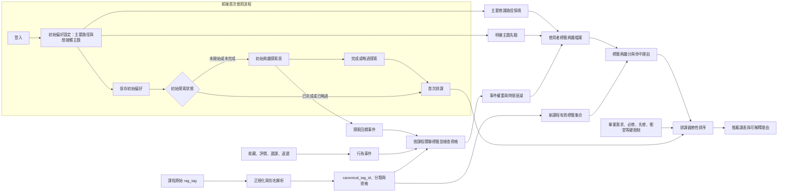

# rag-tag-interest-v1：可解釋的標籤興趣模型計畫

## 文件狀態

- 類型：工程設計計畫，分階段實作中。
- 版本：`rag-tag-interest-v1`。
- 目標：把使用者對課程主題的明確選擇與後續行為，轉成可追溯、可重算的標籤興趣檔案，供新課程推薦與排課方案排序使用。
- 權重、先驗份量與探索流程中的數值目前都是原型起點，需以真實資料及使用者回饋校準；角色扮演資料只驗證流程，不代表模型準確度。
- 進度：階段 1～4 已完成；migration 008 對應的表與欄位已於 2026-10-09 在共用 MySQL 查得存在，唯讀檢查沒有執行 DDL。階段 5 已完成 10 位 synthetic persona 的四組排序比較；真實時間切分評估列入未來上線規劃。階段 6 暫緩實作，先重新設計標籤興趣分如何接入排課及方案排序。

## 實作階段

1. **分類目錄與別名解析（已完成）**：從核准活頁簿匯入主分類、子分類路徑與原始標籤；套用 13 組已核准別名；產生穩定 ID，並支援一個標籤對應多條分類路徑。
2. **課程標籤與資格重算（已完成，2026-10-09）**：唯讀工具從 MySQL 課程 API 取得 3,560 班次，依穩定課號合併成 2,004 門課、套用 13 組核准別名並按 canonical ID 去重。6,769 個標籤全部可映射；可學習 6,736 個、可跨課匹配 2,144 個；通用 6、高頻 27、單課 4,592。使用者已核對結果並確認沿用 `>2%` 高頻排除；兩種資格、課數、比例及原因已寫回版本化目錄。唯讀報表本身仍不寫入目錄或 DB。必修排除是使用者事件層的規則，不能用全域課程類型推斷；事件寫入時須按該使用者的必修 scope 排除。
3. **後端事件與興趣檔案（已完成，2026-10-09；migration schema 已存在）**：新增可追溯的探索回饋與行為證據、重算服務、使用者資料生命週期及 API；沿用既有同意、匯出與刪除規則。唯讀檢查確認 migration 008 所需 schema 存在；本次沒有執行 DDL 或寫入測試事件。
4. **前端初始探索（已完成，2026-10-09）**：登入後第一次保存偏好會接到探索頁；支援廣泛主題追問、逐卡正負回饋、想先了解、略過、刷新續做及既有使用者重新探索。已用隔離 Edge／假 API 做首次設定與回訪 A/B；同意與未同意的事件送出路徑均已驗證。瀏覽器驗收沒有寫入共用 DB；正式 MySQL schema 已備妥，真實資料寫入流程尚未做端到端驗收。詳見[階段 4 變更報告](../CHANGE_REPORTS/2026-10-09-rag-tag-interest-exploration-stage4.md)。
5. **離線評估（persona 比較已完成，2026-10-10；真人評估列入未來規劃）**：在相同的 10 門候選課上比較「初始主題先驗」、「行為標籤檔案」、「初始先驗＋行為」及「現行 v2 排課器」四組排序。角色扮演互動、相關課程標註與分數均為合成資料，不代表準確率；依使用者決定，依時間切分的真人評估待上線累積資料後再做。
6. **排課介接（待架構重議，尚未開始）**：先決定標籤分數要在哪一層與既有方案排序合併、如何處理無標籤課程及如何輸出理由；架構確認後再設計 feature flag、硬性限制保護與瀏覽器 A/B。此階段目前沒有改動 scheduler 或排課服務。

## 設計原則

1. v1 使用可解釋的加權標籤檔案，不訓練深度模型。
2. 原始 `rag_tag`、同義詞解析結果、分類位置與排除原因都可追查；標籤分類和跨課配對資格分開管理。
3. 主要修課路徑是修課情境，不直接等同於興趣；使用者明確選擇的主題才建立直接興趣先驗。
4. 未曝光、未點選、未選到或因時間等限制沒排入課表，都不是負向興趣證據。
5. 必修課不更新使用者的 `rag_tag` 興趣。
6. 標籤分數只作軟性偏好，不能改變畢業需求、必修、先修、衝堂及課程狀態等硬性條件。
7. 每筆證據需保留來源、時間、原因與版本，讓個人檔案可解釋、可重算、可刪除。

## 整體資料流



## 1. 標籤正規化與分類資料

### 1.1 分類路徑、標籤與使用者興趣層級

分類資料不是每個標籤只屬於一個子分類的樹。目錄需保存一個 canonical tag 可對應多個分類路徑：

```text
主分類（main_category_id） 1 ── 多 子分類（subcategory_id）
       子分類（subcategory_id） 多 ── 多 標籤概念（canonical_tag_id）
       標籤概念（canonical_tag_id） 1 ── 多 原始 rag_tag 寫法／已核准別名
```

- **原始標籤**：課程來源中的 `rag_tag` 原文，永久保留供追查，不以正規化結果覆寫。同一個概念可能有不同原始寫法。
- **canonical tag**：同一概念的穩定識別碼 `canonical_tag_id`，是課程標籤與細粒度使用者興趣連結的單位；不同概念不能只因同屬一個分類就合併。
- **分類節點**：已確認的主分類與子分類，用來組織標籤及表示廣泛主題。分類節點的 ID 由正規化後的名稱穩定產生，不可把 Excel 工作表序號當成分類 ID。
- **標籤分類對應**：用獨立的多對多關聯保存 `canonical_tag_id` 與主／子分類路徑；不能為了方便只替標籤保留一條路徑。

因此，一位使用者的興趣檔案可有兩層：`categoryInterests` 以 `main_category_id` 表示廣泛主題選擇／摘要；`tagInterests` 以 `canonical_tag_id` 保存細標籤的先驗、正負證據與分數。只選廣泛主題時，只記錄分類層，不把正向分數複製給該分類下所有子分類或標籤。v1 的新課程興趣分仍依合格 canonical tags 計算；分類層用於保存廣泛意圖、初始探索與摘要，若日後要直接加進排課分數，需另行校準並避免與子標籤重複計分。

### 1.2 Excel 匯入與解析順序

`分類標籤_01` 至 `分類標籤_31` 是同一分類資料的分頁／分段，匯入時合併成同一份分類目錄；不得把 31 張工作表當成 31 個主分類。匯入需保留工作表名稱、列號或來源識別，以便回查原始列。

2026-10-09 核准版包含 19 個主分類、112 條主分類／子分類路徑、15,113 筆分類對應與 6,846 個原始標籤。原始標籤有多路徑分類；目錄保留 2,709 個原始寫法對應多條路徑。套用 13 組核准語意別名後形成 6,769 個 canonical tags。這些數量只描述分類目錄，不代表合併後的課程頻率或資格統計。

每門課的標籤採以下流程，形成「原始 `rag_tag` → canonical tag → 分類位置」的可追查對應：

1. 保留原始字串及來源欄位。
2. 做 Unicode 正規化、去除首尾空白、合併多餘空白；英文比對可忽略大小寫，但不丟棄原文。
3. 先查已核准的 `tag_alias`，再以正規標籤查分類目錄。
4. 將同義寫法解析到同一 `canonical_tag_id`，並將單課的 canonical IDs 去重。
5. 保存主分類、子分類、目錄版本及是否可供興趣學習／跨課配對的資格。

目前已核准的 13 組語意別名以 `docs/CHANGE_REPORTS/2026-10-08-rag-tag-semantic-aliases-approved.md` 為準。`server/scripts/importInterestTagCatalog.py` 將核准版活頁簿和別名表產生版本化 JSON；`server/src/data/interestTagCatalog.js` 提供執行期解析。不得把合併前的課程數量當成目前目錄的最終統計。

### 1.3 分類、排除與配對資格

分類正確與是否適合跨課推薦是兩個獨立欄位。建議目錄至少保存：

- `canonical_tag_id`、顯示名稱、正規名稱；分類路徑透過 `tag_category_assignment` 多對多關聯取得，不把唯一主／子分類寫死在標籤列。
- `interest_learning_eligible`：是否能更新使用者的標籤興趣。
- `cross_course_match_eligible`：是否能用來匹配不同課程。
- `exclusion_reason`、`catalog_version`、資料來源及審核狀態。

規則：

- 通用高頻或排除清單中的標籤：`interest_learning_eligible=false` 且 `cross_course_match_eligible=false`；保留原始資料與排除原因。
- 單課標籤：保留原始課程關聯，標示 `cross_course_match_eligible=false`。它不能單獨替其他新課程提供匹配訊號；是否作為課程內部解釋資料，與跨課興趣分數分開處理。
- 其他保留標籤：只有目錄審核通過且符合學習資格，才能進入使用者興趣更新；只有符合配對資格，才能參與新課程分數。
- 排除狀態需有原因碼與目錄版本，不刪除原始 `rag_tag`，避免分類更新後無法重建。
- **目前資格狀態**：2026-10-09 已從 MySQL 重算並人工核對，目錄資格為 `reviewed_post_alias_course_recount`，版本 `rag-tag-eligibility-2026-10-09-v1`。每個標籤保留兩種布林資格、課數、比例及排除原因；頂層保存統計、資料來源、計算／核對時間及課號／標籤集合摘要雜湊。核准活頁簿的合併前頻率仍不可用作資格依據。只有明確 `true` 才可提供學習或跨課訊號；日後重新匯入 Excel 產生的 pending 目錄仍 fail closed，必須重跑 MySQL 報表及核對後才能再寫回資格。

### 1.4 多標籤與必修課

課程先將原始標籤映射到 canonical IDs、去重，再取符合本次事件用途的標籤集合。若一個事件涉及 `m` 個合格標籤，將該事件總權重平均分成 `weight / m`，不讓標籤數多的課只因標籤多而產生更大總影響。若 `m=0`，仍可保留事件明細，但不更新標籤興趣檔案。

事件發生時需判定課程是否為必修，並保存當時的課程狀態／來源。凡屬必修的瀏覽、選課、接受、評價或退選事件，對 rag_tag 興趣更新權重一律為 0；不得只看「選了這門課」就推定使用者有興趣。

## 2. 排課前初始探索與明確先驗

### 2.1 輸入分層

- **主要修課路徑**：保存為情境資料，可在探索時用來挑選合適的課程卡片；不直接把路徑下所有標籤加成正向興趣。若日後要提供弱先驗，必須使用獨立欄位、較低權重，並經評估後再啟用。
- **使用者明確選擇的主題**：保存為直接興趣先驗，來源及時間獨立於行為事件。
- **廣泛主題**：例如使用者選「人工智慧」，先保存為廣泛意圖，並詢問想接觸的面向（如機器學習、自然語言處理、電腦視覺）。在使用者選定前，不把所有後代子分類標籤都當成正向興趣。

若使用者暫不回答追問，可保留廣泛意圖供初始探索抽樣和理由呈現；不要將其展開成每個細項的滿分先驗。

### 2.2 初始探索流程

在首次正式排課前提供可略過的短探索，讓系統取得第一批明確訊號：

1. 讀取已選主題、主要修課路徑、目標學期與基本課程資格。
2. 從目標學期可選、非必修的課程中，挑選能代表不同子分類的課程卡片；先依主題分層抽樣，避免只顯示同一個熱門細項。
3. 卡片顯示真實課程資料及可讀的主題標籤，不生成資料庫中不存在的課名或課程資訊。
4. 使用者可回答「有興趣」、「沒興趣」、「想先了解」或略過。若選「沒興趣」，再確認是對哪些主題標籤沒興趣；未指出主題或原因是時間、教師、負擔等因素時，不把整門課的所有標籤記成負向。
5. 探索結果寫成獨立的探索回饋事件。探索完成或略過後才進入正式排課；使用者可在沒有探索資料時繼續排課。

首輪卡片數、後續追問數及停止條件先做成可調設定，透過可用性測試決定，不把暫定數量當成模型已校準的參數。初始探索的目的在於補足冷啟動資訊，不應把角色扮演回答寫入真實使用者資料。

### 2.3 前端頁面與導頁時機

初始探索是登入後偏好設定流程的下一步，需新增獨立的前端頁面；它不是把探索結果直接塞進既有偏好設定表單，也不是每次登入都重新詢問：

```text
登入 → 完成並保存初始偏好 → 初始興趣探索頁 → 完成或略過 → 第一次排課
```

- 實作時新增 `client/src/pages/InterestExplorationPage.jsx`，並在 `client/src/App.jsx` 設定受探索狀態控制的路由；API 呼叫沿用 `client/src/services/api.js`。
- 使用 `GET /api/interest-exploration/cards` 取得依登入者修課範圍、目前學期、資格與標籤學習資格篩選的真實課程；此 API 不重用「系外／通識相似度探索」端點。
- 保存初始偏好後，若探索狀態為 `not_started` 或 `in_progress`，導向探索頁；`completed` 與 `skipped` 都直接進入排課，不在之後每次登入重跑。使用者之後可從偏好設定重新開啟探索。
- 頁面讀取已保存的主題、主要修課路徑情境與目前學期，顯示真實、非必修的探索課程卡片；提供「有興趣」、「沒興趣」、「想先了解」、略過及繼續排課操作。對只選廣泛主分類者，先詢問目前合格課程中可用的子分類；選定子分類新增為明確 Profile 先驗，保留原主分類且不展開其全部細標籤。
- 探索進度以登入者分開存在同一瀏覽器的 `localStorage`（狀態、卡片順序／位置、已處理的廣泛分類 ID），不在瀏覽器保存卡片回答內容；刷新或離開後可續做。探索回饋只在同意 `personalization_learning` 時送到階段 3 互動事件端點，未同意仍可跳過或繼續排課。
- 完成或略過後都明確導向首次排課；既有使用者可在偏好設定頁重新開啟探索。
- 若目標學期沒有足夠的合格課程卡片，頁面說明資料不足並允許繼續排課，不虛構課程，也不把探索設為排課的硬性前置條件。
- 初始主題設定、探索頁回饋與一般行為事件分開保存；探索卡片的反應成為探索事件，之後再依課程 ID 關聯 `course_tag` 與標籤資格。標籤目錄不會自行產生事件。

## 3. 行為事件與標籤分數

### 3.1 可用訊號

下表是原型的暫定相對權重。事件在更新前需先確認課程非必修、標籤具學習資格、互動原因符合訊號定義；同一來源事件須具冪等鍵，避免重送重複加分。

| 訊號 | 暫定權重／方向 | 更新規則 |
| --- | ---: | --- |
| 明確選擇課程主題 | 正向先驗 `p₀` | 存於明確偏好資料，不偽裝成行為事件；廣泛主題不展開成所有細項。 |
| 探索卡片明確表示有興趣 | `+1.0` | 對使用者確認有興趣的合格標籤更新；數值待校準。 |
| 高分評價或明確收藏 | `+1.0` | 評價門檻需設為版本化設定；收藏／取消收藏需避免重複計分。 |
| 使用者自願接受推薦或加選選修 | `+0.5` | 系統自動排入或使用者未明確接受不算。 |
| 瀏覽課程 | `+0.1` | 弱訊號，同一課的累計瀏覽貢獻上限為 `+0.15`；第一次瀏覽記 `+0.1`，後續瀏覽最多再增加 `+0.05`。 |
| 明確表示對特定主題沒興趣 | `-1.0` | 只套用到使用者確認的主題；不能由未點擊推斷。 |
| 明確因內容不合而退選 | 負向 | 只有原因明確是內容主題不合時更新；若未指出是哪個主題，標籤平均分攤僅作暫定規則並需人工評估。 |
| 因時間、負擔、教師、名額或資格原因移除／退選 | `0` | 不作為主題興趣的負向證據。 |
| 必修課的任何互動 | `0` | 必修不學習 rag_tag 興趣。 |
| 未曝光、未點選、未排入課表 | `0` | 不等於不喜歡。 |

負向探索回饋沿用「明確指出不感興趣的主題」訊號；若只是對整門多標籤課程按下拒絕，先詢問內容原因或指定標籤，不能不加判斷地把所有標籤都記為負向。低分評價也不自動當成主題反感，除非使用者明確指出內容原因。

### 3.2 時間衰減與權重分配

沿用現有互動模型作為可比較的初始設定：

```text
decay(event) = 2 ^ (-age_days / 120) × (舊學期 ? 0.5 : 1)
effective_weight = base_weight × decay(event)
```

「舊學期」的判定需依事件的目標學期與目前建議學期比較，並記錄衰減規則版本。正向和負向證據分別累加為 `P`、`N`；一事件多標籤時，先對合格且去重的標籤集合平均分配 `effective_weight`。

### 3.3 先驗與行為分開保存

設 `p₀` 為某標籤的明確興趣先驗，範圍 `[-1, 1]`；`κ > 0` 為先驗份量；`P`、`N` 為依事件權重及時間衰減後的正負證據：

```text
tag_score = (κ × p₀ + P − N) / (κ + P + N)
```

分數介於 `-1` 至 `1`。正值代表正向證據，負值代表明確負向證據，零代表沒有偏好證據或正負抵銷。未互動標籤沒有負證據，因此預設分數為 `0`。`κ`、先驗強度與上表事件權重均須版本化並以資料校準；不要把「事件數滿 10 才啟用」硬套到 v1，冷啟動時可先使用明確先驗及初始探索結果。

分數與可信度分開保存：至少提供 `P`、`N`、有效事件數、最後事件時間及資料版本供解釋；v1 先不把未校準的可信度再乘進課程分數。

### 3.4 新課程標籤興趣分

對一門新課程，取通過目錄資格且可跨課配對、去重後的標籤集合 `T`：

```text
course_interest_score = average(user_tag_score[tag] for tag in T)
```

沒有興趣證據的標籤分數為 0，依此公式參與平均。另回傳有證據標籤數／全部可配對標籤數作為覆蓋資訊，避免把「分數接近零」誤解成「已確認不喜歡」。若課程沒有可用標籤，標籤分數為中性／缺值，不排除該課，也不影響畢業需求及其他排課條件。v1 不使用熱門度補正或 IDF；若評估顯示高頻標籤仍造成偏差，再以獨立對照實驗決定是否加入。

### 3.5 配對資格如何影響新課程分數：例子

假設某使用者已累積下列標籤分數：

本節是公式示例，表中資格是假設值；實際推薦以目錄版本為準。2026-10-09 快照中「機器學習」出現於 62／2,004 門課，超過 2%，因此實際兩種資格皆為 false，不會套用本例的 `+0.4`；此高頻排除規則已由使用者確認。

| 標籤 | 使用者標籤分數 | `interest_learning_eligible` | `cross_course_match_eligible` |
| --- | ---: | --- | --- |
| 自然語言處理 | `+0.8` | `true` | `true` |
| 機器學習 | `+0.4` | `true` | `true` |
| 通用高頻標籤 | `0` | `false` | `false` |
| 單課專屬標籤 | `+0.9` | `true` | `false` |

現在有一門新課，原始標籤映射到上述四個 canonical tags。計算前只留下 `cross_course_match_eligible=true` 的標籤，因此「自然語言處理」和「機器學習」進入平均；通用高頻標籤被排除，單課專屬標籤即使使用者曾對它有正向證據，也不拿來推論使用者會喜歡另一門課：

```text
course_interest_score = (0.8 + 0.4) / 2 = 0.6
```

這裡的平均分母是「符合跨課配對資格的標籤數」，不是課程原始標籤總數。`interest_learning_eligible` 決定標籤能否累積使用者興趣證據；`cross_course_match_eligible` 決定課程上的標籤能否用於跨課分數。兩者用途不同。`0.6` 是排序用的軟性興趣分數，不是使用者有 `60%` 機率喜歡這門課。若這門課沒有任何合格配對標籤，就沒有標籤興趣訊號，但課程仍可依其他排課條件納入。

## 4. 建議資料容器

下列為概念資料模型，不代表這次計畫文件更新已新增資料表或 API。

| 容器 | 主要欄位／用途 |
| --- | --- |
| `tag_catalog` | 每個 `canonical_tag_id` 的標籤名稱、學習與跨課配對資格、排除原因、分類版本、來源與審核狀態；不在此欄位假設它只屬於一個分類。 |
| `tag_category_assignment` | `canonical_tag_id` 與主分類／子分類路徑的多對多關聯，並保留來源工作表與列號。 |
| `tag_alias` | 原始／別名寫法、正規化寫法、對應 `canonical_tag_id`、別名類型、核准狀態及目錄版本。 |
| `course_tag` | 課程 ID、`canonical_tag_id`、原始 `rag_tag`、來源欄位／資料版本；保留原始標籤與 canonical 對應，每課 canonical tag 去重。 |
| `user_interest_input` | 使用者明確選擇的主分類／子分類主題、廣泛意圖、主要修課路徑情境及探索狀態；與行為事件分開，不把分類選擇展開成所有子標籤的興趣分。 |
| `user_tag_event` | 使用者、課程、事件類型、原因、時間、學期、來源、使用者明確指出的標籤、必修狀態快照、冪等鍵、原始／目錄／模型版本。 |
| `user_tag_interest` | 以 `(user_id, canonical_tag_id)` 為鍵的稀疏可重建快取：`p₀`、`P`、`N`、分數、有效事件數、最後事件、覆蓋／可信度資訊及模型／目錄版本；無證據標籤預設中性，不必建立一筆負向紀錄。 |

`user_tag_event` 是行為證據的可追溯來源；`user_interest_input` 保存分類層的明確選擇與修課情境；`user_tag_interest` 保存細粒度標籤分數。使用者檔案可在讀取時組成 `categoryInterests` 與 `tagInterests`，不要求為 19 個主分類、112 條分類路徑和所有標籤都預先建立資料列。`user_tag_interest` 是可刪除、可重算的衍生快取，不能成為唯一真相。事件需能重建使用當時的標籤映射或保存標籤快照，避免分類目錄更新後歷史分數無法重算。

### 隱私與資料生命週期

- 開始收集行為型興趣前，需提供清楚用途說明與使用者控制；不為此模型新增自由文字理由欄位。
- 支援檢視／匯出興趣主題與主要證據，並能刪除使用者興趣資料及其衍生快取。
- 使用者取消收藏等狀態型事件，需定義重算或抵銷規則，避免已取消的狀態仍永久加分。
- 模擬 persona 使用獨立 fixture／資料集標記，不寫入真實 `user_tag_event` 或使用者檔案。

## 5. 服務邊界與排課介接

實作時建議拆成可獨立驗證的服務：

1. **標籤目錄服務**：載入分類與核准別名、正規化原始標籤、輸出合格 canonical tags；目前已核准的別名需接入執行期前先驗證合併後目錄及課程聯集統計。
2. **興趣探索服務**：在排課前依目標學期、主題、主要路徑情境與課程可用性挑選真實非必修課程卡片，記錄明確回答。
3. **事件與 profile 服務**：驗證事件資格、冪等寫入、計算時間衰減、分配多標籤權重、重算使用者標籤檔案。
4. **課程興趣評分器**：輸入候選課程的有效 canonical tags 與使用者 profile，回傳分數、涵蓋數及可展示的命中標籤理由。
5. **排課器**：先依現有畢業需求、必修、先修、衝堂、課程狀態等硬條件產生可行方案，再把標籤興趣作為軟性排序訊號；不能因標籤分數移除必修或違反硬條件。

新理由必須由實際映射及證據產生，例如「符合你選擇的人工智慧主題」或「與你收藏課程中的自然語言處理標籤相符」。若標籤映射不存在或證據不足，就不宣稱命中。介接初期以 feature flag 控制，分數係數先可設為 0 做影子計算；離線及使用者驗收後再決定實際係數與上線範圍。

## 6. 評估計畫與角色扮演資料

### 目前評估工具與資料就緒度（2026-10-09）

- `npm run eval:tag-interest` 使用明確標記為 `synthetic` 的 fixture 執行 9 個手寫 persona 情境；驗證廣泛分類冷啟動、多標籤平均、指定標籤負回饋、必修排除、單課標籤不得跨課配對、瀏覽上限、時間衰減、高頻排除及核准別名去重。合成資料不寫入 DB，也不作為準確率證據。
- `server/scripts/lib/tagInterestEvaluation.js` 提供時間先後切分、NDCG@K、Precision@K、Recall@K、課程覆蓋率、子分類多樣性與理由標籤一致性函式；切分會把相同時間戳視為同一組，避免同時事件跨到訓練集與測試集；實際真實排序評估尚未執行。
- `npm run eval:tag-interest:real-readiness` 只讀 aggregate，不輸出使用者 ID 或事件明細。2026-10-09 結果為 30 筆有效標籤快照、1 位使用者、0 筆選課／收藏／高分評價／接受推薦／內容退選結果；無法形成跨使用者的時間切分。`Learned_Tag_Interests` 快取目前 0 筆。這是樣本不足，不是模型效果判定。
- readiness 只表示能否形成最小的多使用者時間切分，不代表統計檢定力；足以作準確率聲明仍需預先定義評估方案與累積資料。

### 離線對照

依學期時間先後切分訓練／評估資料；每個評估時間點只能使用當時已發生的事件和當時可取得的課程標籤，避免未來資訊洩漏。比較：

1. 只用入門明確主題先驗。
2. 只用後續行為標籤。
3. 入門先驗加行為標籤（v1）。
4. 現行 v2 作為既有基準。

指標包含 `NDCG@K`、`Precision@K`、`Recall@K`、可推薦課程覆蓋率、標籤理由正確率及子分類／主題多樣性。另按冷啟動與有行為資料的使用者分組；沒有標籤的課程及必要課程不得被指標或標籤分數錯誤排除。離線指標不能代替學生對推薦是否有用的實際回饋。

### 角色扮演與合成資料

- 建立不同初始主題、主要修課路徑、探索回答和後續行為的 persona 情境，檢查分數方向、標籤去重、時間衰減、必修排除、多標籤分配、拒絕原因與推薦說明。
- 每筆合成資料帶明確 `synthetic` 標記和情境 ID，只進測試 fixture／模擬資料集；禁止混入真實使用者事件或離線真實資料指標。
- 角色扮演適合補測流程與邊界案例，不可用來宣稱推薦準確率或取代真實使用者評估。

參考脈絡：Kim & Kim 的 tag-aware recommender framework、Ma 等人的標籤推薦研究，以及 Narimani & Barberà 對教育推薦系統評估的討論。離線結果仍需搭配實際使用者回饋解讀。

## 7. 建議產品實作階段與完成條件

| 階段 | 工作 | 完成條件 |
| --- | --- | --- |
| 0. 資料盤點與資格重算 | 已完成（2026-10-09）：MySQL 唯讀報表成功、使用者核對，2,004 個課號的資格已版本化。必修排除按使用者 scope 留給事件層。 | 不以合併前快照冒充最終統計；報表成功、分類／來源／別名／排除原因可追查；未核對前資格維持 pending。 |
| 1. 標籤目錄 | 已完成：分類階層、穩定 canonical IDs、13 組別名、執行期解析及已核對資格快照。 | 重複標籤歸併、原文保留、多分類路徑及通用／高頻／單課資格有測試案例；必修事件排除於事件層驗證；資格缺資料時 fail closed。 |
| 2. 冷啟動探索 | **已完成（2026-10-09）**：保存登入後初始偏好後新增 `InterestExplorationPage` 與狀態路由；在首次排課前展示可略過的非必修探索課程卡片，明確回饋只在 `personalization_learning` 同意後送到事件 API。 | Edge A/B 驗證初次設定、回訪、手動重開、廣泛主題澄清、逐卡回饋、未同意不送出、刷新續做與略過；候選不足可直達排課；候選服務與標籤資格測試通過。migration 008 所需 schema 已存在；未向共用 DB 寫入瀏覽器測試事件。 |
| 3. 事件與興趣檔案 | **程式完成；migration schema 已存在**：事件契約、原因碼、冪等性、時間衰減、多標籤平均分配、先驗與 profile 重算；檢視／匯出／刪除生命週期及 migration 008 均已備妥。 | 同一事件不重複計分；時間等退選原因不扣主題分；必修事件不更新 profile；分數可從來源重建。唯讀 schema 檢查確認表與欄位存在；未以此宣稱完成瀏覽器端到端寫入驗收。 |
| 4. 評估 | **persona 比較已完成（2026-10-10）；真人時間切分評估列入未來上線規劃**：以 10 位 synthetic persona、固定 10 門候選課比較四組排序，輸出 NDCG@3、Precision@3、Recall@3、目錄覆蓋、多樣性與理由標籤忠實度。角色扮演只檢查預期情境與流程，不作真人成效或準確率證據。 | 四組使用同一候選集與人工標註；確認 v2 門檻及 cold-start fallback；合成與真人資料分開。真人時間切分待上線累積足夠資料後執行。 |
| 5. 排課器介接 | **待架構重議，尚未開始**：先定義標籤分數如何進入候選課程／方案排序、與現有偏好分數的合併方式及解釋資料契約，再評估 feature flag 與 A/B 做法。 | 架構需明確保護畢業、必修、資格、先修及衝堂等硬條件；沒有合格標籤的課程仍可進入可行方案；完成後以瀏覽器情境 A/B 驗證只影響軟性排序。 |

新增 API、資料欄位或使用者可見功能前，實作計畫需同步更新 `docs/API_SPEC.md`、`docs/DATA_SCHEMA.md`、相關規格與測試；若推進 roadmap 任務，依專案規範核對 roadmap 全表的狀態與相依欄。

## 8. v1 不包含

- 深度模型、端到端神經網路或自動推斷「沒選就是不喜歡」。
- 依主要修課路徑將整個分類樹自動設為正向興趣。
- 以標籤興趣覆蓋必修、畢業學分、資格、先修或衝堂規則。
- 將角色扮演／合成資料混入真實資料或用來宣稱模型準確。
- 未經評估就加入 IDF、標籤熱門度補正或 10 次選擇的啟用門檻。

## 參考資料

- [Kim & Kim, A Framework for Tag-aware Recommender Systems](https://bda.snu.ac.kr/images/3/30/A_Framework_for_Tag-aware_Recommender_Systems.pdf)
- [Ma 等人，標籤推薦研究](https://files.eric.ed.gov/fulltext/ED607802.pdf)
- [Narimani & Barberà, 教育推薦系統研究](https://www.irrodl.org/index.php/irrodl/article/download/7419/6038/44653)
