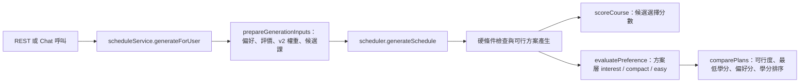
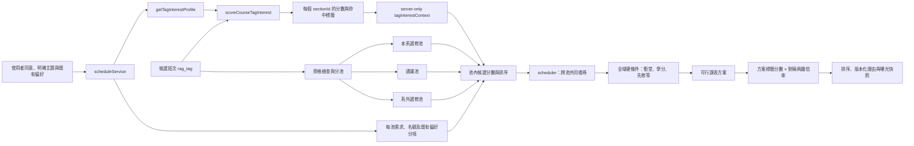

# rag-tag-interest-v1：階段 6 排課介接設計稿（草稿）

## 文件狀態

- 日期：2026-10-10
- 狀態：設計草稿，待確認；不是程式實作規格的最終核准版。
- 範圍：定義標籤興趣檔案與既有多方案排課器之間的資料與評分邊界。
- 本次沒有修改 scheduler、service、API、資料庫或前端。

## 建議決策摘要

1. **保留 rag-tag 興趣作為獨立評分軸。** 不把標籤分數塞進現有三軸 `interest / compact / easy`，也不寫入 `Learned_Preference_Weights`。
2. **由 `scheduleService` 在伺服器端讀取 profile 並逐班次計分。** 把純計分結果當成 request-scoped context 傳給排課器；不接受前端傳入分數或 `canonical_tag_id` 作為權威值。
3. **候選池、候選評分與方案排序分層處理。** 系上選修、通識、系外選修分成三個候選池，各依自己的需求與名額形成候選；標籤興趣透過可調的對稱乘數影響池內基礎分，其他五項分數再相加。排課器最後共同檢查三池候選的衝堂、學分等全域限制。正分按比例提高、負分按相同比例降低；候選與方案的 α 分開校準。
4. **預設關閉，先做 shadow。** `off` 完全維持舊結果；`shadow` 計算分數及預期排序但不改回應順序；確認案例和分數尺度後，才由 feature flag 啟用 `active`。
5. **標籤永遠不構成硬性資格。** 沒有合格標籤的課仍可進候選池；標籤分數不得放寬或覆蓋必修、畢業學分、先修、班次資格、衝堂等規則。

## 1. 目前程式路徑

目前實際流程如下：



- `scheduleService.prepareGenerationInputs()` 已載入 v2 權重並建立 `mergedConstraints`；REST 與 Chat 共用 `generateForUser()`。
- `tagInterestService.getTagInterestProfile()` 已處理同意、快取與重算；`tagInterestLearning.scoreCourseTagInterest()` 已依 `crossCourseMatchEligible` 對單課 `rag_tag` 計分。目前排課服務沒有呼叫它。
- `scheduler.js` 有兩個不同評分層：`scoreCourse()` 供候選選擇、修補及 solver 相關路徑使用；`evaluatePreference()` 將方案的 `interest / compact / easy` 正規化成 0～1 的 `preferenceScore`，由 `comparePlans()` 選擇方案順序。
- 曝光事件的 `plan-feature-v1` 固定是三軸 `interest / compact / easy`。這個向量提供給既有選擇學習流程，不能直接加第四軸或重新解讀 `interest`。

## 2. 目標與界線

### 目標

- 用使用者明確選擇的主題先驗與已同意的行為證據，估計課程標籤興趣。
- 讓標籤分數能影響可選課程的挑選，並能解釋方案為何排在前面。
- 保留既有排課限制及五個既有生成策略的意義；透過可關閉的模式逐步驗證。
- 每個分數可追溯到 profile、標籤目錄及資格版本。

### 不做

- 不用標籤分數刪除候選課、判定課程能否修、替代畢業審核或改寫硬性限制。
- 不以「沒有點擊／沒有選到」作負向標籤；負分只來自 profile 中明確負向證據。
- 不將 synthetic Persona 指標描述成真人準確率，也不以這 10 位 Persona 校準出可宣稱有效的產品參數。
- 不把 tag-interest 向量混入 v2／Choice Perceptron 的三軸曝光向量。

## 3. 建議資料流與介面



### 3.1 服務邊界

1. 在 `prepareGenerationInputs()` 取得候選課後，由 `scheduleService` 呼叫 `getTagInterestProfile(identity, { prefs })`。`off` 模式略過此查詢；服務錯誤、profile 過期或版本不相容時，標籤軸退化為不可用，排課照舊執行。
2. 依課程資格與既有課程分類，把候選班次分入本系選修、通識、系外選修三池；池歸屬需互斥並保留來源，避免同一班次重複占用名額。每池依未滿足的修課需求與可用名額形成自己的候選集合／目標數。
3. 對每個候選 **班次** 的 `ragTag` 呼叫 `scoreCourseTagInterest()`。以 `sectionId` 當 request map key，因不同班次／開課資料可能有不同標籤；輸出由 server 建立，不接受 request body 提供的分數。
4. 將每池候選、池需求與分數 context 傳入 `generateSchedule(candidates, constraints, runtimeOptions)`。scheduler 依各池排名共同搜尋課表，再一起驗證衝堂、學分、先修及其他全域硬條件；不是各池先各自排成完整課表再直接拼接。標籤 context 只用於軟性排序，不得改變池資格或全域限制。
5. 目前的 `counterfactualForUser()` 不走相同的 `generateSchedule()` 路徑。若產品要讓「取消某偏好後課表會怎麼變」也包含標籤興趣，必須明確把同一份 context 傳入反事實計算；否則畫面須說明該比較暫不包含 tag-interest。

### 3.2 Request-scoped context 草案

```js
{
  mode: 'off' | 'shadow' | 'active',
  modelVersion: 'rag-tag-interest-v1',
  catalogVersion: '...',
  eligibilityVersion: '...',
  profileSource: 'consented-learned' | 'explicit-prior' | 'unavailable',
  coursesBySectionId: {
    '12345': {
      score: -1.0, // -1～1；沒有跨課合格標籤時為 null
      eligibleTagCount: 2,
      evidenceTagCount: 1,
      matchedTags: [{ canonicalTagId: 'tag_…', canonicalName: '自然語言處理', score: -1.0 }],
      reason: 'scored' | 'no_cross_course_match_tags' | 'no_user_signal'
    }
  }
}
```

`tagInterestContext` 是內部資料，不是 API 輸入欄位。回應若需提供理由，只回傳該方案實際用到的分數、覆蓋數及少量命中標籤，不回傳整份個人 profile。

### 3.3 同意與明確先驗

- `consented-learned`：可用明確主題先驗及已同意的探索／修課行為證據。
- `explicit-prior`：未同意行為學習時，只使用使用者在偏好設定中主動選擇的主題；不得讀取、重算或輸出行為證據。這與現行排課會使用明確偏好一致。
- `unavailable`：沒有可用主題、profile 版本不支援或服務失敗；標籤軸不參與排序，其他排課結果不受影響。

每個來源要在診斷中分開標示，不能把明確設定說成「從你的行為學到」。

## 4. 課程分數與方案分數

### 4.1 單課分數

沿用 `scoreCourseTagInterest(profile, course.ragTag)` 的規則：先解析 canonical tag，再只保留 `crossCourseMatchEligible=true` 的標籤，對有效標籤分數取平均。分數範圍 `-1～1`；未知興趣標籤按中性 0 計，不視為不喜歡。

- `score = null`：課程沒有可跨課匹配的標籤。只表示沒有標籤訊號，不得排除課程。
- `score = 0`：有可評分的標籤，但目前是中性或正負證據相抵。不得解釋為使用者不感興趣。
- 負值：profile 有明確負向證據時才可能出現。
- 解釋只引用本課實際存在、可跨課匹配，且有非零先驗／事件證據的 canonical tag。單課、通用及高頻排除標籤不出現在配對分數或理由中。

### 4.2 方案彙總

只彙總方案中的**可自由選擇課程**：不含依學生 scope 判定的必修、重補修、使用者已固定選擇的課，以及關注課程。這些課不代表排課器替使用者做的推薦選擇。

```text
planTagScore = mean(courseTagScore)
  只對 score 為數值、且有有效 tag 興趣證據的可自由選擇課程取平均
```

- 平均而非加總，避免選修門數較多的方案只因課多而自動得高分。
- 沒有可評分課程時 `planTagScore=null`；比較器忽略這一軸，維持原有排序。
- 回傳 `tagInterestCoverage = 有標籤證據的可自由選擇課程數 / 可自由選擇課程數`，避免把低覆蓋率的平均分包裝成整張課表都有證據。

### 4.3 排序合併點

只在既有硬條件檢查之後參與軟性排序。建議維持兩個獨立的校準係數，因單課搜尋分數與方案 `preferenceScore` 量尺不同：

```text
courseTagMultiplier = 1 + 0.6 × courseTagScore  // 初始 α_course
candidateScore = poolBaseScore × courseTagMultiplier
               + creditScore
               + textPreferenceMatchScore
               + legacyInterestKeywordScore
               + compactPreferenceScore
               + easePreferenceScore

planTagMultiplier = 1 + α_plan × planTagScore
combinedPlanScore = existingPreferenceScore × planTagMultiplier
```

`α_course`、`α_plan` 各限制在 `0～1`，分別調整候選層與方案層的影響幅度；正負方向使用同一個 α，不能為正向和負向設定不同係數。初始建議兩層都設為 `0.6`，後續可分開調整；這是待評估的初始設定，不是已校準的上線值。先在 `shadow` 模式只輸出彙總的分數分布與假想順序變動統計，不持久化單一使用者的分數；再以固定 Persona 案例檢查方向、負分、冷啟動與覆蓋率。不得只因合成 NDCG 上升就宣稱真人成效。若最後選擇只在方案層排序，需接受它無法促使生成器構造更符合標籤興趣的新課表；若只改候選分數，方案比較又可能仍把舊 `preferenceScore` 較高的課表排在前面。兩層都要做時，必須用同一份 context，α 分開校準，並評估方案多樣性。

`poolBaseScore` 是同一候選池內可比較、非負的軟性基礎分；`courseTagScore` 為 `null` 時 multiplier 視為 1。學分、文字偏好、舊興趣關鍵字、集中及難易分各自保留可檢查的分項，按上式相加；需校準尺度，避免某個加總項蓋過其他訊號。標籤興趣與舊興趣關鍵字是兩個分開的訊號，shadow／Persona 驗收需檢查兩者是否重複放大相同偏好。

硬性資格先判定，候選再依課程分類與系所資格進入三個互斥池：本系選修、通識、系外選修。各池按自身未滿足需求與名額產生、排序候選；排課器對三池候選共同搜尋，並全域驗證衝堂、學分、先修、必修等條件。三池分流本身已表達課程來源與類別，不再用跨池的「課程類別優先分」或「非本系扣分」比較不同池候選。

現行本系其他年級選修的 `−2500` 不再作為全域系所／年級分數。若要優先同年級課，只能保留為本系選修池內的獨立排序規則；本稿將此項列為待確認，未確認前不把該扣分套到通識或系外池。

分數方向與排序規則固定如下：

- `α_course`、`α_plan` 各在 0～1；`active` 且相應分數有資料時必須大於 0。標籤分數越高，倍率與合併分數不得因此降低；候選和方案依合併後分數由高到低排序。
- 同一層正負對稱：標籤分數 `+x` 的倍率是 `1+αx`，`-x` 的倍率是 `1−αx`。初始 α=0.6 時，`+0.8` 乘 `1.48`（增加 48%），`-0.8` 乘 `0.52`（降低 48%）；上限示例 `α=1` 時則分別乘 `1.8`（增加 80%）及 `0.2`（降低 80%）。倍率最低為 0，不會變成負數。`α=0` 等同關閉該層標籤影響。
- `courseTagScore=null` 代表沒有可跨課配對的標籤，倍率視為 1、候選分不變；不可把 `null` 當作負分或用它排除課程。有效標籤但沒有使用者訊號時，模型回傳中性 0，倍率也是 1。
- `planTagScore=null` 時忽略標籤軸，既有方案比較結果不變。方案硬性優先順序仍先於軟性分數。
- 這是固定其他條件下的單調排序保證。基礎分不同時仍依乘數及其他軟性分數合成後的結果排序；α 數值需用 shadow 與 Persona 案例校準影響幅度。

例：候選池基礎分都是 40，其他五個加總分項合計為 0。初始 `α_course=0.6` 時，標籤分數 `+0.8 / 0 / -0.8` 的新候選總分依序為 `59.2 / 40 / 20.8`；上限示例 `α_course=1` 時依序為 `72 / 40 / 8`。實際總分再加上學分、文字命中、舊興趣關鍵字、集中及難易分。`null` 與 0 都讓標籤倍率為 1，但含義不同：`null` 是沒有配對資格的標籤，0 是有合格標籤但沒有使用者訊號或正負證據相抵。

方案比較的硬性優先順序保持不變：排課成功狀態、最低學分達成狀態仍優先；標籤分只影響可行方案間的軟性排序，不可讓不合法方案勝出。

## 5. Feature flag、輸出與相容性

建議以 server-side 設定 `TAG_INTEREST_RANKING_MODE=off|shadow|active` 控制，預設 `off`：

| 模式 | 計算 profile／分數 | 改變候選挑選或方案順序 | 使用情境 |
| --- | --- | --- | --- |
| `off` | 否 | 否 | 預設與快速回復；舊流程不變 |
| `shadow` | 是 | 否 | 先檢查資料覆蓋、分數分布、例外及假想重排 |
| `active` | 是 | 是 | 設計審核、測試、瀏覽器 A/B 通過後才啟用 |

- 保持 `plan-feature-v1` 的三軸向量完全不變。若日後要把 tag-interest 納入 `plan_chosen` 的學習特徵，另立版本化 snapshot／feature contract；不得直接擴充既有向量或把它映射成 `interest`。
- `shadow` 僅在 request 記憶體內計算，觀測資料只保留彙總筆數／分布；不新增互動事件，不持久化單一使用者的分數、完整標籤清單或身分識別值。
- 如推薦 API 要顯示命中標籤或方案分，須新增明確、可選的 `tagInterest` 回應欄位，並同步更新 `docs/API_SPEC.md`、`docs/DATA_SCHEMA.md`、曝光快照與驗證器；本設計階段不新增 API 欄位或 migration。
- 若要在 `recommendation_exposed` 保留曝光當下的排名依據，需另設版本化的 tag ranking snapshot（模型、目錄、資格版本與 per-plan score／coverage）。先確認資料最小化與保存期限，再決定使用既有 JSON 欄位或新增 schema；不要混進三軸學習向量。

## 6. 實作與驗收順序

1. **定稿介面**：確認 profile source、可自由選擇課程範圍、係數位置、曝光快照及 counterfactual 是否納入。
2. **純函式測試**：跨課資格過濾、同義別名去重、多標籤平均、明確負向、無訊號 `null`、必修／固定課排除於方案平均，以及覆蓋率計算。
3. **服務整合測試**：同意開／關、profile cache 失效與錯誤 fallback；REST 和 Chat 必須共用同一 `generateForUser()` 路徑。
4. **scheduler 測試**：`off` 的排序保持原樣；`shadow` 不改結果；`active` 只改軟性排序；驗證 α=0 時不改分、初始 α=0.6 時 `+0.8/-0.8` 分別乘 `1.48/.52`、α=1 時分別乘 `1.8/.2`，正負倍率對稱；分別驗證六個候選分項只加一次，並在三池內檢查候選排序；驗證池需求／名額由 scheduler 共同安排，衝堂、學分、先修等全域硬條件仍通過；確認類別優先分和非本系扣分不跨池比較，年級扣分若啟用只影響本系選修池；`null` 不改分，無標籤課仍可排入。
5. **Persona 重播**：用既有 10 位 synthetic Persona 擴充相同候選課／硬條件案例，比較 off 與 active 的課表可行性、top plan、tag coverage、理由忠實度及多樣性。結果只作情境檢查，不叫作準確率。
6. **瀏覽器 A/B**：固定使用者設定、候選集與 solver seed 比較 flag off／on；逐一操作排課結果、切換方案及推薦理由；檢查兩組硬條件與必修一致、軟性排序差異可解釋、console 無新增錯誤。
7. **分段啟用與回復**：預設 off；能以設定即時退回 off。上線資料累積後再做真人的時間切分評估，這不阻止先做受控 Persona／瀏覽器驗收，但不能省略真實成效限制聲明。

## 7. 待確認決策

| 決策 | 本稿建議 | 實作前需要確認的原因 |
| --- | --- | --- |
| 方案平均要算哪些課 | 只算排課器自由選擇的非必修選修；必修、重補修、使用者固定課與關注課不計 | 避免把硬性或使用者已決定的課誤說成推薦 |
| 未同意行為學習時能用什麼 | 只用明確選的主題先驗，不用事件證據 | 確保模型理由與 consent 範圍一致 |
| 排名倍率 | 正負使用同一 α，α 範圍 0～1；候選與方案初始建議皆設 0.6，再以 shadow 檢查 | 候選與方案分數量尺不同，後續仍可分開校準；Persona 合成指標不能代表真人校準 |
| 候選池與同年級優先 | 本系選修、通識、系外選修分池排名，最後由同一 scheduler 全域檢查；類別優先與非本系扣分不跨池使用。`−2500` 若保留，只能是本系選修池內規則 | 是否保留同年級偏好尚未確認；需避免將池內規則誤用到其他課程池 |
| 曝光時是否存分數 snapshot | active 上線前需要可追溯版本化摘要；具體欄位與保存期限另定 | 現有 `plan-feature-v1` 是不同目的的三軸資料契約 |
| 反事實比較 | 如納入正式推薦解釋，傳入相同 tag context；否則標示不包含 tag-interest | 避免反事實頁和實際排課用兩套排序語意 |

**確認本稿後才進入程式實作。** 實作若新增 API 欄位或 schema，先更新 API／資料規格；若調整 `scheduler.js`，依 `docs/SCHEDULING_LOGIC.md` 驗證學分與課程狀態規則，並完成 off/on 瀏覽器 A/B。
