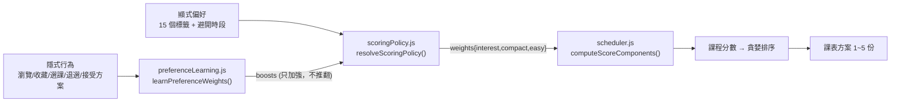

# 01 專案定位

> 本文件所有現況描述以實際程式碼為準；引用既有文件時會標注來源。
> 最後更新：2026-09-08

## 專案名稱與一句話定位

**課表規劃助手（Smart Schedule Planner）**——一套以**限制滿足排課引擎**為核心、
用**個人化偏好權重**排序、並可用**自然語言對話**操作的大學選課規劃系統。

前端頁面標題為「課表規劃助手 | Smart Schedule Planner」
（`client/index.html`；實際渲染結果已於瀏覽器驗證）。

## 專案背景

大學選課同時受三種互相牽制的條件約束：

1. **硬性規則**：必修、重補修、衝堂、學分上下限、修課資格。
2. **個人偏好**：想不想早八、要不要集中排課、想修涼課還是想挑戰。
3. **畢業要求**：各類別學分缺口、通識領域、系外選修認列上限。

現有的選課系統只做「查詢與登記」，不做「規劃」；一般課表產生器只做「填滿時段」，
不理解畢業規則，也不理解「這個人是誰」。學生實際上是拿紙筆或 Excel 手動試排。

## 要解決的問題

| 問題 | 現況痛點 | 本專案處理方式 |
| --- | --- | --- |
| 候選課程太多 | 全校 3,000+ 門課，學生不知道哪些「輪得到自己修」 | 依系所／年級／班級／學制收斂候選池，並標記 `eligibility`（`courseScope.js`） |
| 必修與偏好衝突 | 手動排課容易漏掉必修或重補修 | 必修與重補修在貪婪填充**之前**先排入，並有 `REQUIRED_COURSE_BONUS = 5000` 的絕對優先（`scheduler.js:96`） |
| 偏好無法量化 | 「我想輕鬆一點」無法轉成排序 | 15 個偏好標籤 → 布林旗標 → 三軸連續權重 → 課程分數（`preferenceTags.js`、`scoringPolicy.js`） |
| 排不出來時不知道為什麼 | 系統只說「失敗」 | 回傳 `excludedCourses`（含 `constraintId`）、`unmetRequirements`、`conflictSet`、`clarification` |
| 不知道系統為什麼推薦這門課 | 黑箱 | 每門課帶 `recommendationReason`，含 `selectedBecause`、`scoreComponents`、`alternatives`（落選者） |

## 目標使用者

- **主要**：需要在硬性規則下規劃單一學期課表的大學生（目前資料以逢甲大學 114 學年度下學期為主）。
- **次要**：需要檢視畢業學分缺口的高年級學生。
- **非目標使用者**：系辦人員、教師、跨校使用者。

## 核心價值

1. **可解釋**：每個推薦都能追溯到分數組成與證據來源。
2. **誠實**：資料不足時回報 `unknown`／`unchecked`，不猜測（`resolveCourseEligibility()` 的 5 種 `eligibilitySource`）。
3. **可驗證**：排課結果由**獨立於排課邏輯的 validator** 複查（`scheduleValidator.js`），不信任求解器自我宣告成功。
4. **個人化**：同一份候選池，不同使用者得到不同課表，且差異可量化（`personalizationExperiment.js`）。

## 為什麼需要個人化排課

個人化訊號有兩個來源，都會實際進入排課流程：

**關鍵設計**：學到的權重只能**放大使用者已表態的方向**，不能自己開一個使用者沒宣告的軸
（`scoringPolicy.js:42-44`：`weights[axis] = directions[axis] * (1 + boost)`，
`directions[axis]` 為 0 時 boost 恆無效，由 `scoringPolicy.test.js` 釘住）。

## 與一般課表產生器的差異

| 面向 | 一般課表產生器 | 本專案 |
| --- | --- | --- |
| 硬性限制 | 通常只檢查衝堂 | 8 種 hard constraint，含資格、學分上下限、每日課程數、共同必修配對、一門課只能一個班次 |
| 求解策略 | 單純貪婪 | 貪婪 + bounded backtracking repair（`scheduleSolver.js`），有 timeout／node 上限／固定 seed |
| 結果驗證 | 無 | 獨立 validator 複查所有方案 |
| 個人化 | 無或固定規則 | 顯式偏好 + 從行為學到的權重，可離線量測效果 |
| 解釋 | 無 | 逐門推薦理由 + 分數組成 + 落選者 + counterfactual |
| 對話介面 | 無 | 7 個 tool 的 LLM Agent，回答需通過忠實度稽核 |

## 系統輸入、處理與輸出

**輸入**
- 使用者 Profile：系所、年級、班級、入學年度（`User_Profiles`）
- 偏好：15 個標籤 + 避開時段（`User_Profiles.preference_tags`、`avoid_time`）
- 歷史修課：`User_Course_History`（逐門課號、成績、通過與否、畢業類別）
- 候選課程：`Courses` × `Course_Sections`（本學期）
- 課程評價：`Course_Reviews`
- 學到的權重：`Learned_Preference_Weights`（資料足夠時才套用）

**處理**（詳見 `06-personalized-scheduling.md`）
候選收斂 → 硬性過濾 → 分數計算 → 貪婪填充 → （必要時）修復搜尋 → 獨立驗證 → 多方案去重

**輸出**
1~5 份課表方案，每份含 `schedule`、`totalCredits`、`graduationCredits`、
`excludedCourses`（含原因）、`warnings`、`preferenceScore`、`planMetrics`、
逐門 `recommendationReason`；另有 `solver` 狀態與 `planDiversity`。

## 主要功能範圍

已實作的功能模組（詳見 `03-features-and-user-flows.md`）：
登入與身分、Profile 與偏好設定、課程搜尋、自動排課、多方案比較、
counterfactual 分析、課表編輯與驗證、課表儲存與匯出、畢業進度、
AI 對話排課、回答忠實度稽核、互動事件記錄、偏好學習、隱私中心。

## MVP 範圍

從 roadmap 的完成狀態判斷，MVP 已達成的核心是：
**「登入 → 設定偏好 → 產生合法且個人化的單學期課表 → 看得懂為什麼」**。

## 非目標

以下明確不在目前範圍內（依 roadmap 與程式碼現況）：

- **多學期路徑規劃**：`#8` 未開始，且 `Courses.prerequisites` 3,086 筆全為 NULL。
- **協同過濾／跨使用者推薦**：`#6`、`#32` 皆卡真實互動樣本。
- **與學校選課系統連動**：本專案不連學校正式選課系統，「退選」以「課已進入使用者課表後被移除」對應（`docs/DATA_SCHEMA.md` 的 `course_withdrawn` 說明）。
- **正式線上部署**：`#39` 未開始，目前只有本機前後端 + 共用 MySQL。

## 目前整體完成程度

依 roadmap 進度總覽表（`docs/CHANGE_REPORTS/2026-08-01-personalization-roadmap.md`）：

| 狀態 | 項目數 | 代表任務 |
| --- | ---: | --- |
| ✅ 已完成 | 約 28 | #1、#7、#21、#22、#25、#26、#27、#28、#30、#31、#33、#34、#35、#37、#40、#41 |
| 🟡 部分完成 | 4 | #10、#20、#23、#36 |
| ⬜ 未開始（可動工） | 2 | #39（缺人的決定）、#9／#38（卡 #36） |
| ⛔ 卡外部資料 | 5 | #6、#8、#13C、#13D、#32 |

**外部阻塞的兩大類**：① 系辦／校方正式書面規則（`#13C`／`#13D`／`#23` 剩餘項）；
② 真實學生使用產生的互動樣本（`#6`／`#32`／`#36`，需 `#38` 先啟動）。
