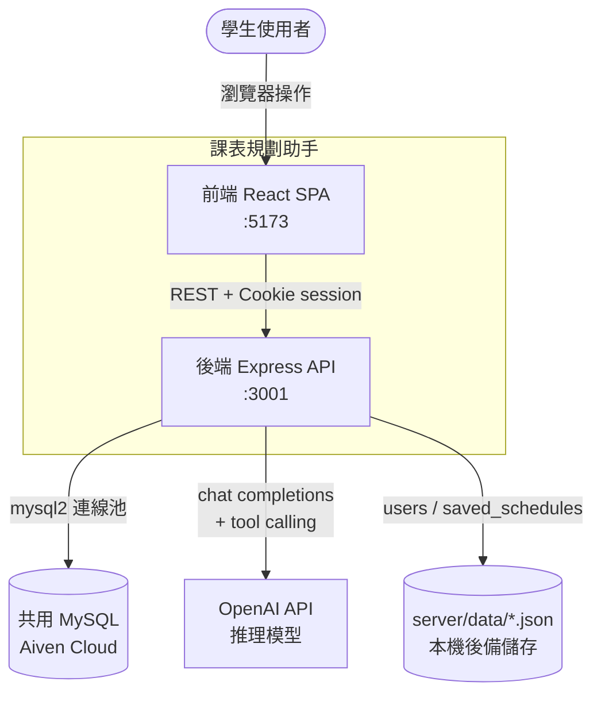
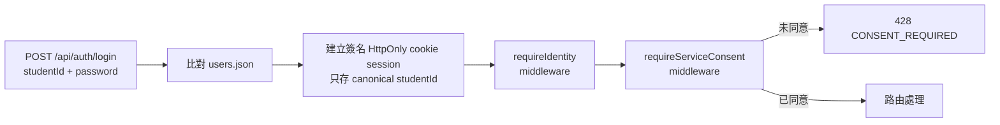
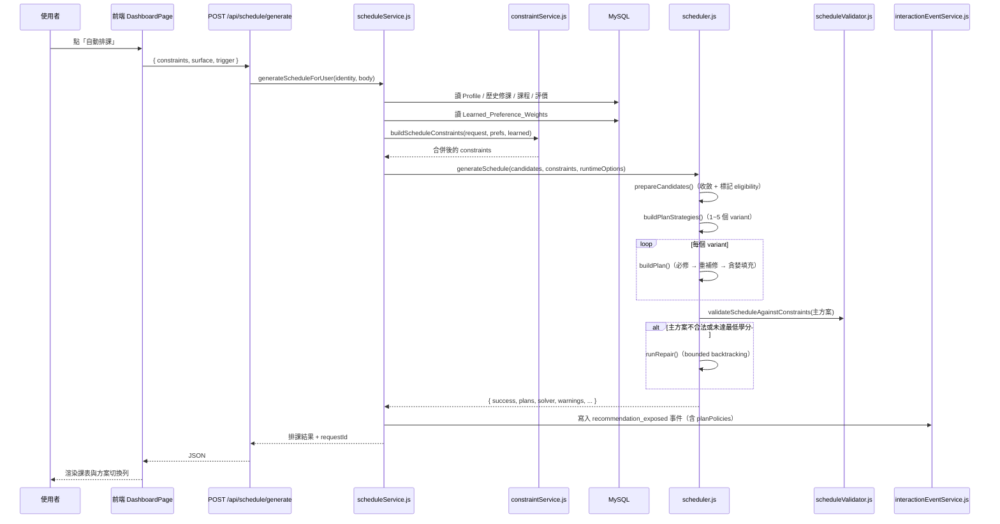
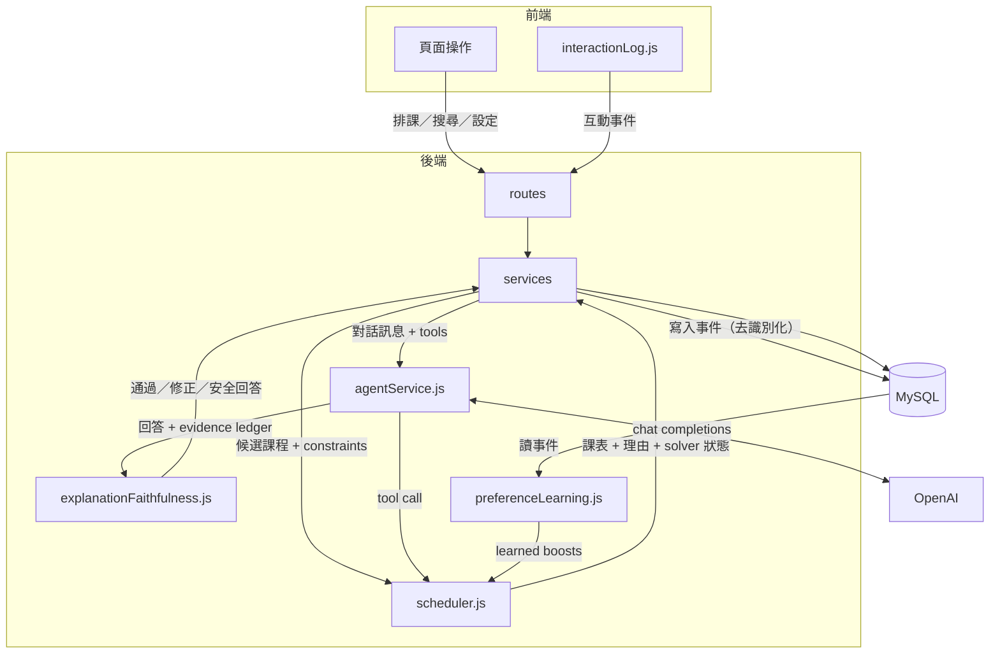

# 02 系統架構

> 最後更新：2026-09-08

## 技術總覽

| 層 | 技術 | 主要責任 | 位置 |
| --- | --- | --- | --- |
| 前端 | React 19 + Vite + React Router + lucide-react | 10 個頁面、狀態管理、互動事件發送 | `client/src/` |
| 後端 | Node.js + Express 5（ESM）| 9 條路由、身分／同意驗證、業務服務、排課引擎、AI Agent | `server/src/` |
| 資料庫 | MySQL（Aiven 雲端，多組共用）+ `mysql2` | 課程、Profile、歷史修課、互動事件、隱私狀態 | `server/src/db/` |
| 外部服務 | OpenAI API（`openai` npm 套件）| Agent 對話與 tool calling | `server/src/services/agentService.js` |

**語言**：整個專案是**純 JavaScript（ESM）**，沒有 TypeScript
（無 `.ts`/`.tsx` 原始碼、無 `tsconfig.json`、無 `typescript` 依賴）。
型別安全由 runtime schema 驗證取代：`interactionEventSchema.js`、
`toolSchemaValidator.js`、`profileSchema.js` 都是手寫的執行期驗證。

## System Context Diagram

**外部相依只有兩個**：共用 MySQL 與 OpenAI API。沒有其他第三方服務、
沒有 Redis／訊息佇列／物件儲存。

## 模組架構圖

```mermaid
flowchart TB
    subgraph Client["client/src"]
        Pages["pages/<br/>10 個頁面"]
        Ctx["contexts/<br/>AuthContext, ScheduleContext, ThemeContext"]
        Api["services/api.js<br/>統一 API 呼叫層"]
        Log["services/interactionLog.js<br/>互動事件建構"]
    end

    subgraph Routes["server/src/routes（9 條）"]
        R1["auth.js"]
        R2["profile.js"]
        R3["courses.js"]
        R4["schedule.js"]
        R5["chat.js"]
        R6["graduation.js"]
        R7["reviews.js"]
        R8["interactions.js"]
        R9["privacy.js"]
    end

    subgraph Services["server/src/services（業務協調）"]
        S1["scheduleService.js"]
        S2["agentService.js"]
        S3["promptService.js"]
        S4["constraintService.js"]
        S5["explanationFaithfulness.js"]
        S6["interactionEventService.js"]
        S7["preferenceLearningService.js"]
        S8["privacyService.js"]
        S9["identityService.js"]
        S10["memoryService.js"]
    end

    subgraph Skills["server/src/skills（純函式核心）"]
        K1["scheduler.js<br/>2903 行 主引擎"]
        K2["scheduleSolver.js<br/>bounded backtracking"]
        K3["scheduleValidator.js<br/>獨立複查"]
        K4["scoringPolicy.js<br/>評分 policy"]
        K5["planStrategies.js"]
        K6["preferenceLearning.js"]
        K7["courseScope.js / courseQuery.js"]
        K8["recommendationReason.js"]
        K9["personalizationExperiment.js<br/>離線量測"]
    end

    subgraph Data["server/src/data（規則與 schema）"]
        D1["constraintSchema.js"]
        D2["preferenceTags.js"]
        D3["profileSchema.js"]
        D4["interactionEventSchema.js"]
        D5["graduationRequirements.js"]
        D6["activeTerm.js"]
    end

    DB[("MySQL")]

    Pages --> Ctx --> Api --> Routes
    Log --> Api
    Routes --> Services
    Services --> Skills
    Skills --> Data
    Services --> DB
```

**分層原則**（由程式碼註解明示）：
`skills/` 是**純函式**，不連資料庫、不呼叫模型；資料取得與寫入由 `services/` 負責。
例如 `preferenceLearning.js` 的檔頭寫明「這個模組只從事件推導，不讀資料庫、不呼叫排課」。

## 排課演算法所在模組

| 模組 | 責任 |
| --- | --- |
| `skills/scheduler.js` | 主引擎：候選準備、硬性檢查、評分、貪婪填充、方案生成、結果組裝 |
| `skills/scheduleSolver.js` | 通用 bounded DFS 搜尋核心，**不知道課程長什麼樣**，由 scheduler 注入 callback |
| `skills/scheduleValidator.js` | 獨立驗證器，複查產出的課表是否真的合法 |
| `skills/scoringPolicy.js` | 版本化評分 policy（`personalized-scoring-v1`） |
| `skills/planStrategies.js` | 依 policy 動態產生 1~5 種比較方案 |
| `data/constraintSchema.js` | hard／soft constraint 的正式定義與 metadata |

## AI Agent 所在模組

| 模組 | 責任 |
| --- | --- |
| `services/agentService.js` | tool execution loop、tool 執行、結果信封、兩段式確認 |
| `services/promptService.js` | system prompt 組裝、7 個 tool 的 JSON Schema |
| `services/agentToolRegistry.js` | tool allowlist 與政策（renderable／writes／confirmation） |
| `services/explanationFaithfulness.js` | evidence ledger 與回答忠實度稽核 |
| `services/requirementPreflight.js` | 排課前的需求矛盾偵測 |
| `services/toolSchemaValidator.js` | tool 參數的執行期 schema 驗證 |

**模型**：`process.env.OPENAI_MODEL || 'gpt-5.6-luna'`（`agentService.js:53-55`）。
因為是推理模型，**刻意不送 `temperature`**（`agentService.js:11` 註解說明）。

## Authentication、Session 與 Consent

- 密碼比對在 `server/src/routes/auth.js:21`（明碼比對 `users.json`，見 `11-known-limitations.md`）。
- `requireIdentity` 保護所有 user-scoped 路由；未登入回 `401`，帶他人學號回 `403`。
- `requireServiceConsent` 檢查 `service_processing` 同意；未同意回 `428 CONSENT_REQUIRED`。
- 互動事件路由**刻意不用** `requireConsent` 擋，未同意時回 `200 { recorded: false, reason: 'CONSENT_NOT_GRANTED' }`（`routes/interactions.js:15-25`）。

## 前後端通訊方式

- REST + JSON，前端統一經 `client/src/services/api.js`，一律 `credentials: 'include'`。
- 開發環境跨埠（5173 → 3001），由後端 CORS 設定允許並帶 cookie。
- **沒有 WebSocket、沒有 SSE、沒有 GraphQL**。

## 開發與正式環境差異

| 面向 | 開發（無 `.env`） | 開發（有 `.env`） | 正式 |
| --- | --- | --- | --- |
| 課程／評價資料 | **不可用**（`assertMysqlAvailable()` 擋下） | 共用 MySQL | 共用 MySQL |
| Profile | `server/data/users.json` 後備 | MySQL `User_Profiles` + `users.json` 合併 | 同左 |
| AI 對話 | 回「伺服器未設定 OPENAI_API_KEY」 | 正常 | 正常 |
| 已存課表 | `server/data/saved_schedules.json` | **仍是 JSON 檔**（MySQL 無此表） | 同左（已知缺口） |
| 部署 | 本機 `:3001` / `:5173` | 同左 | **尚未部署**（roadmap `#39` 未開始） |

## 一次完整排課請求的 Sequence Diagram

## 資料流圖（前端／後端／排課器／Agent／資料庫）

**個人化的閉環**：使用者操作 → 互動事件 → `preferenceLearning` 學出權重 →
下一次排課的評分 policy → 不同的課表 → 使用者再操作。
