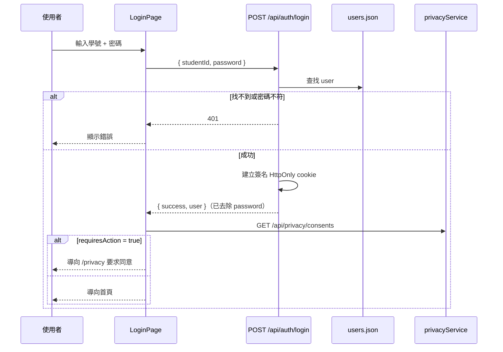
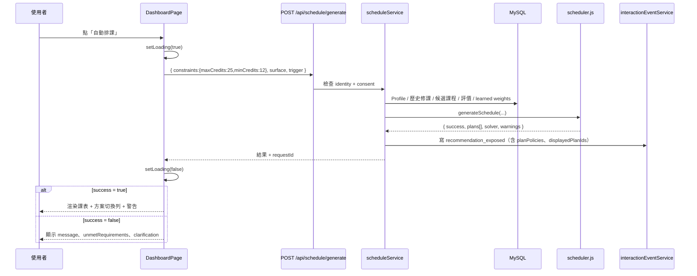
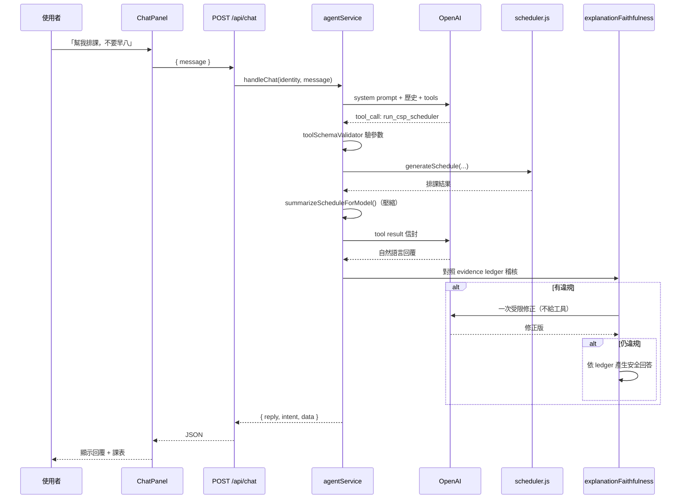
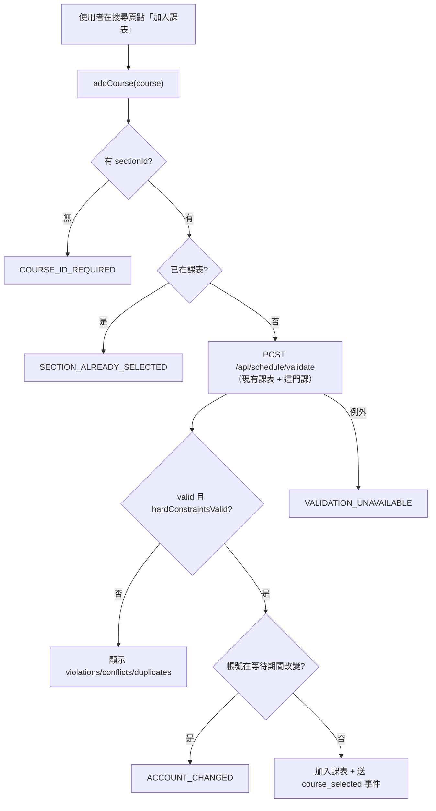
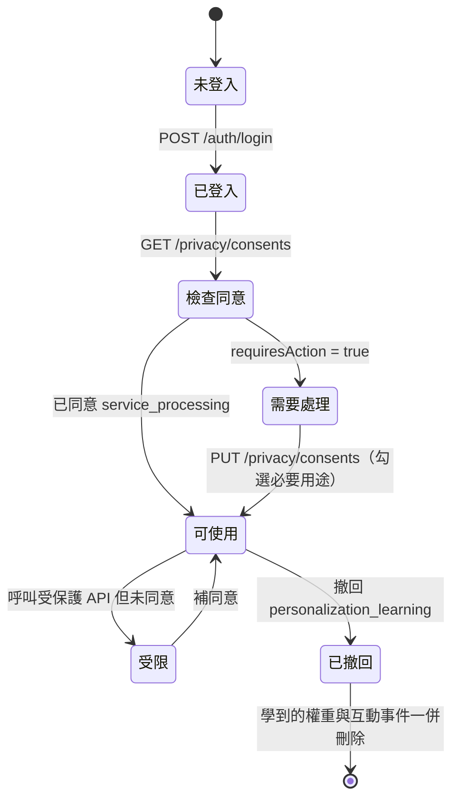

# 03 功能與使用者流程

> 狀態標記：`已實作`／`部分實作`／`規劃中`／`未使用`／`待確認`／`文件與程式不一致`
> 最後更新：2026-09-09

## 功能總表

| 功能模組 | 使用者目的 | 操作入口 | 輸入 | 處理流程 | 輸出 | 失敗情況 | 狀態 | 程式碼來源 |
| --- | --- | --- | --- | --- | --- | --- | --- | --- |
| 登入 | 進入系統 | `/login` | 學號、密碼 | 比對 `users.json` → 建立簽名 cookie session | `user` 物件 | 401 帳密錯誤 | 已實作 | `routes/auth.js:12-30` |
| 登出 | 結束 session | 導覽列 | — | 清除 cookie | `success` | — | 已實作 | `routes/auth.js` |
| 身分查詢 | 前端取得目前使用者 | 自動 | cookie | `requireIdentity` | `user`（去除 password） | 401 未登入 | 已實作 | `routes/auth.js:40-50` |
| Onboarding | 首次使用引導 | `/onboarding` | — | 前端導引 | 導向 Setup | — | 已實作 | `pages/OnboardingPage.jsx` |
| Profile 設定 | 設定系所／年級／班級 | `/setup` | `department`、`grade`、`className` | `normalizeProfile()` → 寫 `User_Profiles` | 更新後 profile | 400 驗證失敗 | 已實作 | `routes/profile.js`、`data/profileSchema.js` |
| 偏好標籤設定 | 表達 15 種偏好 | `/setup`、首頁側欄 | `selectedTags[]` | `extractTags()` → 存 `preference_tags` | 更新後 profile | 400 | 已實作 | `data/preferenceTags.js:120` |
| 避開時段 | 封鎖特定節次 | `/setup` | `blockedPeriods[]` | `normalizeBlockedPeriods()` → `avoid_time` | 更新後 profile | 400 | 已實作 | `utils/periods.js` |
| Profile 重新編輯 | 設定完成後修改系所／年級／班別／偏好 | 使用者選單「個人資料設定」 | 同「Profile 設定」 | 導向 `/setup`，沿用同一份 `SetupPage.jsx` | 更新後 profile | 400 驗證失敗 | 已實作（2026-09-09 新增入口） | `pages/DashboardPage.jsx`、`GraduationPage.jsx`、`SchedulePage.jsx`、`SearchPage.jsx` 的 `user-dropdown-menu` |
| 已修課紀錄 | 提供歷史修課 | 無 UI（後端匯入） | — | 讀 `User_Course_History` | 逐門紀錄 | 503 `COURSE_HISTORY_UNAVAILABLE` | 部分實作（無前端匯入介面） | `db/database.js:328-352` |
| 課程搜尋 | 找課 | `/search` | 系所／年級／班級／類別／關鍵字／教師／時段 | `filterCategorizedCourses()` | 課程陣列 | 500 | 已實作 | `routes/courses.js`、`skills/courseQuery.js` |
| 班級清單 | 選擇班級 | `/setup` | `department`、`grade` | 查 DB distinct | `classes[]` | — | 已實作 | `GET /api/courses/classes` |
| 系所清單 | — | — | — | — | `departments[]` | — | **未使用**（前端無呼叫點） | `GET /api/courses/departments` |
| 教師清單 | — | — | — | — | `instructors[]` | — | **未使用** | `GET /api/courses/instructors` |
| 自動排課 | 產生課表 | 首頁「自動排課」 | `constraints`、`surface`、`trigger` | 見 `06-personalized-scheduling.md` | 1~5 個方案 | `success:false` + `unmetRequirements` | 已實作 | `routes/schedule.js`、`skills/scheduler.js` |
| 課表顯示 | 看課表 | 首頁、`/schedule` | 排課結果 | 前端渲染週課表格 | 課表格 | 空白 state | 已實作 | `components/Schedule/ScheduleGrid.jsx` |
| 方案切換 | 比較不同方案 | 方案切換列 | `plans[]` | 前端切換 | 選定方案 | 只有 1 案時顯示合併原因 | 已實作 | `components/Schedule/PlanSwitcher.jsx` |
| 方案比較表 | 逐項比較 | 方案比較區 | `planMetrics` | 前端呈現 | 對照表 | — | 已實作 | `components/Schedule/PlanComparison.jsx` |
| Counterfactual | 「拿掉某偏好會怎樣」 | 方案比較區 | `courseIds`、`filters`、`constraints` | `buildCounterfactuals()` | `changed`/`unchanged`/`not-applicable` | — | 已實作 | `POST /api/schedule/counterfactual`、`skills/planComparison.js` |
| 推薦理由 | 知道為什麼推薦 | 課程卡片 | — | `recommendationReason.js` | `selectedBecause` + 證據 | 無理由時顯示未提供 | 已實作 | `skills/recommendationReason.js` |
| 手動加課 | 自己選課 | `/search` 加入課表 | 課程物件 | `POST /api/schedule/validate` 通過才加入 | 更新課表 | 衝堂／重複班次訊息 | 已實作 | `contexts/ScheduleContext.jsx:204-250` |
| 手動退課 | 移除課程 | 課表格 | `id`、`feedbackReason` | 前端移除 + 送 `course_withdrawn` | 更新課表 | — | 已實作 | `ScheduleContext.jsx:256-271` |
| 課表驗證 | 檢查合法性 | 加課時自動 | `courses[]` | `validateScheduleAgainstConstraints()` | `valid`、`violations` | — | 已實作 | `POST /api/schedule/validate` |
| 收藏／關注 | 追蹤課程 | 課程卡片星號 | `watchlist[]` | 寫 `users.json` | 更新 watchlist | — | 已實作（但存 JSON 非 DB） | `routes/auth.js:54-71` |
| 課表儲存 | 存多份課表 | 「儲存課表」 | `name`、`schedule`、`totalCredits` | 寫 `server/data/saved_schedules.json` | 已存課表 | — | 已實作（**無 MySQL 表**） | `services/memoryService.js:101-114` |
| 課表匯出 | 帶到行事曆 | 匯出下拉選單 | 目前課表 | 前端產生檔案 | `.ics`／`.png`／`.txt` | — | 已實作 | `client/src/utils/exportSchedule.js` |
| 畢業進度 | 看學分缺口 | `/graduation` | — | `graduationRequirements.js` + 歷史修課 | 各類缺口、認列明細、補課建議 | `courseHistoryAvailable:false` 提示 | 部分實作（多版本規則缺資料） | `routes/graduation.js` |
| AI 對話排課 | 用講的排課 | 首頁聊天面板 | `message` | 見 `08-ai-agent.md` | `reply`、`intent`、`data` | 未設 API key 時明確告知 | 已實作 | `routes/chat.js`、`services/agentService.js` |
| 排課回饋 | 告訴系統好不好 | 「符合／需要調整」 | `requestId`、`rejectedCourses` | `scheduleFeedbackService.js` | 確認訊息 | — | 已實作 | `services/scheduleFeedbackService.js` |
| 互動事件記錄 | （背景）供學習 | 自動 | 事件陣列 | 驗證 → 去識別化 → 寫 `Interaction_Events` | `recorded` | 未同意時 `200 recorded:false` | 已實作 | `routes/interactions.js`、`services/interactionEventService.js` |
| 偏好學習 | （背景）學出權重 | 自動 | 互動事件 | `learnPreferenceWeights()` | `Learned_Preference_Weights` | 資料不足回 `insufficient` | 已實作 | `skills/preferenceLearning.js` |
| 個人化來源顯示 | 知道系統用了什麼 | 首頁徽章 | — | `getPersonalizationSource()` | 四態 | — | 已實作 | `components/Profile/PreferenceSourceBadge.jsx` |
| Privacy Center | 管理同意與資料 | `/privacy` | consent 布林 | `privacyService.js` | consent 狀態 | — | 已實作 | `routes/privacy.js` |
| 資料匯出 | 取回自己的資料 | Privacy Center | — | 彙整多表 | JSON 下載 | — | 已實作 | `GET /api/privacy/export` |
| 資料刪除 | 刪除個資 | Privacy Center | `requestId`、`token`、確認語 | 兩段式刪除 | 刪除筆數 | — | 已實作 | `DELETE /api/privacy/data` |
| 清除聊天 | 刪對話 | Privacy Center | — | 刪 `Chat_Messages` | `deletedCount` | — | 已實作 | `DELETE /api/privacy/chat` |
| 重設個人化 | 清空學到的偏好 | Privacy Center | — | 刪權重 + 互動事件 | 刪除筆數 | — | 已實作 | `DELETE /api/privacy/personalization` |
| 多學期規劃 | — | — | — | — | — | — | **規劃中**（roadmap #8） | — |
| 協同過濾 | — | — | — | — | — | — | **規劃中**（roadmap #6） | — |
| 探索機制 | — | — | — | — | — | — | **規劃中**（roadmap #9） | — |

### 關於已刪除的 `/profile` 舊版表單（2026-09-09）

第二輪欄位盤點發現 `components/Profile/ProfileForm.jsx`／`pages/ProfilePage.jsx`
從未被 `App.jsx` 註冊路由——瀏覽器實測導覽到 `/profile` 會落進 catch-all 導回首頁，
是完全連不到的死碼，不是「過期但可用」。同時發現 `components/Layout/Navbar.jsx`、
`pages/HomePage.jsx` 也是零 import 的死碼（各頁面自行內嵌 `<header className="top-nav">`，
不共用這支 Navbar）。

四支檔案已一併刪除。原本 `ProfileForm` 想補的「設定完成後回來改資料」缺口，
改成在四個實際頁面（Dashboard／Graduation／Schedule／Search）的使用者下拉選單
新增「個人資料設定」，導向現有的 `/setup`（`SetupPage.jsx`）——重新整理後
`profileAPI.get()` 會預先帶入目前值，儲存後 `navigate('/')`，不需要另外做一個
編輯頁。已用 demo 帳號實測：透過此入口把班別從「資訊三乙」改成「資訊三甲」，
直接查共用 MySQL 確認 `User_Profiles.class_name` 真的寫入，符合預期後再改回原值。

## 核心流程逐步說明

### A. 登入流程

**前置條件**：`server/data/users.json` 中存在該學號。

**錯誤流程**：401（帳密錯）、403（帶他人學號）、428（未同意必要條款）。

### B. 自動排課流程

**前置條件**：已登入、已同意 `service_processing`、Profile 有系所與年級。

**Loading state**：按鈕變「排課中...」（已於瀏覽器驗證）。
**Empty state**：無候選課程時回 `data-insufficient` 與「找不到符合條件的候選課程」。
**Error state**：500 時前端顯示錯誤，不顯示假課表。

### C. AI 對話排課流程

**前置條件**：已登入、已同意、伺服器已設定 `OPENAI_API_KEY`。

**注意**：前端讀的是 `res.reply`（不是 `response`），
且只有 `res.intent === 'run_csp_scheduler'` 時才用 `res.data` 覆蓋畫面課表
（`ChatPanel.jsx:46-49`、`DashboardPage.jsx:260-273`）。

### D. 手動加課流程（含失敗路徑）

**設計重點**：**驗證通過才加入**（`ScheduleContext.jsx:227` 註解：
「驗證沒過的課從來沒有進過課表，記成『使用者選了』是錯的」）。

### E. 隱私同意流程

## Authentication 與 Consent 對照

| 路由群 | `requireIdentity` | `requireServiceConsent` |
| --- | :---: | :---: |
| `/api/auth/login`、`/logout` | ❌ | ❌ |
| `/api/auth/me` | ✅ | ❌ |
| `/api/auth/update-watchlist` | ✅ | ✅ |
| `/api/profile`（GET/POST） | ✅ | ✅ |
| `/api/profile/preference-tags` | ❌ | ❌ |
| `/api/courses/**` | ❌ | ❌ |
| `/api/schedule/generate`、`/save`、`/saved`、`/counterfactual` | ✅ | ✅ |
| `/api/schedule/validate` | ❌ | ❌ |
| `/api/chat` | ✅ | ✅ |
| `/api/graduation/me`、`/:studentId` | ✅ | ✅ |
| `/api/interactions` | ✅ | ❌（未同意回 `200 recorded:false`） |
| `/api/privacy/**` | ✅（`/policy` 除外） | ❌ |

（依 `server/src/routes/*.js` 的 middleware 掛載實際整理）
