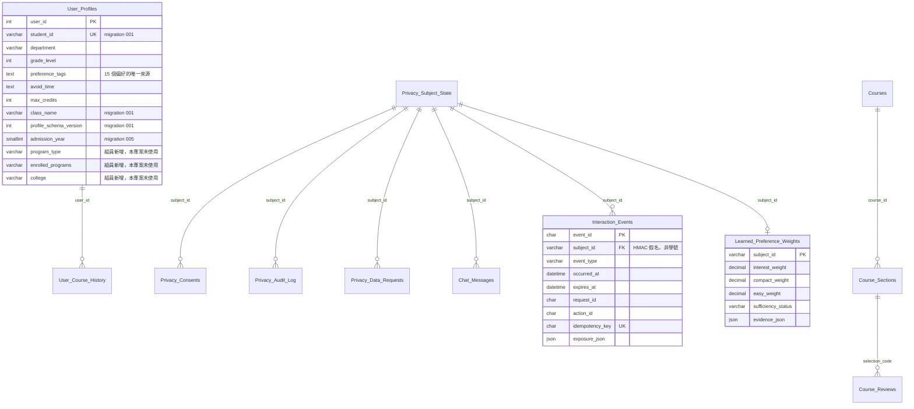
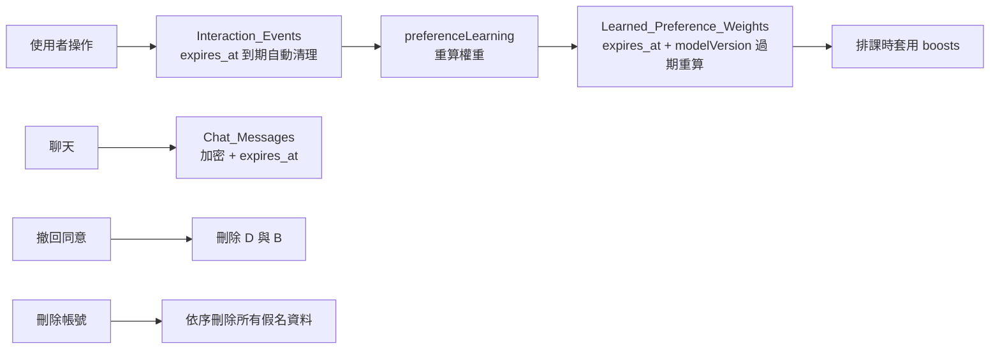

# 04 資料模型

> 依實際 migration、SQL 查詢與 service 使用方式整理。
> 補充來源：`docs/DATA_SCHEMA.md`（部分欄位表為「主要欄位」摘要，非窮舉）。
> 最後更新：2026-09-08

## 重要前提

1. **`User_Profiles`、`Courses`、`Course_Sections`、`Course_Reviews` 從未在本 repo
   被 `CREATE TABLE`**——它們是共用 MySQL 上既有的表，本專案只 `ALTER`（`User_Profiles`）
   或以 DML 讀寫。這幾張表的欄位是從 `SELECT`／`INSERT` 語句反推的。
2. `server/src/db/schema.sql` 是**遺留的 SQLite 檔案**（`INTEGER PRIMARY KEY AUTOINCREMENT`、
   `datetime('now')`），與實際 MySQL 無關，也沒有任何程式讀它。
3. migration 004 的 `.up.sql` 建立的是 `User_Course_History_v1_new`，
   **最終表名 `User_Course_History` 來自 runner script 的 `RENAME TABLE`**
   （`server/scripts/courseHistoryMigration.js:212-214`）——只讀 SQL 檔會誤解表名。

## ER Diagram

## 實體逐一說明

### User_Profiles（學生檔案）

| 欄位 | 型別 | 必填 | 預設 | Key | 用途 | 寫入來源 | 讀取位置 | 敏感性 |
| --- | --- | :---: | --- | --- | --- | --- | --- | --- |
| `user_id` | int | ✅ | — | PK | MySQL 內部 id | 既有 | `database.js:672` | 中 |
| `student_id` | varchar(32) | ❌ | NULL | UNIQUE | canonical 學號 | migration 001 | `database.js:674-675` | **高（個資）** |
| `department` | varchar | ✅ | — | — | 系所 | `POST /api/profile` | `database.js:678` | 中 |
| `grade_level` | int | ❌ | — | — | 年級 | 同上 | `database.js:679` | 中 |
| `class_name` | varchar(45) | ❌ | NULL | — | 班級 | 同上 | `database.js:682` | 中 |
| `admission_year` | smallint | ❌ | NULL | — | 入學學年度（決定畢業規則版本） | migration 005 回填 | `database.js:685` | 中 |
| `preference_tags` | text/JSON | ❌ | — | — | **15 個偏好旗標的唯一儲存** | `POST /api/profile` | `database.js:661,704` | 低 |
| `avoid_time` | text | ❌ | — | — | 封鎖時段 | 同上 | `database.js:689` | 低 |
| `max_credits` | int | ❌ | 25 | — | 學分上限 | 同上 | `database.js:688` | 低 |
| `profile_schema_version` | int | ✅ | 1 | — | schema 版本 | migration 001 | `database.js:696` | 低 |
| `program_type` / `enrolled_programs` / `college` | — | ❌ | — | — | 學制／學程／學院 | **組員新增** | **無程式讀寫** | 中 |
| `name` | — | ? | — | — | 姓名 | **待確認** | `demoPersonasSeed.js:90` | 高 |
| `completed_courses` | — | ❌ | — | — | 已停用 | — | 無 | — |

> **待確認**：`User_Profiles.name` 只在 `demoPersonasSeed.js` 出現，
> 沒有任何 migration 建立它，`database.js` 也不讀它（改用合成的
> `displayName: 'User {id}'`）。可能是共用表上的既有欄位，也可能是 seed script 的 bug。

### User_Course_History（歷史修課，migration 004）

| 欄位 | 型別 | 必填 | Key | 用途 |
| --- | --- | :---: | --- | --- |
| `history_id` | int AI | ✅ | PK | — |
| `user_id` | int | ✅ | FK → `User_Profiles` ON DELETE CASCADE | 擁有者 |
| `catalog_course_code` | varchar(45) utf8mb4_bin | ✅ | UK 之一 | **跨學期穩定課號**（刻意用 bin collation） |
| `academic_year` | smallint | ✅ | UK 之一 | 學年 |
| `semester` | tinyint | ✅ | UK 之一 + CHECK 1~3 | 學期 |
| `course_name` | varchar(255) | ✅ | — | 當時課名 |
| `score` | decimal(5,2) | ❌ | — | 分數 |
| `letter_grade` | varchar(10) | ❌ | — | 等第 |
| `credits` | decimal(4,1) | ✅ | — | 學分 |
| `passed` | tinyint(1) | ✅ | CHECK 0/1 | 是否通過 → 決定已修排除或重補修 |
| `requirement_type` | varchar(32) | ✅ | — | 當時的修別 |
| `general_education_category` | varchar(32) | ❌ | — | 通識領域 |
| `graduation_category` | varchar(32) | ✅ | — | 認列到哪一類畢業學分 |
| `source` | varchar(64) | ✅ | 預設 `'unknown'` | 資料來源 |
| `created_at` / `updated_at` | datetime(3) | ✅ | — | — |

唯一鍵 `uk_user_course_history_attempt (user_id, catalog_course_code, academic_year, semester)`
——**同一門課同一學期只能有一筆**，重修是不同學期因此不衝突。

### Interaction_Events（互動事件，migration 003）

23 欄。關鍵設計：**沒有任何學號欄位**，canonical `userId` 在寫入前一律換成
HMAC `subject_id`（roadmap #2 對抗式審查要求）。

| JS 欄位（envelope） | MySQL 欄位 | 說明 |
| --- | --- | --- |
| `userId`（學號） | `subject_id` | **HMAC 假名化，學號不入庫** |
| `timestamp` | `occurred_at` | 換詞 |
| `exposureContext` | `exposure_json` | 換詞，JSON 型別 |
| `eventId`/`eventType`/`requestId`/`actionId`/`idempotencyKey` | 同名 snake_case | — |
| `course.catalogCourseCode`/`course.sectionId` | `catalog_course_code`/`section_id` | 攤平 |
| `term.academicYear`/`term.semester` | `academic_year`/`semester` | 攤平 |
| `plan.planId`/`plan.variantId` | `plan_id`/`variant_id` | 攤平 |
| `position.planRank`/`courseRank` | `plan_rank`/`course_rank` | 攤平 |
| `versionSnapshot.*` | `profile_schema_version`/`model_version`/`recommendation_reason_version` | 攤平 |

**事件類型**（`interactionEventSchema.js:9-20`）10 種，實際發送狀況：

| eventType | 誰發送 | 狀態 |
| --- | --- | --- |
| `recommendation_exposed` | **只有伺服器** `scheduleService.js:108` | 已實作（前端送一律拒絕） |
| `recommendation_accepted` | 前端 `ScheduleContext.jsx:371` | 已實作 |
| `course_withdrawn` | 前端 `removeCourse()` | 已實作 |
| `course_viewed` | 前端 `logCourseViewed()` | 已實作 |
| `course_favorited`/`course_unfavorited` | 前端 `toggleWatchlist()` | 已實作 |
| `course_selected` | 前端 `addCourse()` | 已實作 |
| `schedule_regenerated` | 前端 `logScheduleRegenerated()` | 已實作（**刻意不投票**，`TEST_PLAN` PL10） |
| `course_deselected` | 無 | **未使用**（常數存在，零引用） |
| `course_removed` | 無 | **規劃中**（`DATA_SCHEMA.md:714` 明訂為 forward contract） |

唯一鍵 `uq_interaction_idempotency (subject_id, idempotency_key)` 保證重送不重複。

### Learned_Preference_Weights（學到的偏好，migration 006）

| 欄位 | 型別 | 用途 |
| --- | --- | --- |
| `subject_id` | varchar(67) PK, FK | HMAC 假名 |
| `model_version` | varchar(64) | `preference-learning-v2`；版本不符即視為過期重算 |
| `interest_weight`/`compact_weight`/`easy_weight` | decimal(4,3) | 三軸權重 |
| `sufficiency_status` | varchar(16) | `sufficient`／`insufficient`／`no-consent` |
| `usable_event_count`/`required_event_count` | int | 量閘（門檻 50） |
| `evidence_json` | JSON | 逐票 `{ruleId, eventId, occurredAt, decay}` |
| `computed_at`/`expires_at` | datetime(3) | 計算時間與保存期限 |

**不落地的欄位**：`axisSignal`（roadmap #40）與 `decay` 參數區塊只存在於
`learnPreferenceWeights()` 的回傳值，**刻意不寫進資料表**。

### Privacy 家族（migration 002）

| 表 | PK | 用途 |
| --- | --- | --- |
| `Privacy_Subject_State` | `subject_id` | 假名主體狀態，其他 5 張表的 FK 目標 |
| `Privacy_Consents` | `consent_id` | 逐筆同意紀錄（append-only，`recorded_sequence` 排序） |
| `Privacy_Audit_Log` | `audit_id` | 稽核軌跡 |
| `Privacy_Data_Requests` | `request_id` | 刪除意向 token（`token_hash`、`expires_at`） |
| `Chat_Messages` | `message_id` | **加密**聊天（`ciphertext`+`iv`+`auth_tag`+`key_version`） |

### 課程家族（既有共用表）

| 表 | 欄位（由查詢反推） |
| --- | --- |
| `Courses` | `course_id`、`name`、`credits`、`type`、`dept`、`subid3`、`prerequisites`（全 NULL） |
| `Course_Sections` | `section_id`、`course_id`、`teacher`、`room`、`time_str`、`time_bitmask`、`year`、`semester`、`current_amount`、`rag_context`、`rag_tag`、`selection_code` |
| `Course_Reviews` | `Reviews_id`、`selection_code`、`Reviews_tags`、`Review_content`、`sweetness`、`coolness`、`workload`、`value`、`overall`、`review_count`、`source`、`url`、`scraped_at` |

**注意**：`Courses.course_id` 與 `Course_Sections.course_id` 的 collation 不同，
JOIN 必須用 `BINARY` 比較，否則會拋 `ER_CANT_AGGREGATE_2COLLATIONS`
（`database.js:729-733`）。

## 欄位名稱轉換對照

| 概念 | 前端 | 後端 | MySQL |
| --- | --- | --- | --- |
| 年級 | 送 `grade`／收 `gradeLevel ?? grade` | `gradeLevel` | `grade_level` |
| 學分上限 | `targetCreditsMax`（僅舊表單） | `targetCreditsMax` | `max_credits` |
| 避開時段 | `blockedPeriods` | `blockedPeriods` | `avoid_time` |
| 偏好標籤 | `selectedTags` | `preferenceTags`／`selectedTags`／`preferredCategories`（3 個同值別名） | `preference_tags` |
| 穩定課號 | `catalogCourseCode` | `catalogCourseCode` | `Courses.subid3` |
| 班次 id | `sectionId`／`id` | `id`＋`sectionId`（同值別名） | `Course_Sections.section_id` |
| 教師 | `instructor`／`teacher` | 兩者同值 | `teacher` |
| 學號 → 假名 | `studentId` | `userId` | `subject_id`（HMAC） |

## 儲存層差異（MySQL / JSON / 記憶體）

| 資料 | MySQL | `server/data/*.json` | 說明 |
| --- | :---: | :---: | --- |
| 課程／評價 | ✅ 唯一來源 | ❌ | `assertMysqlAvailable()` 強制 |
| Profile | ✅ 主要 | ✅ `users.json` 部分後備 | `className` 兩處都有 |
| 歷史修課 | ✅ 唯一來源 | ❌ | JSON 欄位已刪除，無 fallback |
| 互動事件／學習權重／隱私 | ✅ 唯一來源 | ❌ | — |
| **已存課表** | ❌ **無此表** | ✅ `saved_schedules.json` | 換裝置／多人共用看不到 |
| 密碼、watchlist、skillTree、overallScore | ❌ | ✅ `users.json` | **活躍功能但無 DB 欄位** |

## 資料生命週期

保存期限常數在 `PRIVACY_RETENTION`（互動事件 180 天，其餘值**待確認**）。

## 敏感資料分類

| 等級 | 資料 | 保護 |
| --- | --- | --- |
| **高** | 學號、姓名、成績、歷史修課 | session 保護、匯出排除內部 id、事件表不存學號 |
| 中 | 系所、年級、班級、入學年度 | session 保護 |
| 低 | 偏好標籤、避開時段、學分上限 | — |
| **不得外洩** | 密碼、session secret、HMAC key、聊天明文 | 匯出明確排除（`routes/privacy.js:103`） |
