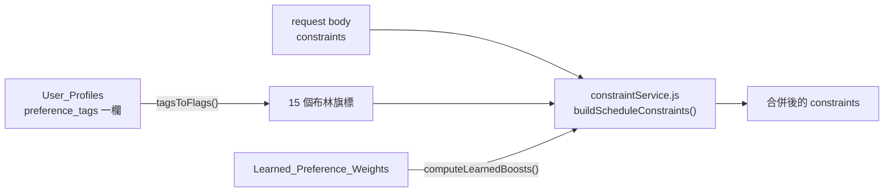
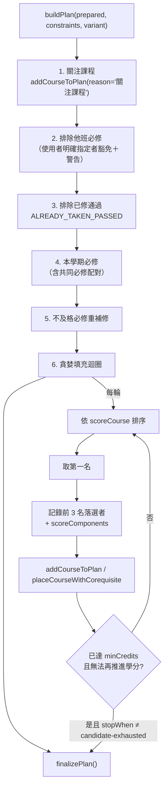
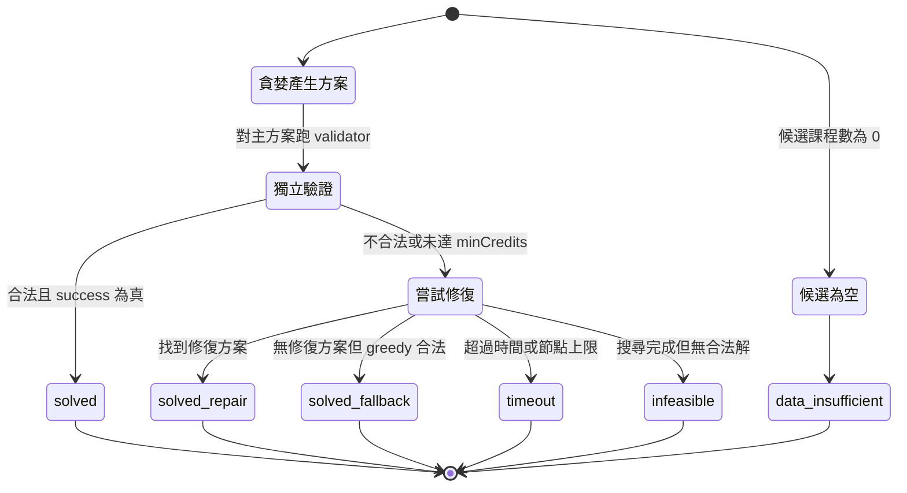
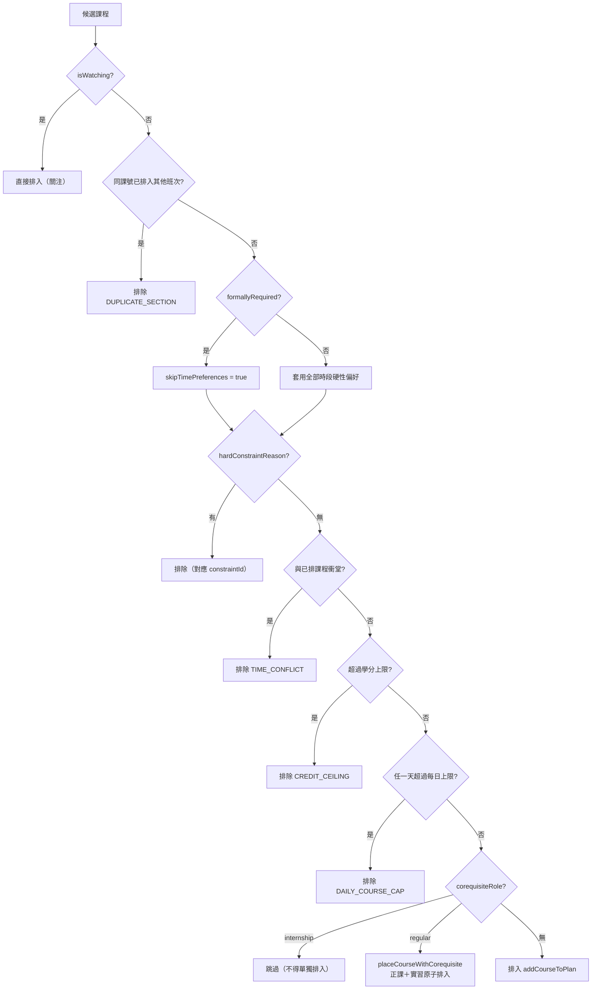
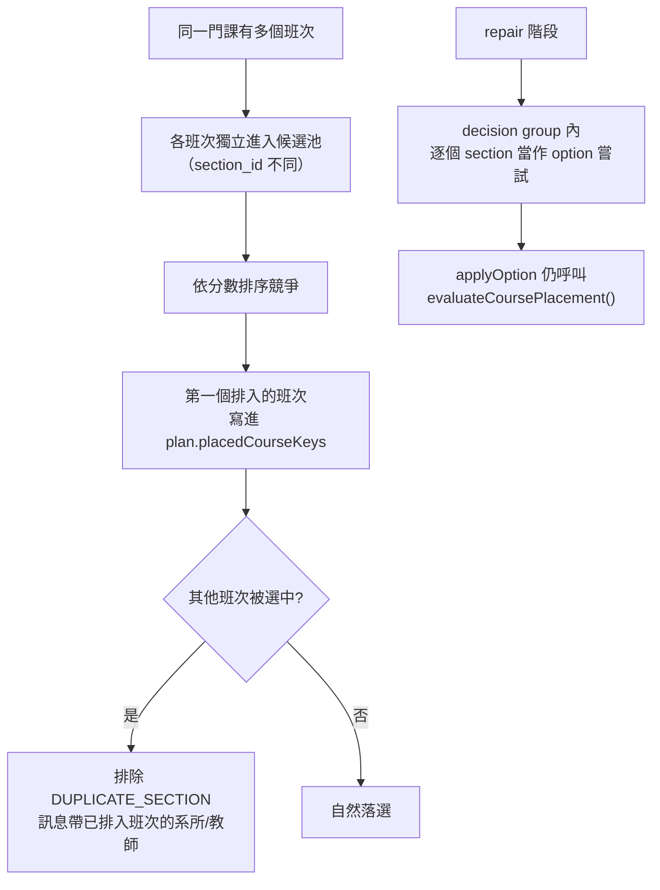

# 06 個人化排課流程

> 本文件是整套文件的核心。所有公式、常數與規則皆逐一標注程式碼位置，
> 未在程式碼中確認的內容一律標記為「待確認」。
> 最後更新：2026-09-08

## 0. 名詞對照

| 名詞 | 意義 | 程式位置 |
| --- | --- | --- |
| variant / strategy | 一種比較方案的搜尋設定 | `planStrategies.js:5` |
| plan | 一份產出的課表方案 | `scheduler.js:1036` `createEmptyPlan()` |
| prepared | 收斂後的候選課程與 scope | `scheduler.js:1148` `prepareCandidates()` |
| policy | 版本化評分規則 | `scoringPolicy.js:34` `resolveScoringPolicy()` |
| scope | 學生的系所／年級／班級範圍 | `courseScope.js` `buildStudentScope()` |

## 1. 排課請求從哪裡進入

三個入口，全部匯流到同一個 `generateSchedule()`：

| 入口 | 路徑 | 程式位置 |
| --- | --- | --- |
| 前端按鈕 | `POST /api/schedule/generate` | `routes/schedule.js` → `scheduleService.js` |
| AI 對話 | `POST /api/chat` → tool `run_csp_scheduler` | `agentService.js:377` `executeAgentTool()` |
| Counterfactual | `POST /api/schedule/counterfactual` | `skills/planComparison.js` `buildCounterfactuals()` |

主函式簽章（`scheduler.js:2425`）：

```js
export function generateSchedule(candidateCourses, rawConstraints = {}, runtimeOptions = {})
```

`runtimeOptions` 支援 `seed`、`timeoutMs`、`maxNodes`、`solverMode`。

## 2-3. Profile 載入與偏好正規化



**偏好只存一欄**：15 個旗標全部由 `User_Profiles.preference_tags`（標籤字串陣列）
在讀取時展開（`preferenceTags.js:97` `tagsToFlags()`）。**缺席即代表未勾選，
不補 false 預設值**——`database.js:698-704` 註解說明先前硬寫 `false` 會把使用者
真正勾選的 `true` 蓋掉，造成偏好靜默消失。

**欄位名稱合併**（`constraintService.js`）：

| request 名稱 | profile 名稱 | 合併位置 |
| --- | --- | --- |
| `grade` | `gradeLevel` | `constraintService.js:52` |
| `maxCredits` | `targetCreditsMax` | `constraintService.js:60` |
| `discussion` | `preferDiscussion` | `constraintService.js:73` |
| `preferEasy` | `preferEasyCourses` | `constraintService.js:116-119` |
| `mustTakeCourseIds` | `mustTakeCourses` | `constraintService.js:81` |

**封鎖時段正規化**在 `generateSchedule()` 入口統一處理（`scheduler.js:2430-2433`），
不要求各呼叫端自己轉——註解記載這正是 D2 缺陷（偏好存成 `["08:00"]` 字串時
`bp.day` 為 undefined，比對靜默跳過）的修法。

**學分上下限預設值**（`scheduler.js:50-54`，來源 `docs/COURSE_SELECTION_RULES.md`）：

| 常數 | 值 |
| --- | ---: |
| `DEFAULT_MIN_CREDITS` | 12 |
| `DEFAULT_MAX_CREDITS` | 25 |
| `FINAL_YEAR_MIN_CREDITS`（四年級） | 9 |
| `OVERLOAD_MAX_CREDITS`（超修申請後） | 30 |

## 4-5. 必修判定與已修／重補修處理

**「必修」有兩種意義，程式刻意分開**（`scheduler.js:117-131`）：

- `Courses.type = '必修'`：某個班級的必修，不代表是**這位學生**的必修。
- `isRequiredForStudent(course, scope)`：這位學生的正式必修。

`getEffectiveCategoryPriority()` 在 scope 可解析時，把「不是本人必修的必修」
降級成一般選修的優先度（`scheduler.js:126-131`），避免通識、共同科目與跨系必修
在填充階段壓過本系選修。

**已修排除**（`scheduler.js:1544-1552`）：用跨學期穩定的 `catalogCourseCode` 比對
`getPassedCourseCodes(courseHistory)`，排除並記 `constraintId: 'ALREADY_TAKEN_PASSED'`。
刻意不做 trim／大小寫轉換／課名 fallback。

**重補修**（`scheduler.js:1496-1497, 1644-1668`）：`getFailedRequiredCourses()` 從
歷史推導不及格必修，固定排在本學期必修**之後**。本學期沒開課時發出警告
（`scheduler.js:1585-1591`）；有開課但排不進去也發警告（`scheduler.js:1663-1667`）。

## 6-7. 候選取得與 Section 展開

課程與班次在資料庫層就已 JOIN 展開（`database.js:708-737`）：
`Course_Sections` INNER JOIN `Courses`，一列 = 一個班次，
`mapCourseRow()` 產生的 `id` 就是 `section_id`（`database.js:206-207`）。

`prepareCandidates()`（`scheduler.js:1148`）依序做：
active term 過濾 → 類別標註 → eligibility 解析 → 系外選修認列 → 共同必修標註
（`annotateCorequisite()`, `scheduler.js:442`）→ 評價索引與母體先驗。

## 8. 先修與共修

- **先修**：`constraintSchema.js:341-365` 定義 `PREREQUISITE`／`COREQUISITE`，
  但標記 `enforced: false, confidence: 0`——因為 `Courses.prerequisites` 3,086 筆全為 NULL。
  **狀態：規劃中**。
- **共修（正課＋實習）**：**已實作**。`corequisiteRole` 標為 `regular`／`internship`；
  實習不得單獨排入（`scheduler.js:1606`、`1681-1687`），一律由正課透過
  `placeCourseWithCorequisite()`（`scheduler.js:1004`）**原子性**整組排入或整組放棄。

## 9-11. Hard Constraints

`evaluateCoursePlacement()`（`scheduler.js:795`）是**貪婪與 repair 共用的唯一入口**
（註解明說，避免只改一邊）。檢查順序與 `constraintId`：

| 順序 | 檢查 | `constraintId` | 程式位置 |
| ---: | --- | --- | --- |
| 0 | 關注課程直接放行 | — | `scheduler.js:796` |
| 1 | 同一門課已排入其他班次 | `DUPLICATE_SECTION` | `scheduler.js:799-804` |
| 2 | 時段偏好類硬性檢查 | 見下表 | `scheduler.js:812` `hardConstraintReason()` |
| 3 | 與已排課程衝堂 | `TIME_CONFLICT` | `scheduler.js:827-831` |
| 4 | 超過學分上限 | `CREDIT_CEILING` | `scheduler.js:833-836` |
| 5 | 超過每日課程數上限 | `DAILY_COURSE_CAP` | `scheduler.js:839-845` |

**時段類判定**（`scheduler.js:321-335`）：

| 概念 | 定義 | 常數 |
| --- | --- | --- |
| 早八 | `startPeriod <= 1` | `MORNING_LAST_PERIOD = 1` |
| 午休 | `startPeriod <= 5 && endPeriod >= 5` | `LUNCH_PERIOD = 5` |
| 晚課 | `startPeriod >= 12` | `EVENING_FIRST_PERIOD = 12` |

**正式必修豁免**（`scheduler.js:806-812`）：`isRequiredForStudent() === true` 的課
**無條件豁免 3 個時段類舒適偏好**（不排早八／午休／晚課），但仍受衝堂、學分上限、
每日上限約束。豁免只在課程真的排入時才揭露（`scheduler.js:821-825`）。

**多時段課程**：`getUsedDays()`（`scheduler.js:381`）回傳課程佔用的**每一天**，
每日課程數上限對多時段課程逐日計算。同一份邏輯由 `scheduleValidator.js` 重用
（roadmap #35 修法）。

## 12-17. 分數公式（完整）

### 主公式

`computeScoreComponents()`（`scheduler.js:752-780`）——**這是唯一一份公式**，
`scoreCourse()` 只是把元件加總（`scheduler.js:782-790`）：

```js
components = {
  base:              1000,
  requiredSelection: requiredIds.has(course.id) ? 10000 : 0,
  requiredCourse:    categoryPriority === 0 ? 5000 : 0,      // REQUIRED_COURSE_BONUS
  category:          -categoryPriority * 120 * policy.categoryCoefficient,
  credits:           (course.credits || 0) * 12 * policy.creditCoefficient,
  contentPreference: getContentPreferenceScore(course, constraints),
  interest:          features.interest * policy.weights.interest * 240,
  compact:           features.compact  * policy.weights.compact  * 240,
  easy:              features.easy     * policy.weights.easy     * 240,
}
score = Σ components
```

### 常數表

| 常數 | 值 | 位置 |
| --- | ---: | --- |
| `base` | 1000 | `scheduler.js:770` |
| `requiredSelection`（使用者指定必排） | 10000 | `scheduler.js:771` |
| `REQUIRED_COURSE_BONUS`（本人必修） | 5000 | `scheduler.js:96` |
| `CATEGORY_WEIGHT` | 120 | `scheduler.js:84` |
| 學分係數 | ×12 | `scheduler.js:774` |
| `PREFERENCE_SCALE` | 240 | `scoringPolicy.js:4` |
| `INTEREST_KEYWORD_SCORE` | 40 | `scheduler.js:57` |
| `EASY_SCORE_MAX` / `MAX_EASY_COURSE_SCORE` | 100 | `scheduler.js:58` |
| `GREEDY_RUNNERS_UP_RECORDED` | 3 | `scheduler.js:63` |
| `LOW_REVIEW_COVERAGE_RATIO` | 0.5 | `scheduler.js:66` |

### 類別優先度（`scheduler.js:73-81`）

| 類別 | priority |
| --- | ---: |
| 必修 | 0 |
| 核心選修 | 1 |
| 一般選修 / 選修 | 2 |
| 通識 | 3 |
| 系外選修 | 4 |
| 其他 | 5 |

`category` 分項為**負值**（`-priority × 120 × categoryCoefficient`），
priority 越大扣越多。

### Policy 係數（`scoringPolicy.js:34-56`）

```js
directions = {
  interest: (preferredKeywords / interests / preferredTrack 任一非空) ? 1 : 0,
  compact:  preferCompact ? 1 : 0,
  easy:     resolveEasyDirection(constraints).direction,   // +1 涼課 / -1 挑戰 / 0 未表態或矛盾
}
weights[axis] = directions[axis] * (1 + clamp(learned.boosts[axis], 0, 1))
categoryCoefficient = 任一 weight 非 0 ? 0.35 : 1
creditCoefficient   = 1（`personalized_credits` variant 改為 3）
```

**安全保證**：`directions[axis] === 0` 時 boost 恆無效——學習只能放大已表態方向，
不能無中生有。由 `scoringPolicy.test.js` 的
`"#7 user direction bounds learned strength and ignores inactive axes"` 釘住。

### 特徵正規化（`scoringPolicy.js:60-68`）

```js
interest = interestCount > 0 ? clamp(interestHits / interestCount, 0, 1) : 0   // [0,1]
easy     = clamp((easiness ?? neutralEasiness) / easyMax, 0, 1) - 0.5          // [-0.5,+0.5]
compact  = courseDays > 0
             ? (overlappingDays > 0 ? clamp(overlappingDays / courseDays, 0, 1) : -1/6)
             : 0                                                              // [-1/6,+1]
```

`compact` 的 `-1/6` 是「這門課會新開一個上課日」的固定扣分。

### 涼度來源與 shrinkage

`resolveEasiness()`（`scheduler.js:539-549`）三態：

| source | 條件 | 可否對使用者宣稱「涼」 |
| --- | --- | --- |
| `reviews` | 有真實評價（`reviewEvidence.easyScore`） | ✅ 可以 |
| `proxy` | 無評價，由課程描述推估 | ❌ 只能說「依課程屬性推估」 |
| `none` | 連描述都沒有 | ❌ |

**proxy 公式**（`scheduler.js:510-536`）：

```js
score = 50                                     // PROXY_EASINESS_BASE = EASY_SCORE_MAX / 2
      + (描述含 討論/互動/參與 ? 20 : 0)        // PROXY_DISCUSSION_BONUS
      - (描述含 實作/實驗/專題 ? 15 : 0)        // PROXY_PROJECT_PENALTY
      - credits * 5                            // PROXY_CREDIT_PENALTY
score = clamp(score, 0, 100)
```

proxy 分數**不得**灌進 `plan.reviewCoverage` 或方案層 `preferenceBreakdown.easy`
（`scheduler.js:499-503` 註解明訂）。

**評價收縮**：`shrinkEasiness()`（`reviewStats.js`）以 m-estimate 把單門課的涼度
往母體先驗收縮，母體先驗由**傳進來的全部評價**計算而非候選池
（`scheduler.js:2500-2504` 註解：否則同一門課在不同搜尋條件下會得到不同涼度）。

### 內容偏好（`CONTENT_PREFERENCE_RULES`, `scheduler.js:167`）

8 個內容偏好以關鍵字比對課程描述加分，係數來自 `constraintSchema.js` 的 soft
constraint `weight`（roadmap #7 移除重複常數）。訊號強度檢查：命中率
< 5%（`CONTENT_PREFERENCE_LOW_SIGNAL_RATIO`）或 > 95%
（`CONTENT_PREFERENCE_HIGH_SIGNAL_RATIO`）時發出警告，告訴使用者這個偏好實際上
起不了作用（`scheduler.js:69-71, 239`）。

## 18. Tie-breaking

貪婪填充的排序（`scheduler.js:1690-1694`）：

```js
remaining.sort((a, b) =>
  scoreCourse(b, ...) - scoreCourse(a, ...)   // 分數高者優先
  || Number(a.id) - Number(b.id)              // 同分時 section_id 小者優先（決定性）
);
```

必修排入順序（`scheduler.js:1561-1566`）：先「使用者指定必排」再「本人必修」，
同級再依 `getCategoryPriority()`。

solver 內同分打散用 FNV-1a hash（`scheduleSolver.js:22-30` `seededStableHash()`），
**只用於決定性 tie-break，不是探索隨機性**。

## 19-22. 排課順序與搜尋策略



**貪婪迴圈的終止條件**（`scheduler.js:1689, 1732-1739`）：
`remaining` 為空、或 `totalCredits >= maxCredits`、或（已達 `minCredits` 且
剩餘課程都無法再推進學分）。**0 學分課程刻意排除在「還能推進」的判定外**，
否則迴圈會跑到候選耗盡。

**貪婪填充只考慮有排定時間的課**（`scheduler.js:1683-1687`）：無時間課程不佔時段、
不衝堂，讓它們參與填充會被無限塞入（roadmap #14 的缺陷）。

### Repair（bounded backtracking）

觸發條件 `shouldAttemptRepair()`（`scheduler.js:2124-2128`，第二輪審查已逐行核對，取消待確認）：

```js
function shouldAttemptRepair(primary, primaryCheck, runtimeOptions) {
  if (runtimeOptions.solverMode === 'greedy') return false;
  if (!primary || !primary.success || !primaryCheck?.valid) return true;
  return primary.totalCredits < primary.minCredits;
}
```

三個判斷依序生效：
1. `runtimeOptions.solverMode === 'greedy'` 時**完全不嘗試 repair**（純貪婪模式，
   之前的文件版本遺漏了這個 opt-out）。
2. 主方案不存在、`primary.success` 為假、或 `scheduleValidator` 判定不合法
   （`primaryCheck.valid` 為假）→ 一定嘗試 repair。
3. 以上皆非（主方案合法且成功）時，只在**未達最低學分**（`totalCredits < minCredits`）
   才嘗試 repair——已達標的合法方案不會被 repair 覆蓋。

搜尋核心 `solveWithBoundedBacktracking()`（`scheduleSolver.js:39`）：

| 參數 | 預設值 | 位置 |
| --- | ---: | --- |
| `DEFAULT_SOLVER_TIMEOUT_MS` | 2000 | `scheduleSolver.js:7` |
| `DEFAULT_SOLVER_MAX_NODES` | 50000 | `scheduleSolver.js:8` |
| `DEFAULT_SOLVER_SEED` | 0 | `scheduleSolver.js:9` |

策略是**有限深度優先搜尋**：逐個 decision group 嘗試所有 option，
optional group 額外探索一條 skip 分支（`scheduleSolver.js:119-121`）；
超過 node 上限或 deadline 即標記 `timedOut`。搜尋器**不知道課程長什麼樣**，
所有實際放置仍走 `scheduler.js` 的 `evaluateCoursePlacement()`。

回傳狀態（`scheduleSolver.js:129`）：

```js
status = timedOut ? 'timeout' : (bestValid ? 'solved' : 'infeasible')
```

外層 `generateSchedule()` 另有 `'data-insufficient'`（候選為空，`scheduler.js:2463`）。

### 放寬階梯

`tryRelaxationLadder()`（`scheduler.js:2390`）為 **opt-in**，
只在 `constraints.allowRelaxation` 為真時執行（`scheduler.js:2605`）；
預設關閉，行為與未加入此功能前完全相同。

## 23. 排不進去時的診斷

| 欄位 | 內容 |
| --- | --- |
| `plan.excludedCourses[]` | `{ course, reason, constraintId, pairedCourse? }` |
| `plan.failures[]` | 必排課程失敗（只有 `options.required` 為真時記入） |
| `plan.warnings[]` | 白話警告（重補修未開課、訊號過弱、他班必修豁免等） |
| `unmetRequirements[]` | `{ type, courseIds, constraintIds, reason, adjustable }` |
| `conflictSet[]` | 互相衝突的限制集合（`buildConflictSet()`, `scheduler.js:2345`） |
| `clarification` | 給使用者的澄清問句（`buildClarification()`, `scheduler.js:2042`） |

## 24-25. 方案生成與成功判定

`buildPlanStrategies(policy)`（`planStrategies.js:5-24`）：

1. `personalized`——基準方案，用原始 policy。
2. 對每個 `policy.weights[axis] !== 0` 的軸，產生 `personalized_${axis}`，
   **只把該軸乘 1.5 倍**，其餘軸不變（`planStrategies.js:17`）。
3. `personalized_credits`——`creditCoefficient: 3`，`stopWhen: 'candidate-exhausted'`。

**因此方案數上限 = 1 + (非零軸數 ≤ 3) + 1 = 5**；未表態任何偏好時只有 2 種。

去重 `uniquePlans()`（`scheduler.js:2319`）依課程集合去重，
`buildPlanDiversity()` 記錄為什麼塌縮（候選池太小 vs 某軸沒有訊號）。

**成功判定**（`scheduler.js:2576-2595`）：



`solver.resultSource` 有 `'greedy'`／`'repair'`／`'none'`；
`solver.improved` 只有 repair 方案成為主方案時為 true。

## 26. 推薦理由

`recommendationReason.js` 為每門一般排序課產生理由。`selectedBecause` 的取值
（由 `explanationFaithfulness.js:68-73, 603` 的比對表確認）：
`REQUIRED_COURSE`、`RETAKE_REQUIRED`、`USER_SPECIFIED`、`COREQUISITE_PAIR`、
`PREFERENCE_MATCH`、`WATCHING`、`CREDIT_FILL`（第 8 個取值**待確認**）。

每門課另帶 `explain = { alternatives, scoreComponents, scoringPolicy }`
（`scheduler.js:1714`）——`alternatives` 是同一決策點的前 3 名落選者及其分數，
**不必另外模擬一次競爭**（`remaining` 剛依同一 `plan.schedule` 狀態排序過）。

## 27. 結果回傳

回傳物件主要欄位（`scheduler.js:2446-2479` 及 `2624-2650` 兩處 return 可見）：

```
success, watchOnly, schedule[], plans[], totalCredits, graduationCredits,
nonGraduationCredits, courseCount, excludedCourses[], watchedCourses[],
unscheduledCourses[], draftSchedule[], draftUnscheduledCourses[], isDraft,
unmetRequirements[], clarification, conflictSet[], relaxedConstraints[],
solver{ status, repairAttempted, resultSource, fallbackUsed, timeoutMs,
        elapsedMs, nodesVisited, prunedNodes, seed, baseline, improved,
        optimizationComplete },
warnings[], reviewDataLoaded, message, planDiversity,
preferenceProfile, preferenceProfileSource
```

Agent 路徑另外經 `summarizeScheduleForModel()`（`agentService.js:174`）壓縮後
才給模型，`EXCLUDED_SAMPLE_SIZE = 15`（`agentService.js:172`）限制排除清單樣本數。

## Hard Constraint 與 Soft Preference 對照表

| 限制 | 類型 | 是否實際執行 | 判定位置 | `constraintId` |
| --- | --- | --- | --- | --- |
| 一門課只能一個班次 | Hard | ✅ | `scheduler.js:799` | `DUPLICATE_SECTION` |
| 衝堂 | Hard | ✅ | `scheduler.js:827` | `TIME_CONFLICT` |
| 學分上限 | Hard | ✅ | `scheduler.js:833` | `CREDIT_CEILING` |
| 每日課程數上限 | Hard | ✅ | `scheduler.js:839` | `DAILY_COURSE_CAP` |
| 不排早八 | Hard（必修豁免） | ✅ | `scheduler.js:341` | `NO_MORNING_CLASSES` |
| 午休空出 | Hard（必修豁免） | ✅ | `scheduler.js:344` | 見 `HARD_REASON_TO_CONSTRAINT_ID` |
| 星期一排空 | Hard（必修豁免） | ✅ | `hardConstraintReason()` | 同上 |
| 封鎖時段 | Hard | ✅ | `hardConstraintReason()` | 同上 |
| 必修覆蓋 | Hard（驗證層） | ✅ | `scheduleValidator.js` | `REQUIRED_COURSE_COVERAGE` |
| 先修條件 | Hard | ❌ **規劃中** | `constraintSchema.js:341` | `PREREQUISITE`（`enforced:false`） |
| 共同必修配對 | Hard | ✅ | `scheduler.js:1004` | `COREQUISITE` |
| 興趣關鍵字 | Soft | ✅ | `scheduler.js:583` | — |
| 集中排課 | Soft | ✅ | `scoringPolicy.js:65` | — |
| 涼課／挑戰難課 | Soft | ✅ | `scoringPolicy.js:64` | — |
| 8 個內容偏好 | Soft | ✅（關鍵字比對） | `scheduler.js:167` | — |

## 個人化欄位追蹤表

| 偏好欄位 | UI 名稱 | 型別 | 預設 | 儲存位置 | Hard/Soft | 實際影響 | 權重 | 程式位置 | 可靠性 |
| --- | --- | --- | --- | --- | --- | --- | --- | --- | --- |
| `preferCompact` | #盡量集中排課 | bool | 未勾 | `preference_tags` | Soft | compact 軸方向 | ×240×(1+boost) | `scoringPolicy.js:38` | 高 |
| `noMorningClasses` | #不排早八 | bool | 未勾 | `preference_tags` | Hard | 濾掉 `startPeriod<=1` | — | `scheduler.js:341` | 高 |
| `mondayFree` | #星期一排空 | bool | 未勾 | `preference_tags` | Hard | 濾掉週一課 | — | `hardConstraintReason()` | 高 |
| `lunchBreakFree` | #午休務必空出 | bool | 未勾 | `preference_tags` | Hard | 濾掉跨第 5 節 | — | `scheduler.js:344` | 高 |
| `preferEasyCourses` | #涼課優先 | bool | 未勾 | `preference_tags` | Soft | easy 軸 +1 | ×240 | `scoringPolicy.js:29` | 中（受評價覆蓋率限制） |
| `preferChallengingCourses` | #挑戰難課 | bool | 未勾 | `preference_tags` | Soft | easy 軸 -1 | ×240 | `scoringPolicy.js:30` | 中 |
| `noMidterm` | #無期中考 | bool | 未勾 | `preference_tags` | Soft | 關鍵字加分 | `constraintSchema` weight | `scheduler.js:167` | **低**（無 `has_midterm` 欄位，實測命中 0/16） |
| `noGroupReport` | #無分組報告 | bool | 未勾 | `preference_tags` | Soft | 關鍵字加分 | 同上 | 同上 | **低** |
| `englishTaught` | #全英授課 | bool | 未勾 | `preference_tags` | Soft | 關鍵字加分 | 同上 | 同上 | **低**（實測 0/16） |
| `practicalExam` | #上機實作考試 | bool | 未勾 | `preference_tags` | Soft | 關鍵字加分 | 同上 | 同上 | 中（13/16） |
| `preferDiscussion` | #高度課堂討論 | bool | 未勾 | `preference_tags` | Soft | 關鍵字加分 | 同上 | 同上 | 中（8/16，最有區分力） |
| `finalReport` / `weightDaily` / `learnMore` / `noRollCall` | 對應標籤 | bool | 未勾 | `preference_tags` | Soft | 關鍵字加分 | 同上 | 同上 | 低～中 |
| `interests` | 興趣關鍵字 | string[] | `[]` | 待確認（`preferredKeywords` 路徑） | Soft | interest 軸方向 + 命中率 | ×240 | `scheduler.js:551-585` | 高（比對含 `ragTag`，100% 有值） |
| `blockedPeriods` | 避開時段 | `{day,period}[]` | `[]` | `User_Profiles.avoid_time` | Hard | 濾掉該時段課 | — | `hardConstraintReason()` | 高 |
| `targetCreditsMax` | 學分上限 | number | 25 | `User_Profiles.max_credits` | Hard | `CREDIT_CEILING` | — | `scheduler.js:833` | 高 |
| learned `boosts` | （不可見） | `{interest,compact,easy}` | `null` | `Learned_Preference_Weights` | Soft | 放大已表態軸 | `1+boost`，boost∈[0,1] | `scoringPolicy.js:43` | 中（需 ≥50 筆事件） |

## 計算案例

> 以下案例使用實際公式與實際常數推導。案例採用的課程屬性為說明用假設值，
> 並以「假設」明確標示；真實資料的完整逐課驗算尚未建立，標記為**待確認**。

### 案例 A：無任何偏好的學生，一門 3 學分一般選修

假設：`credits=3`、`category='一般選修'`（priority 2）、非必修、非指定、
無興趣關鍵字、無評價、描述為空。

policy：`directions` 全 0 → `weights` 全 0 → `categoryCoefficient = 1`、`creditCoefficient = 1`。

| 元件 | 計算 | 值 |
| --- | --- | ---: |
| base | — | 1000 |
| requiredSelection | 非指定 | 0 |
| requiredCourse | priority ≠ 0 | 0 |
| category | −2 × 120 × 1 | −240 |
| credits | 3 × 12 × 1 | +36 |
| contentPreference | 無偏好 | 0 |
| interest | 0 × 0 × 240 | 0 |
| compact | features.compact × 0 × 240 | 0 |
| easy | features.easy × 0 × 240 | 0 |
| **總分** | | **796** |

### 案例 B：同一門課，但學生勾了 #盡量集中排課，且該課與現有課表同一天

`directions.compact = 1`、無 learned boost → `weights.compact = 1`；
因為有非零軸，`categoryCoefficient` 變成 **0.35**。
假設該課只上一天且與已排課程同一天 → `overlappingDays=1, courseDays=1` →
`features.compact = 1`。

| 元件 | 計算 | 值 |
| --- | --- | ---: |
| base | — | 1000 |
| category | −2 × 120 × **0.35** | −84 |
| credits | 3 × 12 × 1 | +36 |
| compact | 1 × 1 × 240 | **+240** |
| easy | (0.5−0.5) × 0 × 240 ※無評價走 proxy，但 weights.easy=0 | 0 |
| **總分** | | **1192** |

**觀察**：開啟任一偏好會讓 `categoryCoefficient` 從 1 降到 0.35，
**類別優先度的影響力被壓縮到 35%**，讓偏好項有機會影響排序——
這是 roadmap #10 修「權重量級失衡」的核心手法。

### 案例 C：本人必修 vs 高分一般選修

本人必修（priority 0）：base 1000 + requiredCourse 5000 + category 0 = **≥6000**。
即使一般選修拿滿 interest+compact+easy 三軸（3 × 240 = 720）也不可能追上。

**結論**：`REQUIRED_COURSE_BONUS = 5000` 確保必修的絕對優先不受任何 variant 權重影響
（`scheduler.js:86-96` 註解明述此設計意圖）。

## 單一候選課程決策流程圖



## 多 Section 嘗試與衝突流程



## 對應測試

| 測試群 | 涵蓋 | 檔案 |
| --- | --- | --- |
| S1-S10 | 基本排課情境（`docs/TEST_PLAN.md` 要求動到排課邏輯必跑） | `scheduler.test.js` |
| N1-N15 | 限制與驗證器 | `scheduler.test.js` |
| X1-X18 | validator 專項（X17/X18 為 `DAILY_COURSE_CAP`） | `scheduler.test.js` |
| Z1-Z7 | repair／solver（貪婪陷阱、真無解、逾時） | `scheduler.test.js` |
| PS1-PS6 | 評分 policy 與策略 | `scoringPolicy.test.js`、`planStrategies.test.js` |
| PD1-PD11 | 難度方向與 learned boost | 見 `docs/TEST_PLAN.md` |
| SB（12 則） | 跨科系 benchmark 五類情境 | `schedulerBenchmark.test.js` |
| PB0-PB14 | 個人化 baseline 與五軸 sweep | `personalizationBaseline.test.js` |
| PL1-PL30 | 偏好學習純函式 | `preferenceLearning.test.js` |
