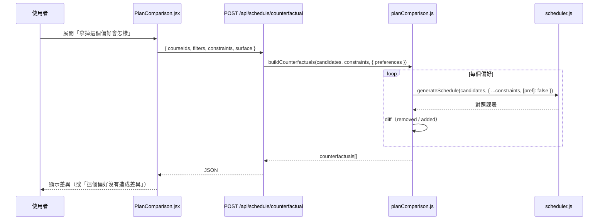
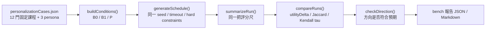

# 07 情境模擬

> 最後更新：2026-09-09

## 「情境模擬」在本專案的三種形態

本專案沒有單一叫做「情境模擬」的功能，而是三套用途不同的機制：

| 形態 | 面向 | 使用者可見？ | 程式位置 | 狀態 |
| --- | --- | :---: | --- | --- |
| **A. Counterfactual 反事實分析** | 「拿掉某個偏好，課表會怎樣？」 | ✅ 是 | `skills/planComparison.js`、`POST /api/schedule/counterfactual` | 已實作 |
| **B. 多方案比較** | 「同一份候選池，不同取向的課表」 | ✅ 是 | `skills/planStrategies.js` + `PlanSwitcher.jsx` | 已實作 |
| **C. 離線 persona 實驗** | 「個人化到底有沒有效？」 | ❌ 開發者用 | `skills/personalizationExperiment.js`、`skills/schedulerBenchmark.js` | 已實作 |

## A. Counterfactual（使用者可見）

**目的**：讓使用者理解「這個偏好實際上改變了什麼」，而不是只看到最終結果。

**啟動位置**：方案比較區（`components/Schedule/PlanComparison.jsx:80`）。

**輸入**：`{ courseIds, filters, constraints, surface }`。
**待確認**：目前兩個呼叫端都沒有傳 `courseIds`／`filters`（預設 `[]`／`{}`），
`constraints` 是前端寫死的 `{ maxCredits: 25, minCredits: 12 }`
（`DashboardPage.jsx:496-500`）。

**處理**：`buildCounterfactuals(candidateCourses, constraints, { preferences })`
對每個指定的 `preferenceId`（例如 `preferCompact`、`noEveningClasses`），
**關掉該偏好重跑一次排課**，比較兩份課表。

**輸出**：每個偏好一筆 `{ status, removed[], added[] }`，
`status` ∈ `changed`／`unchanged`／`not-applicable`。

**資料隔離**：✅ 完全隔離——只是用不同的 `constraints` 呼叫同一個純函式
`generateSchedule()`，**不寫回任何使用者資料**、不產生互動事件。

## B. 多方案比較（使用者可見）

同一次請求內產生 1~5 個 variant（見 `06-personalized-scheduling.md` 第 24 節），
每個 variant 只把**某一軸的權重乘 1.5 倍**，其餘不變。
方案間的差異由 `planMetrics`（學分、使用天數、早八數、偏好符合度）呈現。

方案塌縮時**必須說出原因**（`buildPlanDiversity()`／`describePlanCollapse()`）：
是候選池太小（等 `#13C` 外部規則），還是某個軸沒有訊號可用。

## C. 離線實驗（開發者用）

| 工具 | 指令 | 用途 |
| --- | --- | --- |
| `personalizationExperiment.js` | `npm run bench:personalization` | B0（無個人化）／B1（表單偏好）／P（學到的權重）三條 baseline + 五軸敏感度 sweep |
| `schedulerBenchmark.js` | `npm run bench:scheduler` | 7 個跨科系 case，五類情境（feasible／infeasible／greedy-trap／timeout／data-insufficient） |
| `goldenSetRunner.js` | `npm run eval:golden-set` | Agent 自然語言理解成績單 |

**資料隔離**：✅ 三者都不連 MySQL、不寫使用者資料，使用固定 fixture
（`test/fixtures/personalizationCases.json`、`schedulerBenchmarkCases.json`）
與固定 seed，可重現。

## 情境測試矩陣

| 情境 | 初始資料 | 使用者操作 | 系統處理 | 預期結果 | 支援狀態 | 對應測試 |
| --- | --- | --- | --- | --- | --- | --- |
| 避免早課 | 候選含第 1 節課 | 勾 `#不排早八` | `hardConstraintReason()` 排除 | 課表無第 1 節課 | **已實作** | `S7` |
| 避免晚課 | 候選含第 12 節後課 | 設 `noEveningClasses` | 硬性排除 | 無晚課 | **已實作（但無法儲存，見下）** | `N8` |
| 保留午休 | 候選含跨第 5 節課 | 勾 `#午休務必空出` | 硬性排除 | 午休空出 | **已實作** | `N9` |
| 指定 blocked periods | — | 設定避開時段 | 硬性排除 | 該時段無課 | **已實作** | `X13` |
| 星期一排空 | 候選含週一課 | 勾 `#星期一排空` | 硬性排除 | 週一無正式加選課 | **已實作** | `S8` |
| 必修優先 | 必修與選修同時段 | 自動排課 | `REQUIRED_COURSE_BONUS=5000` | 保留必修 | **已實作** | `S3` |
| 必修 vs blocked period 衝突 | 必修落在封鎖時段 | 自動排課 | 必修**不**豁免 `BLOCKED_PERIODS` | 必修被排除 | **已實作** | `X13` |
| 必修 vs 時段偏好衝突 | 必修落在早八 | 自動排課 | 正式必修**豁免**早八/午休/晚課 | 必修排入 + 揭露警告 | **已實作** | `X12` |
| 指定課程（非正式必修）vs 時段偏好 | `mustTakeCourseIds` 落在早八 | 自動排課 | **不**豁免 | 排不進去並回報 | **已實作** | `X14`、`S10` |
| 選修優先 | — | — | — | — | **未實作**（無此模式） | — |
| 通識優先 | — | — | — | — | **未實作**（`CATEGORY_PRIORITY` 固定，通識 priority 3） | — |
| 偏好涼課 | 候選有評價 | 勾 `#涼課優先` | easy 軸 +1 | 涼課排序較前 | **已實作** | `PS5`（`scoringPolicy.test.js`） |
| 挑戰難課 | 同上 | 勾 `#挑戰難課` | easy 軸 −1 | 反向排序 | **已實作** | `PS2`、`PD` 系列 |
| 兩個難度偏好同時勾 | — | 兩個都勾 | `resolveEasyDirection()` 回 `contradictory` | 視為未表態 + 警告 | **已實作** | `scoringPolicy.js:28` |
| 多偏好互相衝突（排不出來） | — | 設多個硬性偏好 | 放寬階梯（**需 opt-in**） | 依使用者指定順序逐步放寬 | **已實作（預設關閉）** | `X1`、`X2`、`X15`、`X16` |
| 共修課其中一門無法排入 | 正課可排、實習衝堂 | 自動排課 | `placeCourseWithCorequisite()` 原子性 | **整組都不排入** | **已實作** | `Z7` |
| 同名課程（不同班次） | 兩門同名不同 section | 自動排課 | `DUPLICATE_SECTION` | 只排一個班次 | **已實作** | `evaluateCoursePlacement()` |
| 同名課程（AI 回答混淆） | 同上 | 問 Agent | `courseReferenceResolver.js` 逐 candidate 一致性 | 不把 A 的教師配 B 的時間 | **已實作** | `F19`、`F20` |
| 多個 sections 嘗試 | 一門課多班次 | 自動排課 | 各自競爭，第一個排入後其餘排除 | 只有一個 | **已實作** | 同上 |
| 重修課程 | 歷史有不及格必修 | 自動排課 | `getFailedRequiredCourses()` | 自動優先排入 | **已實作** | `S4` |
| 重修課本學期沒開 | 同上但無開課 | 自動排課 | 檢查 `offeredRetakeCodes` | 警告「下學期記得重修」 | **已實作** | `scheduler.js:1585` |
| 找不到完整課表（真無解） | 必修互相衝堂 | 自動排課 | 完整搜尋後 | `infeasible` + `conflictSet` + 草稿 | **已實作** | `Z2` |
| 逾時但有合法 baseline | 大候選池 + 低 `maxNodes` | 自動排課 | fallback | 回傳已驗證的 greedy 結果，`fallbackUsed=true` | **已實作** | `Z3` |
| 逾時且無合法解 | 同上 | 自動排課 | 只放 `draftSchedule` | 正式 `schedule` 為空 | **已實作** | `Z4` |
| 候選資料不足 | 空候選池 | 自動排課 | — | `data-insufficient`（**不誤報 infeasible**） | **已實作** | `Z5` |
| 缺少偏好資料 | 未設定任何偏好 | 自動排課 | `hasExpressedPreference=false` | 改依總學分排序 + 警告 | **已實作** | `S14` |
| 缺少課程評論 | 無 `Course_Reviews` | 勾涼課偏好 | proxy 推估（`easinessSource: 'proxy'`） | 仍排得出不同課表，但不得宣稱「涼」 | **已實作** | `scheduler.js:519` |
| 評價覆蓋率過低 | 少數課有評價 | 自動排課 | `LOW_REVIEW_COVERAGE_RATIO=0.5` | 警告「涼度只由少數課推得」 | **已實作** | `scheduler.js:66` |
| 內容偏好訊號過弱/過強 | 命中率 <5% 或 >95% | 勾內容偏好 | 訊號檢查 | 警告「這項偏好幾乎不起作用」 | **已實作** | `N10`-`N13` |
| AI Agent 修改條件後重新排課 | 已有課表 | 對話要求調整 | Agent 帶新參數再呼叫 `run_csp_scheduler` | 新課表 | **已實作** | golden set 多輪 case |
| AI Agent 永久修改偏好 | — | 「以後都…」 | 兩段式確認 | 需明確同意才寫入 | **已實作** | `agentService.js:328` |
| 相同 seed 可重現 | — | 兩次相同輸入 | 固定 seed | 逐位元相同課程與探索統計 | **已實作** | `Z6` |

## 已知的情境缺口

| 情境 | 狀態 | 原因 |
| --- | --- | --- |
| 「選修優先」「通識優先」模式 | **未實作** | `CATEGORY_PRIORITY` 是固定表，沒有讓使用者反轉類別優先度的入口 |
| 先修條件檢查 | **規劃中** | `Courses.prerequisites` 3,086 筆全 NULL |
| 多學期模擬 | **規劃中** | roadmap `#8` 未開始 |
| **`noEveningClasses` 無法儲存** | **部分實作** | 排課引擎會執行、Agent 參數接受，但它**不在 `preferenceTags.js` 的 15 個標籤裡**，`extractTags()` 產不出它，`updateMysqlUserPreference()` 也沒有對應欄位——只能作為單次請求的暫時條件，重新整理後即失效。曾經送出此欄位的 `ProfileForm.jsx` 已於 2026-09-09 確認為死碼並刪除，目前唯一還會送這個欄位的呼叫端是 Agent（詳見 `11-known-limitations.md`） |
