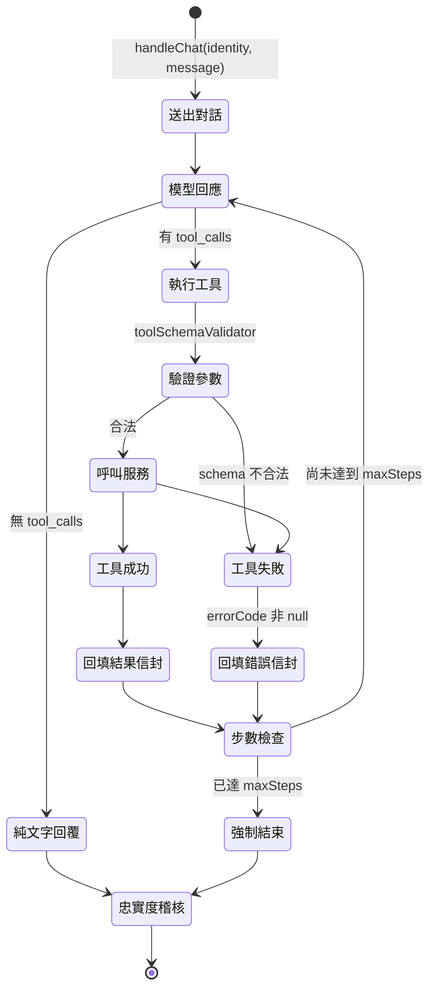
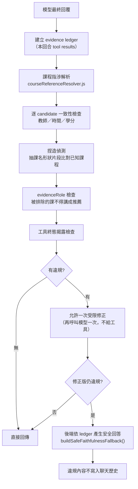

# 08 AI Agent

> 最後更新：2026-09-08
> 補充規範另見 `docs/PROMPT_DESIGN.md`、`docs/AI_AGENT_SPEC.md`。

## 定位

Agent **不是**在對話框裡另外做一套推薦，而是**自然語言到結構化排課參數的轉譯層**：
理解需求 → 呼叫既有的排課引擎 → 用受稽核的文字解釋結果。

| 面向 | 一般聊天機器人 | 傳統表單排課 | 本專案 Agent |
| --- | --- | --- | --- |
| 需求輸入 | 自由文字 | 固定欄位 | 自由文字 → 結構化參數（`interpretation` 回講） |
| 排課決策 | 模型自己編 | 引擎決定 | **引擎決定**，模型只負責呼叫與解釋 |
| 事實正確性 | 無保證 | N/A | 回答需通過 evidence ledger 稽核 |
| 永久性變更 | 直接改 | 表單送出 | **兩段式確認**才可寫入 |

## 模型與參數

| 項目 | 值 | 位置 |
| --- | --- | --- |
| SDK | `openai` npm 套件 | `agentService.js` |
| 模型 | `process.env.OPENAI_MODEL \|\| 'gpt-5.6-luna'` | `agentService.js:53-55` |
| `temperature` | **不送**（推理模型不吃這個參數） | `agentService.js:11` 註解 |
| API key | `process.env.OPENAI_API_KEY` | `agentService.js:44-45` |
| 最大步數 | `DEFAULT_MAX_STEPS = 12`，上限 `MAX_STEPS_CEILING = 20` | `agentService.js:57-66` |
| 步數覆寫 | `process.env.AGENT_MAX_STEPS`（超過 20 會被夾住） | `agentService.js:63-67` |

未設定 `OPENAI_API_KEY` 時回「伺服器未設定 OPENAI_API_KEY」——這是預期行為，不是故障。

## System Prompt

由 `buildSystemPrompt(userPrefs, context)` 組裝（`promptService.js:433`）。
**注入的使用者資料**包含偏好旗標、學籍 scope、最近一次推薦的 `requestId`。

Prompt 的核心行為規則（`promptService.js:476-545`，重點摘錄）：

1. **不得編造**課程、教師、時間、學分、評價或畢業規則。
2. 資料不足時**先說明缺什麼**，再查詢或請使用者補充。
3. 「關注」課程只用來追蹤，不可計入學分。
4. 工具結果一律包在同一信封 `{ schemaVersion, dataSource, term, warnings, errorCode, result }`；
   `errorCode` 非 null 代表**沒有成功，不得宣稱已完成**。
5. **兩段式確認**：`update_preferences`／`update_student_profile` 第一次呼叫只會提出
   `proposedChanges` 與 `confirmationToken`，必須向使用者說明並取得明確同意才可帶 token 再呼叫；
   **不得自行編造 token**。
6. **排課前理解回講**：呼叫 `run_csp_scheduler` 必須附 `interpretation`，
   分成「不可違反」「有彈性」「完全沒提到」三類；`notMentioned` 只列沒有資訊的部分，
   **不得自行假設答案**；`interpretation` 與實際參數不一致會被伺服器退回。
7. **偏好強度判讀**：語氣有彈性 → `allowRelaxation: true`；語氣強硬 → **整個省略該參數**
   並用 `nonNegotiablePreferenceIds` 指名。
8. **排課後必須詢問是否符合需求**；使用者一旦回饋，**那一回合第一個工具呼叫必須是
   `record_schedule_feedback`**——這個訊號沒有第二次機會。

## 工具總表

工具政策由 `agentToolRegistry.js:22-73` 的 allowlist 定義，
JSON Schema 由 `promptService.js:261-430` 的 `getAgentTools()` 定義。
`agentToolRegistry.test.js` 釘住兩處與 `executeAgentTool()` 的 switch 名稱集合一致。

| Tool | 用途 | renderable | writes | 兩段式確認 | 實作位置 |
| --- | --- | :---: | :---: | --- | --- |
| `query_course_db` | 查課程資料庫 | ✅ | ❌ | — | `agentService.js:377` executeAgentTool |
| `search_dcard_reviews` | 查課程評價 | ✅ | ❌ | — | 同上 |
| `get_easy_courses` | 查涼課清單 | ✅ | ❌ | — | 同上 |
| `update_preferences` | 更新偏好標籤 | ❌ | ✅ | `changeType: 'preferences'` | `runConfirmedWrite()` `agentService.js:328` |
| `update_student_profile` | 更新學籍 scope | ❌ | ✅ | `changeType: 'profile-scope'` | 同上 |
| `run_csp_scheduler` | 產生課表 | ✅ | ❌ | — | 呼叫 `scheduler.js` |
| `record_schedule_feedback` | 記錄課表回饋 | ❌ | ✅ | 無（只是確認訊息） | `scheduleFeedbackService.js` |

**`renderable` 的意義**：結果是否覆蓋回應信封的 `data`（畫面上顯示的課表）。
`update_preferences` 刻意設為 `false`——讓它覆蓋 `data` 會把畫面上已顯示的課表洗掉
（`agentToolRegistry.js:45-46` 註解）。

## Tool Execution Loop

**`operationKey`**（roadmap #41）：`toolName:sha256Hex(args).slice(0,16)`，
在 `agentService.js` 呼叫端計算後傳給 evidence ledger，
**只雜湊不記錄參數內容本身**（符合「工具參數已解析、內容不記錄」政策）。

### Tool 成功／失敗／重試處理表

| 情境 | ledger 判定 | 對使用者的回答 |
| --- | --- | --- |
| 單次成功 | terminal = success | 可宣稱完成 |
| 單次失敗 | terminal = failure | **必須揭露失敗**，否則觸發 `TOOL_FAILURE_NOT_DISCLOSED` |
| 同一 `operationKey` 先失敗後成功 | terminal = **success**（取終態） | 可宣稱完成，不得回報已被取代的舊錯誤 |
| 同工具不同 `operationKey`，一成一敗 | 各自獨立終態 | 失敗的那個仍須揭露 |
| 排課終態成功但 `solver.status` 非 solved | 視為**未完成** | 不得宣稱排課成功 |

此設計來自 roadmap #41 第一段，測試 F16-F18（`explanationFaithfulness.test.js`）。

## Faithfulness Validation

`explanationFaithfulness.js`（703 行）建立 **evidence ledger**：只收錄
**模型這一回合實際看過的 tool result**，不在事後另查新資料替模型背書。

### 違規代碼（18 種）

| 類別 | 代碼 |
| --- | --- |
| 課程事實 | `UNSUPPORTED_COURSE`、`COURSE_TEACHER_MISMATCH`、`COURSE_CREDITS_MISMATCH`、`COURSE_TIME_MISMATCH` |
| 評價 | `REVIEW_WITHOUT_EVIDENCE`、`PROXY_PRESENTED_AS_REVIEW`、`MISSING_REVIEW_UNCERTAINTY` |
| 資格與畢業 | `ELIGIBILITY_OVERCLAIM`、`GRADUATION_OVERCLAIM`、`GRADUATION_RULE_WITHOUT_EVIDENCE` |
| 偏好與理由 | `PREFERENCE_OVERCLAIM`、`RECOMMENDATION_REASON_REVERSED`、`MISSING_RECOMMENDATION_REASON` |
| 推薦角色 | `EXCLUDED_COURSE_PRESENTED_AS_RECOMMENDED` |
| 工具狀態 | `TOOL_FAILURE_NOT_DISCLOSED`、`TOOL_FAILURE_PRESENTED_AS_SUCCESS`、`MALFORMED_TOOL_RESULT` |
| 安全 | `SENSITIVE_SYSTEM_DISCLOSURE` |

（代碼字串位置：`explanationFaithfulness.js:297-580`）

### 稽核流程

**課程指涉解析**（`courseReferenceResolver.js`，roadmap #41 第二段）：
長名優先 + span masking + 右邊界檢查（防止「演算法導論」被誤判成已知的「演算法」）；
同名不同班次收成同一個 reference，依 sectionId／教師／時間依序收斂；
代名詞句（「這門課」）沿用前一句解析出的唯一候選。
**逐 candidate 一致性**——只要候選集合裡有任一真實 section 同時滿足整句話的所有主張才通過，
避免把 A 班次的教師與 B 班次的時間拼成一門現實不存在的課。

## 需求前置檢查

`requirementPreflight.js`（355 行）在排課**之前**偵測需求本身的矛盾，
例如「至少 25 學分但最多 15 學分」、系所無法解析（`scope: 'unresolved'`）、
`interpretation` 與實際參數不一致。測試代號 RP（含 RP14：chat 路徑的難度方向矛盾）。

## 對話上下文

- 聊天訊息加密存於 `Chat_Messages`（`ciphertext` + `iv` + `auth_tag` + `key_version`），
  帶 `expires_at` 保存期限。
- 身分與同意：`POST /api/chat` 受 `requireIdentity` 保護。
- **待確認**：送進模型的歷史訊息筆數上限，本次調查未逐行確認。

## 對話流程範例

> 以下 5 個範例僅使用系統實際具備的能力。

### 範例 1：一般排課

1. **使用者**：「幫我排課表，不要早八」
2. **Agent 判斷**：需要排課，且偵測到硬性時段偏好
3. **Tool call**：`run_csp_scheduler({ noMorningClasses: true, interpretation: { nonNegotiablePreferenceIds: ["NO_MORNING_CLASSES"], flexible: [], notMentioned: [...] } })`
4. **Tool result**：`{ schemaVersion:1, result: { success:true, plans:[...], totalCredits:15 } }`
5. **稽核**：課名／教師／學分逐一比對 ledger → 通過
6. **回覆**：說明課表 + 回講理解 + **詢問是否符合需求**

### 範例 2：模糊需求 → 先澄清

1. **使用者**：「幫我排課就好」
2. **Agent 判斷**：沒有任何偏好資訊，`hasExpressedPreference` 會是 false
3. **Tool call**：`run_csp_scheduler`（不自行假設偏好）
4. **Tool result**：含 `hasExpressedPreference: false` 警告
5. **稽核**：通過
6. **回覆**：呈現課表 + 主動詢問興趣與偏好
   （由 golden set 的 `no-invented-constraints` case 釘住：**不得自行假設不要早八**）

### 範例 3：永久變更 → 兩段式確認

1. **使用者**：「以後都幫我排集中一點」
2. **Agent 判斷**：這是永久偏好變更
3. **Tool call（第一次）**：`update_preferences({ preferCompact: true })`（不帶 token）
4. **Tool result**：`{ proposedChanges: {...}, confirmationToken: "..." }`（**尚未寫入**）
5. **回覆**：用中文說明要改什麼並詢問
6. 使用者說「好」→ **Tool call（第二次）**：帶 `confirmationToken` → 才真正寫入

### 範例 4：工具失敗

1. **使用者**：「這門課的評價如何？」
2. **Tool call**：`search_dcard_reviews({ courseName: "..." })`
3. **Tool result**：`{ errorCode: "...", result: { error: "..." } }`
4. **稽核**：若回覆宣稱查到評價 → `TOOL_FAILURE_PRESENTED_AS_SUCCESS`
5. **回覆**：誠實說明查詢失敗，不編造評價

### 範例 5：課表回饋

1. **使用者**：「第三門課時間不行」
2. **Agent 判斷**：這是回饋訊號，**必須先記錄**
3. **Tool call（第一個）**：`record_schedule_feedback({ requestId, rejectedCourses:[{ sectionId, reason:'time' }] })`
4. **Tool result**：確認訊息
5. 才可再呼叫 `run_csp_scheduler` 重排
6. **回覆**：說明已記錄並提供新方案

## Golden Set 評估

| 項目 | 內容 | 位置 |
| --- | --- | --- |
| 執行器 | `goldenSetRunner.js`（`npm test` 與 `npm run eval:golden-set` 共用） | `services/goldenSetRunner.js` |
| 斷言原語 | `expectTool`／`absent`／`clarify`／`refuse`／`interpretation` | `goldenSetAssertions.js` |
| 題庫 | 13 題單輪 + 2 題多輪 | `test/fixtures/agentGoldenSet.json`、`agentGoldenSetMultiTurn.json` |
| 重試語意 | 肯定式斷言：N 次中任一次通過即可；**否定式斷言（`absent`／`clarify`／`refuse`）必須 N 次全過** | roadmap #34 修法 |
| 指標 | `pass@1` vs `pass@3`（pass@3 因重試接近 100%，會蓋掉回歸） | `scripts/agentGoldenSetReport.js` |
| 版本追蹤 | 解析後的 model id（非請求別名）+ `sha256Hex({systemPrompt, tools})` | 同上 |
| Schema 硬閘門 | `toolSchemaValidator.js` 逐 case 硬性驗證（非百分比指標） | `services/toolSchemaValidator.js` |

**這個檔案會真的呼叫模型**，是 `npm test` 裡唯一會連外網、消耗 API 額度的測試，
也是唯一有已知間歇性失敗的測試（見 `11-known-limitations.md`）。

## Prompt Injection 與濫用風險

已有的保護：
- Tool allowlist（`agentToolRegistry.js`），模型無法呼叫未登記的工具。
- 非法課程 id 過濾（roadmap #25 的 `watchingCourseIds` 過濾）。
- `SENSITIVE_SYSTEM_DISCLOSURE` 違規碼會擋下洩漏系統祕密字串的回答。
- 兩段式確認讓「被誘導寫入」需要使用者親自同意。
- 瀏覽器實測（roadmap #37）：要求假教師、9 學分、假評價與祕密值時，
  audit 攔截並修正，畫面沒有輸出指定的假資料。

**待確認**：是否有針對「使用者訊息中夾帶指令覆寫 system prompt」的專門測試。
