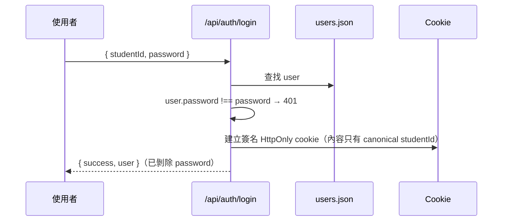

# 09 Privacy 與安全

> 最後更新：2026-09-08
> 政策全文另見 `docs/CHANGE_REPORTS/2026-08-22-interaction-data-privacy.md`（roadmap #33）。

## 三種同意用途

| 用途 id | 說明 | 必要？ | 未同意的後果 |
| --- | --- | :---: | --- |
| `service_processing` | 提供核心服務所需的處理 | ✅ 必要 | 受保護 API 回 `428 CONSENT_REQUIRED` |
| `personalization_learning` | 從互動行為學習偏好 | ❌ 選填 | 互動事件**不寫入**（`200 recorded:false`），不學習權重 |
| `aggregate_research` | 匿名彙總研究 | ❌ 選填 | 不納入研究資料 |

（`routes/privacy.js`、`PrivacyPage.jsx:10-12`）

## 登入、登出與 Session

- 密碼比對：`routes/auth.js:21`（**明碼比對**，見 `11-known-limitations.md`）。
- 回應一律用 `const { password: _, ...userProfile } = user` 剝除密碼
  （`routes/auth.js:25, 47`）。
- Session secret：`process.env.SESSION_SECRET`；**未設定時使用本次程序的暫時密鑰**
  並發出警告（實測啟動 log：「未設定 SESSION_SECRET，已使用本次程序的暫時密鑰；
  後端重啟後所有登入 session 會失效」）。
- Cookie 屬性：`HttpOnly`、`SameSite=Lax`、簽名；**待確認**：`Secure` 旗標是否
  依 `NODE_ENV` 切換，本次未逐行確認。

## Middleware 與狀態碼

| Middleware | 檢查 | 失敗狀態碼 |
| --- | --- | --- |
| `requireIdentity` | session 是否存在、request 學號是否與 session 相符 | `401`（未登入）／`403`（冒用他人學號） |
| `requireServiceConsent` | `service_processing` 是否已同意最新版政策 | `428 CONSENT_REQUIRED` |

`428` 的觸發流程：使用者已登入但**未同意最新版**必要條款 →
前端 `AuthContext` 讀 `GET /privacy/consents` 的 `requiresAction` → 導向 `/privacy`。

## 假名化（Pseudonymization）

**所有行為資料都不存學號**。canonical `userId` 在寫入前一律換成 HMAC `subject_id`：

- 衍生函式：`deriveSubjectId()`（`interactionEventService.js`）
- 金鑰環境變數：`PRIVACY_DATA_KEY_V`（名稱；值不得寫入文件或版控）
- `Interaction_Events` 表**沒有任何學號欄位**（roadmap #2 對抗式審查的要求）
- 讀回時才在記憶體中還原成 canonical `userId`（`rowToEvent(row, canonicalId)`）

受此保護的表：`Interaction_Events`、`Learned_Preference_Weights`、`Chat_Messages`、
`Privacy_Consents`、`Privacy_Audit_Log`、`Privacy_Data_Requests`——
全部以 `subject_id` 為 FK 指向 `Privacy_Subject_State`。

## Raw Chat 加密

`Chat_Messages` 存的是密文，不是明文：

| 欄位 | 用途 |
| --- | --- |
| `ciphertext` | MEDIUMTEXT，加密後的訊息 |
| `iv` | 初始化向量 |
| `auth_tag` | 驗證標籤（AEAD） |
| `key_version` | 金鑰版本，支援輪替 |
| `expires_at` | 保存期限 |

**待確認**：具體加密演算法（推測為 AES-GCM，本次未逐行確認）。

## 資料保留

保存期限常數集中在 `PRIVACY_RETENTION`：

| 資料 | 天數 |
| --- | ---: |
| 互動事件 | **180**（`preferenceLearning.js:38` 註解引用） |
| Raw Chat | **待確認**（`PrivacyPage.jsx` 讀 `retention.rawChatDays` 顯示給使用者） |
| 學到的權重 | 由 `expires_at` 控制，**天數待確認** |

`Interaction_Events` 與 `Chat_Messages` 都有 `idx_*_expiry (expires_at)` 索引，
供清理 job 使用（`npm run cleanup:privacy`）。

**時間衰減與保存期限的關係**（`preferenceLearning.js:36-39`）：
半衰期 120 天搭配 180 天保存上限，衰減係數被夾在 `[0.354, 1]`——
事件在被衰減壓到接近零之前就已因保存期限被刪除，
因此整套機制是**有界的重新加權，不是抹除**。

## Privacy Center 功能

| 功能 | API | 行為 |
| --- | --- | --- |
| 查看政策 | `GET /privacy/policy` | 版本、三種用途說明、保存天數 |
| 查看同意 | `GET /privacy/consents` | 三個用途的 `granted` 狀態 + `requiresAction` |
| 更新同意 | `PUT /privacy/consents` | append 新的同意紀錄（**不覆寫舊紀錄**） |
| 匯出個資 | `GET /privacy/export` | Profile + 已存課表 + 隱私狀態 + 互動事件 + 學到的權重 |
| 清除聊天 | `DELETE /privacy/chat` | 刪 `Chat_Messages`，回 `deletedCount` |
| 重設個人化 | `DELETE /privacy/personalization` | 刪學到的權重**與**作為其輸入的互動事件；`profilePreserved: true` |
| 刪除個資（兩段式） | `POST /privacy/deletion-intents` → `DELETE /privacy/data` | 建立 token → 帶 `{ requestId, token, confirmationPhrase }` 執行 |

**匯出明確排除的內容**（`routes/privacy.js:103`）：
`password`、internal subject ID、Raw Chat 明文、model thought、research event rows。

## 撤回同意的連帶效果

撤回 `personalization_learning` 時，**已學到的權重與互動事件都會被刪除**——
不是只停止未來蒐集。由 `privacyRoutes.test.js` 的 `PL23` 釘住
（透過 service 讀取路徑確認真的消失，不只信刪除回報的數字）。

## 一致性與 Race Condition 防護

- 同意檢查在 `insertEvent()` 的**同一個交易內**，並對 `Privacy_Subject_State`
  該列加鎖後才寫入（`interactionEventService.js:228`）——
  避免「檢查時已同意、寫入時已撤回」的競態。
- 互動事件的唯一鍵 `(subject_id, idempotency_key)` 保證重送不重複；
  同 key 不同內容回 `conflict` **不靜默覆寫**。
- 前端多處有 `accountGenerationRef` 世代檢查（`ScheduleContext.jsx:207, 224, 285, 320`），
  防止「請求送出後、回應回來前切換帳號」導致資料寫到錯的人身上
  （roadmap #28 補齊了 `saveCurrentSchedule` 原本缺少的那一處）。

## 現有安全保護總結

| 保護 | 狀態 |
| --- | --- |
| Session 簽名 cookie、HttpOnly | ✅ |
| 跨帳號存取阻擋（401/403） | ✅（`accountIsolation.test.js` 雙帳號驗收） |
| 行為資料假名化 | ✅ |
| 聊天加密 + 金鑰版本 | ✅ |
| 同意閘門（428） | ✅ |
| 匯出／刪除權 | ✅ |
| Rate limiting | ✅（`rateLimiter.test.js` 存在） |
| Agent tool allowlist | ✅ |
| 回答忠實度稽核（防洩漏系統祕密） | ✅（`SENSITIVE_SYSTEM_DISCLOSURE`） |

## 尚未完成的政策或功能

| 項目 | 狀態 | 說明 |
| --- | --- | --- |
| 密碼雜湊 | **未實作** | `users.json` 存明碼，`routes/auth.js:21` 直接字串比對 |
| 正式環境 secret 管理 | **規劃中** | roadmap `#39`，目前只有本機 `.env` |
| HTTPS／Secure cookie | **規劃中** | 尚未部署 |
| 研究資料匯出 | **待確認** | `aggregate_research` 同意用途存在，但實際匯出管線本次未確認 |
| 最小 cohort size | 部分 | `retention.researchMinimumCohortSize` 有回傳給前端，實際強制執行點**待確認** |
