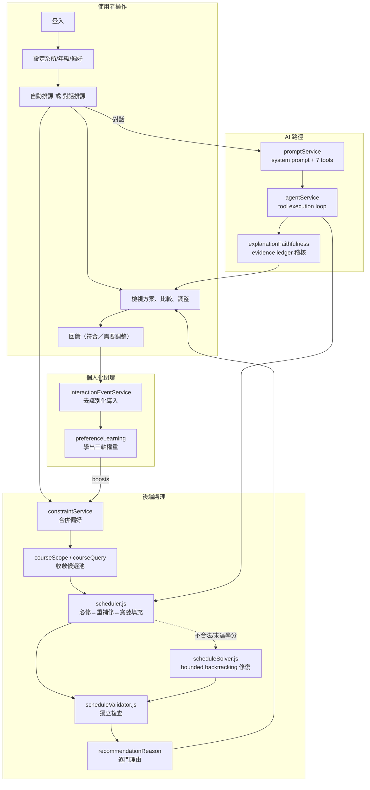

# 專案功能與工程流程說明文件

> 給第一次接觸本專案的開發者、指導教授或評審。
> 所有現況描述以**實際程式碼**為主要依據，既有文件僅作輔助來源。
> 最後更新：2026-09-09

## 專案簡介

**課表規劃助手（Smart Schedule Planner）**——以限制滿足排課引擎為核心、
用個人化偏好權重排序、並可用自然語言對話操作的大學選課規劃系統。

- **前端**：React 19 + Vite（純 JavaScript，無 TypeScript）
- **後端**：Node.js + Express 5（ESM）
- **資料庫**：共用 MySQL（Aiven）
- **AI**：OpenAI API（原生 tool calling，7 個工具）
- **測試**：`node:test`，56 個測試檔、1046 個測試

## 閱讀順序

**趕時間的話**：01 → 02 → 06 → 08 → 11 就能掌握全貌。
**★ 標記**的兩份是工程細節最深的核心文件。

## 各文件用途

| 文件 | 內容 | 適合誰 |
| --- | --- | --- |
| [01 專案定位](./01-project-positioning.md) | 問題、目標使用者、輸入輸出、MVP 與非目標 | 所有人 |
| [02 系統架構](./02-system-architecture.md) | 技術分層、模組依賴、排課請求 sequence diagram | 開發者 |
| [03 功能與使用者流程](./03-features-and-user-flows.md) | 全功能盤點表（含狀態標記）、5 條核心流程 | 所有人 |
| [04 資料模型](./04-data-model.md) | ER Diagram、逐表欄位、儲存層差異、欄位轉換對照 | 開發者 |
| [05 API 參考](./05-api-reference.md) | 32 支 API 總表、重要 API 的 JSON 範例、一致性檢查 | 開發者 |
| [06 個人化排課](./06-personalized-scheduling.md) ★ | **完整評分公式與常數**、hard/soft 對照、搜尋策略、計算案例 | 開發者、評審 |
| [07 情境模擬](./07-scenario-simulation.md) | Counterfactual、多方案、離線實驗；**30 項情境測試矩陣** | 開發者、評審 |
| [08 AI Agent](./08-ai-agent.md) ★ | 模型參數、system prompt 規則、7 個工具、忠實度稽核、5 個對話範例 | 開發者、評審 |
| [09 Privacy 與安全](./09-privacy-and-security.md) | 三種同意、假名化、加密、保留政策、race condition 防護 | 開發者、評審 |
| [10 測試與部署](./10-testing-and-deployment.md) | 測試盤點、CI、環境變數（僅名稱）、migration | 開發者 |
| [11 已知限制與風險](./11-known-limitations.md) | 28 項問題表（含嚴重度與證據位置） | 所有人 |

## 系統整體流程圖

## 各模組完成狀態摘要

| 模組 | 狀態 | 說明 |
| --- | --- | --- |
| 登入與身分隔離 | ✅ **已實作** | 雙帳號實測無交叉；密碼為明碼（見 11-#1） |
| Profile 與偏好設定 | ✅ **已實作** | 15 個標籤存於單一欄位；死碼 `/profile` 舊表單已刪除，改在四個頁面選單提供「個人資料設定」導向 `/setup`（11-#3，已處理） |
| 課程搜尋 | ✅ **已實作** | 依系所／年級／班級收斂 |
| **排課引擎** | ✅ **已實作** | 8 種 hard constraint、貪婪 + repair、獨立驗證、五類情境 benchmark |
| 先修條件 | 🚧 **規劃中** | 資料庫 3,086 筆全 NULL |
| 多方案比較 | ✅ **已實作** | 1~5 個方案 + 塌縮原因說明 |
| Counterfactual | ✅ **已實作** | 「拿掉某偏好會怎樣」 |
| 推薦理由 | ✅ **已實作** | `selectedBecause` + 分數組成 + 落選者 |
| **AI Agent** | ✅ **已實作** | 7 個工具、兩段式確認、理解回講 |
| **回答忠實度稽核** | ✅ **已實作** | 18 種違規碼、一次受限修正、安全 fallback |
| 互動事件記錄 | ✅ **已實作** | 假名化寫入、idempotency |
| 偏好學習 | ✅ **已實作** | 三軸權重、冷啟動、時間衰減、資料不足 fail-open |
| 個人化效果證明 | 🟡 **部分實作** | 離線 runner 完成；真實使用者效果待 `#38` |
| 畢業進度 | 🟡 **部分實作** | 114 學年度規則完成；112/113 版本缺資料 |
| 課表儲存 | 🟡 **部分實作** | 功能可用但**只存 JSON 檔，無 MySQL 表** |
| 隱私中心 | ✅ **已實作** | 三種同意、匯出、刪除、重設個人化 |
| 協同過濾 | 🚧 **規劃中** | 卡真實跨使用者樣本 |
| 多學期規劃 | 🚧 **規劃中** | 卡先修資料 |
| 正式部署 | 🚧 **規劃中** | 卡部署平台決定 |
| 前端／E2E 測試 | ❌ **未實作** | 0 個測試檔，靠人工瀏覽器驗收 |

## 與既有文件的關係

本套文件**不取代**既有文件，而是提供一個整合入口：

| 既有文件 | 關係 |
| --- | --- |
| `docs/API_SPEC.md`（1231 行） | 05 是摘要與一致性檢查，完整欄位規格看它 |
| `docs/DATA_SCHEMA.md`（730 行） | 04 補充了它未列的欄位與儲存層差異 |
| `docs/SCHEDULING_LOGIC.md`（843 行） | 06 深入到公式與常數層級 |
| `docs/TEST_PLAN.md`（1093 行） | 10 是盤點摘要，逐案例看它 |
| `docs/PROMPT_DESIGN.md`（624 行） | 08 補充 tool loop 與稽核流程 |
| `docs/DECISIONS.md`（971 行） | 設計決策的 ADR 紀錄 |
| `docs/CHANGE_REPORTS/2026-08-01-personalization-roadmap.md` | 任務狀態與外部阻塞的**唯一權威來源** |

## 狀態標記說明

| 標記 | 意義 |
| --- | --- |
| `已實作` | 能從程式碼確認完整流程 |
| `部分實作` | 已有部分程式，流程尚未完整 |
| `規劃中` | 只存在於 roadmap、文件、TODO 或設計構想 |
| `未使用` | 有程式碼，但目前沒有被實際流程呼叫 |
| `待確認` | 現有資料不足以判定 |
| `文件與程式不一致` | 文件描述與實際程式行為不同 |
