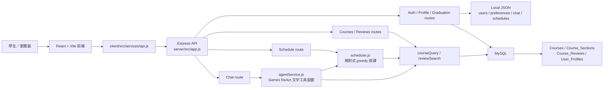
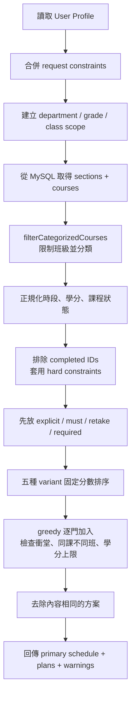

# Executive Summary

本報告以 2026-08-07 的 repository `main` 分支（commit `f1dc3d5`）為查核基準，判斷依據不是 README 或畫面是否存在，而是實際閱讀前後端程式、查詢目前 MySQL、檢查本機 JSON 持久化、執行 API 與測試，並在瀏覽器操作會觸發核心功能的情境。整體判斷是：**系統已具備可展示的課程查詢、規則式排課、課程評價查詢、學分摘要與聊天助理程式骨架，但尚未達到「推薦正確、資料一致、可穩定展示」的完成狀態。**目前較接近「後端核心原型基本完成，個人化、學分正確性與整合可靠度仍在開發中」。

目前真正可運作的核心成果包括：React 前端已建立登入、初始設定、Dashboard、課程搜尋、課表與畢業檢查頁面；Express 後端已提供 authentication、profile、courses、schedule、reviews、graduation 與 chat routes；MySQL 中實際有 3,086 筆課程、3,560 筆開課班別與 181 筆彙整評價；排課器會處理多時段衝堂、學分上限、必修優先、明確指定課程、關注課程不占時段，以及五種排序策略。後端自動測試共 48 個 suites、238 項測試全部通過，前端 lint 與 build 也通過。

然而，這些成果目前仍有四類高優先問題。第一，前端 API 位址固定為 `localhost:3001`，但目前後端環境預設啟動於 `27151`；使用標準啟動流程時 Dashboard 會連線失敗，錯誤資料又缺少 `unscheduled` 欄位，最後造成 React 畫面崩潰。第二，示範使用者雖然有 53 筆歷史修課紀錄，排課器實際取得的 `completedCourseIds` 卻是空陣列，因此無法可靠排除已修課程。第三，畢業學分規則是靜態 JavaScript 資料而非校方規則資料庫，推薦只取同系第一門未完成課程；實測甚至把 0 學分的「班級活動」顯示成通識推薦，而 API 失敗時前端會顯示虛構的學分、課程及評語。第四，登入只是比對 tracked JSON 中的明文密碼，沒有 session、token 或 API 授權隔離；若系統離開本機展示環境，會形成嚴重的帳號與資料風險。

個人化推薦目前屬於固定規則 heuristic，而不是機器學習模型或完整 constraint satisfaction solver。五個方案透過固定分數與 greedy insertion 產生；興趣以課名、教師、標籤等文字是否包含關鍵字計分，「涼課」則以課程文字中是否出現「容易、高分、涼」等字詞判斷，沒有使用 `Course_Reviews` 的統計值。實際示範帳號的候選池只有 16 門同班或合班課程，五個策略最後只得到 2 個不同方案，且前端沒有多方案並排比較介面。

下一階段最重要的三件事是：

1. **先修正正確性與可啟動性**：統一前後端 API port、補齊 Dashboard error state、移除畢業頁虛構 fallback，並建立正式學分建議規則。
2. **建立單一使用者與修課資料來源**：統一 student ID、numeric user ID、MySQL profile 與本機 JSON，將歷史修課轉成可跨學期比對的正式課程代碼後送入排課器。
3. **讓個人化真的影響候選與排名**：擴大合法候選課程範圍、修正搜尋欄位、把評價統計與偏好權重納入排序，並提供多方案差異比較。

若上述項目完成，下一次可向教授實際展示：同一位學生在「有／無歷史修課」、「偏好輕鬆／偏好集中」、「明確指定／未指定課程」下得到可解釋且不同的課表；系統能證明不推薦已修課、不產生衝堂、不以不相關或 0 學分課程補畢業缺口；並能用自動測試與瀏覽器 A/B 畫面支持推薦結果，而不只展示 UI。

# 個人化課表規劃推薦系統－專題進度報告

> - 報告日期：2026-08-07
> - 查核版本：`main` / `f1dc3d5`
> - 查核範圍：repository、實際 MySQL schema 與資料、local JSON、API、前後端串接、排課與推薦邏輯、自動測試及瀏覽器操作。
> - 判斷原則：以下「目前事實」只採用可由程式或實測支持的內容；未呼叫外部 Gemini 服務、未執行寫入型 API、無正式校方規則佐證的項目，均明確標示限制或無法確認。

## 1. 專題摘要

本專題試圖解決資工系學生選課時需要同時處理多種資訊的問題：學生必須知道哪些課程屬於必修、選修或系外選修，核對已修與未修學分，避開衝堂，考量年級、班級、時間與個人偏好，還要閱讀零散的課程評價。一般課表系統多半只提供課程搜尋與手動排課，本系統的目標則是將這些資訊整合成多個可比較、可解釋的候選課表。

主要使用者是需要規劃當學期課程與畢業進度的資訊工程相關科系學生。核心價值不是單純畫出時間表，而是：

- 依使用者的科系、年級、班級及修課歷史限制候選課程。
- 依必修優先、時間限制、學分上下限和明確指定課程產生合法課表。
- 將興趣、課程負擔、集中排課等偏好反映在不同方案中。
- 同時呈現畢業學分缺口與選課建議，降低人工交叉核對成本。

目前 repository 已完成上述目標的多數介面與後端原型，但和一般課表系統真正形成差異的部分——**可靠的個人化、修課歷史排除、畢業規則正確性、多方案比較與資料一致性**——仍未完成到可宣稱穩定可用的程度。

## 2. 系統目標

依照實際程式與正式規格文件，可整理出下列工程與專題研究目標：

1. 建立可維護的課程與開課班別資料層，支援班級、教師、時段、學分、類別與評價查詢。
2. 建立使用者 Profile，保存科系、年級、班級、已修課程、時間限制、學分目標與選課偏好。
3. 依學生 scope 與官方學年度規則過濾可選課程，區分必修、核心選修、一般選修、通識及系外選修；通識領域不以課號前綴猜測。
4. 在不衝堂及學分限制下，自動產生多個候選課表。
5. 將關注、加選、重補修與明確選課等不同狀態正確納入排課規則。
6. 將課程評價和個人偏好轉成可說明的排序依據。
7. 計算畢業學分完成度，指出可驗證的學分缺口與補足方向。
8. 透過 AI Chat assistant 把自然語言需求轉成課程查詢、偏好更新或排課工具呼叫。
9. 建立不同科系、年級、班級、偏好和 edge case 的驗證資料，量化推薦正確性與方案差異。
10. 形成可供專題展示的完整流程：登入、設定、搜尋、排課、方案比較、學分檢查與推薦理由。

其中第 1、3、4 項已有可執行基礎；第 2、5 項部分完成；第 6、7、8、9、10 項仍是後續專題品質的主要工作。

## 3. 系統架構

### 3.1 Repository 結構

- `client/`：React 19 + Vite 前端，頁面、共用元件、contexts 與集中式 API client。
- `server/`：Node.js + Express 5 後端，包含 routes、services、排課／查詢 skills、MySQL adapter 與 local JSON adapter。
- `server/data/`：登入帳號、使用者偏好、聊天紀錄及已儲存課表的 JSON 持久化資料。
- `docs/`：API、資料格式、排課規則、AI prompt 與測試規格。
- `report/`：專題報告及展示素材。

### 3.2 實際執行架構

### 3.3 各模組責任

| 層級 | 主要責任 | 實際程式位置 |
|---|---|---|
| Frontend routing | 保護頁面、登入後導向、Dashboard／搜尋／課表／畢業頁路由 | `client/src/App.jsx` |
| Frontend state | 登入使用者與 setup 狀態、主題狀態 | `client/src/contexts/AuthContext.jsx`、`client/src/contexts/ThemeContext.jsx` |
| API client | 統一包裝 auth、profile、courses、schedule、reviews、graduation、chat requests | `client/src/services/api.js` |
| Express entry | CORS、JSON parser、route 掛載與 health check | `server/src/app.js` |
| Routes | 解析 HTTP 輸入並呼叫 database、service 或 skill | `server/src/routes/*.js` |
| Data adapter | MySQL 查詢、row mapping、JSON 讀寫與 hybrid profile persistence | `server/src/db/database.js`、`server/src/db/mysql.js` |
| Course scope | 解析系所、學制、年級、班級與合班範圍 | `server/src/skills/courseScope.js` |
| Course classification | 必修／核心選修／一般選修／系外選修分類 | `server/src/skills/courseCategory.js`、`server/src/data/csCurriculum.js` |
| Recommendation / scheduling | 正規化限制、候選排序、衝堂檢查、greedy 產生五種方案 | `server/src/skills/scheduler.js` |
| AI orchestration | Prompt、Gemini 呼叫、文字格式 tool-call parser 與工具 dispatch | `server/src/services/agentService.js`、`server/src/services/promptService.js` |

架構上的主要限制是資料層並非單一來源：課程與評價主要在 MySQL，登入、聊天及儲存課表在 JSON，Profile 又可能因 user ID 型態而落入 MySQL 或 JSON。這使同一位學生的身分、偏好與歷史修課可能來自不同紀錄。

## 4. 系統主要使用流程

### 4.1 目前實際流程

1. **登入**
   `LoginPage.jsx` 經 `authAPI.login` 呼叫 `POST /api/auth/login`。後端 `server/src/routes/auth.js` 從 `server/data/users.json` 尋找 student ID 並直接比對密碼。成功後，`AuthContext.jsx` 把使用者與 setup 狀態保存在瀏覽器 localStorage；後端沒有建立 session 或 token。

2. **Onboarding 與 Profile 設定**
   `OnboardingPage.jsx` 引導使用者前往 `SetupPage.jsx`。Setup 儲存科系、年級、班級、偏好標籤與勾選的已修課程，呼叫 `POST /api/profile/:userId`。`memoryService.getUserPreferences()` 及 `database.js` 決定資料從 MySQL `User_Profiles` 或 local `user_preferences.json` 取得。

3. **搜尋課程**
   `SearchPage.jsx` 呼叫 `/api/courses`。後端 `courses.js` 交由 `courseQuery.js` 查詢 MySQL，並用 `courseScope.js`、`courseCategory.js` 解析 scope 與課程類別。一般班級搜尋實測可得到 16 筆候選；條件搜尋因語言欄位不一致而會得到 0 筆。

4. **設定偏好與產生課表**
   Dashboard 從 localStorage 讀取 `fcu_initial_prefs`，呼叫 `POST /api/schedule/generate`。Route 先讀 Profile、合併 request constraints，再由 `searchCoursesForSchedule()` 建立候選課程，最後呼叫 `scheduler.generateSchedules()`。

5. **查看推薦結果**
   `DashboardPage.jsx` 或 `SchedulePage.jsx` 以 `ScheduleGrid.jsx` 顯示一份主要課表。後端雖回傳 `plans`，前端沒有提供五方案的並排比較、差異原因或方案切換；實測五種策略只保留兩個 unique plans。

6. **畢業學分檢查**
   `GraduationPage.jsx` 呼叫 `GET /api/graduation/:studentId`。後端將 `users.json` 內預先保存的 `completedCredits`、`earnedCredits` 與 `graduationRequirements.js` 靜態門檻相減，再選取第一門同系、未在 `completedCourseIds` 的課程作為建議。這不是逐門課程重新核算，也不是完整畢業審核。

7. **AI Chat assistant**
   Dashboard 的聊天流程會帶 student ID 呼叫 `/api/chat`；`SchedulePage` 內的 `ChatPanel.jsx` 則呼叫 `chatAPI.send(msg)` 而未傳入目前使用者 ID。後端 `agentService.js` 要求 Gemini 產生特定文字格式的 `[ToolCall]` JSON，再手動 dispatch 課程查詢、評價、排課與偏好更新工具。

### 4.2 與目標流程的差距

- 使用者在 Setup 儲存失敗時仍會被標記為 setup 完成並導回首頁，因此畫面流程成功不代表 Profile 已持久化。
- `ProfilePage.jsx` 與 `ProfileForm.jsx` 存在，但 `App.jsx` 沒有 `/profile` route；實測直接進入 `/profile` 會被 wildcard route 導回首頁。
- 已儲存課表 API 存在，但目前前端沒有呼叫 save／list saved schedules 的完整流程。
- 畢業頁部分「加入課表」、「查看課程詳情」和 watchlist 操作只有介面，沒有對應 handler 或資料更新。

## 5. 資料庫與資料流

### 5.1 實際 MySQL schema 與資料量

本次以 read-only query 檢查目前 `server/.env` 指向的 MySQL，共有四張主要資料表：

| 資料表 | 筆數 | 主要欄位 | 實際用途 |
|---|---:|---|---|
| `Courses` | 3,086 | `course_id`、`name`、`credits`、`type`、`dept`、`subid3` | 課程主檔與正式課程代碼 |
| `Course_Sections` | 3,560 | `section_id`、`selection_code`、`course_id`、`teacher`、`room`、`time_str`、`time_bitmask`、`year`、`semester`、`rag_context`、`rag_tag` | 當學期開課班別、教師與時段 |
| `Course_Reviews` | 181 | `selection_code`、`content`、`sweetness`、`coolness`、`value`、`overall`、`review_count`、`workload`、來源欄位 | 課程評價彙整與統計 |
| `User_Profiles` | 1 | `user_id`、`department`、`grade_level`、`preference_tags`、`avoid_time`、`completed_courses`、`max_credits` | numeric user ID 的個人偏好 |

目前所有 3,560 筆 sections 都屬於 114 學年度下學期。資料完整性觀察如下：

- `subid3`、`selection_code` 及 `time_str` 未發現空值。
- 87 筆 section 缺教師、153 筆缺教室。
- 217 筆 `time_str` 含 `00`，需要確認是否代表未定時段或特殊時段。
- `current_amount` 全部為 0，因此目前無法用於容量或熱門程度判斷。
- 181 筆評價都能 join 到 section，但只覆蓋 181 / 3,560，約 **5.08%** 的開課班別。
- 181 筆評價的 `workload` 全部等於 `coolness`，高度疑似匯入或欄位 mapping 錯誤，不能直接當作兩個獨立維度使用。

### 5.2 Local JSON 持久化

| 檔案 | 用途 | 目前風險 |
|---|---|---|
| `server/data/users.json` | 登入帳號、學生基本資料、歷史課程、學分摘要、watchlist | 含明文密碼及個人資料，且已納入 Git tracking |
| `server/data/user_preferences.json` | 非 numeric user ID 的 Profile 與偏好 | 與 MySQL `User_Profiles` 形成兩套來源 |
| `server/data/chat_history.json` | AI 對話紀錄 | 目前有 100 筆紀錄並納入 Git tracking，可能含個人需求 |
| `server/data/saved_schedules.json` | 儲存課表 | 有 API，但未發現前端完整使用流程 |

`database.js` 使用同步 JSON read／rewrite 寫入，沒有 file lock、atomic replace 或 transaction。單人展示可能可用，但多請求同時更新時有覆蓋或毀損風險。

### 5.3 使用者 Profile 與歷史修課資料流

目前示範使用者在 `users.json` 有 53 筆歷史修課，`completedCredits` 為 118；但同一 student ID 在 `user_preferences.json` 的 `completedCourseIds` 是空陣列。排課 route 透過 `memoryService.getUserPreferences()` 取得後者，而不會把 `users.json` 的 `courseHistory` 或 `completedCourseCodes` 正規化後合併進排課限制。

此外，歷史課程使用的正式課程代碼，和 scheduler 用來排除的 term-specific numeric `section_id` 並不是同一識別方式。即使把 ID 陣列填入，也可能因不同學期 section ID 改變而失效。正確資料流應以穩定的 `subid3`／正式課程代碼判斷是否已修，再映射到當學期所有 sections。

### 5.4 畢業要求資料

畢業門檻不在 MySQL table，而是 `server/src/data/graduationRequirements.js` 的靜態 JavaScript mapping，部分規則本身標示需要確認。後端直接使用 `users.json` 中預先彙整的 `earnedCredits` 和 `completedCredits`，沒有由目前 `courseHistory` 逐筆分類重算，也未處理先修、抵免、重修、跨系認列、通識領域與課程版本等規則。因此目前可視為「學分摘要展示」，不能視為正式畢業資格審核。

### 5.5 Schema 可重現性

repository 中的 `server/src/db/schema.sql` 是舊式 SQLite 語法與小寫 table 設計，和目前實際 MySQL 的四張表不一致，也沒有可重建現況的 migration。新環境無法只依 repository 重建相同資料庫，這是專題交付與測試可重現性的缺口。

## 6. 個人化課表推薦流程

### 6.1 實際演算法流程

依 `server/src/routes/schedule.js`、`server/src/skills/courseQuery.js` 與 `server/src/skills/scheduler.js`，目前流程如下：

具體步驟為：

1. `schedule.js` 讀取 Profile，將 Profile 與 request body 的 constraints 合併。
2. `buildStudentScope()` 依 department、grade、className 建立學生範圍。
3. `searchCoursesForSchedule()` 從 MySQL 取得課程，交給 `filterCategorizedCourses()`。
4. `courseScope.js` 解析班級名稱的系所、學制、年級與甲乙班；同班或明確合班的必修可納入，其他 scope 外必修會被排除。
5. `scheduler.js` 正規化課程與多個 `timeBlocks`，建立 watched、explicit、must、retake、required、optional 等集合。
6. `hardConstraintReason()` 處理避免時段、星期限制、早八、午休與多個課程型態偏好。
7. 明確指定、重補修及學生必修先插入，optional courses 再依方案分數排序。
8. 每加入一門課時檢查時間衝突、同一 `subid3` 的不同 section、學分上限及系外選修限制。
9. 產生 `required_first`、`compact`、`easy_score`、`interest`、`max_credits` 五個 variants。
10. 用課程集合去除相同方案，第一個方案作為主要 `schedule` 回傳。

### 6.2 目前屬於 heuristic / rule-based，而非 CSP

目前沒有搜尋整個解空間、回溯、MRV variable ordering、constraint propagation 或最佳化 solver。核心是先排序、再逐門嘗試加入的 greedy heuristic。這可以快速產生結果，也適合作為專題初版 baseline，但不能保證：

- 找到滿足所有需求的解，即使其他選課組合其實存在。
- 找到偏好總分最高的全域最佳解。
- 五種策略一定產生五個有實質差異的方案。
- 必修先選後不會阻塞更好的整體組合。

因此 README 或未使用畫面中提到的 CSP、backtracking、MRV，不應作為目前已完成成果對外宣稱。

### 6.3 個人化實際使用程度

- **興趣偏好**：在課名、代碼、教師、系所、分類、描述、track 與 `ragTag` 中做關鍵字 substring match，命中後給固定分數。
- **輕鬆／高分偏好**：檢查課程文字是否含「涼、容易、高分」等字詞，沒有使用 `Course_Reviews.sweetness`、`coolness`、`workload` 或 `overall`。
- **集中排課**：對已使用星期給予額外分數，偏向把後續課程放在相同天。
- **時間偏好**：部分原本應是 soft preference 的條件，在 `hardConstraintReason()` 被當成硬性排除；這可能連必修也排除掉。
- **偏好權重**：主要是布林值與固定常數，沒有根據使用者回饋學習，也沒有顯示每門推薦的可解釋分數明細。

### 6.4 Candidate scope 限制

除非使用者明確指定「系外選修」類別，`filterCategorizedCourses()` 會把結果限制在目前 exact class 或合班範圍。實測示範使用者只有 16 門候選，其中必修 3、核心選修 4、一般選修 9。這使自動排課看不到大量合法的跨班、跨年級、共同選修或通識候選，也會降低多方案差異。

目前只有資工課程有較完整 curriculum mapping；一般教育資料在 `generalEducation.js` 中被標示 unavailable，其他科系也缺少同等分類規則。因此「支援不同科系」尚未完成。

### 6.5 實測推薦結果

在將後端暫時以 port 3001 啟動後，示範帳號的 schedule API 可成功回傳：

- 候選課程：16 門。
- 主要課表：9 門、25 學分。
- 五種 variant 去重後：2 個方案。
- `hasExpressedPreference`：示範 student ID 對應的 Profile 為 false。
- 興趣 preference score：未觀察到有效區分。

這證明排課 pipeline 可執行，但不能證明結果已充分個人化，也不能證明已正確排除歷史修課。

## 7. 目前開發進度

狀態定義：✅ 代表已有實測且未發現阻斷問題；🟡 代表主要路徑可執行但仍有重要缺口；🟠 代表已有部分程式或介面、尚不能視為完整功能；🔴 代表核心要求尚未完成或目前會造成嚴重錯誤；⚪ 代表本次 repository 檢查無法驗證。完成度僅是粗略工程估計，不代表研究品質或正式驗收比例。

| 模組 | 狀態 | 約略完成度 | 已完成內容 | 尚缺內容 | 主要程式位置 |
|---|---|---:|---|---|---|
| 登入與前端 route guard | 🟠 開發中 | 約 45% | 登入頁、使用者 context、protected route 可運作 | 無 session/token、無 API 授權、明文密碼、setup flag 非 user-scoped | `client/src/contexts/AuthContext.jsx`、`server/src/routes/auth.js` |
| User Profile / Setup | 🟠 開發中 | 約 45% | 可輸入科系、年級、班級與偏好並呼叫 API | 兩套身分來源、歷史課程未合併、回填不完整、儲存失敗仍導向成功 | `client/src/pages/SetupPage.jsx`、`server/src/routes/profile.js`、`memoryService.js` |
| MySQL 課程資料層 | 🟡 基本完成 / 待修正 | 約 75% | 3,086 courses、3,560 sections，可 join、解析時段與映射欄位 | 無 migration、無當期查詢條件、教師／教室缺值、容量全為 0 | `server/src/db/database.js`、`server/src/db/mysql.js` |
| 課程 scope 與分類 | 🟡 基本完成 / 待修正 | 約 65% | 資工班級、年級、必修／核心／一般／系外分類已有規則 | exact-class 過窄、其他科系與通識未完成、部分欄位語意混用 | `courseScope.js`、`courseCategory.js`、`csCurriculum.js` |
| 課程搜尋 | 🟡 基本完成 / 待修正 | 約 60% | 班級查詢、關鍵字、教師、時段等 API 與 UI 已存在 | 預設語言造成 0 筆、選課代號欄位不一致、僅提供平日 UI | `SearchPage.jsx`、`courseQuery.js`、`routes/courses.js` |
| 衝堂與規則式排課 | 🟡 基本完成 / 待修正 | 約 65% | 多時段衝突、學分上限、必修優先、explicit／watch／retake 狀態與五 variants | 已修排除資料錯誤、candidate 過窄、soft constraints 被硬排除、無全域最佳解 | `server/src/skills/scheduler.js` |
| 個人化推薦排序 | 🟠 開發中 | 約 35% | 有興趣、集中、輕鬆與最大學分等固定策略 | 未使用評價統計、偏好資料漂移、無權重學習、無推薦理由分數 | `scheduler.js`、`constraintService.js` |
| 多方案產生與比較 | 🟠 開發中 | 約 40% | 後端可產生並去重多個 plans | 實測僅 2 個 unique plans；前端只顯示主方案，無 A/B 比較 | `scheduler.js`、`DashboardPage.jsx`、`SchedulePage.jsx` |
| 課程評價 | 🟠 開發中 | 約 45% | 181 筆評價可查詢、彙整與列出涼課 | 覆蓋率約 5.08%、workload 疑似錯置、未進入 scheduler、前端課程詳情未整合 | `reviewSearch.js`、`reviewStats.js`、`routes/reviews.js` |
| 畢業學分檢查 | 🟠 開發中 | 約 35% | 能顯示預先彙整的總學分與分類缺口 | 非逐課核算、靜態規則未驗證、建議類別錯誤、錯誤 fallback 虛構資料 | `routes/graduation.js`、`graduationRequirements.js`、`GraduationPage.jsx` |
| AI Chat assistant 程式路徑 | 🟠 開發中 | 約 40% | Prompt、Gemini client、文字 tool-call parser 與多個工具 dispatch 已存在 | 未做本次 live Gemini 驗證、parser 脆弱、候選 scope 可能和工具參數不一致、使用者 ID 漏傳 | `agentService.js`、`promptService.js`、`ChatPanel.jsx` |
| Gemini 外部服務現況 | ⚪ 無法確認 | 無法估計 | repository 有設定入口與既有聊天紀錄 | 本次未發出付費／外部寫入請求，無法證明目前 key、quota、模型與回應格式可用 | `server/src/services/agentService.js` |
| Watchlist / saved schedules | 🟠 開發中 | 約 30% | 後端 JSON 與部分 routes 存在，部分頁面能顯示 watchlist | 多個按鈕無 handler、前端未串完整 save/list 流程、無一致狀態模型 | `routes/auth.js`、`routes/schedule.js`、`GraduationPage.jsx` |
| Error handling | 🔴 尚未完成 | 約 25% | 多數 route 有個別 try/catch 與錯誤訊息 | 無中央 error handler／404、Dashboard error state 會 crash、部分 fallback 誤導 | `server/src/app.js`、`DashboardPage.jsx`、`GraduationPage.jsx` |
| Automated testing | 🟡 基本完成 / 待修正 | 約 65% | 238 項後端／邏輯／DB contract tests 通過 | 無前端 component tests、正式 API E2E、auth/security、concurrency 與持續 browser tests | `server/test/**/*.test.js`、`docs/TEST_PLAN.md` |
| Demo / deployment stability | 🔴 尚未完成 | 約 25% | 前後端各自可啟動，修正 port 後核心頁面可載入 | 預設 port 不一致、API URL hard-coded、無 production config 驗證 | `client/src/services/api.js`、`server/src/app.js`、`.claude/launch.json` |

## 8. 已完成成果

以下只列出本次由程式與實測支持、使用者目前確實能完成的操作；仍有條件或限制者一併標示。

- 使用者可以使用 JSON 中已存在的 student ID 與密碼登入，前端會保存登入狀態並保護主要頁面；但這不等於已完成安全認證。
- 使用者可以在 Setup 輸入資工系年級、班級與多個偏好，成功時後端會保存 Profile；但不同 ID 型態會進入不同儲存位置。
- 使用者可以依目前班級查詢 MySQL 課程，看到課名、教師、學分、時段和分類；示範班級實測可回傳 16 筆。
- 使用者可以手動選擇課程並呼叫排課 API；後端會避免同時段課程並限制學分上限。
- 系統能將關注課程分開呈現而不占正式衝堂，並把明確加選、重補修與必修排在一般選修之前。
- 系統能處理一門課多個時段，而不是只比較第一個時段。
- 系統能以五種固定策略嘗試產生方案，並移除課程集合完全相同的重複方案。
- 使用者可以查詢已有的課程評價統計及涼課清單；目前資料覆蓋範圍有限。
- 使用者可以看到 `users.json` 中預先彙整的 118 / 128 學分與分類缺口；目前不能當作正式畢業資格結果。
- 在前後端 port 對齊後，Dashboard 實測可顯示 9 門、25 學分課表；schedule API 可回傳 2 個不同方案。
- 後端核心規則與資料 mapping 具備相當數量的自動測試：48 suites、238 tests 全部通過。

## 9. 目前已知問題

### P0-1：預設啟動無法串接，且錯誤處理使 Dashboard 崩潰

- **問題：** 前端固定呼叫 `http://localhost:3001/api`，目前 `server/.env` 的後端卻預設啟動於 27151。實際用 repository 標準開發流程啟動時，Dashboard API request 失敗，接著 React 因讀取不存在的 `scheduleNotice.unscheduled.length` 而崩潰。
- **原因：** `client/src/services/api.js` 第 1 行硬編碼 port；`DashboardPage.jsx` 的 catch 建立 `warnings`、`excluded`，卻沒有建立 render 必需的 `unscheduled`。
- **影響：** 在目前環境無法完成核心 Demo；錯誤狀態不是顯示提示，而是整頁中斷。
- **相關程式：** `client/src/services/api.js`、`client/src/pages/DashboardPage.jsx` 的排課 catch 與 notice render、`server/src/app.js`。
- **建議處理方式：** 以 Vite environment variable 或同源 proxy 管理 API base；統一 `.env.example`、launch config 與實際 port；建立固定形狀的 notice model 並加 error boundary／失敗 UI 測試。

### P0-2：歷史修課沒有可靠進入 scheduler，可能推薦已修課

- **問題：** 示範使用者有 53 筆歷史修課，但 scheduler 取得的 `completedCourseIds` 為空。
- **原因：** 歷史資料在 `users.json.courseHistory`／`completedCourseCodes`，排課偏好則從 `user_preferences.json` 或 MySQL `User_Profiles` 讀取；`memoryService.getUserPreferences()` 沒有合併兩者。scheduler 又以 numeric section IDs 排除，而歷史資料是穩定課程代碼。
- **影響：** 系統可能推薦學生已通過的課，直接破壞推薦正確性與畢業規劃可信度。
- **相關程式：** `server/src/services/memoryService.js`、`server/src/routes/schedule.js`、`server/src/skills/scheduler.js` 的 `completedIds` 處理、`server/data/users.json`、`server/data/user_preferences.json`。
- **建議處理方式：** 建立 canonical user ID；以 `subid3`／正式課程代碼儲存完成紀錄；在 candidate preparation 排除該代碼的所有當期 sections；建立「同課不同學期 section ID」回歸測試。

### P0-3：畢業頁會顯示錯誤或虛構的學分建議

- **問題：** 後端只取同系第一門未完成課程作為建議，前端又將任何 suggestion 以「通識推薦」樣式呈現。實測建議為 0 學分的「班級活動」。當 API 失敗時，前端會顯示硬編碼的 107 / 128 學分、缺課、課程名稱與評語。
- **原因：** `routes/graduation.js` 沒有根據實際 gap 類別、學分與畢業認列規則篩選；`GraduationPage.jsx` catch 使用 mockup fallback，而非錯誤狀態。
- **影響：** 可能讓學生誤以為某課可補足通識或畢業學分，屬學業決策錯誤；教授 Demo 也會誤判資料是真實運算結果。
- **相關程式：** `server/src/routes/graduation.js` 的 recommendations 建立、`server/src/data/graduationRequirements.js`、`client/src/pages/GraduationPage.jsx` 的 fallback data。
- **建議處理方式：** 立即移除虛構 fallback；將「無法取得資料」明確呈現；以 gap category 驗證課程類別與可認列學分，排除 0 學分活動；在校方規則未驗證前加上「試算／待人工確認」標示。

### P0-4：帳號、API 授權與個人資料不適合對外部署

- **問題：** 密碼以明文保存在 tracked JSON，登入後沒有 server-side session/token；profile、graduation、watchlist 等 API 可直接用任意 user ID 讀寫。聊天紀錄和個人資料也被納入 Git tracking。
- **原因：** 目前 authentication 只在 `auth.js` 做字串比對，Express 沒有 authentication middleware 或 authorization ownership check。
- **影響：** 一旦部署或讓多位受試者使用，可能發生帳號冒用、資料越權存取、密碼與對話外洩。若限定本機單人 Demo，仍需明確說明此限制。
- **相關程式：** `server/src/routes/auth.js`、`server/src/routes/profile.js`、`server/src/routes/graduation.js`、`server/data/users.json`、`server/data/chat_history.json`、`server/src/app.js`。
- **建議處理方式：** 密碼雜湊、加入 session/JWT 與 auth middleware、所有 user-scoped routes 做 ownership check；移除真實／可識別資料並停止 tracking runtime JSON，改用 anonymized fixture。

### P1-1：MySQL、JSON 與瀏覽器 localStorage 形成三套 Profile 狀態

- **問題：** numeric user ID 使用 MySQL `User_Profiles`，student ID 使用 JSON，Dashboard 又從 `fcu_initial_prefs` localStorage 讀偏好；三處可互相覆蓋或不同步。
- **原因：** `database.js` 依 user ID 型態選擇持久化；前端沒有單一 rehydrate／save 流程，Setup 和 Dashboard 各自組 request。
- **影響：** 同一學生在不同頁面、重新登入或重新設定後，可能得到不同排課限制，難以解釋推薦因果。
- **相關程式：** `server/src/db/database.js`、`memoryService.js`、`SetupPage.jsx`、`DashboardPage.jsx`、`AuthContext.jsx`。
- **建議處理方式：** 選定單一 Profile store 與 canonical key；後端回傳 versioned Profile；所有頁面只從同一 API 初始化並保存；加入跨頁面一致性 E2E。

### P1-2：條件搜尋的預設語言會把所有課程篩掉

- **問題：** 條件搜尋初始值是 `中文 (Chinese)`，後端以 `course.language` 比對，但 MySQL mapping 沒有 `language` 欄位。瀏覽器 A/B 實測：一般班級搜尋 16 筆，打開條件搜尋使用預設值後為 0 筆。
- **原因：** 前端 filter schema 和後端 course model 不一致。
- **影響：** 使用者會誤以為沒有符合課程，課程搜尋核心功能在常見操作下失效。
- **相關程式：** `client/src/pages/SearchPage.jsx` 的 `condForm.language`、`server/src/skills/courseQuery.js` 的 `applyCommonFilters()`。
- **建議處理方式：** 在資料庫有可信 language 欄位前，預設為「全部」並停用不存在的條件；建立 shared request schema 與 search contract test。

### P1-3：自動排課 candidate scope 過窄

- **問題：** 非明確系外選修時，候選多數被限制為 exact class／合班；通識及其他可選範圍未納入。
- **原因：** `filterCategorizedCourses()` 同時負責搜尋頁分類與 scheduler candidate filtering，預設採嚴格班級 scope。
- **影響：** 漏掉合法選修，學分可能排不滿，五方案相似，也無法充分利用興趣或評價排序。
- **相關程式：** `server/src/skills/courseQuery.js` 的 `filterCategorizedCourses()`、`server/src/skills/courseScope.js`、`generalEducation.js`。
- **建議處理方式：** 把「可搜尋」、「可加選」、「學生必修」三種 scope 分開；依正式選課規則納入開放選修、通識與跨班課程，並保留 scope reason 供 UI 解釋。

### P1-4：課程評價沒有進入推薦排名，且資料品質可疑

- **問題：** scheduler 的 easy score 只看文字關鍵字；181 筆 reviews 沒有與 candidate ranking 結合。所有 `workload` 又恰好等於 `coolness`。
- **原因：** 課程 query 對 scheduler 未附上可用的 review aggregate；easy heuristic 直接檢查描述與 RAG 文字；評價匯入 mapping 缺少品質檢查。
- **影響：** 系統宣稱的「依評價個人化」目前無法由演算法證明，且錯誤欄位可能導致相反推薦。
- **相關程式：** `server/src/skills/scheduler.js` 的 easy／preference scoring、`reviewSearch.js`、`reviewStats.js`、`Course_Reviews`。
- **建議處理方式：** 先追查 workload 來源；建立 selection code／course code aggregation；設定最少 review count 與可信度；將 review score、資料量和缺值策略納入可解釋 ranking。

### P1-5：多方案只在後端部分存在，使用者無法比較

- **問題：** 後端定義五個 variants，但實測去重後只剩兩個，前端只顯示 primary schedule。
- **原因：** candidate pool 小、各方案固定分數不足以改變排序；`DashboardPage.jsx`／`SchedulePage.jsx` 沒有 plans comparison state 與 UI。
- **影響：** 未達專題「多個可比較推薦課表」的核心差異，教授也無法看到偏好造成的方案變化。
- **相關程式：** `server/src/skills/scheduler.js` 的 variants、`uniquePlans` 與 `buildPlan()`；`DashboardPage.jsx`、`SchedulePage.jsx`。
- **建議處理方式：** 設計方案目標與差異門檻；前端顯示學分、上課天數、早八、評價、偏好命中與差異課程；若方案重複，回傳重複原因而不是暗示有五份結果。

### P1-6：部分 soft preference 被當成 hard constraint

- **問題：** 早八、午休、考試或報告型態等偏好，部分由 `hardConstraintReason()` 直接排除課程。
- **原因：** constraints 沒有一致區分 must／avoid／prefer，UI 標籤與 scheduler 語意未完全對齊。
- **影響：** 使用者只是「偏好不要」時，系統可能把唯一必修或必要選修刪除，導致無解或缺學分。
- **相關程式：** `server/src/skills/scheduler.js` 的 `hardConstraintReason()`、`server/src/services/constraintService.js`、`SetupPage.jsx`。
- **建議處理方式：** 建立 constraint schema：hard、soft、weight、relaxable；必修衝突時回傳清楚警告並允許 soft constraint 逐級放寬。

### P1-7：Setup 儲存失敗仍被標記完成，重新進入也可能清掉偏好

- **問題：** `SetupPage.jsx` catch 仍呼叫 `markSetupDone()` 並 navigate；表單沒有完整回填既有 selected tags／completed checkboxes，重新送出可能覆蓋原值。
- **原因：** UI 流程狀態和 API 成功狀態沒有綁定，initial state 與 persisted Profile schema 不完整同步。
- **影響：** 使用者以為設定成功，實際推薦仍用舊值或空值；重新設定可能造成資料遺失。
- **相關程式：** `client/src/pages/SetupPage.jsx`、`AuthContext.jsx`、`server/src/routes/profile.js`。
- **建議處理方式：** API 失敗時留在原頁並顯示 retry；完整 rehydrate Profile；以 dirty state／version 防止意外覆寫。

### P1-8：AI scheduler 的候選 scope 可能和使用者新限制不同

- **問題：** `agentService.js` 先用已儲存的 `studentScope` 查候選，再把 Agent tool arguments 合併成 constraints。若使用者在對話中修正 department／grade，候選仍可能來自舊 scope。
- **原因：** candidate search 與 scheduler constraint 使用兩次不同來源的 scope；Prompt tool schema 也沒有完整 className 資訊。
- **影響：** AI 回覆可能聲稱依新條件排課，實際卻使用舊班級課程。
- **相關程式：** `server/src/services/agentService.js` 的 `run_csp_scheduler` dispatch、`promptService.js`、`courseQuery.js`。
- **建議處理方式：** 合併並驗證完整 Profile 後只建立一次 scope；工具回傳 scope summary；缺 className 時要求補充，不允許默默沿用矛盾資料。

### P1-9：目前 query 沒有固定學年學期條件

- **問題：** 現有資料剛好全部是 114 下學期，但 course query 沒有明確指定 current year／semester。
- **原因：** adapter 直接讀取所有 sections，依賴資料庫只保留單一學期。
- **影響：** 未來匯入多學期後，搜尋與排課可能混用舊課、重複 sections 或產生不存在的時間表。
- **相關程式：** `server/src/db/database.js` 的 course query、`server/src/skills/courseQuery.js`。
- **建議處理方式：** 建立 active term 設定與資料欄位索引；所有課程、評價與排課 requests 必須帶 term；加入跨學期 fixture。

### P2-1：選課代號與 course ID 欄位語意不一致

- **問題：** 搜尋 UI 的「選課代號」送出 `code`，而 mapped `course.code` 主要來自 `Courses.course_id`，實際選課代號是 `selectionCode`。
- **原因：** API model 同時存在 course ID、正式課程代碼、section ID、selection code，命名未統一。
- **影響：** 使用者用選課代號精確搜尋時可能找不到課；歷史課程 mapping 也容易使用錯 ID。
- **相關程式：** `SearchPage.jsx`、`database.js` 的 row mapping、`courseQuery.js`。
- **建議處理方式：** 定義並文件化 `courseCode`、`sectionId`、`selectionCode`、`catalogCode/subid3`，前後端全面使用一致名稱。

### P2-2：SchedulePage Chat 使用預設 user ID

- **問題：** `ChatPanel.jsx` 只呼叫 `chatAPI.send(msg)`，沒有傳入登入使用者；Dashboard 的另一條聊天路徑則有帶 student ID。
- **原因：** Chat component 沒有接收 user context，兩個聊天入口實作分離。
- **影響：** 對話歷史、偏好更新與 AI 排課可能寫到 `default` 使用者，造成個人化錯置。
- **相關程式：** `client/src/components/Chat/ChatPanel.jsx`、`SchedulePage.jsx`、`client/src/services/api.js`。
- **建議處理方式：** ChatPanel 直接使用 `useAuth()` 或要求 caller 傳入 user ID；後端從認證 context 取得使用者，不接受任意 client user ID。

### P2-3：課表統計未一致納入時間未定課程

- **問題：** 後端可能把時間未定課程列在 `unscheduledCourses`，但前端門數／學分只統計 grid schedule；SchedulePage 又沒有完整保留該清單。
- **原因：** API response 的 total 定義與畫面統計來源不一致。
- **影響：** 畫面總學分可能和 API 或選課清單不同，使用者難以理解時間未定課程是否已被選入。
- **相關程式：** `scheduler.js` response、`DashboardPage.jsx`、`SchedulePage.jsx`。
- **建議處理方式：** 明確區分 selected、scheduled、time-pending 三種統計，並在所有頁面一致顯示。

### P2-4：未使用／遺留程式提高誤判與維護成本

- **問題：** `HomePage.jsx`、`ProfilePage.jsx`、`Navbar.jsx`、`ProfileForm.jsx` 部分或完全不在目前 route；`testFunc.js`、`testFunc3.js` 是獨立 Gemini 實驗；`schema.sql` 與現況不符；client README 仍是 Vite 範本。
- **原因：** 原型演進後未整理 legacy entry points 與文件。
- **影響：** 開發者可能修改未使用畫面、誤信舊演算法描述或使用錯 schema；教授閱讀 repository 時也難以辨認正式流程。
- **相關程式：** 上述檔案及 `client/src/App.jsx`。
- **建議處理方式：** 建立 active／deprecated 清單；刪除或移入 experiments；更新 README 與 architecture decision record。刪除前須確認展示素材與歷史用途。

Repository 全域搜尋沒有找到字面上的 `TODO` 或 `FIXME` 標記；但這不代表沒有未完成工作。上述不可達頁面、無 handler 按鈕、空的 `getAgentTools()`、舊 schema 及未串接 API，都是由實際控制流和資料流判定的未完成或遺留項目，不能因為沒有 TODO 註解而視為完成。

### P2-5：缺值、容量與 UI 範圍尚未完整處理

- **問題：** 87 筆 section 無教師、153 筆無教室、容量全為 0；搜尋 UI 只提供週一至週五，資料模型與課表 grid 則可表示週末。
- **原因：** 資料來源不完整，前端選項未依實際資料模型產生。
- **影響：** 無法完成容量風險判斷，週末課搜尋不完整，畫面需清楚區分「未知」而非顯示錯誤值。
- **相關程式：** MySQL `Course_Sections`、`SearchPage.jsx`、`ScheduleGrid.jsx`、`utils/courseTime.js`。
- **建議處理方式：** 制定 null／unknown 顯示規則；確認 `current_amount` 資料來源；搜尋條件由 period utility 動態產生。

## 10. 尚未完成項目

### Recommendation correctness

- [ ] 統一 API port/config，修正 Dashboard error state 與全站 error boundary。
- [ ] 以正式課程代碼排除已完成課程的所有 sections。
- [ ] 將 hard constraint、soft preference、可放寬條件拆成明確 schema。
- [ ] 建立 active term filter，防止跨學期資料混排。
- [ ] 建立「必修優先但仍可找到可行解」測試，評估 greedy 失敗時的 fallback 或 bounded search。
- [ ] 對 explicit selected course 定義清楚：僅排指定課，或指定後自動補滿課表，並測試不被其他排序覆蓋。

### Personalization

- [ ] 建立單一 canonical Profile，移除 MySQL／JSON／localStorage 三套偏好漂移。
- [ ] 把課程評價 aggregate、review count 與可信度加入推薦分數。
- [ ] 擴大合法 candidate scope，分開必修 scope、可選 scope 與搜尋 scope。
- [ ] 為興趣、集中、輕鬆、時間與學分目標建立可調權重。
- [ ] 回傳每門課的推薦理由、命中偏好、扣分原因與資料來源。
- [ ] 設計使用者回饋機制，記錄接受／移除課程而非只依固定布林標籤。

### Database

- [ ] 建立與實際 MySQL 一致的 migrations／schema 與 anonymized fixtures。
- [ ] 統一 user ID、course code、section ID、selection code 命名及 foreign keys。
- [ ] 驗證 `Course_Reviews.workload` 與 `coolness` 的匯入 mapping。
- [ ] 補上 term、language、capacity 等欄位的來源與缺值策略。
- [ ] 將 runtime account、chat、preference、schedule persistence 移出 tracked JSON。
- [ ] 若暫時保留 JSON，改用 atomic write／lock 並處理 malformed data。

### Graduation requirements

- [ ] 向系辦或正式課規來源確認各入學年度、系所及學制的畢業門檻。
- [ ] 由逐門歷史課程重新分類計算學分，而不是只讀預先彙整數字。
- [ ] 處理重修、停修、抵免、轉學生、跨系認列、0 學分活動與通識領域。
- [ ] 讓推薦課程必須能證明補足特定 gap，並顯示「可認列依據」。
- [ ] 移除所有虛構 fallback，失敗時只顯示無法計算及缺少資料。

### Testing

- [ ] 建立前端 component tests：error state、空結果、方案比較、Profile 回填。
- [ ] 建立 API integration tests：登入後 Profile → search → schedule → graduation 完整流程。
- [ ] 建立不同科系、年級、班級、偏好、無 Profile、衝堂、必修／選修 fixtures。
- [ ] 建立 explicit selection、已修課排除、soft constraint 放寬與跨學期測試。
- [ ] 建立 MySQL／Profile／local state 一致性測試。
- [ ] 把瀏覽器 A/B 驗證納入固定驗收腳本與展示前 checklist。
- [ ] 建立 authentication、authorization、JSON concurrency 與敏感資料掃描測試。

### UI / Integration

- [ ] 讓 API base 使用環境設定，建立可一鍵啟動的 demo configuration。
- [ ] 修正條件搜尋語言與選課代號欄位。
- [ ] 提供多方案切換與並排比較，顯示方案差異指標。
- [ ] 串接課程詳情與評價統計，不只顯示靜態卡片。
- [ ] 完成 watchlist、加入課表、課程詳情與 saved schedules 的 handlers。
- [ ] 補上 `/profile` route 或移除無法到達的入口。
- [ ] 統一 Dashboard 與 SchedulePage 的 chat、user ID 與 schedule response handling。

### AI / Chat

- [ ] 改用結構化／native tool calling，避免用 regex 解析自由文字 `[ToolCall]`。
- [ ] 驗證 Gemini model、quota、timeout、錯誤重試與無 key 狀態。
- [ ] 讓候選查詢與 scheduler 使用同一份已驗證 scope。
- [ ] 避免 log／chat persistence 保存密碼、完整 Profile 或不必要的個人資料。
- [ ] 建立 prompt injection、無資料不編造、錯誤工具參數與工具迴圈上限測試。

## 11. 下一階段開發計畫

### Phase 1 — 系統正確性

優先處理會使系統無法展示、產生錯誤推薦或提供錯誤學業資訊的問題：

1. 統一前後端 port 與 API configuration，修正所有 error state。
2. 移除畢業頁 mock fallback，暫停未經規則驗證的課程建議。
3. 建立 canonical user/profile/history model，以正式課程代碼排除已修課。
4. 修正條件搜尋 language 與 selection code schema。
5. 加入 active term，清理跨資料來源 ID 語意。
6. 完成 security baseline：密碼雜湊、認證 middleware、資料去識別化。

**階段完成定義：** 使用標準啟動指令可完成登入到排課；API 失敗不 crash、不顯示假資料；已修課與衝堂測試均能證明正確排除。

### Phase 2 — 個人化推薦品質

1. 定義合法 candidate universe，而不是只取 exact class。
2. 將 preference 分成 hard／soft／weight，建立可放寬策略。
3. 驗證並整合 Course Reviews，建立資料量與可信度權重。
4. 讓五種方案具有清楚目標、差異門檻及推薦理由。
5. 前端提供方案比較、課程差異和偏好命中說明。
6. 以 baseline greedy 對照改良 heuristic 或 bounded search，記錄可行率、執行時間和偏好分數。

**階段完成定義：** 同一候選集改變偏好時，方案差異可重複、可解釋；評價資料不足時不會假裝有評價依據。

### Phase 3 — 系統驗證

建立至少下列測試矩陣，每個 case 同時驗證候選 scope、衝堂、學分、必修、已修排除與推薦理由：

- 不同科系：有完整規則科系、無規則科系。
- 不同年級：低年級、高年級、延畢或跨年級修課。
- 不同班級：甲／乙班、合班、外班開放課程。
- 不同偏好：集中、避早八、重視評價、重視興趣、無偏好。
- explicit selected course：正常、衝堂、超學分、scope 外、時間未定。
- 無 Profile 使用者：要求補資料，不建立假 scope。
- 衝堂：單一時段、多時段、週末、時間未定。
- 必修／選修：必修和 soft preference 衝突、選修補學分、系外限制。
- 歷史修課：相同課程不同 section ID、重修、未通過、抵免。

驗證結果應保存成固定 fixture、API response snapshot、瀏覽器 screenshot 與問題紀錄，避免只靠現場人工觀察。

### Phase 4 — 系統展示與研究結果

1. 準備 anonymized demo accounts，涵蓋至少三種學生情境。
2. 製作 preference on/off、history on/off、review on/off 的 A/B 結果。
3. 量化推薦：合法課表率、衝堂率、已修重複率、偏好命中率、方案差異度、產生時間。
4. 保存架構圖、資料流、演算法流程、比較表與實機 screenshots。
5. 準備網路／Gemini／資料庫失敗時的可預期 demo fallback；fallback 只能顯示錯誤或 cached factual data，不可虛構。
6. 在最終報告中清楚區分 baseline heuristic、改良方法、限制與評估結果。

## 12. 專題 Roadmap

repository 無法確認正式 deadline，因此不虛構日期，以下使用相對階段安排。

| 時間 | 主要工作 | 可交付成果 | 驗收方式 |
|---|---|---|---|
| 近期 | 修正 port、Dashboard crash、搜尋 0 筆、畢業假資料 | 可穩定啟動的版本、錯誤 UI、四項 regression tests | 標準指令啟動；正常／斷線 A/B；搜尋 A/B |
| 近期 | 統一 user/profile/history 與 course identifiers | Canonical schema、migration、已修排除 pipeline | 53 筆歷史資料能映射；同課不同 section 不再推薦 |
| 下一階段 | 重構 candidate scope 與 hard/soft preferences | 合法候選查詢、可放寬限制、scope reason | 班級／跨班／通識／系外 fixtures 全通過 |
| 下一階段 | 整合可信評價與多方案比較 | Review aggregate、五方案 API 與比較 UI | preference/review on-off 產生可說明差異 |
| 中期 | 完整畢業規則與逐課試算 | 規則版本、學分分類器、gap-based recommendation | 與人工計算及系辦案例逐筆比對 |
| 中期 | 建立 frontend/API/security E2E | 自動化完整流程與負面案例 | CI 或固定本機指令可重複執行 |
| 最終整合 | Demo accounts、效能與穩定性整理 | 可重複 Demo、操作腳本、故障處理 | 連續多次完整展示無人工修資料 |
| 最終整合 | 專題評估與報告素材 | A/B 表、量化指標、screenshots、限制說明 | 教授能由證據判斷推薦改良效果 |

## 13. 風險與待確認事項

| 風險／待確認事項 | 目前狀況 | 可能後果 | 建議控制方式 |
|---|---|---|---|
| 資料完整性 | 教師／教室有缺值，容量皆 0，評價覆蓋低 | 查詢資訊不足、無法做容量或評價推薦 | 建立資料品質 dashboard、缺值率門檻與更新流程 |
| 評價欄位正確性 | workload 全等於 coolness | 推薦依據失真 | 回查 raw source 與 ETL mapping，未確認前停用該維度 |
| 推薦演算法 | greedy、候選過窄、soft/hard 混用 | 有解卻排不出、方案同質、必修被錯排除 | 建立 baseline 指標、放寬策略與小範圍搜尋對照 |
| User Profile | MySQL／JSON／localStorage 分裂 | 同一人不同頁得到不同結果 | 單一 source of truth、canonical ID、versioned schema |
| 歷史修課 | course code 與 section ID 不同 | 重複推薦已修課 | 以穩定 catalog code 對應所有 sections |
| Graduation rules | 靜態、部分待驗證、非逐課計算 | 錯誤學分建議與延畢風險 | 校方規則版本化、人工 golden cases、明確免責標示 |
| Database consistency | 無 migration，local JSON 非原子寫入 | 無法重建環境、多請求覆蓋 | migrations、transactional DB、anonymized seed fixtures |
| Testing coverage | 後端單元測試多，前端／API E2E 缺少 | UI、資料流、身分錯置無法及早發現 | 建立 full-flow tests 與瀏覽器 A/B 驗收 |
| AI service | 本次未 live 驗證，tool parser 依賴文字格式 | Demo timeout、格式解析失敗或內容編造 | 結構化 tool calling、mock tests、timeout/fallback |
| Security / privacy | 明文密碼、tracked user/chat data、無授權 | 帳號與個資外洩 | 部署前列為阻斷條件，完成 auth 與去識別化 |
| Demo stability | port 不一致，錯誤狀態會 crash | 現場無法展示核心流程 | 一鍵啟動、preflight health check、offline factual fixture |
| 多科系擴充 | 主要分類規則只涵蓋資工 | 研究結論無法泛化 | 先明確限定研究範圍，或新增第二科系規則作驗證 |

仍需由指導教授或系辦確認的事項：

1. 專題研究範圍是限定資工系，還是必須支援多科系？
2. 畢業規則以哪個入學年度、學制與正式文件為基準？
3. 課程評價資料是否允許作為正式研究資料，資料來源與使用授權為何？
4. 個人化成果要以使用者滿意度、規則命中率、方案差異，或其他指標評估？
5. AI assistant 是核心研究貢獻，還是自然語言介面？若是介面，應避免把 Gemini 本身當成推薦演算法成果。
6. Demo 是否會對外連線或提供多人試用？若會，P0 security 項目必須先完成。

## 14. 下一次進度報告預計成果

如果下一階段完成，下一次可以向教授實際展示：

- [ ] 使用 repository 標準啟動指令後，前後端 health check 與 Dashboard 一次成功，不需手動改 port。
- [ ] 關閉後端時，前端顯示可理解的錯誤提示且不 crash、不顯示假資料。
- [ ] 匯入同一學生的歷史修課後，A/B 證明已修課在「有歷史」時為 0 門推薦，在「無歷史」fixture 中可正常成為候選。
- [ ] 條件搜尋以預設值能回傳和資料一致的結果，選課代號可精確找到 section。
- [ ] 同一學生切換「集中排課」與「評價優先」，課表、上課天數與評價指標產生可解釋差異。
- [ ] 顯示至少三個真正不同方案，並比較學分、上課天數、早八、偏好命中與替換課程。
- [ ] explicit selected course 在不衝堂時一定保留；衝堂或超學分時顯示明確原因而不靜默覆蓋。
- [ ] 畢業頁只顯示由逐課資料算出的缺口，0 學分活動不會被當成補學分課程。
- [ ] 不同班級與無 Profile case 都有自動測試及瀏覽器 screenshot。
- [ ] 展示推薦 pipeline 的輸入、候選數、排除原因、各方案分數與最終結果，讓教授能檢查因果。

# 教授進度報告 PPT 建議架構

建議控制在 10 頁，先讓教授理解「已做到哪裡」，再用實證說明「目前哪裡不正確」與「下一階段如何驗證」。

| 頁次 | 頁面標題 | 核心內容 | 建議圖表／Screenshot／Architecture diagram | 教授應理解的重點 |
|---:|---|---|---|---|
| 1 | 專題問題與核心價值 | 學生需同時處理畢業規則、修課歷史、衝堂、偏好與評價；本系統希望產生多個可比較課表 | 「一般查課」與「個人化推薦」能力比較圖 | 專題不是課表格子，而是多條件決策支援 |
| 2 | 目前整體進度 | 前端、後端、MySQL、排課原型已存在；個人化與正確性仍開發中 | 精簡版進度表或紅黃綠模組圖 | 系統已有可執行原型，但尚不能宣稱完成 |
| 3 | 實際系統架構 | React → Express → MySQL/JSON → scheduler/Gemini 的責任與資料流 | 使用本報告 Mermaid 架構圖 | 教授能看懂模組邊界及 hybrid persistence 風險 |
| 4 | Repository 與資料現況 | 3,086 courses、3,560 sections、181 reviews、1 MySQL profile；JSON 另存帳號和歷史 | 資料表數量 bar chart、MySQL/JSON 資料分布圖 | 課程資料已有規模，但 Profile 與評價仍不完整 |
| 5 | 排課演算法現況 | scope filter、required first、hard constraints、五 variants、greedy insertion、dedup | 推薦流程圖；標示「rule-based greedy，不是 CSP」 | 目前演算法能運作，但不是全域最佳化或機器學習 |
| 6 | 目前可展示成果 | 班級搜尋 16 筆、課表 9 門 25 學分、衝堂檢查、2 unique plans、238 tests | Dashboard 課表 screenshot、測試通過摘要 | 核心 pipeline 已可跑，有具體工程成果 |
| 7 | A/B 驗收與重大發現 | 正常搜尋 16 vs 條件搜尋 0；port 對齊前 crash vs 對齊後成功；歷史資料 53 筆但排課排除為空 | 三組 before/after screenshot 或對照表 | build/test 通過仍不足，整合驗收發現核心問題 |
| 8 | P0 問題與影響 | port/crash、已修課未排除、畢業假資料／錯誤建議、明文密碼與無授權 | P0 impact matrix：正確性、可用性、學業風險、安全 | 下一階段要先修正可信度，不應先增加更多 UI |
| 9 | 下一階段四個 Phase | 正確性 → 個人化 → 驗證 → 展示研究結果 | Roadmap timeline | 工作有優先順序、交付物和驗收標準 |
| 10 | 下次可展示成果與教授待確認事項 | 歷史 on/off、偏好 A/B、三方案比較、逐課學分、不同班級 tests；確認研究範圍與評估指標 | Checklist + 一張預期方案比較 mockup | 下一次報告會以可重複證據展示改進，而非只增加功能數量 |

簡報呈現建議：第 6、7 頁應使用同一 demo account 與同一候選資料，避免因資料不同造成假 A/B；每張 screenshot 標示輸入條件、資料版本與輸出數字。若 P0 尚未修正，簡報應直接標示「目前限制」，不可用靜態 mockup 冒充即時系統結果。
