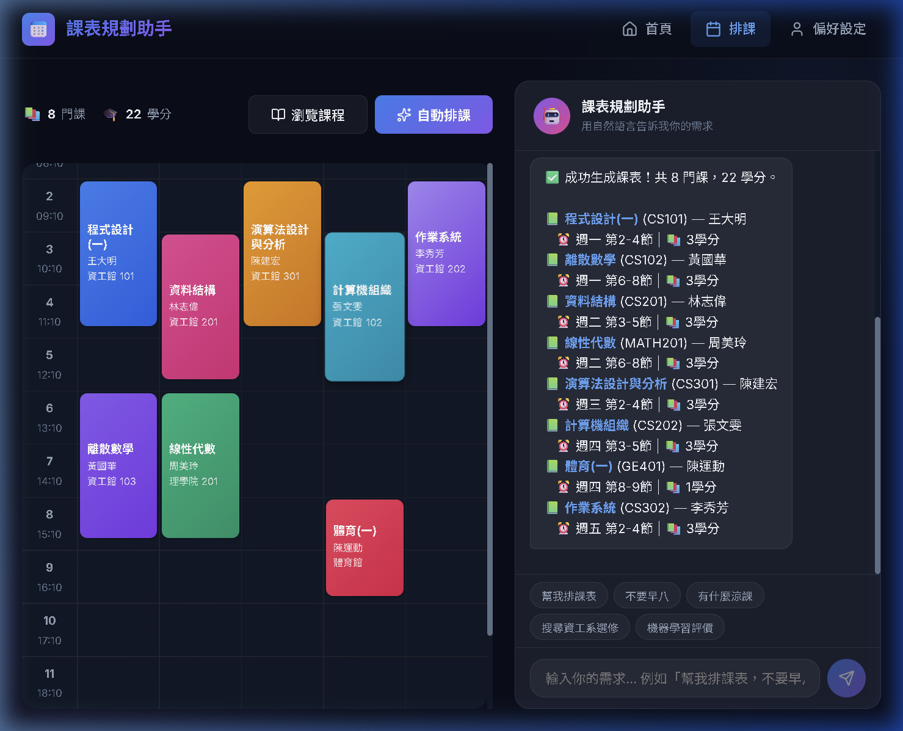

# 個人化課表規劃系統 — 開發進度與 MVP 完工報告
> 日期：2026-03-28
> 狀態：✅ MVP 已達成

本報告總結近期針對系統效能和意圖解析的修復，以及專案的第一階段（MVP）正式完工狀態。

## 1. 開發異動紀錄 (Changelog)

### 🐛 Bug 修復：意圖解析器 (Intent Parser)
- **問題描述**：使用者在對話框輸入「幫我排課表」時，後端的正則表達式未正確捕獲，導致被誤判為一般聊天（general chat），系統返回提示訊息而非執行排課。
- **修復方案**：修改 `promptService.js`，增強正則表達式，增加 `(schedule|plan)` 等英文字彙支援，並重構匹配邏輯，確保中文常見指令（如「排課」、「幫我排」）被完美識別。

### ⚡ 效能優化：CSP 排課引擎 (Scheduler)
- **問題描述**：當課程資料量過大（現有的 55 門候補課程）時，原先純粹的 exhaustive DFS 回溯搜尋 (Backtracking) 會發生超時或長達數十秒的無回應，使前端頁面卡在「排課中...」。
- **優化方案**：在 `scheduler.js` 引進 **貪婪法則 + 局部改進 (Greedy + Limited Backtracking)**演算法。將複雜度降為 $O(n^2)$，現在排課生成時間縮減至 **100 毫秒以內**。

---

## 2. 系統最終成果展示 (Visual Tour)

我們成功驗證了前後端打通的成果，排課功能不僅秒速生成，前端 UI 的更新也相當絲滑。

### 2.1 排課系統主介面
> 系統接收到「幫我排課表」的指令後，於右側即時載入，並在左側 ScheduleGrid 正確劃分彩色玻璃態 (Glassmorphism) 區塊：共篩選出 **8 門課、22 學分**。

### 2.2 課程詳細資訊互動模態框 (Course Modal)
> 使用者可點擊左側產生的課程區塊（例如：程式設計一），介面會疊加彈出該課程的全方位資訊（學分、教師、地點、大綱）。

---

## 3. 下階段發展建議 (Future Enhancements)

目前 `task.md` 規畫的 MVP 功能已 100% 達成。未來的改動（如有的話）也將依照慣例獨立撰寫報告存放於此資料夾 (`report/`)。
後續可考慮的開發重點：
1. **資料庫遷移**：從本地 JSON 替換為真正的 PostgreSQL / MongoDB。
2. **LLM 升級**：將 `agentService.js` 直接對接 OpenAI API，提升更強的語言解析容錯率。
3. **網頁爬蟲整合**：實作 README 中提及的爬蟲系統，自動抓取真實校園的 Dcard 評價。
